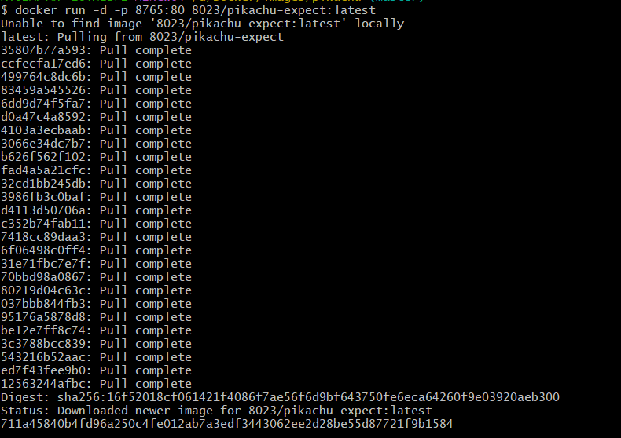
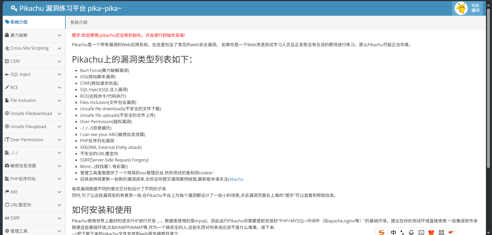
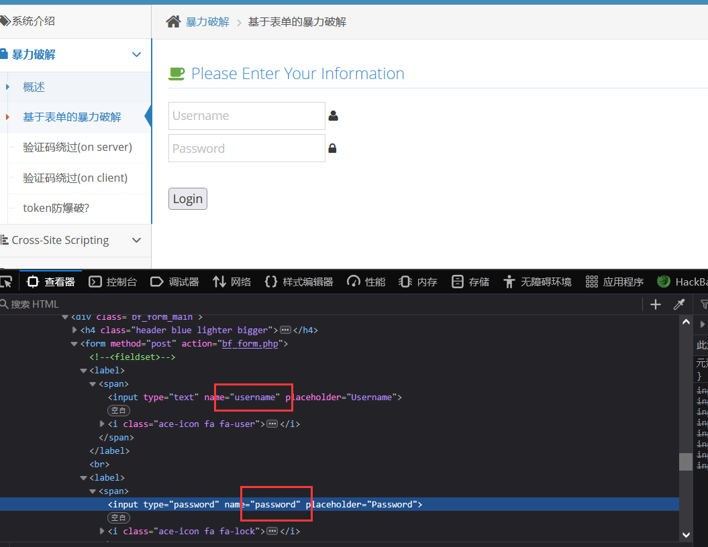
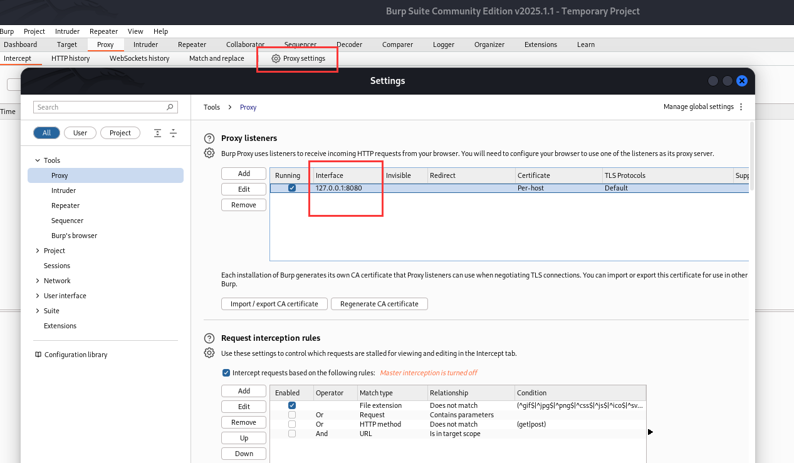
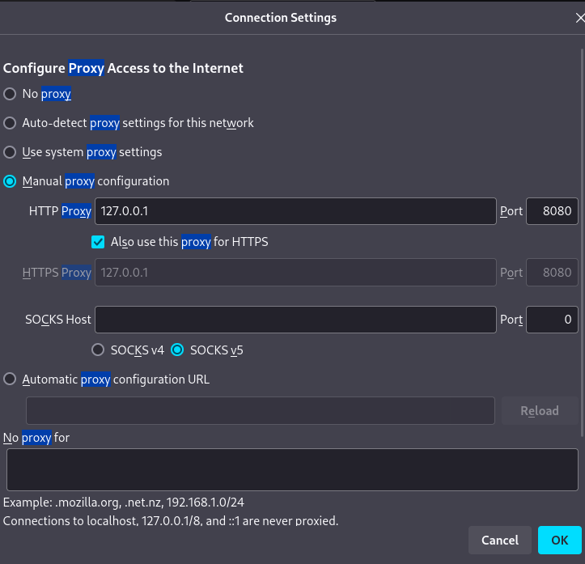
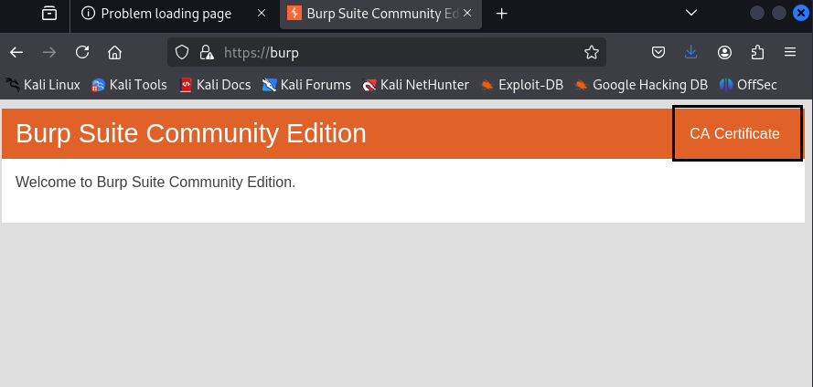
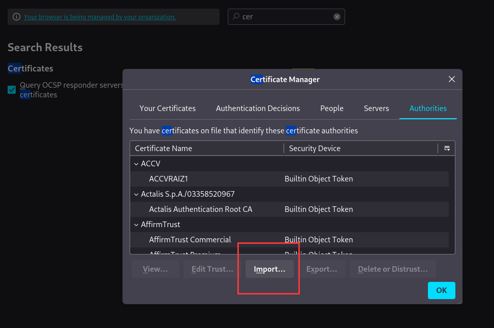
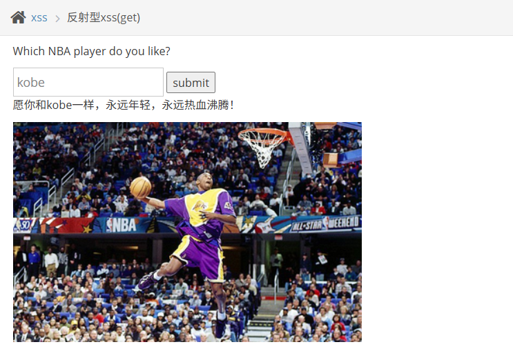

pikachu
===

## 用 Docker 搭建靶场

```bash
docker run -d -p 8765:80 8023/pikachu-expect:latest
```

 



点击安装数据库即可。

## 暴力破解

### 基于表单的暴力破解

打开控制台, 能看到 POST 提交的参数名:



#### 配置 Burpsuite

打开 BP, 查看代理配置:



应用到火狐浏览器:



下载并应用证书:





#### 暴力破解

打开拦截, 

## XSS 

XSS（跨站脚本攻击）本质上是一种基于代码注入的攻击。

### 反射型 XSS

反射型 XSS 就是不存储在服务器端的 XSS, 其存在于请求/响应中。

看一眼网页源代码, 提示输入 `kobe`:



接下来尝试 `'"<>kobe`:

