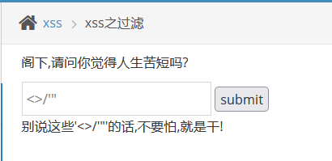

pikachu 1 - 暴力破解, XSS
===

## 用 Docker 搭建靶场

```bash
docker run -d -p 8765:80 8023/pikachu-expect:latest
```

 


点击安装数据库即可。

### 配置 Burpsuite

打开 BP, 查看代理配置:


应用到火狐浏览器:


下载并应用证书:


针对 firefox 浏览器, 如果目标网站在本地 ( `localhost` ), 则浏览器是默认不进行代理的, 要解决这个问题, 需要打开 `about:config` 界面, 搜索 `network.proxy.allow_hijacking_localhost` 并改为 `true`:


这样就取消了 `127.0.0.1 localhost` 永不经过代理的问题。

---

### 暴力破解

暴力破解, 顾名思义就是通过力大砖飞的方式来枚举可能的密码组合, 不过其中也有很多技巧。

#### 验证码绕过(on server)

首先观察一下网站, 输入错误的组合: *用户名:1,密码:1,验证码:1* , 提示密码错误, 并刷新网站。

接下来打开 BP , 拦一个包看看:


此时显示网页已经刷新了, 刚刚的验证码是 *v2qe5t* , 而现在是 *puwmq6*:


重放一下试试:


发了两次包, 发现返回结果都是用户名密码错误, 而验证码是不变的, 查看前台, 果然网站也没有发生变化。

这说明, 这个登录界面的验证码只会在**页面刷新**的时候发生变化。

到这里就可以直接转向 intruder 进行字典破解了, 过程省略, 最后结果为 `admin:123456`。

> `Repeater` 实际上是独立于浏览器的一个重放器, 发送独立 HTTP 请求, 与浏览器完全解耦。并且也不会渲染页面。因此这个功能当然也不会**刷新页面**, 这是它的**重要特性**。 实际上, **所有的 `BP` 模块都不会刷新页面(例如 `intruder`), 原理相同**。

#### 验证码绕过(on client)

结合这个名字, 还有验证码的样式, 这个验证码非常有可能是在前端生成的:


首先用刚刚的方式一样可以完成爆破, 因为这个验证码同样是在刷新界面时才会重新生成:


再看看其他绕过方式, 既然是在前端的验证, 那么在源码中应该能直接看见, 这里查看 respond:


直接 `F12` + `F1` 然后禁用 Javascript 代码即可。这样浏览器在遇到任何含 JS 标签的代码都会直接跳过。

> 这个例子也非常好的说明了任何重要的安全逻辑都不应该放在前端。因为前端实际上是由浏览器负责执行, 而浏览器行为是**用户完全可控**的。几乎所有前端的安全策略都是不可信的。

后面就是正常的 Intruder 爆破, 这里跳过。

#### Token 防爆破

什么是 Token ? Token 是服务端签发给客户端的一段令牌。要系统地明白 Token 的概念, 以及为什么要有 Token, 需要全面了解 "Cookie", "Session", "Token" 这三个概念的异同:

- **Cookie**

早期的 HTTP 协议是**无状态**的, 就像一条只有两秒钟记忆的鱼, 只要发起任何新的 HTTP 请求, 之前的登录信息都会失效。 在没有 Cookie 的情况下, 如果要维持服务器和客户端的连接, 就需要每次带上用户名和密码作为参数, 这种做法不论是安全性还是效率都非常低。

Cookie 的设计是为了解决 HTTP 无状态导致的会话保持问题, 它允许用户将部分不敏感的信息存放在Cookie 中。

- **Session**

早期的 Cookie 是明文存放, 明文传输(这是 HTTP 协议的特点)。由于可以随时被用户修改, 服务器无法信任其中的敏感信息, 例如用户名, 密码等。而确认用户的身份又必须用到 ID 一类敏感信息, 因此需要一种将信息存储在服务器上的解决方案。

Session 的设计是为了解决 Cookie 的安全性问题。现在在用户生成 Cookie 的同时, 在服务器上同时会生成一个 Session 文件, 用于记录本次对话的信息。用户在发送新的请求时, 服务端只需要根据 Cookie 查找是否存在 Session ID 与之对应即可。

可以这么理解: Cookie 是一把钥匙, 存放在客户端; 而 Session 是一台保险箱, 保险箱存放在服务器缓存上。

---

有 Session 之后的会话流程:

1. 用户首次发起会话, 此时还不存在 Cookie, 请求发送给服务器。

2. 服务器收到用户发起的空 Cookie 会话, 创建一个*强随机的长字符串*作为 Session ID, 并存放在内存数据库 (通常是Redis) 中, 然后通过 HTTP 响应头中的 `set-cookie` 传回给用户; 之后用户在此次会话结束前会自动带上这个 Cookie。

3. 服务器在接收到带 Cookie 的请求后会直接查找内存服务器是否存在 *Session ID* 一一对应。若不存在则说明会话过期了, 如果这个请求中包含会话内容, 则需要创建新的 Session ID。 

> Session ID 不存在的常见可能原因:
> - Session ID 过期: `TTL`;
> - Session 主动销毁: 如用户点击注销;
> - 数据库重启: 如 Redis 重启;

由此可见, 由于本身从 Cookie 到 Session 采用了直接比对, Session 的可靠性是依靠传输层实现的。

---

- **Token**

看起来 *Cookie + Session* 的体系已经足够完备, 那么为什么还需要 Token (如最知名的 JWT)呢?

因为现代服务器架构通常是前后端分离, 且为集群分布式。例如常见的多台内网服务器通过 Nginx 反向代理来提高服务器性能和吞吐量。在这种架构模式下, 传统的 Cookie + Session 体系就面临 **跨域认证** 等扩展性问题:

简单的通过共享文件是不可行的, 因为 Session 必须保存在内存中, 才能保证服务器的响应和搜索速度, 需要大量复杂配置; 但同时, 也不可能一次性将所有域主机的 Session 信息都存到本地的内存中, 因为现实中需要集群分布架构的服务器往往访问量非常大, 即使内存装得下会话信息, 实时在各主机同步实现对会话信息的增删改查操作也是不可能的。

Token 旨在尽可能保证安全性的情况下, 让会话信息回到客户端上。

以 JWT (JS WEB Token)为例, 它包含三段信息: `Header`.`Payload`,`Signature`。这三者都是经过 Base64 编码的 json 文件。其中: 

> `Header` 包含了文件类型(JWT), 哈希方法 (例如 SHA-256);

> `Payload` 为用户层面需要传递的数据, (例如用户名, ID, 口令等), 服务器前端只需要对这段信息进行 Base64 解码就可以知道其中的信息;

> `Signature` 为**水印**, 要求得这部分, 首先由 Base64 之后的 `Header` + `Payload` + 用户私钥求和, 再将结果用 `Header` 中指定的哈希算法进行处理。

JWT 的安全性是由水印算法保证的, 也就是**密码学层面**的安全。这是一种**数字签名**算法, 本质上是**非对称加密**, 用户用服务器签发的**私钥**签名, 而服务器只需要用用户公开的**公钥**即可验签。典型的算法为 RSA, 这种加密算法在之前的笔记: [Crypto 1 - RSA](https://r4x.top/2025/05/21/crypto1/) 中已经提到过。

~更进一步的讲, Token 结合数字签名实现了用户会话防篡改, 而剩下的会话防窃听和中间人攻击部分就需要交由 HTTPS 加密传输。~

---
 
回到这里, 此处的 Token 应该为表单 Token, 这种 Token 会在每次加载表单的时候随机生成并加载。Token 主要的目的是防止其他人冒充用户身份进行会话操作 (CSRF), 这显然是对防爆破没有用的。

打开源代码:


---

```html
<input type="hidden" name="token" value="1368268633facb0d60856800812" />
```

---

这里已经能直接看到 Token 了, 只要把 Token 一起扔进 BP 就行, 不过每次提交的 Token 会变化, 需要在每次枚举的时候抓住上次枚举的返回页面中的 Token 值赋到本次枚举的参数中。可以用脚本实现, 或者直接在 BP 里设置递归搜索。搜索结构有所变化, 需要知道 `username` 和 `password` 中的一个, 另一个使用递归搜索:


 Token 需要使用**递归搜索 (Recursive grep)**, 初值为当前源码中的 Token 值, 之后需要再响应页面中定位然后选中源码中的 Token 值。具体操作如下:


执行:


这样就找到了组合。

### XSS 跨站脚本

跨站脚本本身是一种代码注入。

#### 反射型 XSS (GET 或 POST)

根据提示先输个 kobe:


再试试直接注段 js 代码:

```html
<script>alert('kobe')</script>
```

发现有明显的前端限制:


用控制台找到这个地方然后更改参数即可:


成功。

POST 同理, 两者的区别是 POST 是以表单的方式提交参数, 而 GET 是直接显示在 URL 中。

#### 存储型 XSS

存储型 XSS 和反射型 XSS 的区别就是, 前者的注入代码会保存在某个网站页面上。

这关也一样, 非常直白: 服务器不加过滤地将任何用户的输出保存到这个页面上, 因此输入:

```html
<script>alert('kobe')</script>
```


这段代码就被永久保留到了这个界面上, 之后每次打开这个界面, 浏览器都会自动执行留言板中注入的代码。


显然**存储型 XSS 的危害更大**。设想, 如果 QQ 空间的动态页面存在这种漏洞, 那么如果有一个用户的动态被攻击, 任何访问该用户动态的其他人的浏览器都会执行其中注入的代码。

#### DOM 型 XSS

DOM 型 XSS 指的就是此处输入会以某种方式直接操作页面 html, 尝试一下:


可以看到直接把输入原样输出到了这条 html 语句里, 现在只需要考虑怎么围绕这个语句进行注入即可, 这其实和 SQL 注入的手法差不多。

例如注入 `'></a><script></script> <a href='`, 应该显示:


因此注入: `' onclick=alert('kobe')>`:


#### XSS 之盲打

首先先把代码 `<script>alert('kobe')</script>` 打进去, 好像没用, 看看提示, 显示在后台 `/xssblind/admin_login.php` 这个地址进行登录:


所以盲打的意思就是不能马上看到 XSS 结果, 其结果仅在后台可见。

#### XSS 之过滤

过滤是几乎所有网站都会采取的安全措施的一环。有过滤就有绕过, 绕过的方法有很多种, 有些时候需要从网站开发者安全编程的角度去考虑。

这里直接试试 `<script>alert('kobe')</script>`, 发现结果被过滤了:


试试正常输入:


再看看特殊字符, 发现对单个特殊字符是没有过滤的:



再多尝试一点组合, 发现被过滤的标签应该是 `<script` 和 `</script`:


那么不用这个标签就行了:

```html
<a href="" onclick="alert('xss')">
```


实际过滤情况以及服务器的处理策略通常比这个复杂得多。

#### XSS 之 html specialchars

还是先试试 `<script>alert('kobe')</script>`:


可以看到源码中 `<` 和 `>` 被转义了, 因此注入失效, 不过引号没有被过滤, 所以换一种方式即可:

```
' onclick='alert("xss")
```


#### XSS 之 href 输出

老规矩试试公式输入, 然后试一下过滤:


`<`, `>`, `"` 都被过滤了。

根据提示, 这里要用到 `<a>` 标签的一项特性: 支持 `http:`, `https:` 协议和 `javascript:` 伪协议, 其后的代码会被动态加载。

因此 payload 为:

```
javascript:alert('kobe')
```

---


#### XSS 之 js 输出

根据提示试试正常输入 `tmac`:


输出了一个图片, 其他正常输入会输出一段文字;

再试试 `<script>alert('kobe')</script>`:


打开控制台追踪, 发现是输出到 js 代码里了:


那么现在就先闭合引号再闭合 `<script>` 就行了, 显然引号也没有被过滤, 那么 payload 应该是:

```
';alert('kobe')</script>
```

直接在网站加载出来之前就呼出了:


### CSRF 跨站请求伪造

> 参考: 关于原理, 这篇文章写的非常好: [CSRF漏洞原理攻击与防御（非常细）](https://blog.csdn.net/qq_43378996/article/details/123910614)

对比 XSS 和 CSRF, 两者看似相同其实原理上差别很大。

- **CSRF**:

CSRF 本质上是一条精心构造的恶意url, 这段 url 含有恶意代码 `C`。

当用户在没有登出安全网站 `A` (即**会话保持**) 的情况下在加载这段 url 的时候, 其中的恶意代码 `C` 将会被触发, 完成特定操作。由于用户的浏览器是无意识的, 不能辨别攻击, 将会根据 `C` 中的内容发起对安全网站的请求, 并且带上用户的会话身份凭证。

这也就是说, 攻击者在网站 `A` 借用用户的身份执行了一段恶意代码, 完成了一系列操作。例如, 如果 `A` 是某个银行网站, 可能利用用户的身份发起一笔转账。

实际上这个攻击流程有许多必要条件: 1. 用户必须加载这段恶意 url, 2. 网站 `A` 必须没有防护 CSRF 的策略 (例如, 最简单的措施: 验证码), 3. 攻击者必须完全了解恶意代码中的参数结构。

- **XSS**:

前文已经讲过, XSS 的本质是通过注入让用户的浏览器执行恶意代码, 这段恶意代码几乎可以是任何操作, 发往任何主机, 因此 XSS 要危险的多, 其危害可能是**会话劫持**(窃取 Cookie), 键盘记录, 重定向用户, 域渗透等。

CSRF 实际上是伪造了一条用户请求, 而 XSS 可以直接窃取用户身份 (时间上远不止一条请求)。

#### CSRF - GET/POST

根据提示随便登录一个账号, 然后点击修改个人信息, 修改完毕后点击提交, 并把这个包抓住, 然后点 action 生成一个 csrf 的利用:


生成后再改改属性:


现在将刚刚拦到的包放了, 然后去网页确认一下:


更改已经生效了; 接下来再点击生成的 CSRF 链接:


点击确认, 回到刚刚的界面刷新, 发现信息发生了改变, 自此 CSRF 攻击已经完成。


> 在现实攻击中是不存在确认的, 加载 URL 的时候就已经完成了。

#### CSRF - Token

刚刚在暴力枚举的部分已经讲过, Token就是拿来防 CSRF 的, 这里由于 Token 具有时间凭证意义, 已经不能用相同的手段完成伪造了。

> 题外话: 虽然验证码是最简单, 最高效的防止 CSRF 的手段, 但是它有一个致命的缺陷, 就是降低了用户的体验, 绝大部分会被攻击的项目和网站是用户导向, 或者说需求导向的。一般只会在非常敏感的操作下设置验证码