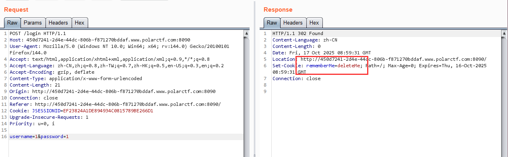

[Polar ctf WEB] 困难区 wp 3
===

## [Polar WEB] PolarOA

### 基本信息



登录注意返回了 rememberMe, 很可能是 Shiro 认证; 那么这里应该是一处反序列化漏洞:

> Apache Shiro 框架提供了记住密码的功能 (rememberMe), 用户登录成功后会生成经过加密并编码的 cookie; 在服务端对 rememberMe 的 cookie 值**先 base64 解码然后 AES 解密**再**反序列化**, 因此有反序列化漏洞;

### Apache Shiro 反序列化漏洞

- 漏洞版本: Apache Shiro < 1.2.4
- 特征: 登录返回包含有 cookie: `rememberMe=deleteMe`

构造 payload 攻击链:

```
命令 => 序列化 => AES加密 => base64 编码 => RememberMe Cookie 值
```

---

原理讲解: [FreeBuf: Shiro反序列化漏洞原理分析以及漏洞复现](https://www.freebuf.com/articles/web/380382.html)

---

## [Polar WEB] 