webgoat - CTF
===

通过 **WebGoat** 这个开源项目来围绕 XSS 进行渗透, 防护和反绕。

### WebGoat

> 项目地址: [Github](https://github.com/WebGoat/WebGoat)

用 Docker 快速部署即可

```bash
git clone https://github.com/WebGoat/WebGoat.git

# cd WebGoat 目录
docker run -it -p 127.0.0.1:28080:8080 -p 127.0.0.1:9090:9090 -e TZ=Asia/Shanghai webgoat/webgoat
```

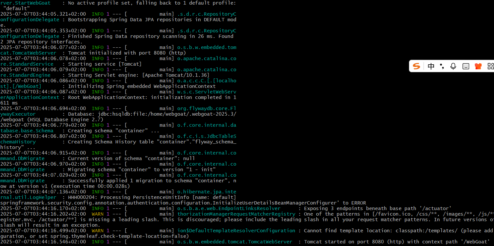

首次使用注册一个账户, 如 `administrator:123456`:

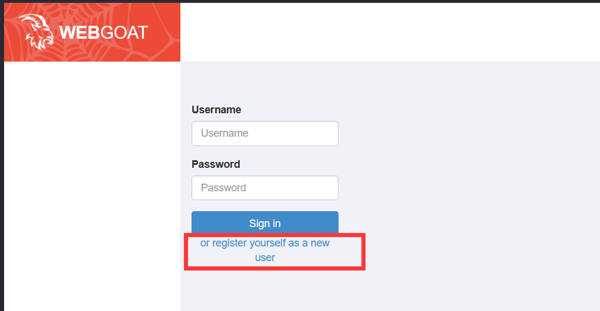

### 概述

这一节的内容主要是一些基本概念和怎么利用浏览器, 抓包工具等。

#### CIA Triad

CIA 指的是 **Confidentiality** (机密性), **Integrity** (完整性), **Availability**。 这三者是信息安全的基准模型, 三者缺一不可。

通俗的来说:

-   机密性关注的是 "谁能看" - 也就是防窃听;

-   完整性关注的是 "信息准不准" - 也就是防篡改;

-   可用性关注的是 "能不能用" - 也就是让该用的人想用的时候就能用。

### A1: Broken Access Control (失效的访问控制)

#### Hijack a session

> 关于 `Session`, `Cookie`, `Token` 的关系: [博客: pikachu 1 - 暴力破解, XSS, CSRF](https://r4x.top/2025/07/01/pikachu1/#Token-%E9%98%B2%E7%88%86%E7%A0%B4)

这一节的目标是预测 `hijack_cookie` 值, 这个值用于区分匿名用户和已登录账户的会话。

随便填个用户和密码, 比如 `1:1`, 用 BP 抓包:

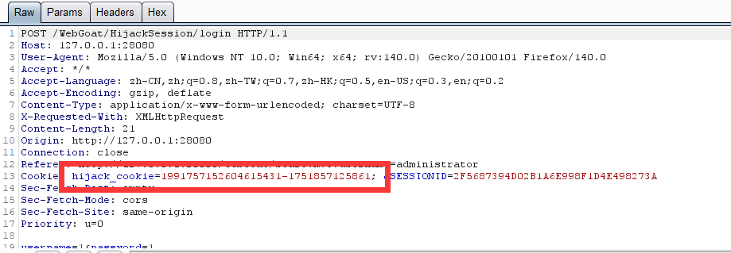

可以看到这里有个 `hijack_cookie`, 不过返回包里面没有, 那试试把请求里的这个值给删掉:

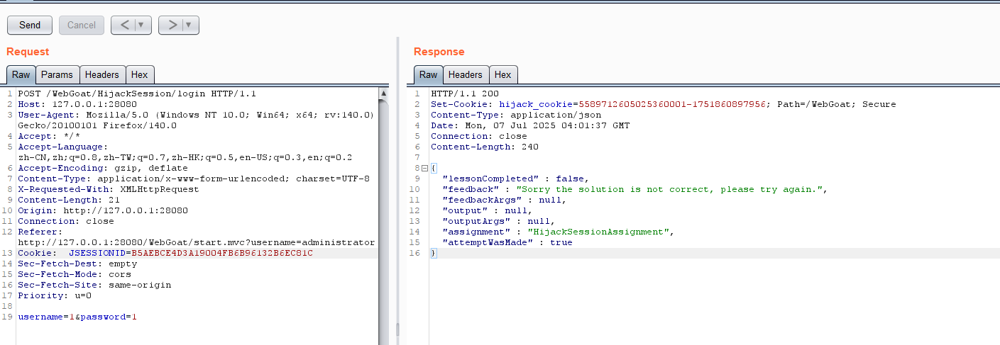

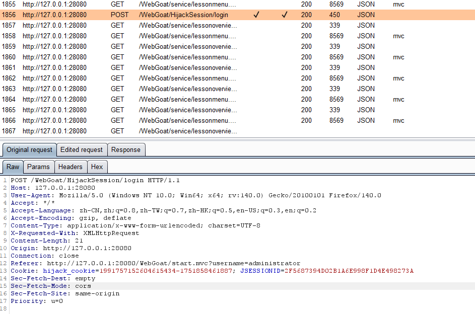

可以看见请求中不带这个 `hijack_cookie` 时, 回复中重新 set-cookie, 并且之后的会话会保持这个 cookie, 这三次 cookie 的值分别为:

发到 Repeater 里重放几次, 返回的 `hijack_cookie` 为:

- `5589712605025362119-1751863185812`
- `5589712605025362121-1751863186683`
- `5589712605025362123-1751863187448`
- ...

通过控制每次发送的时间间隔可以发现, `-` 右边应该是一个时间戳, 并且倒数第四位大概率是单位秒, 两侧都是单调递增的; 左边可能是类似序列号的参数, 每次增加 1 (大多数时候) 或者 2, 如果把左边自增 2 时看做**跳过**了一个序列号, 那么有没有可能是因为这个序列号 (`5589712605025362120` 和 `5589712605025362122`) 可能已经被登录占用了, 所以被跳过? 

如果这个猜想成立, 只需要找到被跳过的这个序列号在算法上对应的可用时间戳即可;

用 BP Intruder 来试试:

设置一下 payload, 将序列号设为 `5589712605025362123`, 时间戳为 `1751863185812` 和 `1751863186683` 之间的所有可能数字, 穷举所有组合:

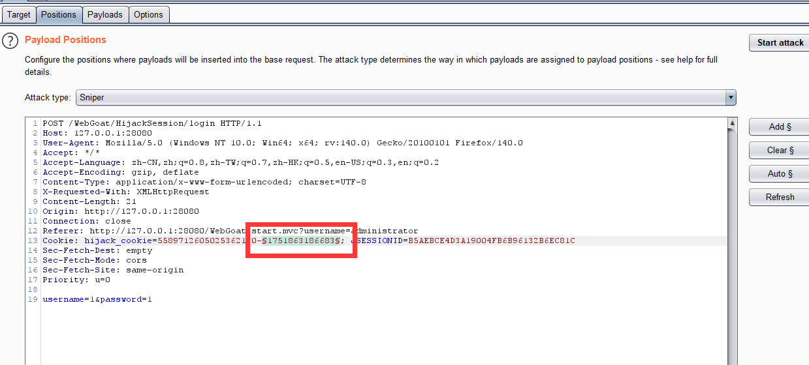

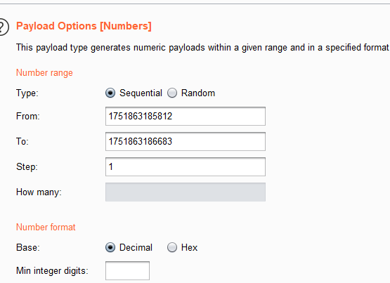

注意不要设置太多并发进程, 适当降低效率防止服务器来不及处理引起报错。

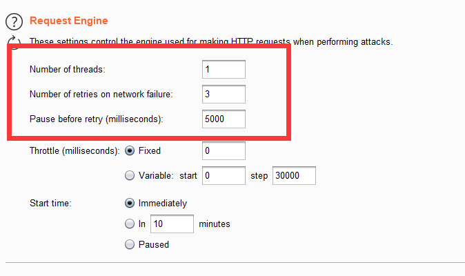

爆破结束后直接找返回长度不同的且状态为 200 的那个响应包, 就是访问成功的包。可以看到已经显示 "Congratulations" 字符, 窃取成功了。

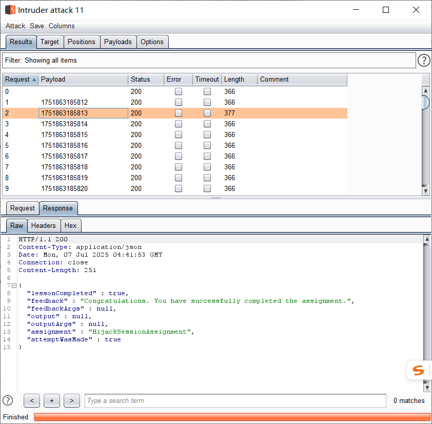

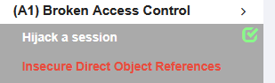

- 应对策略:
  - 采用高熵, 强随机的 Cookie 算法, 使得预测 Cookie 在计算上不可行。例如 Springboot 中默认使用 `SecureRandom` + `base64` 编码生成 16 ~ 32 字节 token。
  - 目前的主流 Web 框架的随机 Cookie 算法强度已经足够, 并且对程序员来说是透明的 (除非显式的指定使用另一套 Cookie 算法), 大部分情况下程序员不需要为此担心。

#### Insecure Direct Object References

不安全的直接对象引用, 指的是在某些方法 (如 `GET`, `POST` 等) 中, 用户通过修改参数能够直接越权访问或者修改到本来无权访问的数据。

首先根据引导以 "Tom" 的身份登录:

~这个程序还玩了 Tomcat 的梗, 说是这个应用 "并不安全"~

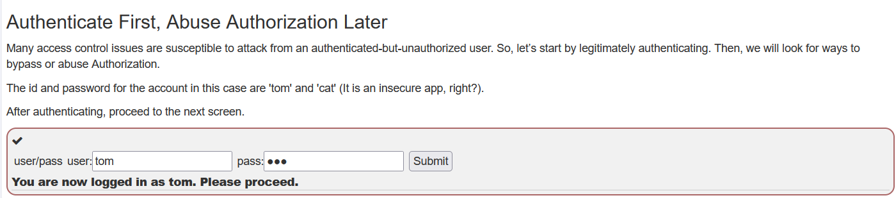

